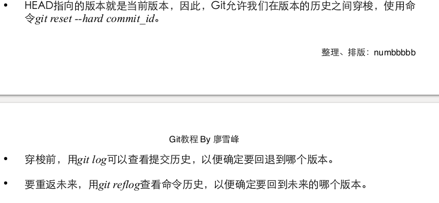
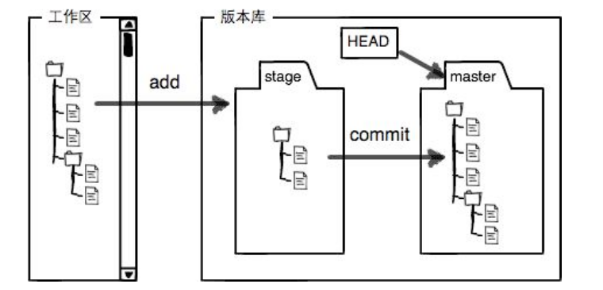
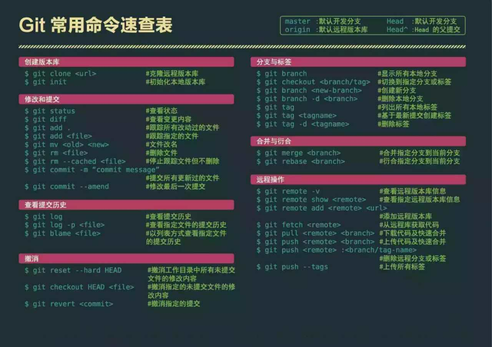

# 一.SVN

## 1.CentOS 7 设置 svn 开机启动

https://blog.csdn.net/realghost/article/details/52396648

# 二.GIT

分支上：分支 dev

​        pull->  git pull origin dev

​        push-> git push origin HEAD:dev

<http://www.liaoxuefeng.com/wiki/0013739516305929606dd18361248578c67b8067c8c017b000>

１.安装   sudo apt-get install git 

2.安装后设置

git config命令的--global参数,用用了这个参数,表示示你这台机器上所有的Git仓库都会

使用用这个配置,当然也可以对某个仓库指定不同的用用户名和Email地址。

创建版本库：

１.初始化仓库目录－－新建目录

２.进入该目录后：git init ---将这个目录变成Git可以管理的仓库

将一个文件添加进仓库

１.git add 具体文件

２. git commit -m "提交说明"　　

状态查看

• 要随时掌握工工作区的状态,使用用 git status 命令。

• 如果 git status 告诉你有文文件被修改过,用用 git diff 可以查看修改内容。

版本回退

git log --查看日志

git log --pretty=oneline  --查看日志的简要信息

git reset --hard 版号数字

eg:git reset --hard 3628164

工作区，暂存区，版本库

需要提交的文文件修改通通放到暂存区,然后,一一次性提交暂存区的所有修改。

即：可以add多次，但是只需要commit一次

git add 命令实际上就是把要提交的所有修改放到暂存区(Stage),然后,执行行 git

commit 就可以一一次性把暂存区的所有修改提交到分支支。

