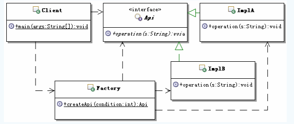

# 设计模式---六大设计原则

https://blog.csdn.net/zhengzhb/article/category/926691/2

## 1.单一职责原则(SRP )

定义：Single Responsibility Principle

​	**不要存在多于一个导致类变更的原因**。通俗的说，即一个类只负责一项职责。
问题由来：

​	类T负责两个不同的职责：职责P1，职责P2。当由于职责P1需求发生改变而需要修改类T时，有可能会导致原本运行正常的职责P2功能发生故障。

解决方案：

​	遵循单一职责原则。分别建立两个类T1、T2，使T1完成职责P1功能，T2完成职责P2功能。这样，当修改类T1时，不会使职责P2发生故障风险；同理，当修改T2时，也不会使职责P1发生故障风险。

​	说到单一职责原则，很多人都会不屑一顾。因为它太简单了。稍有经验的程序员即使从来没有读过设计模式、从来没有听说过单一职责原则，在设计软件时也会自觉的遵守这一重要原则，因为这是常识。在软件编程中，谁也不希望因为修改了一个功能导致其他的功能发生故障。而避免出现这一问题的方法便是遵循单一职责原则。虽然单一职责原则如此简单，并且被认为是常识，但是即便是经验丰富的程序员写出的程序，也会有违背这一原则的代码存在。为什么会出现这种现象呢？因为有职责扩散。**所谓职责扩散，就是因为某种原因，职责P被分化为粒度更细的职责P1和P2。**

​	比如：类T只负责一个职责P，这样设计是符合单一职责原则的。后来由于某种原因，也许是需求变更了，也许是程序的设计者境界提高了，需要将职责P细分为粒度更细的职责P1，P2，这时如果要使程序遵循单一职责原则，需要将类T也分解为两个类T1和T2，分别负责P1、P2两个职责。但是在程序已经写好的情况下，这样做简直太费时间了。所以，简单的修改类T，用它来负责两个职责是一个比较不错的选择，虽然这样做有悖于单一职责原则。（这样做的风险在于职责扩散的不确定性，因为我们不会想到这个职责P，在未来可能会扩散为P1，P2，P3，P4……Pn。所以记住，在职责扩散到我们无法控制的程度之前，立刻对代码进行重构。）

遵循单一职责原的优点有：

​	可以降低类的复杂度，一个类只负责一项职责，其逻辑肯定要比负责多项职责简单的多；
​	提高类的可读性，提高系统的可维护性；
	变更引起的风险降低，变更是必然的，如果单一职责原则遵守的好，当修改一个功能时，可以显著降低对其他功能的影响。

​	需要说明的一点是单一职责原则不只是面向对象编程思想所特有的，只要是模块化的程序设计，都适用单一职责原则。

基本使用原则(个人非官方)：**只有逻辑足够简单，才可以在代码级别（类级别）上违反单一职责原则；只有类中方法数量足够少，才可以在方法级别上违反单一职责原则**

## 2.里氏替换原则(LSP)

Liskov Substitution Principle

​	肯定有不少人跟我刚看到这项原则的时候一样，对这个原则的名字充满疑惑。其实原因就是这项原则最早是在1988年，由麻省理工学院的一位姓里的女士（Barbara Liskov）提出来的。

​	定义1：如果对每一个类型为 T1的对象 o1，都有类型为 T2 的对象o2，使得以 T1定义的所有程序 P 在所有的对象 o1 都代换成 o2 时，程序 P 的行为没有发生变化，那么类型 T2 是类型 T1 的子类型。

​	定义2：**所有引用基类的地方必须能透明地使用其子类的对象**。

​	问题由来：有一功能P1，由类A完成。现需要将功能P1进行扩展，扩展后的功能为P，其中P由原有功能P1与新功能P2组成。新功能P由类A的子类B来完成，则子类B在完成新功能P2的同时，有可能会导致原有功能P1发生故障。

​	解决方案：当使用继承时，遵循里氏替换原则。类B继承类A时，除添加新的方法完成新增功能P2外，尽量不要重写父类A的方法，也尽量不要重载父类A的方法。	

​	继承包含这样一层含义：父类中凡是已经实现好的方法（相对于抽象方法而言），实际上是在设定一系列的规范和契约，虽然它不强制要求所有的子类必须遵从这些契约，但是如果子类对这些非抽象方法任意修改，就会对整个继承体系造成破坏。而里氏替换原则就是表达了这一层含义。

​	继承作为面向对象三大特性之一，在给程序设计带来巨大便利的同时，也带来了弊端。比如使用继承会给程序带来侵入性，程序的可移植性降低，增加了对象间的耦合性，如果一个类被其他的类所继承，则当这个类需要修改时，必须考虑到所有的子类，并且父类修改后，所有涉及到子类的功能都有可能会产生故障。

​	如果非要重写父类的方法，比较通用的做法是：原来的父类和子类都继承一个更通俗的基类，原有的继承关系去掉，采用依赖、聚合，组合等关系代替。

​	里氏替换原则通俗的来讲就是：**子类可以扩展父类的功能，但不能改变父类原有的功能**。它包含以下4层含义：

​	子类可以实现父类的抽象方法，但不能覆盖父类的非抽象方法。
​	子类中可以增加自己特有的方法。
​	当子类的方法重载父类的方法时，方法的前置条件（即方法的形参）要比父类方法的输入参数更宽松。
​	当子类的方法实现父类的抽象方法时，方法的后置条件（即方法的返回值）要比父类更严格。（eg:父类抽象方法通常可以返回抽象类的对象，子类实现时候需要返回具有的实现类）
​        看上去很不可思议，因为我们会发现在自己编程中常常会违反里氏替换原则，程序照样跑的好好的。所以大家都会产生这样的疑问，假如我非要不遵循里氏替换原则会有什么后果？ 后果就是：你写的代码出问题的几率将会大大增加。

## 3.依赖倒置原则(DIP)

Dependence Inversion Principle

定义：高层模块不应该依赖低层模块，二者都应该依赖其抽象；抽象不应该依赖细节；细节应该依赖抽象。
问题由来：类A直接依赖类B，假如要将类A改为依赖类C，则必须通过修改类A的代码来达成。这种场景下，类A一般是高层模块，负责复杂的业务逻辑；类B和类C是低层模块，负责基本的原子操作；假如修改类A，会给程序带来不必要的风险。

解决方案：将类A修改为依赖接口I，类B和类C各自实现接口I，类A通过接口I间接与类B或者类C发生联系，则会大大降低修改类A的几率。

  依赖倒置原则基于这样一个事实：相对于细节的多变性，抽象的东西要稳定的多。以抽象为基础搭建起来的架构比以细节为基础搭建起来的架构要稳定的多。在java中，抽象指的是接口或者抽象类，细节就是具体的实现类，使用接口或者抽象类的目的是制定好规范和契约，而不去涉及任何具体的操作，把展现细节的任务交给他们的实现类去完成。

 **依赖倒置原则的核心思想是面向接口编程**

传递依赖关系有三种方式，以上的例子中使用的方法是**接口传递**，另外还有两种传递方式：**构造方法传递和setter方法传递**，相信用过Spring框架的，对依赖的传递方式一定不会陌生。
在实际编程中，我们一般需要做到如下3点：

低层模块尽量都要有抽象类或接口，或者两者都有。
变量的声明类型尽量是抽象类或接口。
使用继承时遵循里氏替换原则。

 **依赖倒置原则的核心就是要我们面向接口编程**，理解了面向接口编程，也就理解了依赖倒置。

## 4.接口隔离原则(ISP)

Interface Segregation Principle

定义：客户端不应该依赖它不需要的接口；一个类对另一个类的依赖应该建立在最小的接口上。
问题由来：类A通过接口I依赖类B，类C通过接口I依赖类D，如果接口I对于类A和类B来说不是最小接口，则类B和类D必须去实现他们不需要的方法。

解决方案：将臃肿的接口I拆分为独立的几个接口，类A和类C分别与他们需要的接口建立依赖关系。也就是采用接口隔离原则。

举例来说明接口隔离原则：


​						（图1  未遵循接口隔离原则的设计）

​	这个图的意思是：类A依赖接口I中的方法1、方法2、方法3，类B是对类A依赖的实现。类C依赖接口I中的方法1、方法4、方法5，类D是对类C依赖的实现。对于类B和类D来说，虽然他们都存在着用不到的方法（也就是图中红色字体标记的方法），但由于实现了接口I，所以也必须要实现这些用不到的方法。

 	接口隔离原则的含义是：建立单一接口，不要建立庞大臃肿的接口，尽量细化接口，接口中的方法尽量少。也就是说，我们要为各个类建立专用的接口，而不要试图去建立一个很庞大的接口供所有依赖它的类去调用。本文例子中，将一个庞大的接口变更为3个专用的接口所采用的就是接口隔离原则。在程序设计中，依赖几个专用的接口要比依赖一个综合的接口更灵活。接口是设计时对外部设定的“契约”，通过分散定义多个接口，可以预防外来变更的扩散，提高系统的灵活性和可维护性。

​	 说到这里，很多人会觉的接口隔离原则跟之前的单一职责原则很相似，其实不然。其一**，单一职责原则原注重的是职责；而接口隔离原则注重对接口依赖的隔离。其二，单一职责原则主要是约束类，其次才是接口和方法，它针对的是程序中的实现和细节；而接口隔离原则主要约束接口，主要针对抽象，针对程序整体框架的构建。**

​	 采用接口隔离原则对接口进行约束时，要注意以下几点：

​	接口尽量小，但是要有限度。对接口进行细化可以提高程序设计灵活性是不挣的事实，但是如果过小，则会造成接口数量过多，使设计复杂化。所以一定要适度。
​	为依赖接口的类定制服务，只暴露给调用的类它需要的方法，它不需要的方法则隐藏起来。只有专注地为一个模块提供定制服务，才能建立最小的依赖关系。
​	提高内聚，减少对外交互。使接口用最少的方法去完成最多的事情。

​	运用接口隔离原则，一定要适度，接口设计的过大或过小都不好。设计接口的时候，只有多花些时间去思考和筹划，才能准确地实践这一原则。

## 5.迪米特法则(LOD)/最少知识原则(LKP)

Law of Demeter / Least Knowledge Principle

定义：一个对象应该对其他对象保持最少的了解。
问题由来：类与类之间的关系越密切，耦合度越大，当一个类发生改变时，对另一个类的影响也越大。

解决方案：尽量降低类与类之间的耦合

自从我们接触编程开始，就知道了软件编程的总的原则：低耦合，高内聚。无论是面向过程编程还是面向对象编程，只有使各个模块之间的耦合尽量的低，才能提高代码的复用率。低耦合的优点不言而喻，但是怎么样编程才能做到低耦合呢？那正是迪米特法则要去完成的。

​	迪米特法则又叫最少知识原则，最早是在1987年由美国Northeastern University的Ian Holland提出。通俗的来讲，就是一个类对自己依赖的类知道的越少越好。也就是说，对于被依赖的类来说，无论逻辑多么复杂，都尽量地的将逻辑封装在类的内部，对外除了提供的public方法，不对外泄漏任何信息。迪米特法则还有一个更简单的定义：只与直接的朋友通信。首先来解释一下什么是直接的朋友：每个对象都会与其他对象有耦合关系，只要两个对象之间有耦合关系，我们就说这两个对象之间是朋友关系。耦合的方式很多，依赖、关联、组合、聚合等。其中，我们称出现成员变量、方法参数、方法返回值中的类为直接的朋友，而出现在局部变量中的类则不是直接的朋友。也就是说，陌生的类最好不要作为局部变量的形式出现在类的内部。

​	迪米特法则的初衷是降低类之间的耦合，由于每个类都减少了不必要的依赖，因此的确可以降低耦合关系。但是凡事都有度，虽然可以避免与非直接的类通信，但是要通信，必然会通过一个“中介”来发生联系。过分的使用迪米特原则，会产生大量这样的中介和传递类，导致系统复杂度变大。所以在采用迪米特法则时要反复权衡，既做到结构清晰，又要高内聚低耦合。

## 6.开闭原则(OCP)

 Open - ClosedPrinciple

定义：一个软件实体如类、模块和函数应该对扩展开放，对修改关闭。
问题由来：在软件的生命周期内，因为变化、升级和维护等原因需要对软件原有代码进行修改时，可能会给旧代码中引入错误，也可能会使我们不得不对整个功能进行重构，并且需要原有代码经过重新测试。

解决方案：当软件需要变化时，尽量通过扩展软件实体的行为来实现变化，而不是通过修改已有的代码来实现变化。（重视，避免重构，功能的重测，最常见的开发中口头体现：修该、新增了xx功能一定不要影响原有的功能。）

​	开闭原则是面向对象设计中最基础的设计原则，它指导我们如何建立稳定灵活的系统。开闭原则可能是设计模式六项原则中定义最模糊的一个了，它只告诉我们对扩展开放，对修改关闭，可是到底如何才能做到对扩展开放，对修改关闭，并没有明确的告诉我们。以前，如果有人告诉我“你进行设计的时候一定要遵守开闭原则”，我会觉的他什么都没说，但貌似又什么都说了。因为开闭原则真的太虚了。

 	在仔细思考以及仔细阅读很多设计模式的文章后，终于对开闭原则有了一点认识。其实，我们遵循设计模式前面5大原则，以及使用23种设计模式的目的就是遵循开闭原则。也就是说，只要我们对前面5项原则遵守的好了，设计出的软件自然是符合开闭原则的，这个开闭原则更像是前面五项原则遵守程度的“平均得分”，前面5项原则遵守的好，平均分自然就高，说明软件设计开闭原则遵守的好；如果前面5项原则遵守的不好，则说明开闭原则遵守的不好。

 	开闭原则无非就是想表达这样一层意思：**用抽象构建框架，用实现扩展细节**。因为抽象灵活性好，适应性广，只要抽象的合理，可以基本保持软件架构的稳定。而软件中易变的细节，我们用从抽象派生的实现类来进行扩展，当软件需要发生变化时，我们只需要根据需求重新派生一个实现类来扩展就可以了。当然前提是我们的抽象要合理，要对需求的变更有前瞻性和预见性才行。

 	说到这里，再回想一下前面说的5项原则，恰恰是告诉我们**用抽象构建框架，用实现扩展细节**的注意事项而已：**单一职责原则告诉我们实现类要职责单一；里氏替换原则告诉我们不要破坏继承体系；依赖倒置原则告诉我们要面向接口编程；接口隔离原则告诉我们在设计接口的时候要精简单一；迪米特法则告诉我们要降低耦合。而开闭原则是总纲，他告诉我们要对扩展开放，对修改关闭。**

 	最后说明一下如何去遵守这六个原则。对这六个原则的遵守并不是是和否的问题，而是多和少的问题，也就是说，我们一般不会说有没有遵守，而是说遵守程度的多少。任何事都是过犹不及，设计模式的六个设计原则也是一样，制定这六个原则的目的并不是要我们刻板的遵守他们，而需要根据实际情况灵活运用。对他们的遵守程度只要在一个合理的范围内，就算是良好的设计。我们用一幅图来说明一下。


​	图中的每一条维度各代表一项原则，我们依据对这项原则的遵守程度在维度上画一个点，则如果对这项原则遵守的合理的话，这个点应该落在红色的同心圆内部；如果遵守的差，点将会在小圆内部；如果过度遵守，点将会落在大圆外部。一个良好的设计体现在图中，应该是六个顶点都在同心圆中的六边形。


​    	在上图中，设计1、设计2属于良好的设计，他们对六项原则的遵守程度都在合理的范围内；设计3、设计4设计虽然有些不足，但也基本可以接受；设计5则严重不足，对各项原则都没有很好的遵守；而设计6则遵守过渡了，设计5和设计6都是迫切需要重构的设计。

# 0-25.设计模式基础

参考书籍：《研磨设计模式》

https://search.jd.com/Search?keyword=%E7%A0%94%E7%A3%A8%E8%AE%BE%E8%AE%A1%E6%A8%A1%E5%BC%8F&enc=utf-8&qrst=1&rt=1&stop=1&vt=2&psort=3&click=0


## 设计模式的概念

​	设计模式是：**在软件开发中，经过验证的，用于解决在特定环境下、重复出现的、特定问题的解决方案**(5点)

## 案例

​	用大家身边的例子来说，比如医药行业，就有自己的设计模式。假设一个人感冒了，到药店买点感冒药来吃，这个感冒药就是设计模式的一个很好体现

**经过验证的**：药品上市前，会有大量的验证和实验，以保证药品的安全性
**特定环境下**：这些药品是针对人的，不是针对其它动物的
**重复出现的**：正是因为感冒会重复出现，研制药品才是有意义的
**特定问题**：感冒药只用来解决感冒问题，不能解决其它问题，比如脚痛
**解决方案**：药品本身就是个解决方案的具体体现

​	经过上面的比较，你会发现，医药行业对设计模式的体现，一点不逊色于软件行业。事实上，很多行业都有自己的设计模式。就算设计模式本身也不是起源于软件行业，而是起源于建筑业

## 设计模式的理解

1：设计模式是解决某些问题的办法
2：设计模式不是凭空想出来的，是经验的积累和总结
3：设计模式并不是一成不变的，而是在不断的发展中
4：设计模式并不是软件行业独有的，各行各业都有自己的设计模式

## 设计模式的组成

在描述一个设计模式的时候，通常会有如下部分：

1：模式名称：就是为每个设计模式取个名字，好记忆，也好交流

2：环境和问题：描述在什么场景下，出现什么样的特定的问题

3：解决方案：描述如何解决这个问题

4：效果：描述模式应用的效果，以及可能带来的问题，或者使用中需要权衡的问题

## 设计模式的分类

​	为了缩小范围，我们仅讨论Java设计模式，也就是GoF著作《设计模式——可复用面向对象软件的基础》中提到的23个设计模式。对于这23个设计模式的分类，GoF把它们分为三类：
1：**创建型模式**：抽象了对象实例化的过程，用来帮助创建对象的实例

​	简单工厂模式（Simple Factory）工厂方法模式（Factory Method）抽象工厂模式（Abstract Factory）

​	建造者模式（Builder）原型模式（Prototype）单例模式（Singleton）

2：**结构型模式**：描述如何组合类和对象以获得更大的结构

​	适配器模式（Adapter）外观模式（Facade）桥接模式（Bridge）装饰器模式（Decorator）

​	代理模式（Proxy）享元模式（Flyweight）组合模式（Composite）

3：**行为型模式**：描述算法和对象间职责的分配

​	模板方法模式（Template Method）策略模式（Strategy）命令模式（Command）中介者模（Mediator）

​	观察者模式（Observer）迭代器模式（Iteratior）访问者模式（Visiter）

​	责任链模式（Chain of Responsibility）备忘录模式（Memento）状态模式（State）

​	解释器模式（Interpreter）

### 设计模式和面向对象设计原则

​	面向对象的分析设计有很多原则，这些原则大都从思想层面，给我们指出了面向对象分析设计的正确方向，是我们进行面向对象分析设计应该尽力遵守的准则。

​	而设计模式已经是针对某个场景下某些问题的某个解决方案。也就是说这些**设计原则是思想上的指导，而设计模式是实现上的手段**，因此设计模式也是应该遵守这些原则的，换句话说，**设计模式就是这些设计原则的一些具体体现**。

## 设计模式和重构

1：设计模式是重构的目标，重构是达到目标的手段

2：重构并不排斥提前设计，重构并不是不需要设计

3：合理的提前设计 + 重构来不断的改进设计 ==〉趋近于优秀的系统

## 为什么要学习设计模式

1：软件开发越来越复杂，对软件设计的要求也越来越高，而软件设计和架构的入门功夫就是深入理解和掌握设计模式，因此，设计模式的重要性不言而喻。
2：设计模式已经成为软件开发人员的“标准词汇”
3：学习设计模式是个人提高的捷径
4：不用重复发明轮子

# 1-25.简单工厂-simplefactory（非23之一）

## 初识简单工厂

### 定义

​    	简单工厂模式(Simple Factory Pattern)：又称为静态工厂方法(Static Factory Method)模式，它属于创建型模式。**提供一个创建对象实例的功能，而无须关心其具体实现**。被创建实例的类型可以是接口、抽象类，也可以是具体的类。（ps:简单工厂不是一个标准的设计模式）

### 结构和说明




Api：定义客户所需要的功能接口
Impl：具体实现Api的实现类，可能会有多个
Factory：工厂，选择合适的实现类来创建Api接口对象
Client：客户端，通过Factory去获取Api接口对象，然后面向Api接口编程

## 体会简单工厂

### 接口回顾

1：Java中接口的概念
​	在Java中接口是一种特殊的抽象类
2：接口用来干什么
​	通常用接口来定义实现类的外观，就相当于一份契约，根据外部应用需要的功能，约定了实现类应该要实现的功能。**实现类的功能包含但是不仅限于接口约束的功能。接口是实现类对外的外观。**

3：接口的思想 ——**“封装隔离”**
4：使用接口的好处
​	只要接口不变，内部实现的变化就不会影响到外部应用，从而使得系统更灵活，具有更好的扩展性和可维护性---**接口是系统可插拔性的保证**
5：接口和抽象类的选择
（1）优先选用接口
（2）**在如下情况选抽象类：既要定义子类的行为，又要为子类提供公共的功能**

### 面向接口编程

​	面向接口编程是Java编程中的一个重要原则。在Java 程序设计里面，非常讲究层的划分和模块的划分。 比如常见的三层结构：


在一个层内部的各个模块交互也要通过接口


不管是一层还是一个模块或者一个组件，都是一个被接口隔离的整体


问题

​	既然在Java中需要面向接口编程，那么在程序中到底如何使用接口，来做到真正的面向接口编程呢？

不用模式的解决方案


有何问题？
​	把这个问题描述一下：在Java编程中，出现只知接口而不知实现，该怎么办？

使用模式的解决方案


## 理解简单工厂

一个典型的疑问

​	首先来解决一个常见的疑问：可能有朋友会认为，上面示例中的简单工厂看起来不就是把客户端里面的“new Impl()”移动到简单工厂里面吗？不还是一样通过new一个实现类来得到接口吗？把“new Impl()”这句话放到客户端和放到简单工厂里面有什么不同吗？
​	**理解这个问题的重点就在于理解简单工厂所处的位置**。


### 认识简单工厂

1：简单工厂的功能
​	可以用来创建的接口、抽象类或者是普通类的实例
2：静态工厂
​	通常把简单工厂类实现成一个工具类，直接使用静态方法就可以了，也就是说简单工厂的方法通常都是静态的，所以也被称为静态工厂。如果想防止客户端无畏的创建简单工厂的实例，可以将简单工厂的构造方法私有化。

3：万能工厂

​	一个简单工厂理论上可以用来构造任何对象（不同的接口、抽象类或者是普通类的实例），所以又称之为“万能工厂”
4：简单工厂创建对象的范围
​	建议控制在一个独立的组件级别或者一个模块级别

5：简单工厂的调用顺序示意图


6：简单工厂命名的建议
（1）类名建议为“模块名称+Factory”，比如：用户模块的工厂就称为：UserFactory
（2）方法名称通常为“get+接口名称”或者是“create+接口名称”
（3）不建议把方法名称命名为“new+接口名称

简单工厂中方法的写法
​	简单工厂方法的内部主要实现的功能是“**选择合适的实现类**”来创建实例对象。
​	注意：如果是从客户端在调用工厂的时候，传入选择的参数，这就说明客户端必须知道每个参数的含义，也需要理解每个参数对应的功能处理。这就要求必须在一定程度上，向客户暴露一定的内部实现细节

可配置的简单工厂
​	使用反射加上配置文件，来实现添加新的实现类过后，无须修改代码，就能把这个新的实现类加入应用中

### 简单工厂的优缺点

1：帮助封装
2：解耦---实现了客户端和具体实现类的解耦
3：可能增加客户端的复杂度

## 思考简单工厂

### 简单工厂的本质

​	**选择实现**

### 何时选用简单工厂

1：如果想要完全封装隔离具体实现，让外部只能通过接口来操作封装体，那么可以选用简单工厂，让客户端通过工厂来获取相应的接口，而无需关心具体实现

2：如果想要把对外创建对象的职责集中管理和控制，可以选用简单工厂，一个简单工厂可以创建很多的、不相关的对象，可以把对外创建对象的职责集中到一个简单工厂来，从而实现集中管理和控制

# 2-25.外观模式-facade

## 初识外观模式

### 定义

​	为子系统中的一组接口提供一个一致的界面，Facade模式定义了一个高层接口，这个接口使得这一子系统更加容易使用.也叫门面模式

​	例子说明：一个电源总开关可以控制四盏灯、一个风扇、一台空调和一台电视机的启动和关闭。该电源总开关可以同时控制上述所有电器设备，电源总开关即为该系统的外观模式设计。再者例如，一站式办理窗口，周报提交。

### 结构和说明


Facade：定义子系统的多个模块对外的高层接口，通常需要调用内部多个模块，从而把客户的请求代理给适当的子系统对象。
模块：接受Facade对象的委派，真正实现功能，各个模块之间可能有交互。注意，Facade对象知道各个模块，但是各个模块不应该知道Facade对象.

## 体会外观模式

生活中的示例——组装电脑

1：完全自己组装


2：找专业装机公司组装


代码生成的应用


问题
​	如果现在客户端需要使用这个代码生成工具来生成需要的基础代码，该如何实现呢？

不用模式的解决方案
​	直接参看代码示例
存在的问题
​	客户端为了使用生成代码的功能，需要与生成代码子系统内部的多个模块交互。
使用模式的解决方案


## 理解外观模式

### 认识外观模式

1：外观模式的目的
​	外观模式的**目的不是给子系统添加新的功能接口，而是为了让外部减少与子系统内多个模块的交互，松散耦合，从而让外部能够更简单的使用子系统。**
2：使用外观跟不使用相比有何变化
​	Facade方便了客户端的调用、封装了系统内部的细节功能、实现功能的共享和复用

3：有外观，但是可以不使用

4：外观提供了缺省的功能实现

5：外观模式的调用顺序示意图


### 外观模式的实现

1：把外观类当成一个辅助工具类实现
2：Facade可以实现成为interface 


3：Facade实现成为interface的附带好处

​	能够有选择性的暴露接口方法，尽量减少模块对子系统外提供的接口方法。

4：Facade的方法实现
​	Facade的方法实现中，一般是负责把客户端的请求转发给子系统内部的各个模块进行处理，**Facade的方法本身并不进行功能的处理，Facade的方法的实现只是实现一个功能的组合调用。**

### 外观模式的优缺点

1：松散耦合

​	实现了子系统与客户之间的松耦合关系，这使得子系统的组件变化不会影响到调用它的客户类，只需要调整外观类即可。

2：简单易用

  	对客户屏蔽子系统组件，减少了客户处理的对象数目并使得子系统使用起来更加容易。通过引入外观模式，客户代码将变得很简单，与之关联的对象也很少。

3：更好的划分访问层次

4：过多的或者是不太合理的Facade也容易让人迷惑

## 思考外观模式

### 外观模式的本质

​	外观模式的本质是：**封装交互，简化调用**

### 何时选用外观模式

1：如果你希望为一个复杂的子系统提供一个简单接口的时候，可以考虑使用外观模式，使用外观对象来实现大部分客户需要的功能，从而简化客户的使用
2：如果想要让客户程序和抽象类的实现部分松散耦合，可以考虑使用外观模式，使用外观对象来将这个子系统与它的客户分离开来，从而提高子系统的独立性和可移植性

3：如果构建多层结构的系统，可以考虑使用外观模式，使用外观对象作为每层的入口，这样可以简化层间调用，也可以松散层次之间的依赖关系。

### 总结

1）根据“**单一职责原则**”，在软件中将一个系统划分为若干个子系统有利于降低整个系统的复杂性，一个常见的设计目标是使子系统间的通信和相互依赖关系达到最小，而达到该目标的途径之一就是引入一个外观对象，它为子系统的访问提供了一个简单而单一的入口。
2）外观模式也是“**迪米特法则**”的体现，通过引入一个新的外观类可以降低原有系统的复杂度，外观类充当了客户类与子系统类之间的“第三者”，同时降低客户类与子系统类的耦合度。外观模式就是实现代码重构以便达到“迪米特法则”要求的一个强有力的武器。


3）外观模式要求一个子系统的外部与其内部的通信通过一个统一的外观对象进行，外观类将客户端与子系统的内部复杂性分隔开，使得客户端只需要与外观对象打交道，而不需要与子系统内部的很多对象打交道。

4）外观模式从很大程度上提高了客户端使用的便捷性，使得客户端无须关心子系统的工作细节，通过外观角色即可调用相关功能。

5）**不要试图通过外观类为子系统增加新行为** ，不要通过继承一个外观类在子系统中加入新的行为，这种做法是错误的。外观模式的用意是**为子系统提供一个集中化和简化的沟通渠道，而不是向子系统加入新的行为**，新的行为的增加应该通过修改原有子系统类或增加新的子系统类来实现，不能通过外观类来实现。

6） **抽象外观类的引入**：外观模式最大的缺点在于有点（非抽象外观类）违背了“开闭原则”，

当增加新的子系统或者移除子系统时需要修改外观类，可以通过引入抽象外观类在一定程度上解决该问题，客户端针对抽象外观类进行编程。对于新的业务需求，不修改原有外观类，而对应增加一个新的具体外观类，由新的具体外观类来关联新的子系统对象，同时通过修改配置文件来达到不修改源代码并更换外观类的目的

其他参考：https://blog.csdn.net/hguisu/article/details/7533759?utm_source=blogxgwz0


# 3-25.适配器模式-adapter

## 初识适配器模式

例子：三口插座适配器（三直口->三斜口，typec与usb互转）

### 定义

​	将一个类的接口转换成客户希望的另外一个接口。适配器模式使得原本由于接口不兼容而不能一起工作的那些类可以一起工作。

### 结构和说明


Client：客户端，调用自己需要的领域接口Target。
Target：定义客户端需要的跟特定领域相关的接口。
Adaptee：已经存在的接口，但与客户端要求的特定领域接口不一致，需要被适配。
Adapter：适配器，把Adaptee适配成为Client需要的Target


## 体会适配器模式

装配电脑的例子
1：旧的硬盘和电源


2：加入新的硬盘


3：有何问题

如果把上面的问题抽象一下，用对象来描述，那就是：有一个电源类和旧的硬盘类配合工作得很好，现在又有了一个新的硬盘类，现在想让新的硬盘类和电源类也配合使用，但是发现它们的接口无法匹配，问题就产生了：如何让原有的电源类的接口能够适应新的硬盘类的电源接口的需要呢？

4：如何解决
解决方法是采用一个转接线类，转接线可以把电源的接口适配成为新的硬盘所需要的接口，那么这个转接线类就类似本节的主角——适配器。


案例：同时支持数据库和文件的日志管理
1：日志管理第一版
在第一版的时候，用户要求日志以文件的形式记录。
2：日志管理第二版
要采用数据库来管理日志
不用模式的解决方案
存在的问题
现在的客户端，无法以同样的方式来直接使用第一版的实现


使用模式的解决方案


小结一下思路
1：原有文件存取日志的方式，运行得很好


2：现在有了新的基于数据库的实现，新的实现有自己的接口


3：现在想要在第二版的实现里面，能够同时兼容第一版的功能，那么就应有一个类来实现第二版的接口，然后在这个类里面去调用已有的功能实现，这个类就是适配器


直接修改第一版本的代码岂不更直接？原因：1.修改第一版的代码可能导致其他地方在依赖第一版的地方不能正常运行。2.加入第一版是A公司开发的，第二版升级版需要A的子公司B去开发完成，B没法获取到A的第一版源码。

## 理解适配器模式

### 认识适配器模式

1：适配器模式的功能
​	适配器模式的主要功能是**进行转换匹配，目的是复用已有的功能，而不是来实现新的接口**。适配器里面也可以实现功能，称这种适配器为**智能适配器**。

2：Adaptee和Target的关系
​	适配器模式中被适配的接口Adaptee和适配成为的接口Target是没有关联的
3：对象组合
​	适配器的实现方式其实是依靠对象组合的方式。

适配器模式的调用顺序示意图


### 适配器模式的实现

1：适配器的常见实现
适配器通常是一个类，一般会让适配器类去实现Target接口，然后在适配器的具体实现里面调用Adaptee。
2：智能适配器
可以在适配器的实现里面，加入新功能的实现，这种适配器被称为智能适配器。
3：适配多个Adaptee

4：适配器Adapter实现的复杂程度

适配器Adapter实现的复杂程度，取决于Target和Adaptee的相似程度。

5：缺省适配

缺省适配的意思是：为一个接口提供缺省

双向适配器

​	适配器也可以实现双向的适配，前面我们讲的都是把Adaptee适配成为Target，其实也可以把Target适配成为Adaptee，也就是说这个适配器可以同时当作Target和Adaptee来使用。


### 对象适配器和类适配器

类适配器
​	**Adapter 类继承Adaptee （被适配类），同时实现Target 接口**（因为 Java 不支持多继承，所以只能通过接口的方法来实现多继承），在 Client 类中我们可以根据需要选择并创建任一种符合需求的子类，来实现具体功能。采用多重继承对一个接口与另一个接口进行匹配

对象适配器
​	不使用多继承或继承的方式，而是使用直接关联，或者称为委托的方式。**依赖于对象组合**。就如同前面的实现示例，都是采用的对象组合的方式，也就是前面讲述的都是对象适配器实现的方式。

区别
​	类适配器的重点在于类，是通过构造一个继承Adaptee类来实现适配器的功能； 

​	对象适配器的重点在于对象，是通过在直接包含Adaptee类来实现的，当需要调用特殊功能的时候直接使用Adapter中包含的那个Adaptee对象来调用特殊功能的方法即可。

Java中类似实现类适配器


类适配器和对象适配器的权衡**
1：从实现上：**类适配器使用对象继承的方式，是静态的定义方式；而对象适配器使用对象组合的方式，是动态组合的方式**
2：对于类适配器：**由于适配器直接继承了Adaptee，使得适配器不能和Adaptee的子类一起工作**，因为继承是个静态的关系，当适配器继承了Adaptee过后，就不可能再去处理Adaptee的子类了。

对于对象适配器：允许一个Adapter和多个Adaptee，包括Adaptee和它所有的子类一起工作。因为对象适配器采用的是对象组合的关系，只要对象类型正确，是不是子类都无所谓。

3：**对于类适配器：适配器可以重定义Adaptee的部分行为，相当于子类覆盖父类的部分实现方法**。对于对象适配器：要重定义Adaptee的行为比较困难，这种情况下，需要定义Adaptee的子类来实现重定义，然后让适配器组合子类。
4：对于类适配器：仅仅引入了一个对象，并不需要额外的引用来间接得Adaptee。
对于对象适配器：需要额外的引用来间接得到Adaptee。

### 适配器模式的优缺点

1：更好的复用性

2：更好的可扩展性

3：过多的使用适配器，会让系统非常零乱，不容易整体进行把握

## 思考适配器模式

### 适配器模式的本质

适配器模式的本质是：**转换匹配，复用功能**

### 何时选用适配器模式

1：如果你想要使用一个已经存在的类，但是它的接口不符合你的需求，这种情况可以使用适配器模式，来把已有的实现转换成你需要的接口
2：如果你想创建一个可以复用的类，这个类可能和一些不兼容的类一起工作，这种情况可以使用适配器模式，到时候需要什么就适配什么
3：如果你想使用一些已经存在的子类，但是不可能对每一个子类都进行适配，这种情况可以选用对象适配器，直接适配这些子类的父类就可以了

# 4-25.单例模式-singleton

## 初识单例模式

#### 定义

保证一个类仅有一个实例，并提供一个访问它的全局访问点。

### 结构和说明


Singleton：
​	负责创建Singleton类自己的唯一实例，并提供一个getInstance的方法，让外部来访问这个类的唯一实例


## 体会单例模式

读取配置文件的内容
​	现在要读取配置文件的内容，该如何实现呢？
不用模式的解决方案

存在的问题
​	在系统运行期间，系统中会存在很多个XXX的实例对象，这会严重浪费系统资源。
​	把上面的描述进一步抽象一下，问题就出来了：在一个系统运行期间，某个类只需要一个类实例就可以了，那么应该怎么实现呢？

使用模式的解决方案
直接参看代码示例

## 理解单例模式

### 认识单例模式

1：单例模式的功能
​	单例模式的功能是用来保证这个类在运行期间只会被创建一个类实例，并提供一个全局唯一访问这个类实例的访问点。
2：单例模式的范围
​	是一个ClassLoader及其子ClassLoader的范围

3：单例模式的命名
​	一般建议单例模式的方法命名为：getInstance() 。
​	单例模式的名称：单例、单件、单体等等，翻译的不同，都是指的同一个模式

### 懒汉式和饿汉式实现

分步骤代码示例
单例模式的调用顺序示意图


### 延迟加载的思想

延迟加载的思想
什么是延迟加载呢？
​	通俗点说，就是一开始不要加载资源或者数据，一直等到马上就要使用这个资源或者数据了，躲不过去了才加载，所以也称Lazy Load，不是懒惰啊，是“延迟加载”,这在实际开发中是一种很常见的思想，尽可能的节约资源

**懒汉式的判断就是延迟加载的思想**

### 缓存的思想

​	单例模式的懒汉式实现还体现了缓存的思想，缓存也是实际开发中非常常见的功能。
​	简单讲就是，如果某些资源或者数据会被频繁的使用，可以把这些数据缓存到内存里面，每次操作的时候，先到内存里面找，看有没有这些数据，如果有，那么就直接使用，如果没有那么就获取它，并设置到缓存中，下一次访问的时候就可以直接从内存中获取了。从而节省大量的时间，当然，缓存是一种典型的空间换时间的方案。

**懒汉式的初始instance = null;就是用的缓存思想**

Java中缓存的基本实现
直接参看代码示例
利用缓存来实现单例模式
直接参看代码示例


### 单例模式的优缺点

1：时间和空间：懒汉式是典型的时间换空间，饿汉式是典型的空间换时间
2：线程安全 ：（1）不加同步的懒汉式是线程不安全的


（2）饿汉式是线程安全的，因为**虚拟机保证**了只会装载一次
（3）如何实现懒汉式的线程安全呢？看代码示例

​	方式1：加上synchronized即可，但是这样会降低访问速度，而且每次都需要判断

​	方式2:4）

（4）双重检查加锁
​	所谓双重检查加锁机制，指的是：并不是每次进入getInstance方法都需要同步，而是先不同步，进入方法过后，先检查实例是否存在，如果不存在才进入下面的同步块，这是第一重检查。进入同步块过后，再次检查实例是否存在，如果不存在，就在同步的情况下创建一个实例，这是第二重检查。这样一来，就只需要同步一次了，从而减少了多次在同步情况下进行判断所浪费的时间。

​	双重检查加锁机制的实现会使用一个关键字volatile，它的意思是：被volatile修饰的变量的值，将不会被本地线程缓存，所有对该变量的读写都是直接操作共享内存,从而确保多个线程能正确的处理该变量。
​	注意:在Java1.4及以前版本中，很多JVM对于volatile关键字的实现有问题，会导致双重检查加锁的失败，因此本机制只能用在Java5及以上的版本。

​	这种方式既能实现线程安全的创建实例，而不会对性能造成太大的影响。它只是在第一次创建实例的时候同步，以后就不会同步了，从而加快了运行速度。

   ps:由于volatile关键字可能会屏蔽掉虚拟机汇总一些必要的优化代码，所有运行效率并不是很高。因此一般建议，没有特别需要，不要使用。（具体如何屏蔽，自行研究）

在Java中一种更好的单例实现方式( **静态内部类**)
​	Lazy initialization holder class模式，这个模式综合使用了Java的类级内部类和多线程缺省同步锁的知识，很巧妙的同时实现了延迟加载和线程安全。

单例和枚举
按照《高效Java 第二版》中的说法：单元素的枚举类型已经成为实现Singleton的最佳方法。
（1）Java的枚举类型实质上是功能齐全的类，因此可以有自己的属性和方法
（2）Java枚举类型的基本思想：通过公有的静态final域为每个枚举常量导出实例的类

（3）从某个角度讲，**枚举是单例的泛型化**，本质上是单元素的枚举。用枚举来实现单例非常简单，只需要编写一个包含单个元素的枚举类型即可

枚举实现单例：https://blog.csdn.net/gavin_dyson/article/details/70832185

几种单例模式对比：https://blog.csdn.net/mnb65482/article/details/80458571

## 思考单例模式

单例模式的本质
单例模式的本质是：**控制实例数目**
何时选用单例模式
​	当需要控制一个类的实例只能有一个，而且客户只能从一个全局访问点访问它时，可以选用单例模式，这些功能恰好是单例模式要解决的问题

# 5-23.工厂方法模式-factoryMethod

## 初识工厂方法模式

### 定义

​	**定义一个用于创建对象的接口，让子类决定实例化哪一个类，Factory Method使一个类的实例化延迟到其子类。**

### 结构和说明


Product：定义工厂方法所创建的对象的接口，也就是实际需要使用的对象的接口
ConcreteProduct：具体的Product接口的实现对象。
Creator：创建器，声明工厂方法
ConcreteCreator：具体的创建器对象，覆盖实现Creator定义的工厂方法，返回具体的Product实例


## 体会工厂方法模式

导出数据的应用框架
​	考虑这样一个实际应用：实现一个导出数据的应用框架，来让客户选择数据的导出方式，并真正执行数据导出。
​	通常这种系统，在导出数据上，会有一些约定的方式，比如导出成：文本格式、数据库备份形式、Excel格式、Xml格式等等

不用模式的解决方案  -- 看代码实例

存在的问题
​	对于实现导出数据的业务功能对象，它需要创建ExportFileApi的具体实例对象，但是它只知道ExportFileApi接口，而不知道其具体的实现。那该怎么办呢？

使用模式的解决方案


## 理解工厂方法模式

### 认识工厂方法模式

1：工厂方法模式的功能
​	工厂方法的主要功能是**让父类在不知道具体实现的情况下，完成自身的功能调用，而具体的实现延迟到子类来实现。**
2：实现成抽象类
​	工厂方法的实现中，通常父类会是一个抽象类，里面包含创建所需对象的抽象方法，这些抽象方法就是工厂方法.ps:**子类在实现抽象方法时候，通常并不是真正的由子类来实现具体的功能，而是在子类的方法里面做选择，选择具体的产品实现对象。**

3：实现成具体的类
​	也可以把父类实现成为一个具体的类，这种情况下，通常是在父类中提供获取所需对象的默认实现方法，这样就算没有具体的子类，也能够运行 。
4：工厂方法的参数和返回值
​	工厂方法的实现中，可能需要参数，以便决定到底选用哪一种具体的实现。一般工厂方法返回的是被创建对象的接口对象，当然也可以是抽象类或者一个具体的类的实例。

5：谁来使用工厂方法创建的对象
（1）在工厂方法模式里面，应该是**Creator中的其它方法在使用工厂方法创建的对象**
（2）**客户端应该是使用Creator对象，或者是使用由Creator创建出来的对象，这个时候工厂方法创建的对象，是Creator中的某些方法使用。在某些情况下，客户端可能会使用由Creator创建出来的对象，这个时候工厂方法创建的对象，是构成客户端需要的对象的一部分。**

​	小结一下：在工厂方法模式里面，**客户端要么使用Creator对象，要么使用Creator创建的对象**，一般客户端不直接使用工厂方法。当然也可以直接把工厂方法暴露给客户端操作，但是一般不这么做

工厂方法模式的调用顺序示意图
先看看客户端使用由Creator创建出来的对象情况的调用顺序示意图


接下来看看客户端使用Creator对象时候的调用顺序示意图


### 工厂方法模式与IoC/DI 

1：概念
依赖注入：应用程序依赖容器创建并注入它所需要的外部资源
控制反转：容器控制应用程序，由容器反向的向应用程序注入应用程序所需要的外部资源。

2：理解
(1)参与者都有谁？

​	一般有三方参与者，一个是某个对象；一个是IoC/DI的容器；另一个是某个对象的外部资源。
​	又要名词解释一下，某个对象指的就是任意的、普通的Java对象; IoC/DI的容器简单点说就是指用来实现IoC/DI功能的一个框架程序；对象的外部资源指的就是对象需要的，但是是从对象外部获取的，都统称资源，比如：对象需要的其它对象、或者是对象需要的文件资源等等。

(2)依赖：谁依赖于谁？为什么需要依赖？

​	当然是某个对象依赖于IoC/DI的容器。对象需要IoC/DI的容器来提供对象需要的外部资源。

(3)注入：谁注入于谁？到底注入什么？

​	很明显是IoC/DI的容器 注入 某个对象。就是注入某个对象所需要的外部资源。

(4)控制反转：谁控制谁？控制什么？为何叫反转（有反转就应该有正转了）？

​	当然是IoC/DI的容器来控制对象了。主要是控制对象实例的创建。反转是相对于正向而言的，那么什么算是正向的呢？考虑一下常规情况下的应用程序，如果要在A里面使用C，你会怎么做呢？当然是直接去创建C的对象，也就是说，是在A类中主动去获取所需要的外部资源C，这种情况被称为正向的。那么什么是反向呢？就是A类不再主动去获取C，而是被动等待，等待IoC/DI的容器获取一个C的实例，然后反向的注入到A类中。
​	用图例来说明一下，先看没有IoC/DI的时候，常规的A类使用C类的示意图，如图：

没有IoC/DI的时候，常规的A类使用C类的示意图


有了IoC/DI的容器后，A类不再主动去创建C了


而是被动等待，等待IoC/DI的容器获取一个C的实例，然后反向的注入到A类中


(5)依赖注入和控制反转是同一概念吗？

​	根据上面的讲述，应该能看出来，依赖注入和控制反转是对同一件事情的不同描述，从某个方面讲，就是它们描述的角度不同。**依赖注入是从应用程序的角度**在描述，**应用程序依赖容器创建并注入它所需要的外部资源**；而**控制反转是从容器的角度**在描述，**容器控制应用程序，由容器反向的向应用程序注入应用程序所需要的外部资源。**

### 4：思想

​	其实IoC/DI对编程带来的最大改变不是从代码上，而是从思想上，发生了“**主从换位**”的变化。应用程序原本是老大，要获取什么资源都是主动出击，但是在IoC/DI思想中，应用程序就变成被动的了，被动的等待IoC/DI容器来创建并注入它所需要的资源了。

​	这么小小的一个改变其实是编程思想的一个大进步，这样就有效的分离了对象和它所需要的外部资源，**使得它们松散耦合，有利于功能复用，更重要的是使得程序的整个体系结构变得非常灵活**。

工厂方法模式和IoC/DI的关系
​	他们的思想很类似，都是“**主动变被动”，进行“主从换位”，从而获得更灵活的程序结构**

### 平行的类层次结构

（1）什么是平行的类层次结构呢？

​	简单点说，假如有两个类层次结构，其中一个类层次中的每个类在另一个类层次中都有一个对应的类的结构，就被称为平行的类层次结构。


（2）这种平行的类层次结构用来干什么呢？

​	主要用来把一个类层次中的某些行为分离出来，让类层次中的类把原本属于自己的职责，委托给分离出来的类去实现，从而使得类层次本身变得更简单，更容易扩展和复用。

（3）工厂方法模式跟平行的类层次结构有何关系呢？

​	可以使用工厂方法模式来连接平行的类层次。

​	看上面的示例图，在每个硬盘对象里面，都有一个工厂方法createHDOperate，通过这个工厂方法，客户端就可以获取一个跟硬盘对象相对应的行为对象。然后在硬盘对象的子类中，会覆盖父类的工厂方法createHDOperate，以提供与自身相对应的行为对象，从而自然的把两个平行的类层次连接起来使用。

参数化工厂方法
​	所谓参数化工厂方法指的就是：通过给工厂方法传递参数，让工厂方法根据参数的不同来创建不同的产品对象
（1）先看代码示例
（2）再体会一下，当需要扩展新的实现 ，使用参数化工厂方法，扩展起来会非常容易

### 工厂方法模式的优缺点

1：可以在不知具体实现的情况下编程
2：更容易扩展对象的新版本。eg:参数化工厂方法
3：连接平行的类层次
4：具体产品对象和工厂方法的耦合性

## 思考工厂方法模式

### 工厂方法模式的本质

工厂方法模式的本质是：**延迟到子类来选择实现**

简单工厂vs 工厂方法：

​	具体实现上都是**选择实现**，简单工厂是直接在工厂类里面进行**选择实现**；而工厂方法会把这个工作延迟到子类中去实现，工厂类里面使用工厂方法的地方是依赖与抽象而不是具体的实现的，更加灵活，可维护性与可拓展性好。

### 对设计原则的体现

工厂方法模式很好的体现了“**依赖倒置原则**” 。
​	依赖倒置原则告诉我们“要依赖抽象，不要依赖于具体类”，简单点说就是：不能让高层组件依赖于低层组件，而且不管高层组件还是低层组件，都应该依赖于抽象。

### 何时选用工厂方法模式

1：如果一个类需要创建某个接口的对象，但是又不知道具体的实现，这种情况可以选用工厂方法模式，把创建对象的工作延迟到子类去实现
2：如果一个类本身就希望，由它的子类来创建所需的对象的时候，应该使用工厂方法模式


# 6-25.抽象工厂模式-abstractfactory

## 初识抽象工厂模式

### 定义

提供一个创建一系列相关或相互依赖对象的接口，而无需指定它们具体的类。

### 结构和说明


AbstractFactory：
​	抽象工厂，定义创建一系列产品对象的操作接口。
ConcreteFactory：
​	具体的工厂，实现抽象工厂定义的方法，具体实现**一系列**产品对象的创建。
AbstractProduct：
​	定义**一类**产品对象的接口

ConcreteProduct：
​	具体的产品实现对象，通常在具体工厂里面，会选择具体的产品实现对象，来创建符合抽象工厂定义的方法返回的产品类型的对象。
Client：
​	客户端，主要使用抽象工厂来获取一系列所需要的产品对象，然后面向这些产品对象的接口编程，以实现需要的功能

## 体会抽象工厂模式

选择组装电脑的配件
​	举个生活中常见的例子——组装电脑，我们在组装电脑的时候，通常需要选择一系列的配件，比如：CPU、硬盘、内存、主板、电源、机箱等等。为了使讨论简单点，只考虑选择CPU和主板的问题。

​	对于装机工程师而言，他只知道组装一台电脑，需要相应的配件，但是具体使用什么样的配件，还得由客户说了算。也就是说装机工程师只是负责组装，而客户负责选择装配所需要的具体的配件。

问题
​	现在需要使用程序来把这个装机的过程，尤其是选择组装电脑配件的过程实现出来，该如何实现呢？看代码

不用模式的解决方案
存在的问题
	虽然上面的实现，通过简单工厂解决解决了：对于装机工程师，只知CPU和主板的接口，而不知道具体实现的问题。但还有一个问题没有解决，什么问题呢？那就是这些CPU对象和主板对象其实是有关系的，是需要相互匹配的。装机人员无法保证用户提供的方案CPU和主板是匹配的。

使用模式的解决方案

​	先来看看如何使用抽象工厂模式来解决前面提出的问题。装机工程师要组装电脑对象，需要一系列的产品对象，比如CPU、主板等，于是**创建一个抽象工厂给装机工程师使用，在这个抽象工厂里面定义抽象的创建CPU和主板的方法，这个抽象工厂就相当于一个抽象的装机方案，在这个装机方案里面，各个配件是能够相互匹配的**。

​	每个装机的客户，会提出他们自己的具体装机方案，或者是选择已有的装机方案，相当于为抽象工厂提供了具体的子类，在这些具体的装机方案类里面，会创建具体的CPU和主板实现对象。

使用模式的解决方案的结构图


## 理解抽象工厂模式

### 认识抽象工厂模式

1：模式的功能
​	抽象工厂的功能是**为一系列相关对象或相互依赖的对象创建一个接口。从某种意义上看，抽象工厂其实是一个产品系列，或者是产品簇。**
2：实现成接口
​	AbstractFactory在Java中通常实现成为接口，大家不要被名称误导了，以为是实现成为抽象类

3：使用工厂方法
​	AbstractFactory定义了创建产品所需要的接口，具体的实现是在实现类里面，通常在实现类里面就需要选择多种更具体的实现，所以AbstractFactory定义的创建产品的方法可以看成是工厂方法，而这些工厂方法的具体实现就延迟到了具体的工厂里面。也就是说**使用工厂方法来实现抽象工厂**。

4：切换产品簇
​	**抽象工厂定义了一个产品簇，因此切换产品簇的时候提供不同的抽象工厂就好**了

5：抽象工厂模式的调用顺序示意图


### 定义可扩展的工厂

​	在前面的示例中，抽象工厂为每一种它能创建的产品对象都定义了相应的方法，比如创建CPU的方法和创建主板的方法等。这种实现有一个麻烦，就是如果在产品簇中要新增加一种产品，比如现在要求抽象工厂除了能够创建CPU和主板外，还要能够创建内存对象，那么就需要在抽象工厂里面添加创建内存的这么一个方法。当抽象工厂一发生变化，所有的具体工厂实现都要发生变化，这非常的不灵活。

​	现在有一种相对灵活，但是不太安全的改进方式来解决这个问题，思路如下：抽象工厂里面不需要定义那么多方法，定义一个方法就可以了，给这个方法设置一个参数，通过这个参数来判断具体创建什么产品对象；由于只有一个方法，在返回类型上就不能是具体的某个产品类型了，只能是所有的产品对象都继承或者实现的这么一个类型，比如让所有的产品都实现某个接口，或者干脆使用Object类型。

### 抽象工厂和DAO

了解即可

一：DAO知识回顾
1：DAO：数据访问对象，是Data Access Object首字母的简写
2：DAO是JEE（也称JavaEE，原J2EE）中的一个标准模式，通过它来解决访问数据对象所面临的一系列问题，比如：数据源不同、存储类型不同、访问方式不同、供应商不同、版本不同等等，这些不同会造成访问数据的实现上差别很大。
3：使用DAO的系统结构图


4：DAO需要抽象和封装所有对数据的访问，DAO承担和数据仓库交互的职责，这也意味着，访问数据所面临的所有问题，都需要DAO在内部来自行解决

DAO和抽象工厂的关系
​	在实现DAO模式的时候，最常见的实现策略就是使用工厂的策略，而且多是通过抽象工厂模式来实现，当然在使用抽象工厂模式来实现的时候，可以结合工厂方法模式。因此DAO模式和抽象工厂模式有很大的联系。

DAO模式采用工厂方法模式来实现的策略


DAO模式采用抽象工厂模式来实现的策略


### 抽象工厂模式与工厂方法模式的区别

 	抽象工厂模式是工厂方法模式的升级版本，他用来创建一组相关或者相互依赖的对象。他与工厂方法模式的区别就在于，**工厂方法模式针对的是一个产品等级结构；而抽象工厂模式则是针对的多个产品等级结构**。在编程中，通常一个产品结构，表现为一个接口或者抽象类，也就是说，**工厂方法模式提供的所有产品都是衍生自同一个接口或抽象类，而抽象工厂模式所提供的产品则是衍生自不同的接口或抽象类。**

​	在抽象工厂模式中，有一个产品族的概念：所谓的产品族，是指位于不同产品等级结构中功能相关联的产品组成的家族。抽象工厂模式所提供的一系列产品就组成一个产品族；而工厂方法提供的一系列产品称为一个等级结构。

​	明白了等级结构和产品族的概念，就理解工厂方法模式和抽象工厂模式的区别了，如果工厂的产品全部属于同一个等级结构，则属于工厂方法模式；如果工厂的产品来自多个等级结构，则属于抽象工厂模式。如下以汽车等级为例，如果一个工厂模式提供2.0排量两厢车和2.4排量两厢车，那么他属于工厂方法模式；如果一个工厂模式是提供2.4排量两厢车和2.4排量三厢车两个产品，那么这个工厂模式就是抽象工厂模式，因为他提供的产品是分属两个不同的等级结构。当然，如果一个工厂提供全部四种车型的产品，因为产品分属两个等级结构，他当然也属于抽象工厂模式了。


### 抽象工厂模式的优缺点

1：分离接口和实现
2：使得切换产品簇变得容易
3：不太容易扩展新的产品

​	产品族的扩展将是一件十分费力的事情，假如产品族中需要增加一个新的产品，则几乎所有的工厂类都需要进行修改。所以使用抽象工厂模式时，对产品等级结构的划分是非常重要的。

4：容易造成类层次复杂

## 思考抽象工厂模式

### 抽象工厂模式的本质

抽象工厂模式的本质是：**选择产品簇的实现**

### 何时选用抽象工厂模式

1：如果希望一个系统独立于它的产品的创建，组合和表示的时候，换句话说，希望一个系统只是知道产品的接口，而不关心实现的时候
2：如果一个系统要由多个产品系列中的一个来配置的时候，换句话说，就是可以动态的切换产品簇的时候
3：如果要强调一系列相关产品的接口，以便联合使用它们的时候

### 总结

​	无论是简单工厂模式，工厂方法模式，还是抽象工厂模式，他们都属于工厂模式，在形式和特点上也是极为相似的，他们的最终目的都是为了解耦。在使用时，我们不必去在意这个模式到底工厂方法模式还是抽象工厂模式，因为他们之间的演变常常是令人琢磨不透的。经常你会发现，明明使用的工厂方法模式，当新需求来临，稍加修改，加入了一个新方法后，由于类中的产品构成了不同等级结构中的产品族，它就变成抽象工厂模式了；而对于抽象工厂模式，当减少一个方法使的提供的产品不再构成产品族之后，它就演变成了工厂方法模式。

​	所以，在使用工厂模式时，只需要关心降低耦合度的目的是否达到了。

# 7-25.生成器模式-builder

## 初识生成器模式

### 定义

​	将一个复杂对象的构建与它的表示分离，使得同样的构建过程可以创建不同的表示。

### 结构和说明


Builder：
​	生成器接口，定义创建一个Product对象所需的各个部件的操作。
ConcreteBuilder：
​	具体的生成器实现，实现各个部件的创建，并负责组装Product对象的各个部件，同时还提供一个让用户获取组装完成后的产品对象的方法。

Director：
​	指导者，也被称为导向者，主要用来使用Builder接口，**以一个统一的过程来构建所需要的Product对象**。
Product：
​	产品，表示被生成器构建的复杂对象，包含多个部件。

## 体会生成器模式

继续导出数据的应用框架
对于导出数据的应用框架，通常对于具体的导出内容和格式是有要求的，假如现在有如下的要求，简单描述一下：
（1）导出的文件，不管什么格式，都分成三个部分，分别是文件头、文件体和文件尾
（2）在文件头部分，需要描述如下信息：分公司或门市点编号、导出数据的日期，对于文本格式，中间用逗号分隔

（3）在文件体部分，需要描述如下信息：表名称、然后分条描述数据。对于文本格式，表名称单独占一行，数据描述一行算一条数据，字段间用逗号分隔。
（4）在文件尾部分，需要描述如下信息：输出人现在就要来实现上述功能。为了演示简单点，在工厂方法模式里面已经实现的功能，这里就不去重复了，这里只关心如何实现导出文件，而且只实现导出成文本格式和XML格式就可以了，其它的就不去考虑了。

不用模式的解决方案--看代码
存在的问题
对于不同的输出格式，处理步骤是一样的，但是具体每步的实现是不一样的。
（1）先拼接文件头的内容
（2）然后拼接文件体的内容
（3）再拼接文件尾的内容
（4）最后把拼接好的内容输出出去成为文件
按照现在的实现方式，就存在如下的问题：
（1）构建每种输出格式的文件内容的时候，都会重复这几个处理步骤，应该提炼出来，形成公共的处理过程

（2）今后可能会有很多不同输出格式的要求，这就需要在处理过程不变的情况下，能方便的切换不同的输出格式的处理
​	换句话说，也就是构建每种格式的数据文件的处理过程，应该和具体的步骤实现分开，这样就能够复用处理过程，而且能很容易的切换不同的输出格式。假设：xx客户要求表头和表尾的位置互换，那么不同输出格式的逻辑都得修改，改动量大。

使用模式的解决方案


## 理解生成器模式

### 认识生成器模式

1：生成器模式的功能
​	生成器模式的主要功能**不仅仅是构建复杂的产品，而且是细化的，分步骤的构建产品**，也就是生成器模式重在解决一步一步构造复杂对象的问题。如果光是这么认识生成器模式的功能是不够的。

​	更为重要的是，**这个构建的过程是统一的**，固定不变的，变化的部分放到生成器部分了，只要配置不同的生成器，那么同样的构建过程，就能构建出不同的产品表示来。

​	直白点说，生成器模式的重心在于分离**构建算法和具体的构造实现**，从而使得构建算法可以重用，具体的构造实现可以很方便的扩展和切换，从而可以灵活的组合来构造出不同的产品对象。

2：生成器模式的构成
要特别注意，生成器模式分成两个很重要的部分：
（1）一个部分是Builder接口这边，这边是定义了如何构建各个部件，也就是知道每个部件功能如何实现，以及如何装配这些部件到产品中去；
（2）另外一个部分是Director这边，Director是知道如何组合来构建产品，也就是说Director负责整体的构建算法，而且通常是分步骤的来执行。

​	不管如何变化，Builder模式都存在这么两个部分，**一个部分是部件构造和产品装配，另一个部分是整体构建的算法**。认识这点是很重要的，因为在生成器模式中，强调的**是固定整体构建的算法，而灵活扩展和切换部件的具体构造和产品装配的方式**，所以要严格区分这两个部分。
​	在Director实现整体构建算法的时候，遇到需要创建和组合具体部件的时候，就会把这些功能通过委托，交给Builder去完成

3：生成器模式的使用
​	应用生成器模式的时候，可以让客户端创造Director，在Director里面封装整体构建算法，然后让Director去调用Builder，让Builder来封装具体部件的构建功能，这就跟前面的例子一样。
	还有一种退化的情况，就是让客户端和Director融合起来，让客户端直接去操作Builder，就好像是指导者自己想要给自己构建产品一样。（代码）

4：生成器模式的调用顺序示意图


### 生成器模式的实现

（1）生成器的实现
​	实际上在Builder接口的实现中，每个部件构建的方法里面，除了部件装配外，也可以实现如何具体的创建各个部件对象，也就是说**每个方法都可以有两部分功能，一个是创建部件对象，一个是组装部件。**
​	在构建部件的方法里面可以实现选择并创建具体的部件对象，然后再把这个部件对象组装到产品对象中去，这样一来，Builder就可以和工厂方法配合使用了。

​	再进一步，如果在实现Builder的时候，只有创建对象的功能，而没有组装的功能，那么这个时候的Builder实现跟抽象工厂的实现是类似的。
​	这种情况下，Builder接口就类似于抽象工厂的接口，Builder的具体实现就类似于具体的工厂，而且Builder接口里面定义的创建各个部件的方法也是有关联的，这些方法是构建一个复杂对象所需要的部件对象。

（2）指导者的实现
​	在生成器模式里面，指导者承担的是整体构建算法部分，是相对不变的部分。因此在实现指导者的时候，把变化的部分分离出去是很重要的。
​	其实指导者分离出去的变化部分，就到了生成器那边，指导者知道整体的构建算法，就是不知道如何具体的创建和装配部件对象。
	因此真正的指导者实现，并不仅仅是如同前面示例那样，简单的按照一定顺序调用生成器的方法来生成对象，并没有这么简单。应该是有较为复杂的算法和运算过程，在运算过程中根据需要，才会调用生成器的方法来生成部件对象。

（3）指导者和生成器的交互
​	在生成器模式里面，指导者和生成器的交互，是通过生成器的那些buildPart方法来完成的。指导者通常会实现比较复杂的算法或者是运算过程，在实际中很可能会有这样的情况：
​	a：在运行指导者的时候，会按照整体构建算法的步骤进行运算，可能先运行前几步运算，到了某一步骤，需要具体创建某个部件对象了，然后就调用Builder中创建相应部件的方法来创建具体的部件。同时，把前面运算得到的数据传递给Builder，因为在Builder内部实现创建和组装部件的时候，可能会需要这些数据

​	b：Builder创建完具体的部件对象后，会把创建好的部件对象返回给指导者，指导者继续后续的算法运算，可能会用到已经创建好的对象
​	c：如此反复下去，直到整个构建算法运行完成，那么最终的产品对象也就创建好了
​	通过上面的描述，可以看出指导者和生成器是需要交互的，方式就是通过生成器方法的参数和返回值，来回的传递数据。**事实上，指导者是通过委托的方式来把功能交给生成器去完成**

（4）返回装配好的产品的方法
​	在标准的生成器模式里面，在Builder实现里面会提供一个返回装配好的产品的方法，**在Builder接口上是没有的**。它考虑的是最终的对象一定要通过部件构建和装配，才算真正创建了，而具体干活的就是这个Builder实现，虽然指导者也参与了，但是指导者是不负责具体的部件创建和组装的，因此客户端是从Builder实现里面获取最终装配好的产品。

（5）关于被构建的产品的接口
​	在使用生成器模式的时候，大多数情况下是不知道最终构建出来的产品是什么样的，所以在标准的生成器模式里面，一般是不需要对产品定义抽象接口的，因为最终构造的产品千差万别，给这些产品定义公共接口几乎是没有意义的。

### 生成器模式的优缺点

1：松散耦合
2：可以很容易的改变产品的内部表示
3：更好的复用性

### 总结

 	首先，生成器模式的封装性很好。使用生成器模式可以有效的封装变化，在使用生成器模式的场景中，一般Product类和builder类是比较稳定的，因此，将主要的业务逻辑封装在Director类中对整体而言可以取得比较好的稳定性。

 	其次，生成器模式很容易进行扩展。如果有新的需求，通过实现一个新的生成器类就可以完成，基本上不用修改之前已经测试通过的代码，因此也就不会对原有功能引入风险。

   	**生成器模式与工厂模式的区别**

​	我们可以看到，生成器模式与工厂模式是极为相似的，总体上，生成器模式仅仅只比工厂模式多了一个“导演类”的角色。在生成器模式的类图中，假如把这个Director类看做是最终调用的客户端，那么图中剩余的部分就可以看作是一个简单的工厂模式了。

​	与工厂模式相比，生成器模式一般用来创建更为复杂的对象，因为对象的创建过程更为复杂，因此将对象的创建过程独立出来组成一个新的类——Director类。也就是说，**工厂模式是将对象的全部创建过程封装在工厂类中，由工厂类向客户端提供最终的产品；而生成器模式中，builder类一般只提供产品类中各个组件的建造，而将具体建造过程交付给Director类。由Director类负责将各个组件按照特定的规则组建为产品，然后将组建好的产品交付给客户端。**	

## 思考生成器模式

### 生成器模式的本质

生成器模式的本质是：**分离整体构建算法和部件构造**

### 何时选用生成器模式

1：如果创建对象的算法，应该独立于该对象的组成部分以及它们的装配方式时
2：如果同一个构建过程有着不同的表示时

# 8-25.原型模式

## 初识原型模式

### 定义

​	用原型实例指定创建对象的种类，并通过拷贝这些原型创建新的对象。

### 结构和说明


Prototype：声明一个克隆自身的接口，用来约束想要克隆自己的类，要求它们都要实现这里定义的克隆方法。
ConcretePrototype：实现Prototype接口的类，这些类真正实现克隆自身的功能
Client：使用原型的客户端，首先要获取到原型实例对象，然后通过原型实例克隆自身来创建新的对象实例。

Prototype类需要具备以下两个条件：

​	实现Cloneable接口。它的作用只有一个，就是在运行时通知虚拟机可以安全地在实现了此接口的类上使用clone方法。在java虚拟机中，只有实现了这个接口的类才可以被拷贝，否则在运行时会抛出CloneNotSupportedException异常。
​	重写Object类中的clone方法。Java中，所有类的父类都是Object类，Object类中有一个clone方法，作用是返回对象的一个拷贝，但是其作用域protected类型的，一般的类无法调用，因此，Prototype类需要将clone方法的作用域修改为public类型。

​	原型模式是一种比较简单的模式，也非常容易理解，**实现一个接口，重写一个方法即完成了原型模式**。在实际应用中，原型模式很少单独出现。经常与其他模式混用，他的原型类Prototype也常用抽象类来替代。

## 体会原型模式

订单处理系统
​	考虑这样一个实际应用：订单处理系统。
​	现在有一个订单处理的系统，里面有个保存订单的业务功能，在这个业务功能里面，客户有这么一个需求：每当订单的预定产品数量超过1000的时候，就需要把订单拆成两份订单来保存，如果拆成两份订单后，还是超过1000，那就继续拆分，直到每份订单的预定产品数量不超过1000。至于为什么要拆分，原因是好进行订单的后续处理，后续是由人工来处理，每个人工工作小组的处理能力上限是1000。

​	根据业务，目前的订单类型被分成两种：一种是个人订单，一种是公司订单。现在想要实现一个通用的订单处理系统，也就是说，不管具体是什么类型的订单，都要能够正常的处理。
该怎么实现呢？

​	不用模式的解决方案--看代码

​	存在的问题

​	仔细想想，真的没有关心订单的类型和具体实现吗？答案是“否定的”。事实上在实现订单处理的时候，上面的实现是按照订单的类型和具体实现来处理的，就是instanceof的那一段。有朋友可能会问，这样实现有何不可吗？这样的实现有如下几个问题

(1)既然想要实现通用的订单处理，那么对于订单处理的实现对象，是不应该知道订单的具体实现的，更不应该依赖订单的具体实现。但是上面的实现中，很明显订单处理的对象依赖了订单的具体实现对象。

(2)这种实现方式另外一个问题就是：难以扩展新的订单类型。假如现在要加入一个大客户专用订单的类型，那么就需要修改订单处理的对象，要在里面添加对新的订单类型的支持，这算哪门子的通用处理。
​	因此，上面的实现是不太好的，把上面的问题再抽象描述一下：已经有了某个对象实例后，如何能够快速简单地创建出更多的这种对象？

使用模式的解决方案


## 理解原型模式

认识原型模式
1：原型模式的功能
原型模式的功能实际上包含两个方面：
(1)一个是通过克隆来创建新的对象实例
(2)另一个是为克隆出来的新的对象实例复制原型实例属性的值
	原型模式要实现的主要功能就是：通过克隆来创建新的对象实例。一般来讲，新创建出来的实例的数据是和原型实例一样的。但是具体如何实现克隆，需要由程序自行实现，原型模式并没有统一的要求和实现算法。

2：原型与new
​	原型模式从某种意义上说，就像是new操作，在前面的例子实现中，克隆方法就是使用new来实现的，但请注意，只是“类似于new”而不是“就是new”。克隆方法和new操作最明显的不同就在于：new一个对象实例，一般属性是没有值的，或者是只有默认值；如果是克隆得到的一个实例，通常属性是有值的，属性的值就是原型对象实例在克隆的时候，原型对象实例的属性的值。

3：原型实例和克隆的实例
​	原型实例和克隆出来的实例，本质上是不同的实例，克隆完成后，它们之间是没有关联的，如果克隆完成后，克隆出来的实例的属性的值发生了改变，是不会影响到原型实例的。
4：原型模式的调用顺序示意图


Java中的克隆方法
	在Java语言中已经提供了clone方法，定义在Object类中。需要克隆功能的类，只需要实现java.lang.Cloneable接口，这个接口没有需要实现的方法，是一个标识接口。

### 浅度克隆和深度克隆

什么是浅度克隆？什么是深度克隆呢？简单地解释一下：
(1)浅度克隆：只负责克隆按值传递的数据（比如：基本数据类型、String类型）
(2)深度克隆：除了浅度克隆要克隆的值外，还负责克隆引用类型的数据，基本上就是被克隆实例所有的属性的数据都会被克隆出来.

​	深度克隆还有一个特点，如果被克隆的对象里面的属性数据是引用类型，也就是属性的类型也是对象，那么需要一直递归的克隆下去。这也意味着**，要想深度克隆成功，必须要整个克隆所涉及的对象都要正确实现克隆方法，如果其中有一个没有正确实现克隆，那么就会导致克隆失败**。

### 原型管理器

​	如果一个系统中原型的数目不固定，比如系统中的原型可以被动态的创建和销毁，那么就需要在系统中维护一个当前可用的原型的注册表，这个注册表就被称为原型管理器。
	其实如果把原型当成一个资源的话，原型管理器就相当于一个资源管理器，在系统开始运行的时候初始化，然后运行期间可以动态的添加资源和销毁资源。从这个角度看，原型管理器就可以相当于一个缓存资源的实现，只不过里面缓存和管理的是原型实例而已。

​	有了原型管理器过后，一般情况下，除了向原型管理器里面添加原型对象的时候是通过new来创造的对象，其余时候都是通过向原型管理器来请求原型实例，然后通过克隆方法来获取新的对象实例，这就可以实现动态管理、或者动态切换具体的实现对象实例。

### 原型模式的优缺点

1：对客户端隐藏具体的实现类型
2：在运行时动态改变具体的实现类型
3：深度克隆方法实现会比较困难

​	

## 思考原型模式

### 原型模式的本质

原型模式的本质是：克隆生成对象

###  何时选用原型模式

1：如果一个系统想要独立于它想要使用的对象时，可以使用原型模式，让系统只面向接口编程，在系统需要新的对象的时候，可以通过克隆原型来得到
2：如果需要实例化的类是在运行时刻动态指定时，可以使用原型模式，通过克隆原型来得到需要的实例

​	**使用原型模式创建对象比直接new一个对象在性能上要好的多，因为Object类的clone方法是一个本地方法，**

**（protected native Object clone()）它直接操作内存中的二进制流，特别是复制大对象时，性能的差别非常明显。**

​	使用原型模式的另一个好处是简化对象的创建，使得创建对象就像我们在编辑文档时的复制粘贴一样简单。

  	 因为以上优点，所以在需要重复地创建相似对象时可以考虑使用原型模式。比如需要在一个循环体内创建对象，假如对象创建过程比较复杂或者循环次数很多的话，使用原型模式不但可以简化创建过程，而且可以使系统的整体性能提高很多。

### 原型模式的注意事项

​	使用原型模式复制对象不会调用类的构造方法。因为对象的复制是通过调用Object类的clone方法来完成的，它直接在内存中复制数据，因此不会调用到类的构造方法。不但构造方法中的代码不会执行，甚至连访问权限都对原型模式无效。还记得单例模式吗？单例模式中，只要将构造方法的访问权限设置为private型，就可以实现单例。但是clone方法直接无视构造方法的权限，所以，单例模式与原型模式是冲突的，在使用时要特别注意。

​	深拷贝与浅拷贝。Object类的clone方法只会拷贝对象中的基本的数据类型，对于数组、容器对象、引用对象等都不会拷贝，这就是浅拷贝。如果要实现深拷贝，必须将原型模式中的数组、容器对象、引用对象等另行拷贝。

由于ArrayList不是基本类型，所以成员变量list，不会被拷贝，需要我们自己实现深拷贝，幸运的是java提供的大部分的容器类都实现了Cloneable接口。所以实现深拷贝并不是特别困难。

​	PS：深拷贝与浅拷贝问题中，会发生深拷贝的有java中的8中基本类型以及他们的封装类型，另外还有String类型。其余的都是浅拷贝。

# 9-25.中介者模式 -Mediator

## 初识中介者模式

### 定义

​	用一个中介对象来封装一系列的对象交互。中介者使得各对象不需要显式地相互引用，从而使其耦合松散，而且可以独立的改变它们之间的交互。

### 结构和说明


Mediator：
​	中介者接口。在里面定义各个同事之间交互需要的方法，可以是公共的通讯方法，比如changed方法，大家都用，也可以是小范围的交互方法。
ConcreteMediator：
​	具体中介者实现对象。它需要了解并维护各个同事对象，并负责具体的协调各同事对象的交互关系。

Colleague：

​	同事类的定义，通常实现成为抽象类，主要负责约束同事对象的类型，并实现一些具体同事类之间的公共功能，比如：每个具体同事类都应该知道中介者对象，也就是具体同事类都会持有中介者对象，就可以定义到这个类里面。
ConcreteColleague：
​	具体的同事类，实现自己的业务，在需要与其它同事通讯的时候，就与持有的中介者通信，中介者会负责与其它的同事交互。

## 体会中介者模式

如果没有主板
​	如果电脑里面没有了主板，那么各个配件之间就必须自行相互交互，以互相传送数据，理论上说，基本上各个配件相互之间都存在交互数据的可能


​	有了主板，各个配件的交互完全通过主板来完成，每个配件都只需要和主板交互，而主板知道如何和所有的配件打交道，那就简单多了


存在的问题
如果上面的情况发生在软件开发上呢？
​	如果把每个电脑配件都抽象成为一个类或者是子系统，那就相当于出现了多个类之间相互交互，而且交互还很繁琐，导致每个类都必须知道所有需要交互的类，也就是我们常说的类和类耦合了，是不是很麻烦？

​	这样一来，不但开发的时候每个类会复杂，因为要兼顾其它的类，更要命的是每个类在发生改动的时候，需要通知所有相关的类一起修改，因为接口或者是功能发生了变动，使用它的地方都得变，太可怕了吧！那该如何来简化这种多个对象之间的交互呢？


案例：使用电脑来看电影
​	为了演示，考虑一个稍微具体点的功能。在日常生活中，我们经常使用电脑来看电影，把这个过程描述出来，这里仅仅考虑正常的情况，也就是有主板的情况，简化后假定会有如下的交互过程：

1：首先是光驱要读取光盘上的数据，然后告诉主板，它的状态改变了
2：主板去得到光驱的数据，把这些数据交给CPU进行分析处理
3：CPU处理完后，把数据分成了视频数据和音频数据，通知主板，它处理完了
4：主板去得到CPU处理过后的数据，分别把数据交给显卡和声卡，去显示出视频和发出声音

​	当然这是一个持续的、不断重复的过程，从而形成不间断的视频和声音，具体的运行过程不在讨论之列，假设就有如上简单的交互关系就可以了。也就是说想看电影，把光盘放入光驱，光驱开始读盘，就可以看电影了

使用模式的解决方案


## 理解中介者模式

认识中介者模式
1：中介者模式的功能
​	中介者的功能非常简单，就是**封装对象之间的交互**。**如果一个对象的操作会引起其它相关对象的变化，或者是某个操作需要引起其它对象的后续或连带操作，而这个对象又不希望自己来处理这些关系，那么就可以找中介者，把所有的麻烦扔给它，只在需要的时候通知中介者，其它的就让中介者去处理就可以了**。

​	反过来，其它的对象在操作的时候，可能会引起这个对象的变化，也可以这么做。最后**对象之间就完全分离**了，谁都不直接跟其它对象交互，那么**相互的关系，全部被集中到中介者对象里面**了，**所有的对象就只是跟中介者对象进行通信，相互之间不再有联系。**
​	把所有对象之间的交互都封装在中介者当中，无形中还得到另外一个好处，就是**能够集中的控制这些对象的交互关系，这样有什么变化的时候，修改起来就很方便。**

2：需要Mediator接口吗
​	**有没有使用Mediator接口的必要，取决于是否会提供多个不同的中介者实现**。如果中介者实现只有一个的话，而且预计中也没有需要扩展的要求，那么就可以不定义Mediator接口，让各个同事对象直接使用中介者实现对象；如果中介者实现不只一个，或者预计中有扩展的要求，那么就需要定义Mediator接口，让各个同事对象来面向中介者接口编程，而无需关心具体的中介者实现。

3：同事关系
​	在中介者模式中，要求这些类都要继承相同的类，也就是说，这些对象从某个角度讲是同一个类型，算是兄弟对象。正是这些兄弟对象之间的交互关系很复杂，才产生了把这些交互关系分离出去，单独做成中介者对象，这样一来，这些兄弟对象就成了中介者对象眼里的同事。

4：同事和中介者的关系
​	**中介者对象和同事对象之间是相互依赖的 。**

5：如何实现同事和中介者的通信
​	一种实现方式是在Mediator接口中定义一个特殊的通知接口，作为一个通用的方法，让各个同事类来调用这个方法 。另外一种实现方式是可以采用观察者模式，把Mediator实现成为观察者，而各个同事类实现成为Subject，这样同事类发生了改变，会通知Mediator。Mediator在接到通知过后，会与相应的同事对象进行交互。

6：中介者模式的调用顺序示意图


### 广义中介者

标准的中介者模式在实际使用中的困难
1：是否有必要为同事对象定义一个公共的父类？
​	大家都知道，Java是单继承的，为了使用中介者模式，就让这些同事对象继承一个父类，这是很不好的；再说了，这个父类目前也没有什么特别的公共功能，也就是说继承它也得不到多少好处。
​	在实际开发中，很多相互交互的对象本身是没有公共父类的，强行加上一个父类，会让这些对象实现起来特别别扭。

2：同事类有必要持有中介者对象吗？
​	**同事类需要知道中介者对象，以便当它们发生改变的时候，能够通知中介者对象**，但是否需要作为属性，并通过构造方法传入，这么强的依赖关系呢？
​	**也可以有简单的方式去通知中介对象，比如把中介对象做成单例，**直接在同事类的方法里面去调用中介者对象。

3：是否需要中介者接口？
​	**在实际开发中，很常见的情况是不需要中介者接口的**，而且中介者对象也不需要创建很多个实例，因为**中介者是用来封装和处理同事对象的关系的，它一般是没有状态需要维护的，因此中介者通常可以实现成单例。**

4：中介者对象是否需要持有所有的同事？
​	虽说中介者对象需要知道所有的同事类，这样中介者才能与它们交互。但是是否需要做为属性这么强烈的依赖关系，而且中介者对象在不同的关系维护上，可能会需要不同的同事对象的实例，因此可以在中介者处理的方法里面去创建、或者获取、或者从参数传入需要的同事对象。

5：中介者对象只是提供一个公共的方法，来接受同事对象的通知吗？
​	从示例就可以看出来，在公共方法里，还是要去区分到底是谁调过来，这还是简单的，还没有去区分到底是什么样的业务触发调用过来的，因为不同的业务，引起的与其它对象的交互是不一样的。
​	因此在实际开发中，通常会提供具体的业务通知方法，这样就不用再去判断到底是什么对象，具体是什么业务了。


### 对标准的中介者模式在实际使用中的改进

​	基于上面的考虑，在实际应用开发中，经常会简化中介者模式，来使开发变得简单，比如有如下的简化：

**1：通常会去掉同事对象的父类，这样可以让任意的对象，只要需要相互交互，就可以成为同事；**
**2：还有通常不定义Mediator接口，把具体的中介者对象实现成为单例；**
**3：另外一点就是同事对象不再持有中介者，而是在需要的时候直接获取中介者对象并调用；中介者也不再持有同事对象，而是在具体处理方法里面去创建、或者获取、或者从参数传入需要的同事对象。**
​	把这样经过简化、变形使用的情况称为**广义中介者**。

广义中介者示例——部门与人员
1：部门和人员的关系 ： 是 多对多的
2：问题的出现
想想部门和人员的功能交互，举几个常见的功能：
（1）部门被撤销
（2）部门之间进行合并
（3）人员离职
（4）人员从一个部门调职到另外一个部门

想想要实现这些功能，按照前面的设计，该怎么做呢？
（1）系统运行期间，部门被撤销了，就意味着这个部门不存在了，可是原来这个部门下所有的人员，每个人员的所属部门中都有这个部门呢，那么就需要先通知所有的人员，把这个部门从它们的所属部门中去掉，然后才可以清除这个部门。

（2）部门合并，是合并成一个新的部门呢，还是把一个部门并入到另一个部门？如果是合并成一个新的部门，那么需要把原有的两个部门撤销，然后再新增一个部门；如果是把一个部门合并到另一个部门里面，那就是撤销掉一个部门，然后把这个部门下的人员移动到这个部门。不管是那种情况，都面临着需要通知相应的人员进行更改这样的问题

（3）人员离职了，反过来就需要通知他所属于的部门，从部门的拥有人员的记录中去除掉这个人员。
（4）人员调职，同样需要通知相关的部门，先从原来的部门中去除掉，然后再到新的部门中添加上。

看了上述的描述，感觉如何？
麻烦的根源在什么地方呢？仔细想想，对了，麻烦的根源就在于部门和人员之间的耦合，这样导致操作人员的时候，需要操作所有相关的部门，而操作部门的时候又需要操作所有相关的人员，使得部门和人员搅和在了一起。

3：中介者来解决
​	找到了根源就好办了，采用中介者模式，引入一个中介者对象来管理部门和人员之间的关系，就能解决这些问题了。
​	如果采用标准的中介者模式，想想上面提出的那些问题点吧，就知道实现起来会很别扭。因此采用广义的中介者来解决，这样部门和人员就完全解耦了，也就是说部门不知道人员，人员也不知道部门，它们完全分开，它们之间的关系就完全由中介者对象来管理了。


### 中介者模式的优缺点

1：松散耦合

​	适当地使用中介者模式**可以避免同事类之间的过度耦合，使得各同事类之间可以相对独立地使用。**

2：集中控制交互

​	使用中介者模式**可以将对象的行为和协作进行抽象，能够比较灵活的处理对象间的相互作用**。

3：多对多变成一对多

​	使用中介者模式**可以将对象间一对多的关联转变为一对一的关联，使对象间的关系易于理解和维护。**

4：过度集中化

## 思考中介者模式

### 中介者模式的本质

中介者模式的本质是：**封装交互**

### 何时选用中介者模式

1：如果一组对象之间的通信方式比较复杂，导致相互依赖、结构混乱，可以采用中介者模式，把这些对象相互的交互管理起来，各个对象都只需要和中介者交互，从而使得各个对象松散耦合，结构也更清晰易懂
2：如果一个对象引用很多的对象，并直接跟这些对象交互，导致难以复用该对象。可以采用中介者模式，把这个对象跟其它对象的交互封装到中介者对象里面，这个对象就只需要和中介者对象交互就可以了

​	 在面向对象编程中，一个类必然会与其他的类发生依赖关系，完全独立的类是没有意义的。一个类同时依赖多个类的情况也相当普遍，既然存在这样的情况，说明，一对多的依赖关系有它的合理性，适当的使用中介者模式可以使原本凌乱的对象关系清晰，但是如果滥用，则可能会带来反的效果。**一般来说，只有对于那种同事类之间是网状结构的关系，才会考虑使用中介者模式。**可以将网状结构变为星状结构，使同事类之间的关系变的清晰一些。

​	中介者模式是一种比较常用的模式，也是一种比较容易被滥用的模式。对于大多数的情况，同事类之间的关系不会复杂到混乱不堪的网状结构，**因此，大多数情况下，将对象间的依赖关系封装的同事类内部就可以的，没有必要非引入中介者模式。滥用中介者模式，只会让事情变的更复杂。**

# 10-25.代理模式-Proxy

## 初识代理模式

### 定义

​	为其它对象提供一种代理以控制对这个对象的访问。

### 结构和说明


Proxy：
代理对象，通常具有如下功能：
1：实现与具体的目标对象一样的接口，这样就可以使用代理来代替具体的目标对象
2：保存一个指向具体目标对象的引用，可以在需要的时候调用具体的目标对象
3：可以控制对具体目标对象的访问，并可能负责创建和删除它

Subject：
目标接口，定义代理和具体目标对象的接口，这样就可以在任何使用具体目标对象的地方使用代理对象
RealSubject：
具体的目标对象，真正实现目标接口要求的功能。

## 体会代理模式

访问多条数据
​	考虑这样一个实际应用：要一次性访问多条数据。

​	这个功能的背景是这样的；在一个HR（人力资源）应用项目中客户提出，当选择一个部门或是分公司的时候，要把这个部门或者分公司下的所有员工都显示出来，而且不要翻页，好方便他们进行业务处理。在显示全部员工的时候，只需要显示名称即可，但是也需要提供如下的功能：在必要的时候可以选择并查看某位员工的详细信息。

​	客户方是一个集团公司，有些部门或者分公司可能有好几百人，不让翻页，也就是要求一次性的获取这多条数据并展示出来。该怎么样实现呢？

不用模式的解决方案 
​	不就是要获取某个部门或者某个分公司下的所有员工的信息吗？直接使用sql语句从数据库中查询就可以得到，示意性的SQL大致如下：String sql = "select * from 用户表,部门表 where 用户表.depId = 部门表.depId and 部门表.depId like '"+用户选择查看的depId+"%'";

1：建表的语句如下：

```mysql
CREATE TABLE TBL_DEP (
	DEPID VARCHAR(20) PRIMARY KEY, 
	NAME VARCHAR(20) 
);
```

```MYSQL
CREATE TABLE TBL_USER (
	USERID VARCHAR(20) PRIMARY KEY,
	NAME VARCHAR(20) , 
	DEPID VARCHAR(20) ,
	SEX VARCHAR(10) , 
	CONSTRAINT TBL_USER_FK FOREIGN KEY(DEPID)
	REFERENCES TBL_DEP(DEPID)
);

```

2：增加点测试数据

```MYSQL
INSERT INTO TBL_DEP VALUES('01','总公司');
INSERT INTO TBL_DEP VALUES('0101','一分公司');
INSERT INTO TBL_DEP VALUES('0102','二分公司');
INSERT INTO TBL_DEP VALUES('010101','开发部');
INSERT INTO TBL_DEP VALUES('010102','测试部');
INSERT INTO TBL_DEP VALUES('010201','开发部');
INSERT INTO TBL_DEP VALUES('010202','客服部');

INSERT INTO TBL_USER VALUES('user0001','张三1','010101','男');
INSERT INTO TBL_USER VALUES('user0002','张三2','010101','男');
INSERT INTO TBL_USER VALUES('user0003','张三3','010102','男');
INSERT INTO TBL_USER VALUES('user0004','张三4','010201','男');
INSERT INTO TBL_USER VALUES('user0005','张三5','010201','男');
INSERT INTO TBL_USER VALUES('user0006','张三6','010202','男');
COMMIT; 

```

存在的问题
​	上面的实现看起来很简单，功能也正确，但是蕴含一个较大的问题，那就是：当一次性访问的数据条数过多，而且每条描述的数据量又很大的话，那会消耗较多的内存。
​	对于用户表，事实上是有很多字段的，不仅仅是示例的那么几个，再加上不使用翻页，一次性访问的数据就可能会有很多条。如果一次性需要访问的数据较多的话，内存开销会比较大。

​	而且从客户使用角度来说，有很大的随机性，客户既可能访问每一条数据，也可能一条都不访问。也就是说，一次性访问很多条数据，消耗了大量内存，但是很可能是浪费掉了，客户根本就不会去访问那么多数据，对于每条数据，客户只需要看看姓名而已。
​	那么该怎么实现，才能既把多条用户数据的姓名显示出来，而又能节省内存空间，当然还要实现在客户想要看到更多数据的时候，能正确访问到数据呢？

使用模式的解决方案


## 理解代理模式

### 认识代理模式

1：代理模式的功能
​	**代理模式是通过创建一个代理对象，用这个代理对象去代表真实的对象，客户端得到这个代理对象过后，对客户端没有什么影响，就跟得到了真实对象一样来使用。**
​	当客户端操作这个代理对象时，实际上功能最终还是会由真实的对象来完成，只不过是通过代理操作的，也就是**客户端操作代理，代理操作真正的对象。**
​	正是因为有**代理对象夹在客户端和被代理的真实对象中间，相当于一个中转**，那么在中转的时候就有很多花招可以玩，比如：判断一下权限，如果没有足够的权限那就不给你中转了，等等。

2：代理的分类
（1）**虚代理**：根据需要来创建开销很大的对象，该对象只有在需要的时候才会被真正创建
（2）**远程代理**：用来在不同的地址空间上代表同一个对象，这个不同的地址空间可以是在本机，也可以在其它机器上，在Java里面最典型的就是RMI技术
（3）copy-on-write代理：在客户端操作的时候，只有对象确实改变了，才会真的拷贝（或克隆）一个目标对象，算是虚代理的一个分支
（4）**保护代理**：控制对原始对象的访问，如果有需要，可以给不同的用户提供不同的访问权限，以控制他们对原始对象的访问

（5）Cache代理：为那些昂贵的操作的结果提供临时的存储空间，以便多个客户端可以共享这些结果
（6）防火墙代理：保护对象不被恶意用户访问和操作
（7）同步代理：使多个用户能够同时访问目标对象而没有冲突
（8）**智能指引**：在访问对象时执行一些附加操作，比如：对指向实际对象的引用计数、第一次引用一个持久对象时，将它装入内存等
​	在这些代理类型中，最常见的是：虚代理、保护代理、远程代理和智能指引这几种。我们主要来学习虚代理和保护代理，这是实际开发中使用频率最高的。

3：虚代理的示例
前面的例子就是一个典型的虚代理的实现。
4：copy-on-write 
​	拷贝一个大的对象是很消耗资源的，如果这个被拷贝的对象从上次操作以来，根本就没有被修改过，那么再拷贝这个对象是没有必要的，白白消耗资源而已。那么就可以使用代理来延迟拷贝的过程，可以等到对象被修改的时候才真的对它进行拷贝。
​	copy-on-write可以大大降低拷贝大对象的开销，因此它算是一种优化方式，可以根据需要来拷贝或者克隆对象。

5：具体目标和代理的关系
​	从代理模式的结构图来看，好像是有一个具体目标类就有一个代理类，其实不是这样的。如果代理类能完全通过接口来操作它所代理的目标对象，那么代理对象就不需要知道具体的目标对象，这样就无须为每一个具体目标类都创建一个代理类了。
​	但是，如果代理类必须要实例化它代理的目标对象，那么代理类就必须知道具体被代理的对象，这种情况下，一个具体目标类通常会有一个代理类。这种情况多出现在虚代理的实现里面。

6：代理模式的调用顺序示意图


### 保护代理

​	保护代理是一种控制对原始对象访问的代理，多用于对象应该有不同的访问权限的时候。保护代理会检查调用者是否具有请求所必需的访问权限，如果没有相应的权限，那么就不会调用目标对象，从而实现对目标对象的保护。

1：示例需求
​	现在有一个订单系统，要求是：一旦订单被创建，只有订单的创建人才可以修改订单中的数据，其他人不能修改。相当于现在如果有了一个订单对象实例，那么就需要控制外部对它的访问，满足条件的可以访问，而不满足条件的就不能访问了。

### Java中的代理

1：Java的静态代理
​	通常把前面自己实现的代理模式，称为Java的静态代理。这种实现方式有一个较大的缺点，就是如果Subject接口发生变化，那么代理类和具体的目标实现都要变化，不是很灵活

2：Java的动态代理
​	通常把使用Java内建的对代理模式支持的功能来实现的代理称为Java的动态代理。动态代理跟静态代理相比，明显的变化是：静态代理实现的时候，在Subject接口上定义很多的方法，代理类里面自然也要实现很多方法；而动态代理实现的时候，虽然Subject接口上定义了很多方法，但是动态代理类始终只有一个invoke方法。这样当Subject接口发生变化的时候，动态代理的接口就不需要跟着变化了。

### 代理模式的优缺点

​	代理模式在客户和被客户访问的对象之间，引入了一定程度的间接性，客户是直接使用代理，让代理来与被访问的对象进行交互。不同的代理类型，这种附加的间接性有不同的用途，也就是有不同的特点：
1：远程代理：隐藏了一个对象存在于不同的地址空间的事实，也即是客户通过远程代理去访问一个对象，根本就不关心这个对象在哪里，也不关心如何通过网络去访问到这个对象，从客户的角度来讲，它只是在使用代理对象而已。
2：虚代理：可以根据需要来创建“大”对象，只有到必须创建对象的时候，虚代理才会创建对象，从而大大加快程序运行速度，并节省资源。通过虚代理可以对系统进行优化。

3：保护代理：可以在访问一个对象的前后，执行很多附加的操作，除了进行权限控制之外，还可以进行很多跟业务相关的处理，而不需要修改被代理的对象。也就是说，可以通过代理来给目标对象增加功能。
4：智能指引：跟保护代理类似，也是允许在访问一个对象的前后，执行很多附加的操作，这样一来就可以做很多额外的事情，比如：引用计数等

## 思考代理模式

### 代理模式的本质

代理模式的本质是：控制对象访问

###  何时选用代理模式

1：需要为一个对象在不同的地址空间提供局部代表的时候，可以使用远程代理
2：需要按照需要创建开销很大的对象的时候，可以使用虚代理
3：需要控制对原始对象的访问的时候，可以使用保护代理
4：需要在访问对象的时候执行一些附加操作的时候，可以使用智能指引代理


# 11.观察者模式-Observer

## 初识观察者模式

### 定义

​	定义对象间的一种一对多的依赖关系，当一个对象的状态发生改变时，所有依赖于它的对象都得到通知并被自动更新。也叫订阅者模式。

### 结构和说明


Subject：
目标对象，通常具有如下功能：
（1）一个目标可以被多个观察者观察
（2）目标提供对观察者注册和退订的维护
（3）当目标的状态发生变化时，目标负责通知所有注册的、有效的观察者
Observer：
定义观察者的接口，提供目标通知时对应的更新方法，这个更新方法进行相应的业务处理，可以在这个方法里面回调目标对象，以获取目标对象的数据。

ConcreteSubject：
具体的目标实现对象，用来维护目标状态，当目标对象的状态发生改变时，通知所有注册有效的观察者，让观察者执行相应的处理。
ConcreteObserver：
观察者的具体实现对象，用来接收目标的通知，并进行相应的后续处理，比如更新自身的状态以保持和目标的相应状态一致。

## 体会观察者模式

订阅报纸的过程


在整个过程中，邮局只不过起到一个中转的作用，为了简单，我们去掉邮局，让订阅者直接和报社交互


订阅报纸的问题
​	在上述过程中，订阅者在完成订阅后，最关心的问题就是何时能收到新出的报纸。幸好在现实生活中，报纸都是定期出版，这样发放到订阅者手中也基本上有一个大致的时间范围，差不多到时间了，订阅者就会看看邮箱，查收新的报纸。
​	要是报纸出版的时间不固定呢？
​	那订阅者就麻烦了，如果订阅者想要第一时间阅读到新报纸，恐怕只能天天守着邮箱了，这未免也太痛苦了吧。

​	继续引申一下，用类来描述上述的过程，描述如下：

​	订阅者类向出版者类订阅报纸，很明显不会只有一个订阅者订阅报纸，订阅者类可以有很多；当出版者类出版新报纸的时候，多个订阅者类如何知道呢？还有订阅者类如何得到新报纸的内容呢？

把上面的问题对比描述一下：


进一步抽象描述这个问题：当一个对象的状态发生改变的时候，如何让依赖于它的所有对象得到通知，并进行相应的处理呢？

使用模式的解决方案


## 理解观察者模式

### 认识观察者模式

1：目标和观察者之间的关系
​	按照模式的定义，目标和观察者之间是典型的一对多的关系。但是要注意，如果观察者只有一个，也是可以的，这样就变相实现了目标和观察者之间一对一的关系，这也使得在处理一个对象的状态变化会影响到另一个对象的时候，也可以考虑使用观察者模式。

​	同样的，一个观察者也可以观察多个目标，如果观察者为多个目标定义的通知更新方法都是update方法的话，这会带来麻烦，因为需要接收多个目标的通知，如果是一个update的方法，那就需要在方法内部区分，到底这个更新的通知来自于哪一个目标，不同的目标有不同的后续操作。
​	一般情况下，观察者应该为不同的观察者目标，定义不同的回调方法，这样实现最简单，不需要在update方法内部进行区分。

2：单向依赖
​	在观察者模式中，**观察者和目标是单向依赖的，只有观察者依赖于目标，而目标是不会依赖于观察者的。**
它们之间联系的主动权掌握在目标手中，**只有目标知道什么时候需要通知观察者，在整个过程中，观察者始终是被动的，被动的等待目标的通知，等待目标传值给它**。

​	对目标而言，所有的观察者都是一样的，目标会一视同仁的对待。当然也可以通过在目标里面进行控制，实现有区别对待观察者，比如某些状态变化，只需要通知部分观察者，但那是属于稍微变形的用法了，不属于标准的、原始的观察者模式了。

3：基本的实现说明
​	具体的目标实现对象要能维护观察者的注册信息，最简单的实现方案就如同前面的例子那样，采用一个集合来保存观察者的注册信息。具体的目标实现对象需要维护引起通知的状态，一般情况下是目标自身的状态，变形使用的情况下，也可以是别的对象的状态。
​	具体的观察者实现对象需要能接收目标的通知，能够接收目标传递的数据，或者是能够主动去获取目标的数据，并进行后续处理。

​	如果是一个观察者观察多个目标，那么在观察者的更新方法里面，需要去判断是来自哪一个目标的通知。一种简单的解决方案就是扩展update方法，比如在方法里面多传递一个参数进行区分等；还有一种更简单的方法，那就是干脆定义不同的回调方法。

4：命名建议
（1）观察者模式又被称为发布-订阅模式
（2）目标接口的定义，建议在名称后面跟Subject
（3）观察者接口的定义，建议在名称后面跟Observer
（4）观察者接口的更新方法，建议名称为update，当然方法的参数可以根据需要定义，参数个数不限、参数类型不限

5：触发通知的时机
**一般情况下，是在完成了状态维护后触发**，因为通知会传递数据，不能够先通知后改数据，这很容易出问题，会导致观察者和目标对象的状态不一致。
6：相互观察
A对象的状态变化会引起C对象的联动操作，反过来，C 对象的状态变化也会引起A对象的联动操作。对于出现这种状况，要特别小心处理，因为可能会出现死循环的情况。

7：观察者模式的调用顺序示意图
在使用观察者模式时，会很明显的分成两个阶段，第一个阶段是**准备阶段**，也就是**维护目标和观察者关系的阶段**，这个阶段的调用顺序如图


接下来就是实际的运行阶段了，这个阶段的调用顺序如图


8：通知的顺序
从理论上说，当目标对象的状态变化后通知所有观察者的时候，顺序是不确定的，因此观察者实现的功能，绝对不要依赖于通知的顺序，也就是说，**多个观察者之间的功能是平行的，相互不应该有先后的依赖关系**。

### 推模型和拉模型

推模型：**目标对象主动向观察者推送目标的详细信息，不管观察者是否需要，推送的信息通常是目标对象的全部或部分数据，相当于是在广播通信。**
拉模型：**目标对象在通知观察者的时候，只传递少量信息，如果观察者需要更具体的信息，由观察者主动到目标对象中获取，相当于是观察者从目标对象中拉数据**。一般这种模型的实现中，会把目标对象自身通过update方法传递给观察者，这样在观察者需要获取数据的时候，就可以通过这个引用来获取了

关于两种模型的比较
两种实现模型，在开发的时候，究竟应该使用哪一种，还是应该具体问题具体分析。这里，只是把两种模型进行一个简单的比较。
1：**推模型是假定目标对象知道观察者需要的数据；而拉模型是目标对象不知道观察者具体需要什么数据，没有办法的情况下，干脆把自身传给观察者，让观察者自己去按需取值**。

2：**推模型可能会使得观察者对象难以复用**，因为观察者定义的update方法是按需而定义的，可能无法兼顾没有考虑到的使用情况。这就意味着出现新情况的时候，就可能需要提供新的update方法，或者是干脆重新实现观察者。
​	而拉模型就不会造成这样的情况，因为拉模型下，update方法的参数是目标对象本身，这基本上是目标对象能传递的最大数据集合了，基本上可以适应各种情况的需要。

Java中的观察者模式
在java.util包里面有一个类Observable，它实现了大部分我们需要的目标的功能；还有一个接口Observer，它里面定义了update的方法，就是观察者的接口。

### 观察者模式的优缺点

1：观察者模式实现了观察者和目标之间的抽象耦合
2：观察者模式实现了动态联动
3：观察者模式支持广播通信
4：观察者模式可能会引起无谓的操作

## 思考观察者模式

### 观察者模式的本质

观察者模式的本质是：**触发联动**

### 何时选用观察者模式

1：当一个抽象模型有两个方面，其中一个方面的操作依赖于另一个方面的状态变化，那么就可以选用观察者模式。
2：如果在更改一个对象的时候，需要同时连带改变其它的对象，而且不知道究竟应该有多少对象需要被连带改变，这种情况可以选用观察者模式，被更改的那一个对象很明显就相当于是目标对象，而需要连带修改的多个其它对象，就作为多个观察者对象了。
3：当一个对象必须通知其它的对象，但是你又希望这个对象和其它被它通知的对象是松散耦合的，也就是说这个对象其实不想知道具体被通知的对象，这种情况可以选用观察者模式，这个对象就相当于是目标对象，而被它通知的对象就是观察者对象了。

### 简单变形示例——区别对待观察者

1：范例需求
这是一个实际系统的简化需求：在一个水质监测系统中有这样一个功能，当水中的杂质为正常的时候，只是通知监测人员做记录；当为轻度污染的时候，除了通知监测人员做记录外，还要通知预警人员，判断是否需要预警；当为中度或者高度污染的时候，除了通知监测人员做记录外，还要通知预警人员，判断是否需要预警，同时还要通知监测部门领导做相应的处理。

2：解决思路和范例代码
分析上述需求就会发现，对于水质污染这件事情，有可能会涉及到监测员、预警人员、监测部门领导，根据不同的水质污染情况涉及到不同的人员，也就是说，监测员、预警人员、监测部门领导他们三者是平行的，职责都是处理水质污染，但是处理的范围不一样。因此很容易套用上观察者模式，如果把水质污染的记录当作被观察的目标的话，那么监测员、预警人员和监测部门领导就都是观察者了。

前面学过的观察者模式，当目标通知观察者的时候是全部都通知，但是现在这个需求是不同的情况来让不同的人处理，怎么办呢？解决的方式通常有两种，一种是目标可以通知，但是观察者不做任何操作；另外一种是在目标里面进行判断，干脆就不通知了。两种实现方式各有千秋，这里选择后面一种方式来示例，这种方式能够统一逻辑控制，并进行观察者的统一分派，有利于业务控制和今后的扩展。

# 12.命令模式-command

## 初识命令模式

### 定义

​	将一个请求封装为一个对象，从而使你可用不同的请求对客户进行参数化；对请求排队或记录请求日志，以及支持可撤销的操作。

### 结构和说明


Command：定义命令的接口，声明执行的方法。
ConcreteCommand：命令接口实现对象，是“虚”的实现；通常会持有接收者，并调用接收者的功能来完成命令要执行的操作。
Receiver：接收者，真正执行命令的对象。任何类都可能成为一个接收者，只要它能够实现命令要求实现的相应功能。

Invoker：要求命令对象执行请求，通常会持有命令对象，可以持有很多的命令对象。这个是客户端真正触发命令并要求命令执行相应操作的地方，也就是说相当于使用命令对象的入口。
Client：创建具体的命令对象，并且设置命令对象的接收者。注意这个不是我们常规意义上的客户端，而是在组装命令对象和接收者，或许，把这个Client称为装配者会更好理解，因为真正使用命令的客户端是从Invoker来触发执行。

## 体会命令模式

如何开机
​	当我们按下启动按钮过后呢？谁来处理？如何处理？都经历了怎样的过程，才让电脑真正的启动起来，供我们使用呢？
​	如果现在要求用软件把开机的过程表现出来，该如何实现？
​	首先把开机的过程总结一下，主要就这么几个步骤：首先加载电源，然后是设备检查，再然后是装载系统，最后电脑就正常启动了。可是谁来完成这些过程？如何完成？

​	不能让使用电脑的客户——就是我们来做这些工作吧，真正完成这些工作的是主板，那么客户和主板如何发生联系呢？现实中，是用连接线把按钮连接到主板上的，这样当客户按下按钮的时候，就相当于发命令给主板，让主板去完成后续的工作。
​	另外，从客户的角度来看，开机就是按下按钮，不管什么样的主板都是一样的，也就是说，客户只管发出命令，谁接收命令，谁实现命令，如何实现，客户是不关心的。

有何问题
​	把上面的问题抽象描述一下：客户端只是想要发出命令或者请求，不关心请求的真正接收者是谁，也不关心具体如何实现，而且同一个请求的动作可以有不同的请求内容，当然具体的处理功能也不一样，请问该怎么实现？
 使用模式的解决方案
使用模式解决问题的思路
看看实际的电脑是如何处理上面描述的这个问题的


## 

要用程序来解决上面提出的问题，一种自然的方案就是来模拟上述解决思路
​	在命令模式中，会定义一个命令的接口，用来约束所有的命令对象，每个命令实现对象是对客户端某个请求的封装，对应于机箱上的按钮，一个机箱上可以有很多按钮，也就相当于会有多个具体的命令实现对象。
​	在命令模式中，命令对象并不知道如何处理命令，会有相应的接收者对象来真正执行命令。就像电脑的例子，机箱上的按钮并不知道如何处理功能，而是把这个请求转发给主板，由主板来执行真正的功能，这个主板就相当于命令模式的接收者。

​	在命令模式中，命令对象和接收者对象的关系，并不是与生俱来的，需要有一个装配的过程，命令模式中的Client对象就来实现这样的功能。这就相当于在电脑的例子中，有了机箱上的按钮，也有了主板，还需要有一个连接线把这个按钮连接到主板上才行。
​	命令模式还会提供一个Invoker对象来持有命令对象，就像电脑的例子，机箱上会有多个按钮，这个机箱就相当于命令模式的Invoker对象。这样一来，命令模式的客户端就可以通过Invoker来触发并要求执行相应的命令了，这也相当于真正的客户是按下机箱上的按钮来操作电脑一样。

使用模式的解决方案的类图


## 理解命令模式

认识命令模式
1：命令模式的关键
​	**命令模式的关键之处就是把请求封装成为对象，也就是命令对象，并定义了统一的执行操作的接口，这个命令对象可以被存储、转发、记录、处理、撤销等，整个命令模式都是围绕这个对象在进行**。
2：命令模式的组装和调用
​	在命令模式中经常会有一个命令的组装者，用它来维护命令的“虚”实现和真实实现之间的关系。如果是超级智能的命令，也就是说命令对象自己完全实现好了，不需要接收者，那就是命令模式的退化，不需要接收者，自然也不需要组装者了。

​	而真正的用户就是具体化请求的内容，然后提交请求进行触发就好了。真正的用户会通过invoker来触发命令。在实际开发中，Client和Invoker可以融合在一起，由客户在使用命令模式时，先进行命令对象和接收者的组装，组装完成后，再调用命令执行请求。

3：命令模式的接收者
​	接收者可以是任意的类，对它没有什么特殊要求，这个对象知道如何真正执行命令的操作，执行时是从command的实现类里面转调过来。一个接收者对象可以处理多个命令，接收者和命令之间没有约定的对应关
系。接收者提供的方法个数、名称、功能和命令中的可以不一样，只要能够通过调用接收者的方法来实现命令对应的功能就可以了。

4：智能命令
​	在标准的命令模式里面，命令的实现类是没有真正实现命令要求的功能的，真正执行命令的功能的是接收者。如果命令的实现对象比较智能，它自己就能真实地实现命令要求的功能，而不再需要调用接收者，那么这种情况就称为智能命令。也可以有半智能的命令，命令对象知道部分实现，其它的还是需要调用接收者来完成，也就是说命令的功能由命令对象和接收者共同来完成。

5：发起请求的对象和真正实现的对象是解耦的
​	请求究竟由谁处理，如何处理，发起请求的对象是不知道的，也就是发起请求的对象和真正实现的对象是解耦的。发起请求的对象只管发出命令，其它的就不管了。
6：命令模式的调用顺序示意图
​	使用命令模式的过程分成两个阶段，一个阶段是组装命令对象和接收者对象的过程，另外一个阶段是触发调用Invoker，来让命令真正执行的过程。


再看看真正执行命令时的调用顺序示意图


参数化配置
​	所谓命令模式的参数化配置，指的是：可以用不同的命令对象，去参数化配置客户的请求。像前面描述的那样：客户按下一个按钮，到底是开机还是重启，那要看参数化配置的是哪一个具体的按钮对象，如果参数化的是开机的命令对象，那就执行开机的功能，如果参数化的是重启的命令对象，那就执行重启的功能。虽然按下的是同一个按钮，相当于是同一个请求，但是为请求配置不同的按钮对象，那就会执行不同的功能。

可撤销的操作
​	可撤销操作的意思就是：放弃该操作，回到未执行该操作前的状态。这是一个非常重要的功能，几乎所有GUI应用里都有撤消操作的功能。GUI的菜单是命令模式最典型的应用之一，所以你总是能在菜单上找到撤销这样的菜单项。既然这么常用，那该如何实现呢？有两种基本的思路来实现可撤销的操作，一种是**补偿式，又称反操作式**：
比如被撤销的操作是加的功能，那撤消的实现就变成减的功能；同理被撤销的操作是打开的功能，那么撤销的实现就变成关闭的功能。另外一种方式是**存储恢复式**，意思就是把操作前的状态记录下来，然后要撤销操作的时候就直接恢复回去就可以了。这里先讲第一种方式，就是补偿式或者反操作式，第二种方式放到备忘录模式中去讲解

范例需求
​	考虑一个计算器的功能，最简单的那种，只能实现加减法运算，现在要让这个计算器支持可撤销的操作。

宏命令
简单点说就是包含多个命令的命令，是一个命令的组合。举个例子来说吧，设想一下你去饭店吃饭的过程：


1：宏命令在哪里？
​	现实中是当你你点完菜，说“点完了”的时候，服务员才会启动命令的执行，请注意，这个时候执行的就不是一个命令了，而是执行一堆命令。描述这一堆命令的就是菜单，如果把菜单也抽象成为一个命令，就相当于一个大的命令，当客户说“点完了”的时候，就相当于触发这个大的命令，意思就是执行菜单这个命令就可以了，这个菜单命令包含多个命令对象，一个命令对象就相当于一道菜。那么这个菜单就相当于我们说的宏命令。

2：如何实现宏命令
​	宏命令从本质上讲类似于一个命令，基本上把它当命令对象进行处理。但是它跟普通的命令对象又有些不一样，就是宏命令包含有多个普通的命令对象，执行一个宏命令，简单点说，就是执行宏命令里面所包含的所有命令对象，有点打包执行的意味。

队列请求
​	所谓队列请求，就是对命令对象进行排队，组成工作队列，然后依次取出命令对象来执行。多用多线程或者线程池来进行命令队列的处理，当然也可以不用多线程，就是一个线程，一个命令一个命令的循环处理，就是慢点。
日志请求
​	所谓日志请求，就是把请求的历史记录保存下来，一般是采用永久存储的方式。如果运行请求的过程中，系统崩溃了，那么在系统再次运行时，就可以从保存的历史记录里面获取日志请求，并重新执行命令。日志请求的实现有两种方案，一种就是直接使用Java中的序列化方法，另外一种就是在命令对象里面添加上存储和装载的方法，其实就是让命令对象自己实现类似序列化的功能。当然要简单就直接使用Java中的序列化 。

### 命令模式的优缺点

1：更松散的耦合
2：更动态的控制
3：能很自然的复合命令
4：更好的扩展性

## 思考命令模式

### 命令模式的本质

命令模式的本质是：封装请求

### 何时选用命令模式

1：如果需要抽象出需要执行的动作，并参数化这些对象，可以选用命令模式，把这些需要执行的动作抽象成为命令，然后实现命令的参数化配置
2：如果需要在不同的时刻指定、排列和执行请求，可以选用命令模式，把这些请求封装成为命令对象，然后实现把请求队列化
3：如果需要支持取消操作，可以选用命令模式，通过管理命令对象，能很容易的实现命令的恢复和重做的功能
4：如果需要支持当系统崩溃时，能把对系统的操作功能重新执行一遍，可以选用命令模式，把这些操作功能的请求封装成命令对象，然后实现日志命令，就可以在系统恢复回来后，通过日志获取命令列表，从而重新执行一遍功能
5：在需要事务的系统中，可以选用命令模式，命令模式提供了对事务进行建模的方法，命令模式有一个别名就是Transaction。

### 退化的命令模式

前面讲到了智能命令，如果命令的实现对象超级智能，实现了命令所要求的功能，那么就不需要接收者了，既然没有了接收者，那么也就不需要组装者了。

# 13.迭代器模式-Iterator

## 初识迭代器模式

### 定义

​	提供一种方法顺序访问一个聚合对象中各个元素，而又不需暴露该对象的内部表示 。

### 结构和说明


Iterator：迭代器接口。定义访问和遍历元素的接口。
ConcreteIterator：具体的迭代器实现对象。实现对聚合对象的遍历，并跟踪遍历时的当前位置。
Aggregate：聚合对象。定义创建相应迭代器对象的接口。
ConcreteAggregate:具体聚合对象。实现创建相应的迭代器对象。

## 体会迭代器模式

工资表数据的整合
​	这个项目的背景是这样的，项目的客户方收购了一家小公司，这家小公司有自己的工资系统，现在需要整合到客户方已有的工资系统上。现在除了要把两个工资系统整合起来外，老板还希望能够通过决策辅助系统来统一查看工资数据，他不想看到两份不同的工资表。那么应该如何实现呢？
有何问题

​	本来就算内部描述形式不一样，只要不需要整合在一起，两个系统单独输出自己的工资表，是没有什么问题的。但是，老板还希望能够以一个统一的方式来查看所有的工资数据，也就是说从外部看起来，两个系统输出的工资表应该是一样的。

​	经过分析，要满足老板的要求，而且要让两边的系统改动都尽可能的小的话，问题的核心就在于如何能够以一种统一的方式来提供工资数据给决策辅助系统，换句说来说就是：如何能够以一个统一的方式来访问内部实现不同的聚合对象。

使用模式的解决方案的类图


## 理解迭代器模式

### 认识迭代器模式

1：迭代器模式的功能
​	迭代器模式的功能主要在于提供对聚合对象的迭代访问。迭代器就围绕着这个“访问”做文章，延伸出很多的功能来。比如：
（1）以不同的方式遍历聚合对象，比如向前、向后等
（2）对同一个聚合同时进行多个遍历
（3）以不同的遍历策略来遍历聚合，比如是否需要过滤等
（4）多态迭代，含义是：为不同的聚合结构，提供统一的迭代接口，也就是说通过一个迭代接口可以访问不同的聚合结构，这就叫做多态迭代。上面的示例就已经实现了多态迭代，事实上，标准的迭代模式实现基本上都是支持多态迭代的。但是请注意：多态迭代可能会带来类型安全的问题，可以考虑使用泛型

2：迭代器模式的关键思想
​	聚合对象的类型很多，如果对聚合对象的迭代访问跟聚合对象本身融合在一起的话，会严重影响到聚合对象的可扩展性和可维护性。因此迭代器模式的关键思想就是**把对聚合对象的遍历和访问从聚合对象中分离出来**，放入到单独的迭代器中，这样聚合对象会变得简单一些；而且迭代器和聚合对象可以独立的变化和发展，会大大加强系统的灵活性。
3：内部迭代器和外部迭代器
​	所谓内部迭代器，指的是由迭代器自己来控制迭代下一个元素的步骤，客户端无法干预，因此，如果想要在迭代的过程中完成工作的话，客户端就需要把操作传给迭代器，迭代器在迭代的时候会在每个元素上执行这个操作，类似于Java的回调机制。
​	所谓外部迭代器，指的是由客户端来控制迭代下一个元素的步骤，像前面的示例一样，客户端必须显示的调用next来迭代下一个元素。总体来说外部迭代器比内部迭代器要灵活一些，因此我们常见的实现多属于外部迭代器，前面的例子也是实现的外部迭代器。

4：Java中最简单的统一访问聚合的方式
​	如果只是想要使用一种统一的访问方式来访问聚合对象，在Java中有更简单的方式，简单到几乎什么都不用做，利用Java 5以上版本本身的特性即可。但是请注意，这只是从访问形式上一致了，但是也暴露了聚合的内部实
现，因此并不能算是标准迭代器模式的实现，但是从某种意义上说，可以算是隐含的实现了部分迭代器模式的功能。

### 使用Java的迭代器

​	大家都知道，在java.util包里面有一个Iterator的接口，在Java中实现迭代器模式是非常简单的，而且java的集合框架中的聚合对象，基本上都是提供了迭代器的。
下面就来把前面的例子改成用Java中的迭代器实现，一起来看看有些什么改变。
1：不再需要自己实现的Iterator接口，直接实现java.util.Iterator接口就可以了，所有使用自己实现的Iterator接口的地方都需要修改过来
2：Java中Iterator接口跟前面自己定义的接口相比，需要实现的方法是不一样的
3：集合已经提供了Iterator，那么CollectionIteratorImpl类就不需要了，直接去掉

带迭代策略的迭代器
​	由于迭代器模式把聚合对象和访问聚合的机制实现了分离，所以可以在迭代器上实现不同的迭代策略，最为典型的就是实现过滤功能的迭代器。在实际开发中，对于经常被访问的一些数据可以使用缓存，把这些数据存放在内存中。但是不同的业务功能需要访问的数据是不同的，还有不同的业务访问权限能访问的数据也是不同的，对于这种情况，就可以使用实现过滤功能的迭代器，让不同功能使用不同的迭代器来访问。当然，这种情况也可以结合策略模式来实现。
​	在实现过滤功能的迭代器中，又有两种常见的需要过滤的情况，一种是对数据进行整条过滤，比如只能查看自己部门的数据；另外一种情况是对数据进行部分过滤，比如某些人不能查看工资数据。

谁定义遍历算法的问题
​	在迭代器模式的实现中，常见有两个地方可以来定义遍历算法，一个就是聚合对象本身，另外一个就是迭代器负责遍历算法。在聚合对象本身定义遍历的算法这种情况下，通常会在遍历过程中，用迭代器来存储当前迭代的状态，这种迭代器被称为游标，因为它仅用来指示当前的位置。在迭代器里面定义遍历算法，会易于在相同的聚合上使用不同的迭代算法，同时也易于在不同的聚合上重用相同的算法。比如上面带策略的迭代器的示例，迭代器把需要迭代的数据从聚合对象中取出并存放到自己对象里面，然后再迭代自己的数据，这样一来，除了刚开始创建迭代器的时候需要访问聚合对象外，真正迭代过程已经跟聚合对象无关了。

双向迭代器
​	所谓双向迭代器的意思就是：可以同时向前和向后遍历数据的迭代器。在Java util包中的ListIterator接口就是一个双向迭代器的示例，当然自己实现双向迭代器也非常容易，只要在自己的Iterator接口中添加向前的判断和向前获取值的方法，然后在实现中实现即可

### 迭代器模式的优缺点

1：更好的封装性
2：可以以不同的遍历方式来遍历一个聚合
3：迭代器简化了聚合的接口
4：简化客户端调用
5：同一个聚合上可以有多个遍历

## 思考迭代器模式

### 迭代器模式的本质

迭代器模式的本质是：控制访问聚合对象中的元素

### 何时选用迭代器模式

1：如果你希望提供访问一个聚合对象的内容，但是又不想暴露它的内部表示的时候，可以使用迭代器模式来提供迭代器接口，从而让客户端只是通过迭代器的接口来访问聚合对象，而无需关心聚合对象内部实现。
2：如果你希望有多种遍历方式可以访问聚合对象，可以使用迭代器模式
3：如果你希望为遍历不同的聚合对象提供一个统一的接口，可以使用迭代器模式

### 翻页迭代

在实际开发中很常用的翻页功能的实现，常见的翻页功能有如下几种实现方式：
（1）纯数据库实现
依靠SQL提供的功能实现翻页，用户每次请求翻页的数据，就会到数据库中获取相应的数据
（2）纯内存实现
就是一次性从数据库中把需要的所有数据都取出来放到内存中，然后用户请求翻页时，从内存中获取相应的数据
（3）上面两种方式各有优缺点：
第一种方案明显是时间换空间的策略，每次获取翻页的数据都要访问数据库，运行速度相对比较慢，而且很耗数据库资源，但是节省内存空间。第二种方案是典型的空间换时间，每次是直接从内存中获取翻页的数据，运行速度快，但是很耗内存。

（4）纯数据库实现 + 纯内存实现
思路是这样的：如果每页显示10条记录，根据判断，用户很少翻到10页过后，那好了，第一次访问的时候，就一次性从数据库中获取前10页的数据，也就是100条记录，把这100条记录放在内存里面。这样一来，当用户在前10页内进行翻页操作的时候，就不用再访问数据库了，而是直接从内存中获取数据，这样速度就快了。当用户想要获取第11页的数据，这个时候才会再次访问数据库，对于这个时候到底获取多少页的数据，简单的处理就是继续获取10页的数据，比较好的方式就是根据访问统计进行衰减访问，比如折半获取，也就是第一次访问数据库获取10页的数据，那么第二次就只获取5页，如此操作直到一次从数据库中获取一页的数据。这也符合正常规律，因为越到后面，被用户翻页到的机会也就越小了。

# 14.组合模式-composite

## 初识组合模式

### 定义

​	将对象组合成树形结构以表示“部分-整体”的层次结构。组合模式使得用户对单个对象和组合对象的使用具有一致性 。

### 结构和说明


Component：抽象的组件对象，为组合中的对象声明接口，让客户端可以通过这个接口来访问和管理整个对象结构，可以在里面为定义的功能提供缺省的实现。、
Leaf：叶子节点对象，定义和实现叶子对象的行为，不再包含其它的子节点对象。
Composite：组合对象，通常会存储子组件，定义包含子组件的那些组件的行为，并实现在组件接口中定义的与子组件有关的操作。

Client：客户端，通过组件接口来操作组合结构里面的组件对象。一种典型的Composite对象结构通常是如图所示的树形结构


## 体会组合模式

商品类别树
​	在实现跟商品有关的应用系统的时候，一个很常见的功能就是商品类别树的管理，比如有如下所示的商品类别树：


仔细观察上面的商品类别树，有以下几个明显的特点：
1：有一个根节点，比如服装，它没有父节点，它可以包含其它的节点
2：有一类节点可以包含其它的节点，称之为树枝节点，比如男装、女装
3：有一类节点没有子节点，称之为叶子节点，比如衬衣、夹克、裙子、套装
现在要求能实现输出如上商品类别树的结构的功能，应该如何实现呢？

不用模式的解决方案
​	要管理商品类别树，就是要管理树的各个节点，现在树上的节点有三类，根节点、树枝节点和叶子节点，再进一步分析发现，根节点和树枝节点是类似的，都是可以包含其它节点的节点，把它们称为容器节点。

​	这样一来，商品类别树的节点就被分成了两种，一种是容器节点，另一种是叶子节点。容器节点可以包含其它的容器节点或者叶子节点。把它们分别实现成为对象，也就是容器对象和叶子对象，容器对象可以包含其它的容器对象或者叶子对象，换句话说，容器对象是一种组合对象。

有何问题
​	上面的实现，虽然能实现要求的功能，但是有一个很明显的问题：那就是必须区分组合对象和叶子对象，并进行有区别的对待，比如在Composite和Client里面，都需要去区别对待这两种对象。

​	区别对待组合对象和叶子对象，不仅让程序变得复杂，还对功能的扩展也带来不便。实际上，大多数情况下用户并不想要去区别它们，而是认为它们是一样的，这样他们操作起来最简单。
​	换句话说，对于这种具有整体与部分关系，并能组合成树形结构的对象结构，如何才能够以一个统一的方式来进行操作呢？

使用模式的解决方案的类图


## 理解组合模式

认识组合模式
1：组合模式的目的
​	组合模式的目的是：让客户端不再区分操作的是组合对象还是叶子对象，而是以一个统一的方式来操作。
实现这个目标的关键之处，是设计一个抽象的组件类，让它可以代表组合对象和叶子对象。这样一来，客户端就不用区分到底是组合对象还是叶子对象了，只需要全部当成组件对象进行统一的操作就可以了。

2：对象树
​	通常，组合模式会组合出树形结构来，组成这个树形结构所使用的多个组件对象，就自然的形成了对象树。
这也意味着凡是可以使用对象树来描述或操作的功能，都可以考虑使用组合模式，比如读取XML文件，或是对语句进行语法解析等。

3：组合模式中的递归
​	组合模式中的递归，指的是对象递归组合，不是常说的递归算法。而这里的组合模式中的递归，是对象本身的递归，是对象的组合方式，是从设计上来讲的，在设计上称**作递归关联**，是对象关联关系的一种

4：Component中是否应该实现一个Component列表
​	大多数情况下，一个Composite对象会持有子节点的集合。有些朋友可能就会想，那么能不能把这个子节点集合定义到Component中去呢？因为在Component中还声明了一些操作子节点的方法，这样一来，大部分的工作就可以在Component中完成了。
​	事实上，这种方法是不太好的，因为在父类来存放子类的实例对象，对于Composite节点来说没有什么，它本来就需要存放子节点，但是对于叶子节点来说，就会导致空间的浪费，因为叶节点本身不需要子节点。因此只有当组合结构中叶子对象数目较少的时候，才值得使用这种方法。

5：最大化Component定义
​	前面讲到了组合模式的目的是：让客户端不再区分操作的是组合对象还是叶子对象，而是以一种统一的方式来操作。由于要统一两种对象的操作，所以Component里面的方法也主要是两种对象对外方法的和，换句话说，有点大杂烩的意思，组件里面既有叶子对象需要的方法，也有组合对象需要的方法。
​	这种实现是与类的设计原则相冲突的，类的设计有这样的原则：一个父类应该只定义那些对它的子类有意义的操作。看看上面的实现就知道，Component中的有些方法对于叶子对象是没有意义的。那么怎么解决这一冲突呢？

​	常见的做法是在Component里面为对某些子对象没有意义的方法，提供默认的实现，或是默认抛出不支持该功能的例外。如果子对象需要这个功能，那就覆盖实现它，如果不需要，那就不用管了，使用父类的默认实现就可以了。
​	从另一个层面来说，如果把叶子对象看成是一个特殊的Composite对象，也就是没有子节点的组合对象而已。这样看来，对于Component而言，子对象就全部看作是组合对象，因此定义的所有方法都是有意义的了。

6：子部件排序
​	在某些应用中，使用组合模式的时候，需要按照一定的顺序来使用子组件对象，比如进行语法分析的时候，使用组合模式构建的抽象语法树，在解析执行的时候，是需要按照顺序来执行的。对于这样的功能，需要在设计的时候，就要把组件对象的索引考虑进去，并仔细的设计对子节点的访问和管理接口，通常的方式是需要按照顺序来存储，这样在获取的时候就可以按照顺序得到了。可以考虑结合Iterator模式来实现按照顺序的访问组件对象。

### 安全性和透明性

​	有一个很重要的问题：到底在组合模式的类层次结构中，在哪一些类里面定义这些管理子组件的操作，到底应该在Component中声明这些操作，还是在Composite中声明这些操作？
这就需要仔细思考，在不同的实现中，进行安全性和透明性的权衡选择。
1：这里所说的安全性是指：从客户使用组合模式上看是否更安全。如果是安全的，那么不会有发生误操作的可能，能访问的方法都是被支持的功能。
2：这里所说的透明性是指：从客户使用组合模式上，是否需要区分到底是组合对象还是叶子对象。如果是透明的，那就是不再区分，对于客户而言，都是组件对象，具体的类型对于客户而言是透明的，是客户无需要关心的。

透明性的实现
​	如果把管理子组件的操作定义在Component中，那么客户端只需要面对Component，而无需关心具体的组件类型，这种实现方式就是透明性的实现。事实上，前面示例的实现方式都是这种实现方式。但是透明性的实现是以安全性为代价的，因为在Component中定义的一些方法，对于叶子对象来说是没有意义的，比如：增加、删除子组件对象。而客户不知道这些区别，对客户是透明的，因此客户可能会对叶子对象调用这种增加或删除子组件的方法，这样的操作是不安全的。
​	组合模式的透明性实现，通常的方式是：在Component中声明管理子组件的操作，并在Component中为这些方法提供缺省的实现，如果是有子对象不支持的功能，缺省的实现可以是抛出一个例外，来表示不支持这个功能。

安全性的实现
​	如果把管理子组件的操作定义在Composite中，那么客户在使用叶子对象的时候，就不会发生使用添加子组件或是删除子组件的操作了，因为压根就没有这样的功能，这种实现方式是安全的。但是这样一来，客户端在使用的时候，就必须区分到底使用的是Composite对象，还是叶子对象，不同对象的功能是不一样的。也就是说，这种实现方式，对客户而言就不是透明的了。

两种实现方式的选择
​	对于组合模式而言，在安全性和透明性上，会更看重透明性，毕竟组合模式的功能就是要让用户对叶子对象和组合对象的使用具有一致性。而且对于安全性的实现，需要区分是组合对象还是叶子对象，但是有的时候，你需要将对象进行类型转换，却发现类型信息丢失了，只好强行转换，这种类型转换必然是不够安全的。
​	对于这种情况的处理方法是在Component里面定义一个getComposite的方法，用来判断是组合对象还是叶子对象，如果是组合对象，就返回组合对象，如果是叶子对象，就返回null，这样就可以先判断，然后再强制转换。因此在使用组合模式的时候，建议多用透明性的实现方式，而少用安全性的实现方式。

### 父组件引用

所谓父组件引用就是指：子组件对象到父组件对象的引用
这个在实际开发中也是非常有用的，比如：
1：现在要删除某个商品类别。如果这个类别没有子类别的话，直接删除就好了，没有太大的问题，但是如果它还有子类别，这就涉及到它的子类别如何处理了，一种情况是连带全部删除，一种是上移一层，把被删除的商品类别对象的父商品类别，设置成为被删除的商品类别的子类别的父商品类别。
2：现在要进行商品类别的细化和调整，把原本属于A类别的一些商品类别，调整到B类别里面去，某个商品类别的调整会伴随着它所有的子类别一起调整。这样的调整可能会：把原本是兄弟关系的商品类别变成父子关系，也可能会把原本是父子关系的商品类别调整成了兄弟关系，如此等等会有很多种可能

​	要实现上述的功能，一个较为简单的方案就是在保持从父组件到子组件引用的基础上，再增加保持从子组件到父组件的引用，这样在删除一个组件对象或是调整一个组件对象的时候，可以通过调整父组件的引用来实现，这可以大大简化实现。
​	通常会在Component中定义对父组件的引用，组合对象和叶子对象都可以继承这个引用。那么什么时候来维护这个引用呢？
​	较为容易的办法就是：在组合对象添加子组件对象的时候，为子组件对象设置父组件的引用；在组合对象删除一个子组件对象的时候，再重新设置相关子组件的父组件引用。把这些实现到Composite中，这样所有的子类都可以继承到这些方法，从而更容易的维护子组件到父组件的引用。

环状引用
​	所谓环状引用指的是：在对象结构中，某个对象包含的子对象，或是子对象的子对象，或是子对象的子对象的子对象……,如此经过N层后，出现所包含的子对象中有这个对象本身，从而构成了环状引用。比如：A包含B，B包含C，而C又包含了A，转了一圈，转回来了，就构成了一个环状引用。那么该如何检测是否有环状引用的情况发生呢？
​	一个很简单的思路就是记录下每个组件从根节点开始的路径，因为要出现环状引用，在一条路径上，某个对象就必然会出现两次。因此只要每个对象在整个路径上只是出现了一次，那么就不会出现环状引用。

### 组合模式的优缺点

1：定义了包含基本对象和组合对象的类层次结构
2：统一了组合对象和叶子对象
3：简化了客户端调用
4：更容易扩展
5：很难限制组合中的组件类型

## 思考组合模式

### 组合模式的本质

组合模式的本质是：统一叶子对象和组合对象

### 何时选用组合模式

1：如果你想表示对象的部分-整体层次结构，可以选用组合模式，把整体和部分的操作统一起来，使得层次结构实现更简单，从外部来使用这个层次结构也简单。
2：如果你希望统一的使用组合结构中的所有对象，可以选用组合模式，这正是组合模式提供的主要功能

# 15.模板方法模式-templatemethod

## 初识模板方法模式

### 定义

​	定义一个操作中的算法的骨架，而将一些步骤延迟到子类中。模板方法使得子类可以不改变一个算法的结构即可重定义该算法的某些特定步骤。
结构和说明


AbstractClass：抽象类。用来定义算法骨架和原语操作，在这个类里面，还可以提供算法中通用的实现。
ConcreteClass： 具体实现类。用来实现算法骨架中的某些步骤，完成跟特定子类相关的功能。

## 体会模板方法模式

登录控制
先看看普通用户登录前台的登录控制的功能：
1：前台页面：用户能输入用户名和密码；提交登录请求，让系统去进行登录控制
2：后台：从数据库获取登录人员的信息
3：后台：判断从前台传递过来的登录数据，和数据库中已有的数据是否匹配
4：前台Action：如果匹配就转向首页，如果不匹配就返回到登录页面，并显示错误提示信息
再来看看工作人员登录后台的登录控制功能：
1：前台页面：用户能输入用户名和密码；提交登录请求，让系统去进行登录控制
2：后台：从数据库获取登录人员的信息
3：后台：把从前台传递过来的密码数据，使用相应的加密算法进行加密运算，得到加密后的密码数据
4：后台：判断从前台传递过来的用户名和加密后的密码数据，和数据库中已有的数据是否匹配
5：前台Action：如果匹配就转向首页，如果不匹配就返回到登录页面，并显示错误提示信息

不用模式的解决方案
有何问题
​	看了这里的实现示例，是不是很简单。但是，仔细看看，总会觉得有点问题，两种登录的实现太相似了，现在是完全分开，当作两个独立的模块来实现的，如果今后要扩展功能，比如要添加“控制同一个编号同时只能登录一次”的功能，那么两个模块都需要修改，是很麻烦的。而且，现在的实现中，也有很多相似的地方，显得很重复。另外，具体的实现和判断的步骤混合在一起，不利于今后变换功能，比如要变换加密算法等。总之，上面的实现，有两个很明显的问题：一是重复或相似代码太多；二是扩展起来很不方便。那么该怎么解决呢？该如何实现才能让系统既灵活又能简洁的实现需求功能呢？

使用模式的解决方案的类图


## 理解模板方法模式

### 认识模板方法模式

1：模式的功能
​	模板方法的功能在于固定算法骨架，而让具体算法实现可扩展。这在实际应用中非常广泛，尤其是在设计框架级功能的时候非常有用。框架定义好了算法的步骤，在合适的点让开发人员进行扩展，实现具体的算法。比
如在DAO实现中，设计通用的增删改查功能，这个后面会给大家示例。模板方法还额外提供了一个好处，就是可以控制子类的扩展。因为在父类里面定义好了算法的步骤，只是在某几个固定的点才会调用到被子类实现的方
法，因此也就只允许在这几个点来扩展功能，这些个可以被子类覆盖以扩展功能的方法通常被称为**“钩子”方法**，后面也会给大家示例。

2：为何不是接口
​	首先搞清楚抽象类和接口的关系。其次要明了什么时候使用抽象类，那就是通常在“**既要约束子类的行为，又要为子类提供公共功能”的时候使用抽象类**。按照这个原则来思考模板方法模式的实现，模板方法模式需要固定定义算法的骨架，这个骨架应该只有一份，算是一个公共的行为，但是里面具体的步骤的实现又可能是各不相同的，恰好符合选择抽象类的原则。把模板实现成为抽象类，为所有的子类提供了公共的功能，就是定义了具体的算法骨架；同时在模板里面把需要由子类扩展的具体步骤的算法定义成为抽象方法，要求子类去实现这些方法，这就约束了子类的行为。因此综合考虑，用抽象类来实现模板是一个很好的选择。

3：变与不变
​	程序设计的一个很重要的思考点就是“变与不变”，也就是分析程序中哪些功能是可变的，哪些功能是不变的，把不变的部分抽象出来，进行公共的实现，把变化的部分分离出去，用接口来封装隔离，或用抽象类来约束子类行为。模板方法模式很好的体现了这一点。**模板类实现的就是不变的方法和算法的骨架，而需要变化的地方，都通过抽象方法，把具体实现延迟到子类，还通过父类的定义来约束了子类的行为，从而使系统能有更好的复用性和扩展性。**
4：好莱坞法则
​	什么是**好莱坞法则**呢？简单点说，就是“不要找我们，我们会联系你”。模板方法模式很好的体现了这一点，做为父类的模板会在需要的时候，调用子类相应的方法，也就是由父类来找子类，而不是让子类来找父类。这是一种反向的控制结构，按照通常的思路，是子类找父类才对，也就是应该是子类来调用父类的方法，因为父类根本就不知道子类，而子类是知道父类的，但是在模板方法模式里面，是父类来找子类，所以是一种反向的控制结构。

在Java里面能实现这样功能的理论依据在哪里呢？
​	理论依据就在于Java的动态绑定采用的是“后期绑定”技术，对于出现子类覆盖父类方法的情况，在**编译时是看数据类型，运行时看实际的对象类型**（**new操作符后跟的构造方法是哪个类的**），一句话：**new谁就调用谁的方法**。因此在使用模板方法模式的时候，虽然用的数据类型是模板类型，但是在创建类实例的时候是创建的具体的子类的实例，因此调用的时候，会被动态绑定到子类的方法上去，从而实现反向控制。其实在写父类的时候，它调用的方法是父类自己的抽象方法，只是在运行的时候被动态绑定到了子类的方法上。 。
5：扩展登录控制
在使用模板方法模式实现过后，如果想要扩展新的功能，有如下几种情况：
（1）一种情况是只需要提供新的子类实现就可以了，比如想要切换不同的加密算法，现在是使用的MD5，想要实现使用3DES的加密算法，那就新做一个子类，然后覆盖实现父类加密的方法，在里面使用3DES来实现即可，已有的实现不需要做任何变化

（2）另外一种情况是想要给两个登录模块都扩展同一个功能，这种情况多属于需要修改模板方法的算法骨架的情况，应该尽量避免，但是万一前面没有考虑周全，后来出现了这种情况，怎么办呢？最好就是重构，也就是考虑修改算法骨架，尽量不要去找其它的替代方式，替代的方式也许能把功能实现了，但是会破坏整个程序的结构。
（3）还有一种情况是既需要加入新的功能，也需要新的数据。比如：现在对于普通人员登录，要实现一个加强版，要求登录人员除了编号和密码外，还需要提供注册时留下的验证问题和验证答案，验证问题和验证答案是记录在数据库中的，不是验证码，一般Web开发中登录使用的验证码会放到session中，这里不去讨论它。

### 模板的写法

通常在模板里面包含如下操作类型：
1：模板方法：就是定义算法骨架的方法
2：具体的操作：在模板中直接实现某些步骤的方法，通常这些步骤的实现算法是固定的，而且是不怎么变化的，因此就可以当作公共功能实现在模板里面。如果不需提供给子类访问这些方法的话，还可以是private的。这样一来，子类的实现就相对简单些。如果是子类需要访问，可以把这些方法定义为protected final的，因为通常情况下，这些实现不能够被子类覆盖和改变了。
3：具体的AbstractClass操作：在模板中实现某些公共功能，可以提供给子类使用，一般不是具体的算法步骤的实现，只是一些辅助的公共功能。
4：原语操作：就是在模板中定义的抽象操作，通常是模板方法需要调用的操作，是必需的操作，而且在父类中还没有办法确定下来如何实现，需要子类来真正实现的方法。

5：**钩子操作**：在模板中定义，并提供默认实现的操作。这些方法通常被视为可扩展的点，但不是必须的，子类可以有选择的覆盖这些方法，以提供新的实现来扩展功能。比如：模板方法中定义了5步操作，但是根据需要，某一种具体的实现只需要其中的1、2、3这几个步骤，因此它就只需要覆盖实现1、2、3这几个步骤对应的方法。那么4和5步骤对应的方法怎么办呢，由于有默认实现，那就不用管了。也就是说钩子操作是可以被扩展的点，但不是必须的。
6：Factory Method：在模板方法中，如果需要得到某些对象实例的话，可以考虑通过工厂方法模式来获取，把具体的构建对象的实现延迟到子类中去。

### Java回调与模板方法模式

​	模板方法模式的一个目的，就在于让其它类来扩展或具体实现在模板中固定的算法骨架中的某些算法步骤。在标准的模板方法模式实现中，主要是使用继承的方式，来让父类在运行期间可以调用到子类的方法。其实在Java开发中，还有另外一个方法可以实现同样的功能或是效果，那就是——Java回调技术，通过回调在接口中定义的方法，调用到具体的实现类中的方法，其本质同样是利用Java的动态绑定技术，在这种实现中，可以不把实现类写成单独的类，而是使用匿名内部类来实现回调方法。
​	两种实现方式的比较
1：使用继承的方式，抽象方法和具体实现的关系，是在编译期间静态决定的，是类级关系；使用Java回调，这个关系是在运行期间动态决定的，是对象级的关系。

2：相对而言，使用回调机制会更灵活，因为Java是单继承的，如果使用继承的方式，对于子类而言，今后就不能继承其它对象了，而使用回调，是基于接口的。从另一方面说，回调机制是通过委托的方式来组合功能，它的耦合强度要比继承低一些，这会给我们更多的灵活性。比如某些模板实现的方法，在回调实现的时候可以不调用模板中的方法，而是调用其它实现中的某些功能，也就是说功能不再局限在模板和回调实现上了，可以更灵活组织功能。
3：相对而言，使用继承方式会更简单点，因为父类提供了实现的方法，子类如果不想扩展，那就不用管。如果使用回调机制，回调的接口需要把所有可能被扩展的方法都定义进去，这就导致实现的时候，不管你要不要扩展，你都要实现这个方法，哪怕你什么都不做，只是转调模板中已有的实现，都要写出来。事实上，在前面讲命令模式的时候也提到了Java回调，还通过退化命令模式来实现了Java回调的功能，所以也有这样的说法：命令模式可以作为模板方法模式的一种替代实现，那就是因为可以使用Java回调来实现模板方法模式。。

典型应用：排序
​	模板方法模式的一个非常典型的应用，就是实现排序的功能。
​	在java.util包中，有一个Collections类，它里面实现了对列表排序的功能，它提供了一个静态的sort方法，接受一个列表和一个Comparator接口的实例，这个方法实现的大致步骤是：
1：先把列表转换成为对象数组
2：通过Arrays的sort方法来对数组进行排序，传入Comparator接口的实例
3：然后再把排好序的数组的数据设置回到原来的列表对象中去这其中的算法步骤是固定的，也就是算法骨架是固定的了，只是其中具体比较数据大小的步骤，需要由外部来提供，也就是传入的Comparator接口的实例，就是用来实现数据比较的，在算法内部会通过这个接口来回调具体的实现。

排序，到底是模板方法模式，还是策略模式的实例，到底哪个说法更合适？
1：认为是策略模式的实例的理由：
（1）首先上面的排序实现，并没有如同标准的模板方法模式那样，使用子类来扩展父类，至少从表面上看不太像模板方法模式；
（2）其次排序使用的Comparator的实例，可以看成是不同的算法实现，在具体排序时，会选择使用不同的Comparator实现，就相当于是在切换算法的实现。
2：认为是模板方法模式的实例的理由：
（1）首先，模板方法模式的本质是固定算法骨架，虽然使用继承是标准的实现方式，但是通过回调来实现，也不能说这就不是模板方法模式；
（2）其次，从整体程序上看，排序的算法并没有改变，不过是某些步骤的实现发生了变化，也就是说通过Comparator来切换的是不同的比较大小的实现，相对于整个排序算法而言，它不过是其中的一个步骤而已。
总结：排序的实现，实际上组合使用了模板方法模式和策略模式，从整体来看是模板方法模式，但到了局部，比如排序比较算法的实现上，就是使用的策略模式了。

### 模板方法模式的优缺点

1：实现代码复用
2：算法骨架不容易升级

## 思考模板方法模式

### 模板方法模式的本质

模板方法模式的本质是：固定算法骨架
对设计原则的体现
​	模板方法很好的体现了开闭原则和里氏替换原则。

​	首先从设计上，先分离变与不变，然后把不变的部分抽取出来，定义到父类里面，比如算法骨架，比如一些公共的、固定的实现等等。这些不变的部分被封闭起来，尽量不去修改它了，要扩展新的功能，那就使用子类来扩展，通过子类来实现可变化的步骤，对于这种新增功能的做法是开放的。其次，能够实现统一的算法骨架，通过切换不同的具体实现来切换不同的功能，一个根本原因就是里氏替换原则，遵循这个原则，保证所有的子类实现的
是同一个算法模板，并能在使用模板的地方，根据需要，切换不同的具体实现。

### 何时选用模板方法模式

1：需要固定定义算法骨架，实现一个算法的不变的部分，并把可变的行为留给子类来实现的情况。
2：各个子类中具有公共行为，应该抽取出来，集中在一个公共类中去实现，从而避免代码重复
3：需要控制子类扩展的情况。模板方法模式会在特定的点来调用子类的方法，这样只允许在这些点进行扩展

# 16.策略模式-Strategy

## 初识策略模式

### 定义

​	定义一系列的算法，把它们一个个封装起来，并且使它们可相互替换。本模式使得算法可独立于使用它的客户而变化 。

### 结构和说明


Strategy：策略接口，用来约束一系列具体的策略算法。Context使用这个接口来调用具体的策略实现定义的算法。
ConcreteStrategy：具体的策略实现，也就是具体的算法实现。
Context：上下文，负责和具体的策略类交互，通常上下文会持有一个真正的策略实现，上下文还可以让具体的策略类来获取上下文的数据，甚至让具体的策略类来回调上下文的方法。

## 体会策略模式

报价管理
​	向客户报价，对于销售部门的人来讲，这是一个非常重大、非常复杂的问题，对不同的客户要报不同的价格，比如：
1：对普通客户或者是新客户报的是全价
2：对老客户报的价格，根据客户年限，给予一定的折扣
3：对大客户报的价格，根据大客户的累计消费金额，给予一定的折扣
4：还要考虑客户购买的数量和金额，比如：虽然是新用户，但是一次购买的数量非常大，或者是总金额非常高，也会有一定的折扣
5：还有，报价人员的职务高低，也决定了他是否有权限对价格进行一定的浮动折扣
6：甚至在不同的阶段，对客户的报价也不同，一般情况是刚开始比较高，越接近成交阶段，报价越趋于合理。
​	总之，向客户报价是非常复杂的，因此在一些CRM（客户关系管理）的系统中，会有一个单独的报价管理模块，来处理复杂的报价功能。

为了演示的简洁性，假定现在需要实现一个简化的报价管理，实现如下的功能：
（1）对普通客户或者是新客户报全价
（2）对老客户报的价格，统一折扣5%
（3）对大客户报的价格，统一折扣10%
该怎么实现呢？

不用模式的解决方案
有何问题
上面的写法是很简单的，也很容易想，但是仔细想想，这样实现，问题可不小，比如：
第一个问题：价格类包含了所有计算报价的算法，使得价格类，尤其是报价这个方法比较庞杂，难以维护。
第二个问题：经常会有这样的需要，在不同的时候，要使用不同的计算方式。
那么到底应该如何实现，才能够让价格类中的计算报价的算法，能很容易的实现可维护、可扩展，又能动态的切换变化呢？

使用模式来解决的思路
​	仔细分析上面的问题，先来把它抽象一下，各种计算报价的计算方式就好比是具体的算法，而使用这些计算方式来计算报价的程序，就相当于是使用算法的客户。
​	再分析上面的实现方式，为什么会造成那些问题，根本原因，就在于算法和使用算法的客户是耦合的，甚至是密不可分的，在上面实现中，具体的算法和使用算法的客户是同一个类里面的不同方法。现在要解决那些问题，按照策略模式的方式，应该先把所有的计算方式独立出来做成单独的算法类。
​	然后引入上下文对象来实现具体的算法和直接使用算法的客户是分离的。具体的算法和使用它的客户分离过后，使得算法可独立于使用它的客户而变化，并且能够动态的切换需要使用的算法，只要客户端动态的选择不同的算法，然后设置到上下文对象中去，实际调用的时候，就可以调用到不同的算法。

使用模式的解决方案的类图


## 理解策略模式

### 认识策略模式

1：策略模式的功能
​	策略模式的功能是把具体的算法实现，从具体的业务处理里面独立出来，实现成为单独的算法类，从而形成一系列的算法，并让这些算法可以相互替换。策略模式的重心**不是如何来实现算法，而是如何组织、调用这些算法**，从而让程序结构更灵活、具有更好的维护性和扩展性
2：策略模式和if-else语句
​	看了前面的示例，很多朋友会发现，每个策略算法具体实现的功能，就是原来在if-else结构中的具体实现。没错，其实多个if-elseif语句表达的就是一个平等的功能结构，你要么执行if，要不你就执行else，或者是elseif，这个时候，if块里面的实现和else块里面的实现从运行地位上来讲就是平等的。
​	而策略模式就是把各个平等的具体实现封装到单独的策略实现类了，然后通过上下文来与具体的策略类进行交互。**因此多个if-else语句可以考虑使用策略模式**

3：算法的平等性
​	策略模式一个很大的特点就是各个策略算法的平等性。对于一系列具体的策略算法，大家的地位是完全一样的，正是因为这个平等性，才能实现算法之间可以相互替换。所有的策略算法在实现上也是相互独立的，相互之间是没有依赖的。所以可以这样描述这一系列策略算法：**策略算法是相同行为的不同实现**。
4：谁来选择具体的策略算法
​	在策略模式中，可以在两个地方来进行具体策略的选择。一个是在客户端，在使用上下文的时候，由客户端来选择具体的策略算法，然后把这个策略算法设置给上下文。前面的示例就是这种情况。还有一个是客户端不管，由上下文来选择具体的策略算法，这个在后面讲容错恢复的时候给大家演示一下。

5：Strategy的实现方式
​	在前面的示例中，Strategy都是使用的接口来定义的，这也是常见的实现方式。但是如果多个算法具有公共功能的话，可以把Strategy实现成为抽象类，然后把多个算法的公共功能实现到Strategy里面。
6：运行时策略的唯一性
​	运行期间，策略模式在每一个时刻只能使用一个具体的策略实现对象，虽然可以动态的在不同的策略实现中切换，但是同时只能使用一个。
7：增加新的策略
​	在前面的示例里面，体会到了策略模式中切换算法的方便，但是增加一个新的算法会怎样呢？比如现在要实现如下的功能：对于公司的“战略合作客户”，统一8折。
​	其实很简单，策略模式可以让你很灵活的扩展新的算法。具体的做法是：先写一个策略算法类来实现新的要求，然后在客户端使用的时候指定使用新的策略算法类就可以了。

策略模式调用顺序示意图


Context和Strategy的关系
​	在策略模式中，通常是上下文使用具体的策略实现对象，反过来，策略实现对象也可以从上下文获取所需要的数据，因此可以将上下文当参数传递给策略实现对象，这种情况下上下文和策略实现对象是紧密耦合的。
​	在这种情况下，上下文封装着具体策略对象进行算法运算所需要的数据，具体策略对象通过回调上下文的方法来获取这些数据。甚至在某些情况下，策略实现对象还可以回调上下文的方法来实现一定的功能，这种使用场景下，上下文变相充当了多个策略算法实现的公共接口，在上下文定义的方法可以当做是所有或者是部分策略算法使用的公共功能。
​	但是请注意，由于所有的策略实现对象都实现同一个策略接口，传入同一个上下文，可能会造成传入的上下文数据的浪费，因为有的算法会使用这些数据，而有的算法不会使用，但是上下文和策略对象之间交互的开销是存在的了。

工资支付的实现思路
​	随着公司的发展，会不断有新的工资支付方式出现，这就要求能方便的扩展；另外工资支付方式不是固定的，要求能很方便的切换具体的支付方式。要实现这样的功能，策略模式是一个很好的选择。在实现这个功能的时
候，不同的策略算法需要的数据是不一样，比如：现金支付就不需要银行帐号，而银行转账就需要帐号。这就导致在设计策略接口中的方法时，不太好确定参数的个数，而且，就算现在把所有的参数都列上了，今后扩展呢？难道再来修改策略接口吗？如果这样做，那无异于一场灾难，加入一个新策略，就需要修改接口，然后修改所有已有的实现，不疯掉才怪！那么到底如何实现，在今后扩展的时候才最方便呢？
解决方案之一，就是把上下文当做参数传递给策略对象，这样一来，如果要扩展新的策略实现，只需要扩展上下文就可以了，已有的实现不需要做任何的修改。

现在有这么两种扩展的实现方式，到底使用哪一种呢？或者是哪种实现更好呢？下面来比较一下：
​	对于扩展上下文的方式：这样实现，所有策略的实现风格更统一，策略需要的数据都统一从上下文来获取，这样在使用方法上也很统一；另外，在上下文中添加新的数据，别的相应算法也可以用得上，可以视为公共的数据。但缺点也很明显，如果这些数据只有一个特定的算法来使用，那么这些数据有些浪费；另外每次添加新的算法都去扩展上下文，容易形成复杂的上下文对象层次，也未见得有必要。
​	对于在策略算法的实现上添加自己需要的数据的方式：这样实现，比较好想，实现简单。但是缺点也很明显，跟其它策略实现的风格不一致，其它策略都是从上下文中来获取数据，而这个策略的实现一部分数据来自上下文，一部分数据来自自己，有些不统一；另外，这样一来，外部使用这些策略算法的时候也不一样了，不太好以一个统一的方式来动态切换策略算法。两种实现各有优劣，至于如何选择，那就具体问题，具体的分析了。

另一种策略模式调用顺序示意图
策略模式调用还有一种情况，就是把Context当做参数来传递给Strategy，也就是本例示范的这种方式，这个时候策略模式的调用顺序如图


容错恢复机制
​	容错恢复机制是应用程序开发中非常常见的功能。什么是容错恢复呢？简单点说就是：程序运行的时候，正常情况下应该按照某种方式来做，如果按照某种方式来做发生错误的话，系统并不会崩溃，也不会就此不能继续向下运行了，而是有容忍出错的能力，不但能容忍程序运行出现错误，还提供出现错误后的备用方案，也就是恢复机制，来代替正常执行的功能，使程序继续向下运行。举个实际点的例子吧，比如在一个系统中，所有对系统的操作都要有日志记录，而且这个日志还需要有管理界面，这种情况下通常会把日志记录在数据库里面，方便后续的管理，但是在记录日志到数据库的时候，可能会发生错误，比如暂时连不上数据库了，那就先记录在文件里面，然后在合适的时候把文件中的记录再转录到数据库中。
​	对于这样的功能，就可以采用策略模式，把日志记录到数据库和日志记录到文件当作两种记录日志的策略，然后在运行期间根据需要进行动态的切换

策略模式结合模板方法模式
​	在实际应用策略模式的过程中，经常会出现一系列算法的实现上存在公共功能，甚至这一系列算法的实现步骤都是一样的，只是在某些局部步骤上有所不同，这个时候，就需要对策略模式进行些许的变化使用了。对于一系列算法的实现上存在公共功能的情况，策略模式可以有如下三种
实现方式：
1：在上下文当中实现公共功能，让所有具体的策略算法回调这些方法。
2：把策略的接口改成抽象类，然后在里面实现具体算法的公共功能。
3：给所有的策略算法定义一个抽象的父类，让这个父类去实现策略的接口，然后在这个父类里面去实现公共的功能。
​	更进一步，如果这个时候发现“一系列算法的实现步骤都是一样的，只是在某些局部步骤上有所不同”的情况，那就可以在这个抽象类里面定义算法实现的骨架，然后让具体的策略算法去实现变化的部分。这样的一个结构自然就变成了策略模式来结合模板方法模式了，那个抽象类就成了模板方法模式的模板类。

​	在前面我们讨论过模板方法模式来结合策略模式的方式，也就是主要的结构是模板方法模式，局部采用策略模式。而这里讨论的是策略模式来结合模板方法模式，也就是主要的结构是策略模式，局部实现上采用模板方法模式。通过这个示例也可以看出来，模式之间的结合是没有定势的，要具体问题具体分析。
此时策略模式结合模板方法模式的系统结构如下图


### 策略模式的优缺点

1：定义一系列算法
2：避免多重条件语句
3：更好的扩展性
4：客户必须了解每种策略的不同
5：增加了对象数目
6：只适合扁平的算法结构


## 思考策略模式

### 策略模式的本质

策略模式的本质是：分离算法，选择实现
对设计原则的体现
​	从设计原则上来看，策略模式很好的体现了开-闭原则。策略模式通过把一系列可变的算法进行封装，并定义出合理的使用结构，使得在系统出现新算法的时候，能很容易的把新的算法加入到已有的系统中，而已有的实现不需要做任何修改。这在前面的示例中已经体现出来了，好好体会一下。从设计原则上来看，策略模式还很好的体现了里氏替换原则。策略模式是一个扁平结构，一系列的实现算法其实是兄弟关系，都是实现同一个接口或者继承的同一个父类。这样只要使用策略的客户保持面向抽象类型编程，就能够使用不同的策略的具体实现对象来配置它，从而实现一系列算法可以相互替换。

### 何时选用策略模式

1：出现有许多相关的类，仅仅是行为有差别的情况，可以使用策略模式来使用多个行为中的一个来配置一个类的方法，实现算法动态切换
2：出现同一个算法，有很多不同的实现的情况，可以使用策略模式来把这些“不同的实现”实现成为一个算法的类层次
3：需要封装算法中，与算法相关的数据的情况，可以使用策略模式来避免暴露这些跟算法相关的数据结构
4：出现抽象一个定义了很多行为的类，并且是通过多个if-else语句来选择这些行为的情况，可以使用策略模式来代替这些条件语句

# 17.状态模式-state

## 初识状态模式

### 定义

​	允许一个对象在其内部状态改变时改变它的行为。对象看起来似乎修改了它的类。

### 结构和说明


Context：环境，也称上下文，通常用来定义客户感兴趣的接口，同时维护一个来具体处理当前状态的实例对象。
State：状态接口，用来封装与上下文的一个特定状态所对应的行为。
ConcreteState：具体实现状态处理的类，每个类实现一个状态的具体处理。

## 体会状态模式

实现在线投票
​	考虑一个在线投票的应用，要实现控制同一个用户只能投一票，如果一个用户反复投票，而且投票次数超过5次，则判定为恶意刷票，要取消该用户投票的资格，当然同时也要取消他所投的票。如果一个用户的投票次数超过8次，将进入黑名单，禁止再登录和使用系统。该怎么实现这样的功能呢？

不用模式的解决方案
 有何问题
​	看起来很简单，是不是？但是你想想，在vote()方法中那么多判断，还有每个判断对应的功能处理都放在一起，是不是有点太杂乱了，那简直就是个大杂烩，如果把每个功能都完整的实现出来，那vote()方法会很长的。
一个问题是：如果现在要修改某种投票情况所对应的具体功能处理，那就需要在那个大杂烩里面，找到相应的代码块，然后进行改动。
​	另外一个问题是：如果要添加新的功能，比如投票超过8次但不足10次的，给个机会，只是禁止登录和使用系统3天，如果再犯，才永久封掉账号，该怎么办呢？那就需要改动投票管理的源代码，在上面的if-else结构中再添加一个else if块进行处理。该如何实现才能做到：既能够很容易的给vote()方法添加新的功能，又能够很方便的修改已有的功能处理呢？

使用模式来解决的思路
​	仔细分析上面的问题，会发现，那几种用户投票的类型，就相当于是描述了人员的几种投票状态，而各个状态和对应的功能处理具有很强的对应性，有点类似于“一个萝卜一个坑”，各个状态下的处理基本上都是不一样的，也不存在可以相互替换的可能。
​	为解决上面的问题，很自然的一个设计就是首先把状态和状态对应的行为从原来的大杂烩代码中分离出来，把每个状态所对应的功能处理封装在一个独立的类里面，这样选择不同处理的时候，其实就是在选择不同的状态处理类。然后为了统一操作这些不同的状态类，定义一个状态接口来约束它们，这样外部就可以面向这个统一的状态接口编程，而无需关心具体的状态类实现了。
​	这样一来，要修改某种投票情况所对应的具体功能处理，那就是直接修改或者扩展某个状态处理类的功能就可以了。而要添加新的功能就更简单，直接添加新的状态处理类就可以了，当然在使用Context的时候，需要设置使用这个新的状态类的实例。

使用模式的解决方案的类图


## 理解状态模式

### 认识状态模式

1：状态和行为
​	所谓对象的状态，通常指的就是对象实例的属性的值；而行为指的就是对象的功能，再具体点说，行为多半可以对应到方法上。状态模式的功能就是分离状态的行为，通过维护状态的变化，来调用不同的状态对应的不同的功能。也就是说，状态和行为是相关联的，它们的关系可描述为：状态决定行为由于状态是在运行期被改变的，因此行为也会在运行期，根据状态的改变而改变，看起来，同一个对象，在不同的运行时刻，行为是不一样的，就像是类被修改了一样
2：行为的平行性
​	注意是平行性而不是平等性。所谓平行性指的是各个状态的行为所处的层次是一样的，相互是独立的、没有关联的，是根据不同的状态来决定到底走平行线的那一条，行为是不同的，当然对应的实现也是不同的，相互之间不可替换。


​	而平等性强调的是可替换性，大家是同一行为的不同描述或实现，因此在同一个行为发生的时候，可以根据条件来挑选任意一个实现来进行相应的处理。


​	大家可能会发现状态模式的结构和策略模式的结构完全一样，但是，它们的目的、实现、本质都是完全不一样的。这个行为之间的特性也是状态模式和策略模式一个很重要的区别，状态模式的行为是平行性的，不可相互替换的；而策略模式的行为是平等性的，是可以相互替换的

3：上下文和状态处理对象
​	在状态模式中，上下文是持有状态的对象，但是上下文自身并不处理跟状态相关的行为，而是把处理状态的功能委托给了状态对应的状态处理类来处理。在具体的状态处理类里面经常需要获取上下文自身的数据，甚至在必要的时候会回调上下文的方法，因此，通常将上下文自身当作一个参数传递给具体的状态处理类。
​	客户端一般只和上下文交互，客户端可以用状态对象来配置一个上下文，一旦配置完毕，就不再需要和状态对象打交道了，客户端通常不负责运行期间状态的维护，也不负责决定到底后续使用哪一个具体的状态处理对象。
4：不完美的OCP体验
​	使用状态模式来修改和扩展功能，是没有完全遵循OCP原则 的。由于状态的维护和转换在状态模式结构里面，不管你是扩展了状态实现类，还是新添加了状态实现类，都需要修改状态维护和转换的地方，以使用新的实现。

5：创建和销毁状态对象
​	在应用状态模式的时候，有一个常见的考虑，那就是：究竟何时创建和销毁状态对象。常见的有几个选择：
1：一个是当需要使用状态对象的时候创建，使用完后就销毁它们
2：另一个是提前创建它们并且始终不销毁
3：还有一种是采用延迟加载和缓存合用的方式，就是当第一次需要使用状态对象的时候创建，使用完后并不销毁对象，而是把这个对象缓存起来，等待下一次使用，而且在合适的时候，会由缓存框架销毁状态对象

怎么选择呢？下面给出选择建议：
1：如果要进入的状态在运行时是不可知的，而且上下文是比较稳定的，不会经常改变状态，而且使用也不频繁，这个时候建议选第一种方案。
2：如果状态改变很频繁，也就是需要频繁的创建状态对象，而且状态对象还存储着大量的信息数据，这种情况建议选第二种方案。
3：如果无法确定状态改变是否频繁，而且有些状态对象的状态数据量大，有些比较小，一切都是未知的，建议选第三种方案。
​	事实上，在实际工程开发中，第三种方案是首选，因为它兼顾了前面两种方案的优点，而又避免了它们的缺点，几乎能适应各种情况的需要。只是这个方案在实现的时候，要实现一个合理的缓存框架，而且要考虑多线程并发的问题，因为需要由缓存框架来在合适的时候销毁状态对象，因此实现上难度稍高点。另外在实现中还可以考虑结合享元模式，通过享元模式来共享状态对象。

状态模式调用顺序示意图
​	前面的示例中，采用的是在Context中进行状态的维护和转换，这里就先画出这种方式的调用顺序示意图


### 状态的维护和转换控制

​	所谓状态的维护，指的就是维护状态的数据，就是给状态设置不同的状态值；而状态的转换，指的就是根据状态的变化来选择不同的状态处理对象。在状态模式中，通常有两个地方可以进行状态的维护和转换控制。一个就是在上下文当中，因为状态本身通常被实现为上下文对象的状态，因此可以在上下文里面进行状态维护，当然也就可以控制状态的转换了。前面投票的示例就是采用的这种方式。另外一个地方就是在状态的处理类里面，当每个状态处理对象处理完自身状态所对应的功能后，可以根据需要指定后继的状态，以便让应用能正确处理后续的请求。

那么到底如何选择这两种方式呢？
1：一般情况下，如果状态转换的规则是一定的，一般不需要进行什么扩展规则，那么就适合在上下文中统一进行状态的维护。
2：如果状态的转换取决于前一个状态动态处理的结果，或者是依赖于外部数据，为了增强灵活性，这种情况下，一般是在状态处理类里面进行状态的维护。
采用让状态对象来维护和转换状态的调用顺序示意图如图


使用数据库来维护状态
​	在实际开发中，还有一个方式来维护状态，那就是使用数据库，在数据库中存储下一个状态的识别数据，也就是说，维护下一个状态，演化成了维护下一个状态的识别数据，比如状态编码。这样在程序中，通过查询数据库中的数据来得到状态编码，然后再根据状态编码来创建出相应的状态对象，然后再委托相应的状态对象进行功能处理。直接把“转移”记录到数据库中还有一种情况是直接把“转移”记录到数据库中，这样会更灵活。**所谓转移，指的就是描述从A状态到B状态的这么一个转换变化。**
​	比如：在正常投票状态处理对象里面指定使用“转移A”，而“转移A”描述的就是从正常投票状态转换成重复投票状态。这样一来，假如今后想要让正常投票处理过后变换成恶意投票状态，那么就不需要修改程序，直接修改数据库中的数据，把数据库中“转移A”的描述数据修改一下，使其描述从正常投票状态转换成恶意投票状态就可以了。

模拟工作流
​	做企业应用的朋友，大多数都接触过工作流，至少处理过业务流程。当然对于工作流，复杂的应用可能会使用工作流中间件，用工作流引擎来负责流程处理，这个会比较复杂，其实工作流引擎的实现也可以应用上状态模式，这里不去讨论。
​	简单点的，把流程数据存放在数据库里面，然后在程序里面自己来进行流程控制。对于简单点的业务流程控制，可以使用状态模式来辅助进行流程控制，因为大部分这种流程都是状态驱动的。
​	举个例子来说明吧，举个最常见的“请假流程”，流程是这样的：当某人提出请假申请过后，先由项目经理来审批，如果项目经理不同意，审批就直接结束；如果项目经理同意了，再看请假的天数是否超过3天，项目经理的审批权限只有3天以内，如果请假天数在3天以内，那么审批也直接结束，否则就提交给部门经理；部门经理审核过后，无论是否同意，审批都直接结束。流程图如图


实现思路
​	仔细分析上面的流程图和运行过程，把请假单在流程中的各个阶段的状态分析出来，会发现，整个流程完全可以看成是状态驱动的。在上面的流程中，请假单大致有如下状态：等待项目经理审核、等待部门经理审核、审核结束。
​	既然可以把流程看成是状态驱动的，那么就可以自然的使用上状态模式，每次当相应的工作人员完成工作，请求流程响应的时候，流程处理的对象会根据当前所处的状态，把流程处理委托给相应的状态对象去处理。又考虑到在一个系统中会有很多流程，虽然不像通用工作流那么复杂的设计，但还是稍稍提炼一下，至少把各个不同的业务流程，在应用状态模式时的公共功能，或者是架子给搭出来，以便复用这些功能。

### 状态模式的优缺点

1：简化应用逻辑控制
2：更好的分离状态和行为
3：更好的扩展性
4：显式化进行状态转换
5：引入太多的状态类

## 思考状态模式

### 状态模式的本质

状态模式的本质是：根据状态来分离和选择行为

###  何时选用状态模式

1：如果一个对象的行为取决于它的状态，而且它必须在运行时刻根据状态来改变它的行为。可以使用状态模式，来把状态和行为分离开，虽然分离开了，但状态和行为是有对应关系的，可以在运行期间，通过改变状态，就能够调用到该状态对应的状态处理对象上去，从而改变对象的行为
2：如果一个操作中含有庞大的多分支语句，而且这些分支依赖于该对象的状态。可以使用状态模式，把各个分支的处理分散包装到单独的对象处理类里面，这样，这些分支对应的对象就可以不依赖于其它对象而独立变化了

# 18.备忘录模式

## 初识备忘录模式

### 定义

​	在不破坏封装性的前提下，捕获一个对象的内部状态，并在该对象之外保存这个状态。这样以后就可将该对象恢复到原先保存的状态 。

###  结构和说明


Memento：备忘录。主要用来存储原发器对象的内部状态，但是具体需要存储哪些数据是由原发器对象来决定的。另外备忘录应该只能由原发器对象来访问它内部的数据，原发器外部的对象不应该能访问到备忘录对象的内部数据。
Originator：原发器。使用备忘录来保存某个时刻原发器自身的状态，也可以使用备忘录来恢复内部状态。
Caretaker：备忘录管理者，或者称为备忘录负责人。主要负责保存备忘录对象，但是不能对备忘录对象的内容进行操作或检查。

## 体会备忘录模式

开发仿真系统
​	考虑这样一个仿真应用，功能是：模拟运行针对某个具体问题的多个解决方案，记录运行过程的各种数据，在模拟运行完成过后，好对这多个解决方案进行比较和评价，从而选定最优的解决方案。由于都是解决同一个具体的问题，这多个解决方案并不是完全不一样的，假定它们的前半部分运行是完全一样的，只是在后半部分采用了不同的解决方案，后半部分需要使用前半部分运行所产生的数据。
​	由于要模拟运行多个解决方案，而且最后要根据运行结果来进行评价，这就意味着每个方案的后半部分的初始数据应该是一样。那么，这样的系统该如何实现呢？尤其是每个方案运行需要的初始数据应该一样，要如何来保证呢？

不用模式的解决方案
要保证初始数据的一致，实现思路也很简单：
1：首先模拟运行流程第一个阶段，得到后阶段各个方案运行需要的数据，并把数据保存下来，以备后用
2：每次在模拟运行某一个方案之前，用保存的数据去重新设置模拟运行流程的对象，这样运行后面不同的方案时，对于这些方案，初始数据就是一样的了
有何问题
​	上面的实现有一个不太好的地方，那就是数据是一个一个零散着在外部存放的，如果需要外部存放的数据多了，会显得很杂乱。这个好解决，只需要定义一个数据对象来封装这些需要外部存放的数据就可以了。
​	还有一个严重的问题：为了把运行期间的数据放到外部存储起来，模拟流程的对象被迫把内部数据结构开放出来，这暴露了对象的实现细节，而且也破坏了对象的封装性。本来这些数据只是模拟流程的对象内部数据，是不对外的。
那么究竟如何实现这样的功能会比较好呢？

使用模式来解决的思路
​	在这个示例中出现的、需要解决的问题就是：如何能够在不破坏对象的封装性的前提下，来保存和恢复对象的状态。备忘录模式引入一个存储状态的备忘录对象，为了让外部无法访问这个对象的值，一般把这个对象实现成为需要保存数据的对象的内部类，通常还是私有的，这样一来，除了这个需要保存数据的对象，外部无法访问到这个备忘录对象的数据，这就保证了对象的封装性不被破坏。
​	但是这个备忘录对象需要存储在外部，为了避免让外部访问到这个对象内部的数据，备忘录模式引入了一个备忘录对象的窄接口，这个接口一般是空的，什么方法都没有，这样外部存储的地方，只是知道存储了一些备忘录接口的对象，但是由于接口是空的，它们无法通过接口去访问备忘录对象内的数据。

使用模式的解决方案的类图


## 理解备忘录模式

### 认识备忘录模式

1：备忘录模式的功能
​	备忘录模式的功能，首先是在不破坏封装性的前提下，捕获一个对象的内部状态。这里要注意两点，一个是不破坏封装性，也就是对象不能暴露它不应该暴露的细节；另外一个是捕获的是对象的内部状态，而且通常还是运行期间某个时刻，对象的内部状态。
​	为什么要捕获这个对象的内部状态呢？捕获这个内部状态有什么用呢？是要在以后的某个时候，将该对象的状态恢复到备忘录所保存的状态，这才是备忘录真正的目的，前面保存状态就是为了后面恢复，虽然不是一定要恢复，但是目的是为了恢复。这也是很多人理解备忘录模式的时候，忽视掉的地方，他们太关注备忘，而忽视了恢复，这是不全面的理解。捕获的状态存放在哪里呢？
​	备忘录模式中，捕获的内部状态，存储在备忘录对象中；而备忘录对象，通常会被存储在原发器对象之外，也就是被保存状态的对象的外部，通常是存放在管理者对象哪里。

2：备忘录对象
​	在备忘录模式中，备忘录对象，通常就是用来记录原发器需要保存的状态的对象，简单点的实现，也就是个封装数据的对象。但是这个备忘录对象和普通的封装数据的对象还是有区别的，主要就是这个备忘录对象，一般只让原发器对象来操作，而不是像普通的封装数据的对象那样，谁都可以使用。为了保证这一点，通常会把备忘录对象作为原发器对象的内部类来实现，而且会实现成私有的，这就断绝了外部来访问这个备忘录对象的途径。
​	但是备忘录对象需要保存在原发器对象之外，为了与外部交互，通常备忘录对象都会实现一个窄接口，来标识对象的类型。。

3：原发器对象
​	原发器对象，就是需要被保存状态的对象，也是有可能需要恢复状态的对象。原发器一般会包含备忘录对象的实现。通常原发器对象应该提供捕获某个时刻对象内部状态的方法，在这个方法里面，原发器对象会创建备忘录对象，把需要保存的状态数据设置到备忘录对象中，然后把备忘录对象提供给管理者对象来保存。当然，原发器对象也应该提供这样的方法：按照外部要求来恢复内部状态到某个备忘录对象记录的状态。

4：管理者对象
在备忘录模式中，管理者对象，主要是负责保存备忘录对象，这里有几点要讲一下。
（1）：并不一定要特别的做出一个管理者对象来，广义地说，调用原发器获得备忘录对象后，备忘录对象放在哪里，哪个对象就可以算是管理者对象。
（2）：管理者对象并不是只能管理一个备忘录对象，一个管理者对象可以管理很多的备忘录对象，虽然前面的示例中是保存一个备忘录对象，别忘了那只是个示意，并不是只能实现成那样。
（3）：狭义的管理者对象，是只管理同一类的备忘录对象，但是广义管理者对象是可以管理不同类型的备忘录对象的。
（4）：管理者对象需要实现的基本功能主要就是：存入备忘录对象、保存备忘录对象、获取备忘录对象，如果从功能上看，就是一个缓存功能的实现，或者是一个简单的对象实例池的实现。
（5）：管理者虽然能存取备忘录对象，但是不能访问备忘录对象内部的数据。

5：窄接口和宽接口
​	窄接口：管理者只能看到备忘录的窄接口，它的实现里面通常没有任何的方法，只是一个类型标识，窄接口使得管理者只能将备忘录传递给其它对象。

​	宽接口：原发器能够看到一个宽接口，允许它访问所需的所有数据，来返回到先前的状态。理想状况是：只允许生成备忘录的原发器来访问该备忘录的内部状态，通常实现成为原发器内的一个私有内部类。
​	备忘录模式的标准实现方式，那就是窄接口没有任何的方法，把备忘录对象实现成为原发器对象的私有内部类。那么能不能在窄接口里面提供备忘录对象对外的方法，变相对外提供一个“宽”点的接口呢？
​	通常情况是不会这么做的，因为这样一来，所有能拿到这个接口的对象就可以通过这个接口来访问备忘录内部的数据或是功能，这违反了备忘录模式的初衷，备忘录模式要求“在不破坏封装性的前提下”，如果这么做，那就等于是暴露了内部细节，因此，备忘录模式在实现的时候，对外多是采用窄接口，而且通常不会定义任何方法。

6：使用备忘录的潜在代价
​	标准的备忘录模式的实现机制是依靠缓存来实现的，因此，当需要备忘的数据量较大时，或者是存储的备忘录对象数据量不大但是数量很多的时候，或者是用户很频繁的创建备忘录对象的时候，这些都会导致非常大的开销。因此在使用备忘录模式的时候，一定要好好思考应用的环境，如果使用的代价太高，就不要选用备忘录模式，可以采用其它的替代方案
7：增量存储
​	如果需要频繁的创建备忘录对象，而且创建和应用备忘录对象来恢复状态的顺序是可控的，那么可以让备忘录进行增量存储，也就是备忘录可以仅仅存储原发器内部相对于上一次存储状态后的增量改变。
​	比如：在命令模式实现可撤销命令的实现中，就可以使用备忘录来保存每个命令对应的状态，然后在撤销命令的时候，使用备忘录来恢复这些状态。由于命令的历史列表是按照命令操作的顺序来存放的，也是按照这个历史列表来进行取消和重做的，因此顺序是可控的。那么这种情况，还可以让备忘录对象只存储一个命令所产生的增量改变而不是它所影响的每一个对象的完整状态。

8：备忘录模式调用顺序示意图
​	在使用备忘录模式的时候，分成了两个阶段，第一个阶段是创建备忘录对象的阶段，第二个阶段是使用备忘录对象来恢复原发器对象的状态的阶段。它们的调用顺序是不一样的，下面分开用图来示意一下


使用备忘录对象来恢复原发器对象的状态的阶段，调用顺序如图


结合原型模式
​	在原发器对象创建备忘录对象的时候，如果原发器对象中全部或者大部分的状态都需要保存，一个简洁的方式就是直接克隆一个原发器对象。也就是说，这个时候备忘录对象里面存放的是一个原发器对象的实例 。
离线存储
​	标准的备忘录模式，没有讨论离线存储的实现。事实上，从备忘录模式的功能和实现上，是可以把备忘录的数据实现成为离线存储的，也就是不仅限于存储于内存中，可以把这些备忘数据存储到文件中、xml中、数据库中，从而支持跨越会话的备份和恢复功能。离线存储甚至能帮助应对应用崩溃，然后关闭重启的情况，应用重启过
后，从离线存储里面获取相应的数据，然后重新设置状态，恢复到崩溃前的状态。

再次实现可撤销操作
​	存储恢复式，意思就是把操作前的状态记录下来，然后要撤销操作的时候就直接恢复回去就可以了
1：范例需求
考虑一个计算器的功能，最简单的那种，只能实现加减法运算，现在要让这个计算器支持可撤销的操作。
2：存储恢复式的解决方案
（1）把原来的运算类，就是那个Operation类，当作原发器，原来的内部状态result，就只提供一个getter方法，来让外部获取运算的结果
（2）在这个原发器里面，实现一个私有的备忘录对象
（3）把原来的计算器类，就是Calculator类，当作管理者，把命令对应的备忘录对象保存在这里。当需要撤销操作的时候，就把相应的备忘录对象设置回到原发器去，恢复原发器的状态

### 备忘录模式的优缺点

1：更好的封装性
2：简化了原发器
3：窄接口和宽接口
4：可能会导致高开销

## 思考备忘录模式

### 备忘录模式的本质

备忘录模式的本质是：保存和恢复内部状态

###  何时选用备忘录模式

1：如果必须保存一个对象在某一个时刻的全部或者部分状态，这样在以后需要的时候，可以把该对象恢复到先前的状态。可以使用备忘录模式，使用备忘录对象来封装和保存需要保存的内部状态，然后把备忘录对象保存到管理者对象里面，在需要的时候，再从管理者对象里面获取备忘录对象，来恢复对象的状态
2：如果需要保存一个对象的内部状态，但是如果用接口来让其它对象直接得到这些需要保存的状态，将会暴露对象的实现细节并破坏对象的封装性。可以使用备忘录模式，把备忘录对象实现成为原发器对象的内部类，而且还是私有的，从而保证只有原发器对象才能访问该备忘录对象。这样既保存了需要保存的状态，又不会暴露原发器对象的内部实现细节。

# 19.享元模式

## 初识享元模式

### 定义

`运用共享技术有效地支持大量细粒度的对象 。

### 结构和说明


Flyweight：享元接口，通过这个接口flyweight可以接受并作用于外部状态。通过这个接口传入外部的状态，在享元对象的方法处理中可能会使用这些外部的数据。
ConcreteFlyweight：具体的享元实现对象，必须是可共享的，需要封装flyweight的内部状态。
UnsharedConcreteFlyweight：非共享的享元实现对象，并不是所有的Flyweight实现对象都需要共享。非
共享的享元实现对象通常是对共享享元对象的组合对象。
FlyweightFactory：享元工厂，主要用来创建并管理共享的享元对象，并对外提供访问共享享元的接口。
Client：享元客户端，主要的工作是维持一个对flyweight的引用，计算或存储享元对象的外部状态，当然这里可以访问共享和不共享的flyweight对象。

## 体会享元模式

加入权限控制
​	考虑这样一个问题，给系统加入权限控制，这基本上是所有的应用系统都有的功能了。
​	对于应用系统而言，一般先要登录系统，才可以使用系统的功能，登录过后，用户的每次操作都需要经过权限系统的控制，确保该用户有操作该功能的权限，同时还要控制该用户对数据的访问权限、修改权限等等。总之一句话，一个安全的系统，需要对用户的每一次操作都要做权限检测，包括功能和数据，以确保只有获得相应授权的人，才能执行相应的功能，操作相应的数据。
​	举个例子来说吧：普通人员都有能查看到本部门人员列表的权限，但是在人员列表中每个人员的薪资数据，普通人员是不可以看到的；而部门经理在查看本部门人员列表的时候，就可以看到每个人员相应的薪资数据。
现在就要来实现为系统加入权限控制的功能，该怎么实现呢？

权限管理的基础知识
​	为了让大家更好的理解后面讲述的知识，先介绍一点权限系统的基础知识。几乎所有的权限系统都分成两个部分，一个是授权部分，一个是验证部分，为了理解它们，首先解释两个基本的名词：安全实体和权限。
1：安全实体：就是被权限系统检测的对象，比如工资数据。
2：权限：就是需要被校验的权限对象，比如查看、修改等。安全实体和权限通常要一起描述才有意义，比如有这么个描述：“现在要检测登录人员对工资数据是否有查看的权限”，“工资数据”这个安全实体和“查看”这个权限一定要一起描述。如果只出现安全实体描述，那就变成这样：“现在要检测登录人员对工资数据”，对工资数据干什么呀，没有后半截，一看就知道不完整；当然只有权限描述也不行，那就变成：“现在要检测登录人员是否有查看的权限”，对谁的查看权限啊，也不完整。所以安全实体和权限通常要一起描述。

授权和验证
​	所谓授权是指：把对某些安全实体的某些权限分配给某些人员的过程。
​	所谓验证是指：判断某个人员对某个安全实体是否拥有某个或某些权限的过程。
​	也就是说，授权过程即是权限的分配过程，而验证过程则是权限的匹配过程。在目前应用系统的开发中，多数是利用数据库来存放授权过程产生的数据，也就是说：授权是向数据库里面添加数据、或是维护数据的过程，而匹配过程就变成了从数据库中获取相应数据进行匹配的过程了。为了让问题相对简化一点，就不去考虑权限的另外两个特征，一个是继承性，一个是最近匹配原则，都什么意思呢，还是解释一下：

权限的继承性
​	指的是：如果多个安全实体存在包含关系，而某个安全实体没有相应的权限限制，那么它会继承包含它的安全实体的相应权限。
权限的最近匹配原则
​	指的是：如果多个安全实体存在包含关系，而某个安全实体没有相应的权限限制，那么它会向上寻找并匹配相应权限限制，直到找到一个离这个安全实体最近的拥有相应权限限制的安全实体为止。如果把整个层次结构都寻找完了都没有匹配到相应权限限制的话，那就说明所有人对这个安全实体都拥有这个相应的权限限制。

不用模式的解决方案
1：看看现在都已经有什么了
​	系统的授权工作已经完成，授权数据记录在数据库里面，具体的数据结构就不去展开了，反正里面记录了人员对安全实体所拥有的权限。假如现在系统中已有如下的授权数据：


2：思路选择
​	由于操作人员进行授权操作过后，各人员被授予的权限是记录在数据库中的，刚开始有开发人员提出，每次用户操作系统的时候，都直接到数据库里面去动态查询，以判断该人员是否拥有相应的权限，但很快就被否决掉了，试想一下，用户操作那么频繁，每次都到数据库里面动态查询，这会严重加剧数据库服务器的负担，使系统变慢。
​	为了加快系统运行的速度，开发小组决定采用一定的缓存，当每个人员登录的时候，就把该人员能操作的权限获取到，存储在内存中，这样每次操作的时候，就直接在内存里面进行权限的校验，速度会大大加快，这是典型的以空间换时间的做法。

有何问题
​	看了上面的实现，很简单，而且还考虑了性能的问题，在内存中缓存了每个人相应的权限数据，使得每次判断权限的时候，速度大大加快，实现得挺不错，难道有什么问题吗？仔细想想，问题就来了，既有缓存这种方式固有的问题，也有我们实现上的问题。先说说缓存固有的问题吧，这个不在本次讨论之列，大家了解一下。
1：缓存时间长度的问题
2：缓存数据和真实数据的同步问题
3：缓存的多线程并发控制
​	仔细看看上面输出结果，输出的值是不同的，表明这些对象实例肯定不是同一个对象实例，而是多个对象实例。这就引出一个问题了，就是对象实例数目太多，为什么这么说呢？看看就描述这么几条数据，数数看有多少个对象实例呢？

​	另外，这些对象的粒度都很小，都是简单的描述某一个方面的对象，而且很多数据是重复的，在这些大量重复的数据上耗费掉了很多的内存。比如在前面示例的数据中就会发现有重复的部分，见下面框住的部分：


​	前面讲过，对于安全实体和权限一般要联合描述，因此对于“人员列表 这个安全实体 的 查看权限 限制”，就算是授权给不同的人员，这个描述是一样的。假设在某极端情况下，要把“人员列表 这个安全实体 的 查看权限 限制”授权给一万个人，那么数据库里面会有一万条记录，按照前面的实现方式，会有一万个对象实例，而这些实例里面，有大部分的数据是重复的，而且会重复一万次，你觉得这是不是个很大的问题呢？把上面的问题描述出来就是：在系统当中，存在大量的细粒度对象，而且存在大量的重复数据，严重耗费内存，如何解决？

使用模式来解决的思路
​	现在造成内存浪费的主要原因：就是细粒度对象太多，而且有大量重复的数据。如果能够有效的减少对象的数量，减少重复的数据，那么就能够节省不少内存。一个基本的思路就是缓存这些包含着重复数据的对象，让这些对象只出现一次，也就只耗费一份内存了。
​	但是请注意，并不是所有的对象都适合缓存，因为缓存的是对象的实例，实例里面存放的主要是对象属性的值。因此，如果被缓存的对象的属性值经常变动，那就不适合缓存了，因为真实对象的属性值变化了，那么缓存里面的对象也必须要跟着变化，否则缓存中的数据就跟真实对象的数据不同步，可以说是错误的数据了。
​	因此，需要分离出被缓存对象实例中，哪些数据是不变且重复出现的，哪些数据是经常变化的，真正应该被缓存的数据是那些不变且重复出现的数据，把它们称为对象的内部状态，而那些变化的数据就不缓存了，把它们称为对象的外部状态。

​	这样在实现的时候，把内部状态分离出来共享，称之为享元，通过共享享元对象来减少对内存的占用。把外部状态分离出来，放到外部，让应用在使用的时候进行维护，并在需要的时候传递给享元对象使用。为了控制对内部状态的共享，并且让外部能简单的使用共享数据，提供一个工厂来管理享元，把它称为享元工厂。
比如：


​	很明显，可以把安全实体和权限的描述定义成为享元，而和它们结合的人员数据，就可以做为享元的外部数据。

## 理解享元模式

### 认识享元模式

1：变与不变
​	享元模式设计的重点就在于分离变与不变，把一个对象的状态分成内部状态和外部状态，内部状态是不变的，外部状态是可变的。然后通过共享不变的部分，达到减少对象数量、并节约内存的目的。在享元对象需要的时候，可以从外部传入外部状态给共享的对象，共享对象会在功能处理的时候，使用自己内部的状态和这些外部的状态。
2：共享与不共享
​	在享元模式中，享元对象又有共享与不共享之分，这种情况通常出现在跟组合模式合用的情况，通常共享的是叶子对象，一般不共享的部分是由共享部分组合而成的，由于所有细粒度的叶子对象都已经缓存了，那么缓存组合对象就没有什么意义了。这个在后面给大家一个示例。

3：内部状态和外部状态
​	享元模式的内部状态，通常指的是包含在享元对象内部的、对象本身的状态，通常是独立于使用享元的场景的信息，一般创建过后就不再变化的状态，因此可以共享。外部状态指的是享元对象之外的状态，取决于使用享元的场景，会根据使用场景而变化，因此不可共享。如果享元对象需要这些外部状态的话，可以从外部传递到享元对象里面，比如通过方法的参数来传递。也就是说享元模式真正缓存和共享的数据是享元的内部状态，而外部状态
是不应该被缓存共享的。另外一点，内部状态和外部状态是独立的，外部状态的变化不应该影响到内部状态。

4：实例池
​	在享元模式中，为了创建和管理共享的享元部分，引入了享元工厂，享元工厂中一般都包含有享元对象的实例池，享元对象就是缓存在这个实例池中的。简单介绍一点实例池的知识，所谓实例池，指的是缓存和管理对象实例的程序，通常实例池会提供对象实例的运行环境，并控制对象实例的生命周期。工业级的实例池实现上有两个最基本的难点，一个就是动态控制实例数量，一个就是动态分配实例来提供给外部使用。这些都是需要算法来做保证的。
​	回到享元模式中来，享元工厂中的实例池可没有这么复杂，因为共享的享元对象基本上都是一个实例，一般不会出现同一个享元对象有多个实例的情况，这样就不用去考虑动态创建和销毁享元对象实例的功能；另外只有一个实例，也就不存在动态调度的麻烦，反正就是它了。这也主要是因为享元对象封装的多半是对象的内部状态，这些状态通常是不变的，有一个实例就够了，不需要动态控制生命周期，也不需要动态调度，它只需要做一个缓存而已，没有上升到真正的实例池那么个高度。

5：享元模式的调用顺序示意图
​	享元模式的使用上，有两种情况，一种是没有“不需要共享”的享元对象，就如同前面的示例那样，只有共享享元对象的情况；还有一种是既有共享享元对象，又有不需要共享的享元对象的情况，这种情况后面再示例。这里看看只有共享享元对象的情况下，享元模式的调用顺序


6：谁来初始化共享对象
​	在享元模式中，通常是在第一次向享元工厂请求获取共享对象的时候，进行共享对象的初始化，而且多半都是在享元工厂内部实现，不会从外部传入共享对象。当然可以从外部传入一些创建共享对象需要的值，享元工厂可以按照这些值去初始化需要共享的对象，然后就把创建好的共享对象的实例放入享元工厂内部的缓存中，以后再请求这个共享对象的时候就不用再创建了。

不需要共享的享元实现
​	在实际开发中，存在不需要共享的享元实现，这种情况多出现在组合结构中，对于使用已经缓存的享元组合出来的对象，就没有必要再缓存了，也就是把已经缓存的享元当做叶子结点，组合出来的组合对象就不需要再被缓存了。也把这种享元称为复合享元。比如要给某人分配“薪资数据”这个安全实体的“修改”权限，那么一定会把“薪
资数据”的“查看权限”也分配给这个人，如果按照前面的做法，这就需要分配两个对象，为了方便，干脆把这两个描述组合起来，打包成一个对象，命名成为“操作薪资数据”，那么分配权限的时候，可以这么描述：
​	把 “操作薪资数据” 分配给 张三
​	这句话的意思就相当于
​	把 “薪资数据” 的 “查看”权限 分配给 张三
​	把 “薪资数据” 的 “修改”权限 分配给 张三
​	这样一来，“操作薪资数据”就相当于是一个不需要共享的享元，它实际由享元“薪资数据 的 查看 权限”，和享元“薪资数据 的 修改 权限”这两个享元组合而成，因此“操作薪资数据”本身也就不需要再共享了。

对享元对象的管理
​	虽然享元模式对于共享的享元对象实例的管理要求，没有实例池对实例管理的要求那么高，但是也还是有很多自身的特点功能，比如：引用计数、垃圾清除等。所谓引用计数，就是享元工厂能够记录每个享元被使用的次数；所谓垃圾，就是在缓存中存在，但是不再需要被使用的缓存中的对象。而垃圾清除，就是在不需要这些数据的时候，应该把这些数据从缓存中清除，释放相应的内存空间，以节省资源。
​	在前面的示例中，共享的享元对象是很多人共享的，基本上可以一直存在于系统中，不用清除。但是垃圾清除是享元对象管理的一个很常见功能，还是通过示例给大家讲一下，看看如何实现这些常见的功能。
1：实现引用计数的基本思路
​	要实现引用计数，就在享元工厂里面定义一个Map，它的key值跟缓存享元对象的key是一样的，而value就是被引用的次数，这样当外部每次获取该享元的时候，就把对应的引用计数取出来加上1，然后再记录回去。

2：实现垃圾回收的基本思路
​	要实现垃圾回收就比较麻烦点，首先要能确定哪些是垃圾？其次是何时回收？还有由谁来回收？如何回收？解决了这些问题，也就能实现垃圾回收了。确定哪些是垃圾的一个简单方案是这样的，定义一个缓存对象的配置对象，在这个对象中描述了缓存的开始时间和最长不被使用的时间，这个时候判断是垃圾的计算公式如下：当前的时间 - 缓存的开始时间 >= 最长不被使用的时间。当然，每次这个对象被使用的时候，就把那个缓存开始的时间更新为使用时的当前时间，也就是说如果一直有人用的话，这个对象是不会被判断为垃圾的。何时回收的问题，当然是判断出来是垃圾了就可以回收了。

​	关键是谁来判断垃圾，还有谁来回收垃圾的问题。一个简单的方案是定义一个内部的线程，这个线程在享元工厂被创建的时候就启动运行。由这个线程每隔一定的时间来循环缓存中所有对象的缓存配置，看看是否是垃圾，如果是垃圾，那就可以启动回收了。
​	怎么回收呢？这个简单，就是直接从缓存的map对象中删除掉相应的对象，让这些对象没有引用的地方，那么这些对象就可以等着被虚拟机的垃圾回收来回收掉了。

### 享元模式的优缺点

1：减少对象数量，节省内存空间
2：维护共享对象，需要额外开销

## 思考享元模式

### 享元模式的本质

享元模式的本质是：分离与共享

### 何时选用享元模式

1：如果一个应用程序使用了大量的细粒度对象，可以使用享元模式来减少对象数量
2：如果由于使用大量的对象，造成很大的存储开销，可以使用享元模式来减少对象数量，并节约内存
3：如果对象的大多数状态都可以转变为外部状态，比如通过计算得到，或是从外部传入等，可以使用享元模式来实现内部状态和外部状态的分离
4：如果不考虑对象的外部状态，可以用相对较少的共享对象取代很多组合对象，可以使用享元模式来共享对象，然后组合对象来使用这些共享对象

# 20.解释器模式

## 初识解释器模式

### 定义

​	给定一个语言，定义它的文法的一种表示，并定义一个解释器，这个解释器使用该表示来解释语言中的句子

### 结构和说明


AbstractExpression：

​	定义解释器的接口，约定解释器的解释操作。
TerminalExpression：
​	终结符解释器，用来实现语法规则中和终结符相关的操作，不再包含其它的解释器，如果用组合模式来构建抽象语法树的话，就相当于组合模式中的叶子对象，可以有多种终结符解释器。
NonterminalExpression：
​	非终结符解释器，用来实现语法规则中非终结符相关的操作，通常一个解释器对应一个语法规则，可以包含其它的解释器，如果用组合模式来构建抽象语法树的话，就相当于组合模式中的组合对象，可以有多种非终结符解释器。
Context：
​	上下文，通常包含各个解释器需要的数据，或是公共的功能。
Client：
​	客户端，指的是使用解释器的客户端，通常在这里去把按照语言的语法做的表达式，转换成为使用解释器对象描述的抽象语法树，然后调用解释操作。

## 体会解释器模式

读取配置文件
​	考虑这样一个实际的应用，维护系统自定义的配置文件。几乎每个实际的应用系统都有与应用自身相关的配置文件，这个配置文件是由开发人员根据需要自定义的，系统运行时会根据配置的数据进行相应的功能处理。
系统现有的配置数据很简单，主要是JDBC所需要的数据，还有默认读取Spring的配置文件，目前系统只需要一个Spring的配置文件。示例如下：


现在的功能需求是：如何能够灵活的读取配置文件的内容？

不用模式的解决方案
​	不就是读取配置文件吗？实现很简单，直接读取并解析xml就可以了。读取xml的应用包很多，这里都不用，直接采用最基础的Dom解析就可以了。另外，读取到xml中的值过后，后续如何处理，这里也不去管，这里只是实现把配置文件读取并解析出来。

有何问题
​	看了上面的实现，多简单啊，就是最基本的Dom解析嘛，要是采用其它的开源工具包，比如dom4j、jDom之类的来处理，会更简单，这好像不值得一提呀，真的是这样吗？请思考一个问题：如果配置文件的结构需要变动呢？仔细想想，就会感觉出问题来了。还是先看例子，然后再来总结这个问题。
​	随着开发的深入进行，越来越多可配置的数据被抽取出来，需要添加到配置文件中，比如与数据库的连接配置：就加入了是否需要、是否使用DataSource等配置。除了这些还加入了一些其它需要配置的数据，例如：系统管理员、日志记录方式、缓存线程的间隔时长、默认读取哪些Spring配置文件等等，示例如下：


​	改变一下配置文件不是件大事情，但是带来的一系列麻烦也不容忽视，比如：修改了配置文件的结构，那么读取配置文件的程序就需要做出相应的变更；用来封装配置文件数据的数据对象也需要相应的修改；外部使用配置文件的地方，获取数据的地方也会相应变动。
​	当然在这一系列麻烦中，最让人痛苦的莫过于修改读取配置文件的程序了，有时候几乎是重写。比如在使用Dom读取第一个配置文件，读取默认的Spring配置文件的值的时候，可能的片断代码示例如下：


​	但是如果配置文件改成第二个，文件的结构发生了改变，需要读取的配置文件变成了多个了，读取的程序也发生了改变，而且application-xml节点也不是直接从doc下获取了。几乎是完全重写了，此时可能的片断代码示例如下：


​	仔细对比上面在xml变化前后读取值的代码，你会发现，由于xml结构的变化，导致读取xml文件内容的代码，基本上完全重写了。问题还不仅仅限于读取元素的值，同样体现在读取属性上。可能有些朋友说可以换不同的xml解析方式来简化，不是还有Sax解析，实在不行换用其它开源的解决方案。
​	确实通过使用不同的解析xml的方式是会让程序变得简单点，但是每次xml的结构发生变化过后，或多或少都是需要修改程序中解析xml部分的。有没有办法解决这个问题呢？也就是当xml的结构发生改变过后，能够很方便的获取相应元素、或者是属性的值，而不用再去修改解析xml的程序。


使用模式来解决的思路
​	要想解决当xml的结构发生改变后，不用修改解析部分的代码，一个自然的思路就是要把解析部分的代码写成公共的，而且还要是通用的，能够满足各种xml取值的需要，比如：获取单个元素的值，获取多个相同名称的元素的值，获取单个元素的属性的值，获取多个相同名称的元素的属性的值，等等。
​	要写成通用的代码，又有几个问题要解决，如何组织这些通用的代码？如何调用这些通用的代码？以何种方式来告诉这些通用代码，客户端的需要？要解决这些问题，其中的一个解决方案就是解释器模式。在描述这个模式
的解决思路之前，先解释两个概念，一个是解析器（不是指xml的解析器），一个是解释器。
1：这里的解析器，指的是把描述客户端调用要求的表达式，经过解析，形成一个抽象语法树的程序，不是指xml的解析器。
2：这里的解释器，指的是解释抽象语法树，并执行每个节点对应的功能的程序。

​	要解决通用解析xml的问题，第一步：需要先设计一个简单的表达式语言，在客户端调用解析程序的时候，传入用这个表达式语言描述的一个表达式，然后把这个表达式通过解析器的解析，形成一个抽象的语法树。第二步：解析完成后，自动调用解释器来解释抽象语法树，并执行每个节点所对应的功能，从而完成通用的xml解析。
这样一来，每次当xml结构发生了更改，也就是在客户端调用的时候，传入不同的表达式即可，整个解析xml过程的代码都不需要再修改了。

为表达式设计简单的文法
为了通用，用root表示根元素，a、b、c、d等来代表元素，一个简单的xml如下


约定表达式的文法如下：
1：获取单个元素的值：从根元素开始，一直到想要获取值的元素，元素中间用“/”分隔，根元素前不加“/”。比如表达式“root/a/b/c”就表示获取根元素下、a元素下、b元素下的c元素的值
2：获取单个元素的属性的值：要获取值的属性一定是表达式的最后一个元素的属性，在最后一个元素后面添加“.”然后再加上属性的名称。如“root/a/b/c.name”就表示获取根元素下、a元素下、b元素下、c元素的name属性的值
3：获取相同元素名称的值，当然是多个：要获取值的元素一定是表达式的最后一个元素，在最后一个元素后面添加“$”。比如表达式“root/a/b/d$”就表示获取根元素下、a元素下、b元素下的多个d元素的值的集合
4：获取相同元素名称的属性的值，当然也是多个：要获取属性值的元素一定是表达式的最后一个元素，在最后一个元素后面添加“$”，然后在后面添加“.”然后再加上属性的名称，在属性名称后面也添加“$”。比如表达式“root/a/b/d$.id$”就表示获取根元素下、a元素下、b元素下的多个d元素的id属性的值的集合


示例说明
​	为了示例的通用性，就使用上面这个xml来实现功能，不去使用前面定义的具体的xml了，解决的方法是一样的。另外一个问题，解释器模式主要解决的是“解释抽象语法树，并执行每个节点所对应的功能”，并不包含如何从一个表达式转换成为抽象的语法树。因此下面的范例就先来实现解释器模式所要求的功能。至于如何从一个表达式转换成为相应的抽象语法树，后面会给出一个示例。
​	对于抽象的语法树这个树状结构，很明显可以使用组合模式来构建。解释器模式把需要解释的对象分成了两大类，一类是节点元素，就是可以包含其它元素的组合元素，比如非终结符元素，对应成为组合模式Composite；另一类是终结符元素，相当于组合模式的叶子对象。解释整个抽象语法树的过程，也就是执行相应对象的功能的过程。

比如上面的xml，对应成为抽象语法树，可能的结构如下图


## 理解解释器模式

### 认识解释器模式

1：解释器模式的功能
​	解释器模式使用解释器对象来表示和处理相应的语法规则，一般一个解释器处理一条语法规则。理论上来说，只要能用解释器对象把符合语法的表达式表示出来，而且能够构成抽象的语法树，那都可以使用解释器模式来处理。
2：语法规则和解释器
​	语法规则和解释器之间是有对应关系的，一般一个解释器处理一条语法规则，但是反过来并不成立，一条语法规则是可以有多种解释和处理的，也就是一条语法规则可以对应多个解释器对象。

3：上下文的公用性
​	上下文在解释器模式中起到非常重要的作用，由于上下文会被传递到所有的解释器中，因此可以在上下文中存储和访问解释器的状态，比如前面的解释器可以存储一些数据在上下文中，后面的解释器就可以获取这些值。
另外还可以通过上下文传递一些在解释器外部，但是解释器需要的数据，也可以是一些全局的，公共的数据。
​	上下文还有一个功能，可以提供所有解释器对象的公共功能，类似于对象组合，而不是使用继承来获取公共功能，在每个解释器对象里面都可以调用。

4：谁来构建抽象语法树
​	在前面的示例中，大家已经发现，自己在客户端手工来构建抽象语法树，是很麻烦的，但是在解释器模式中，并没有涉及这部分功能，只是负责对构建好的抽象语法树进行解释处理。前面的测试简单，所以手工构建抽象语法树也不是特别困难的事，要是复杂了呢？如果还是手工创建，那跟修改解析xml的代码也差不了多少。后
面会给大家讲提供解析器来把表达式转换成为抽象语法树。还有一个问题，就是一条语法规则是可以对应多个解释器对象的，也就是说同一个元素，是可以转换成多个解释器对象的，这也就意味着同样一个表达式，是可以构成不同的抽象语法树的，这也造成构建抽象语法树变得很困难，而且工作量很大。
5：谁负责解释操作
​	只要定义好了抽象语法树，肯定是解释器来负责解释执行。虽然有不同的语法规则，但是解释器不负责选择究竟用哪一个解释器对象来解释执行语法规则，选择解释器的功能在构建抽象语法树的时候就完成了。所以解释器只要忠实的按照抽象语法树解释执行就好了。

6：解释器模式的调用顺序示意图


读取多个元素或属性的值
​	获取多个值和前面获取单个值的实现思路大致相同，只是在取值的时候需要循环整个NodelList，依次取值，而不是只取出第一个来。当然，由于语法发生了变动，所以对应的解释器也需要发生改变。
​	首先是有了一个表示多个元素作为终结符的语法，比如“root/a/b/d$”中的“d$”；其次有了一个表示多个元素的属性作为终结符的语法，比如“root/a/b/d$.id$”中的“.id$”；最后还有一个表示多个元素，但不是终结
符的语法，比如“root/a/b/d$.id$”中的“d$

### 解析器

​	解析器负责把表达式，解析转换成为解释器需要的抽象语法树。当然解析器是跟表达式的语法，还有解释器对象紧密关联的。
​	解析器有很多种实现方式，没有什么定式，只要能完成相应的功能即可，比如表驱动、语法分析生成程序等。这里的示例采用自己来分解表达式以实现构建抽象语法树的功能，没有使用递归，是用循环实现的。
1：实现思路
要实现解析器也不复杂，大约有下面三个步骤：
第一步：把客户端传递来的表达式进行分解，分解成为一个一个的元素，并用一个对应的解析模型来封装这个元素的一些信息。
第二步：根据每个元素的信息，转化成相对应的解析器对象
第三步：按照先后顺序，把这些解析器对象组合起来，得到抽象语法树

​	可能有朋友会说，为什么不把第一步和第二步合并，直接分解出一个元素就转换成相应的解析器对象呢？原因有两个：
​	其一是功能分离，不要让一个方法的功能过于复杂；
​	其二是为了今后的修改和扩展，现在语法简单，所以转换成解析器对象需要考虑的东西少，直接转换也不难，但要是语法复杂了，直接转换就很杂乱了。
​	事实上，封装解析属性的数据模型充当了第一步和第二步操作间的接口，使第一步和第二步都变简单了。

解析器示例小结
​	通过使用解释器模式，自行设计一种简单的语法，就可以用很简单的表达式来获取你想要的xml中的值了。有的朋友可能会想到XPath，没错，示例实现的功能就是类似于XPath的部分功能。
​	如果今后xml的结构要是发生了变化，或者是想要获取不同的值，基本上就是修改那个表达式而已，你可以试试看，能否完成前面实现过的功能。比如：
1：想要获取c元素的值，表达式为：“root/a/b/c”
2：想要获取c元素的name属性值，表达式为：“root/a/b/c.name”
3：想要获取d元素的值，表达式为：“root/a/b/d$”，获取d的属性上面已经测试了

### 解释器模式的优缺点

1：易于实现语法
2：易于扩展新的语法
3：不适合复杂的语法

## 思考解释器模式

### 解释器模式的本质

解释器模式的本质是：分离实现，解释执行

### 何时选用解释器模式

1：当有一个语言需要解释执行，并且可以将该语言中的句子表示为一个抽象语法树的时候，可以考虑使用解释器模式。
​	在使用解释器模式的时候，还有两个特点需要考虑，一个是语法相对应该比较简单，太复杂的语法不合适使用解释器模式；另一个是效率要求不是很高，对效率要求很高的情况下，不适合使用解释器模式。

# 21.装饰模式

## 初识装饰模式

### 定义

​	动态地给一个对象添加一些额外的职责。就增加功能来说，装饰模式比生成子类更为灵活。

### 结构和说明


Component：
​	组件对象的接口，可以给这些对象动态的添加职责。
ConcreteComponent：
​	具体的组件对象，实现组件对象接口，通常就是被装饰器装饰的原始对象，也就是可以给这个对象添加职责。
Decorator：
​	所有装饰器的抽象父类，需要定义一个与组件接口一致的接口，并持有一个Component对象，其实就是持有一个被装饰的对象。注意这个被装饰的对象不一定是最原始的那个对象了，也可能是被其它装饰器装饰过后的对象，反正都是实现的同一个接口，也就是同一类型。
ConcreteDecorator：
​	实际的装饰器对象，实现具体要向被装饰对象添加的功能。

## 体会装饰模式

复杂的奖金计算
​	奖金计算是相对复杂的功能，尤其是对于业务部门的奖金计算方式，是非常复杂的，除了业务功能复杂外，另外一个麻烦之处是计算方式还经常需要变动，因为业务部门经常通过调整奖金的计算方式来激励士气。
先从业务上看看现有的奖金计算方式的复杂性：
1：首先是奖金分类：对于个人，大致有个人当月业务奖金、个人累计奖金、个人业务增长奖金、及时回款奖金、限时成交加码奖金等等；
2：对于业务主管或者是业务经理，除了个人奖金外，还有：团队累计奖金、团队业务增长奖金、团队盈利奖金等等。
3：其次是计算奖金的金额，又有这么几个基数：销售额、销售毛利、实际回款、业务成本、奖金基数等等；
4：另外一个就是计算的公式，针对不同的人、不同的奖金类别、不同的计算奖金的金额，计算的公式是不同的，就算是同一个公式，里面计算的比例参数也有可能是不同的。

简化后的奖金计算体系
​	看了上面奖金计算的问题，所幸我们只是来学习设计模式，并不是真的要去实现整个奖金计算体系的业务，因此也没有必要把所有的计算业务都罗列在这里，为了后面演示的需要，简化一下，演示用的奖金计算体系如下：
1：每个人当月业务奖金 = 当月销售额 X 3%
2：每个人累计奖金 = 总的回款额 X 0.1%
3：团队奖金 = 团队总销售额 X 1%

不用模式的解决方案
有何问题
​	对于奖金计算，光是计算方式复杂，也就罢了，不过是实现起来会困难点，相对而言还是比较好解决的，不过是用程序把已有的算法表达出来。最痛苦的是，这些奖金的计算方式，经常发生变动，几乎是每个季度都会
有小调整，每年都有大调整，这就要求软件的实现要足够灵活，要能够很快进行相应调整和修改，否则就不能满足实际业务的需要。

​	举个简单的例子来说，现在根据业务需要，需要增加一个“环比增长奖金”，就是本月的销售额比上个月有增加，而且要达到一定的比例，当然增长比例越高，奖金比例越大。那么软件就必须要重新实现这么个功能，并正确的添加到系统中去。过了两个月，业务奖励的策略发生了变化，不再需要这个奖金了，或者是另外换了一个新的奖金方式了，那么软件就需要把这个功能从软件中去掉，然后再实现新的功能。

那么上面的要求该如何实现呢？
​	很明显，一种方案是通过继承来扩展功能；另外一种方案就是到计算奖金的对象里面，添加或者删除新的功能，并在计算奖金的时候，调用新的功能或是不调用某些去掉的功能，这种方案会严重违反开-闭原则。
​	还有一个问题，就是在运行期间，不同人员参与的奖金计算方式也是不同的，举例来说：如果是业务经理，除了参与个人计算部分外，还要参加团队奖金的计算，这就意味着需要在运行期间动态来组合需要计算的部分，也就是会有一堆的if-else。

总结一下，奖金计算面临如下问题：
（1）计算逻辑复杂
（2）要有足够灵活性，可以方便的增加或者减少功能
（3）要能动态的组合计算方式，不同的人参与的计算不同
​	上面描述的奖金计算的问题，绝对没有任何夸大成分，相反已经简化不少了，还有更多麻烦没有写上来，毕竟我们的重点在设计模式，而不是业务。把上面的问题抽象一下，设若有一个计算奖金的对象，现在需要能够灵活
的给它增加和减少功能，还需要能够动态的组合功能，每个功能就相当于在计算奖金的某个部分。现在的问题就是：如何才能够透明的给一个对象增加功能，并实现功能的动态组合呢？

使用模式来解决的思路
​	虽然经过简化，业务简单了很多，但是需要解决的问题不会少，还是要解决：要透明的给一个对象增加功能，并实现功能的动态组合。所谓透明的给一个对象增加功能，换句话说就是要给一个对象增加功能，但是不能让这个对象知道，也就是不能去改动这个对象。而实现了能够给一个对象透明的增加功能，自然就能够实现功能的动态组合。
​	在装饰模式的实现中，为了能够和原来使用被装饰对象的代码实现无缝结合，是通过定义一个抽象类，让这个类实现与被装饰对象相同的接口，然后在具体实现类里面，转调被装饰的对象，在转调的前后添加新的功能，这就实现了给被装饰对象增加功能，这个思路跟“对象组合”非常类似。在转调的时候，如果觉得被装饰的对象的功能不再需要了，还可以直接替换掉，也就是不再转调，而是在装饰对象里面完全全新的实现。

使用模式来解决的类图


画个图来说明奖金的计算过程


这个图很好的揭示了装饰模式的组合和调用过程，请仔细体会一下。

## 理解装饰模式

### 认识装饰模式

1：装饰模式的功能
​	装饰模式能够实现动态的为对象添加功能，是从一个对象外部来给对象增加功能，相当于是改变了对象的外观。当装饰过后，从外部使用系统的角度看，就不再是使用原始的那个对象了，而是使用被一系列的装饰器装饰过后的对象。这样就能够灵活的改变一个对象的功能，只要动态组合的装饰器发生了改变，那么最终所得到的对象的功能也就发生了改变。变相的还得到了另外一个好处，那就是装饰器功能的复用，可以给一个对象多次增加同一个装饰器，也可以用同一个装饰器装饰不同的对象。
2：对象组合
​	在面向对象设计中，有一条很基本的规则就是“尽量使用对象组合，而不是对象继承”来扩展和复用功能 ，装饰模式的思考起点就是这个规则 。

3：装饰器
​	装饰器实现了对被装饰对象的某些装饰功能，可以在装饰器里面调用被装饰对象的功能，获取相应的值，这其实是一种递归调用。在装饰器里不仅仅是可以给被装饰对象增加功能，还可以根据需要选择是否调用被装饰对象的功能，如果不调用被装饰对象的功能，那就变成完全重新实现了，相当于动态修改了被装饰对象的功能。
​	另外一点，各个装饰器之间最好是完全独立的功能，不要有依赖，这样在进行装饰组合的时候，才没有先后顺序的限制，也就是先装饰谁和后装饰谁都应该是一样的，否则会大大降低装饰器组合的灵活性。

4：装饰器和组件类的关系
​	装饰器是用来装饰组件的，装饰器一定要实现和组件类一致的接口，保证它们是同一个类型，并具有同一个外观，这样组合完成的装饰才能够递归的调用下去。
​	组件类是不知道装饰器的存在的，装饰器给组件添加功能是一种透明的包装，组件类毫不知情。需要改变的是外部使用组件类的地方，现在需要使用包装后的类，接口是一样的，但是具体的实现类发生了改变。
5：退化形式
​	如果仅仅只是想要添加一个功能，就没有必要再设计装饰器的抽象类了，直接在装饰器里面实现跟组件一样的接口，然后实现相应的装饰功能就可以了。但是建议最好还是设计上装饰器的抽象类，这样有利于程序的扩展。

### Java中的装饰模式应用

Java中典型的装饰模式应用——I/O流


Java的I/O对象层次图


查看上图会发现，它的结构和装饰模式的结构几乎是一样的：
1：InputStream就相当于装饰模式中的Component。
2：其实FileInputStream、ObjectInputStream、StringBufferInputStream这几个对象是直接继承了InputSream，还有几个直接继承InputStream的对象，比如：ByteArrayInputStream、PipedInputStream等。这些对象相当于装饰模式中的ConcreteComponent，是可以被装饰器装饰的对象。
3：那么FilterInputStream就相当于装饰模式中的Decorator，而它的子类DataInputStream、BufferedInputStream、LineNumberInputStream和PushbackInputStream就相当于装饰模式中的ConcreteDecorator了。另外FilterInputStream和它的子类对象的构造器，都是传入组件InputStream类型，
这样就完全符合前面讲述的装饰器的结构了。

自己实现的I/O流的装饰器——第一版
​	来个功能简单点的，实现把英文加密存放吧，也谈不上什么加密算法，就是把英文字母向后移动两个位置，比如：a变成c，b变成d，以此类推，最后的y变成a，z就变成b，而且为了简单，只处理小写的，够简单的吧。
测试中可能会出现输出一片空白，要把这个问题搞清楚，就需要把上面I/O流的内部运行和基本实现搞明白，分开来看看具体的运行过程吧。
先看看成功输出流中的内容的写法的运行过程：
1：当执行到“dout.write(”abcdxyz“.getBytes());”这句话的时候，会调用DataOutputStream的write方法，把数据输出到BufferedOutputStream中；
2：由于BufferedOutputStream流是一个带缓存的流，它默认缓存8192byte，也就是默认流中的缓存数据到了8192byte，它才会自动输出缓存中的数据；
3：而目前要输出的字节肯定不到8192byte，因此数据就被缓存在BufferedOutputStream流中了，而不会被自动输出

4：当执行到“dout.close();”这句话的时候：会调用关闭DataOutputStream流，这会转调到传入DataOutputStream中的流的close方法，也就是BufferedOutputStream的close方法，而BufferedOutputStream的close方法继承自FilterOutputStream，在FilterOutputStream的close方法实现里面，会先调用输出流的方法flush，然后关闭流。也就是此时BufferedOutputStream流中缓存的数据会被强制输出；
5：BufferedOutputStream流中缓存的数据被强制输出到EncryptOutputStream流，也就我们自己实现的流，没有缓存，经过处理后继续输出；
6：EncryptOutputStream流会把数据输出到FileOutputStream中，FileOutputStream会直接把数据输出到文件中，因此，这种实现方式会输出文件的内容。

再来看看不能输出流中的内容的写法的运行过程：
1：当执行到“dout.write(”abcdxyz“.getBytes());”这句话的时候，会调用DataOutputStream的write方法，把数据输出到EncryptOutputStream中；
2：EncryptOutputStream流，也就是我们自己实现的流，没有缓存，经过处理后继续输出，把数据输出到BufferedOutputStream中；
3：由于BufferedOutputStream流是一个带缓存的流，它默认缓存8192byte，也就是默认流中的缓存数据到了8192byte，它才会自动输出缓存中的数据；
4：而目前要输出的字节肯定不到8192byte，因此数据就被缓存在BufferedOutputStream流中了，而不会被自动输出
5：当执行到“dout.close();”这句话的时候：会调用关闭DataOutputStream流，这会转调到传入DataOutputStream流中的流的close方法，也就是EncryptOutputStream的close方法，而EncryptOutputStream的close方法继承自OutputStream，在OutputStream的close方法实现里面，是个空方法，什么都没有做。因此，这种实现方式没有flush流的数据，也就不会输出文件的内容，自然是一片空白了。


自己实现的I/O流的装饰器——第二版
​	要让我们写的装饰器跟其它Java中的装饰器一样用，最合理的方案就应该是：让我们的装饰器继承装饰器的父类，也就是FilterOutputStream类，然后使用父类提供的功能来协助完成想要装饰的功能。

装饰模式和AOP 
​	关于AOP的知识，可以参看私塾在线上关于AOP的课程，或者是Spring的课程。可以使用装饰模式做出类似AOP的效果

### 装饰模式的优缺点

1：比继承更灵活
2：更容易复用功能
3：简化高层定义
4：会产生很多细粒度对象

## 思考装饰模式

### 装饰模式的本质

装饰模式的本质是：动态组合

###  何时选用装饰模式

1：如果需要在不影响其它对象的情况下，以动态、透明的方式给对象添加职责，可以使用装饰模式，这几乎就是装饰模式的主要功能
2：如果不合适使用子类来进行扩展的时候，可以考虑使用装饰模式，因为装饰模式是使用的“对象组合”的方式。所谓不适合用子类扩展的方式，比如：扩展功能需要的子类太多，造成子类数目呈爆炸性增长。

# 22.职责链模式

## 初识职责链模式

### 定义

​	使多个对象都有机会处理请求，从而避免请求的发送者和接收者之间的耦合关系。将这些对象连成一条链，并沿着这条链传递该请求，直到有一个对象处理它为止 。

### 结构和说明


Handler：
​	定义职责的接口，通常在这里定义处理请求的方法，可以在这里实现后继链。
ConcreteHandler：
​	实现职责的类，在这个类里面，实现对在它职责范围内请求的处理，如果不处理，就继续转发请求给后继者。
Client：
​	职责链的客户端，向链上的具体处理者对象提交请求，让职责链负责处理。

## 体会职责链模式

申请聚餐费用
​	来考虑这样一个功能：申请聚餐费用的管理。
​	申请聚餐费用的大致流程一般是：由申请人先填写申请单，然后交给领导审查，如果申请批准下来了，领导会通知申请人审批通过，然后申请人去财务核领费用，如果没有核准，领导会通知申请人审批未通过，此事也就此作罢了。不同级别的领导，对于审批的额度是不一样的，比如：项目经理只能审批500元以内的申请；部门经理能审批1000元以内的申请；而总经理可以审核任意额度的申请。
​	也就是说，当某人提出聚餐费用申请的请求后，该请求会由项目经理、部门经理、总经理之中的某一位领导来进行相应的处理，但是提出申请的人并不知道最终会由谁来处理他的请求，一般申请人是把自己的申请提交给项目经理，或许最后是由总经理来处理他的请求，但是申请人并不知道应该由总经理来处理他申请请求。那么该怎样实现这样的功能呢？

不用模式的解决方案
 有何问题
上面的实现很简单，基本上没难度。仔细想想，这么实现有没有问题呢？
仔细分析申请聚餐费用的业务功能和目前的实现，主要面临着如下问题：
1：聚餐费用申请的处理流程是可能会变动的。
2：各个处理环节的业务处理也是会变动的。
​	如果采用上面的实现，要是处理的逻辑发生了变化，解决的方法，一个是生成一个子类，覆盖requestToProjectManager方法，然后在里面实现新的处理；另一个方法就是修改处理申请方法的源码。
​	总之都不是什么好方法，也就是说，如果出现聚餐费用申请的处理流程变化的情况，或者是出现各个处理环节的功能变化的时候，上面的实现方式是很难灵活的变化来适应新功能的要求的。

​	把上面的问题抽象一下：客户端发出一个请求，会有很多对象都可以来处理这个请求，而且不同对象的处理逻辑是不一样的。对于客户端而言，无所谓谁来处理，反正有对象处理就可以了。
​	而且在上述处理中，还希望处理流程是可以灵活变动的，而处理请求的对象需要能方便的修改或者是被替换掉，以适应新的业务功能的需要。请问如何才能实现上述要求？

使用模式来解决的思路
​	仔细分析上面的场景，当客户端提出一个聚餐费用的申请，后续处理这个申请的对象，项目经理、部门经理和总经理，自然的形成了一个链，从项目经理à部门经理à总经理，客户端的申请请求就在这个链中传递，直到有领导处理为止。看起来，上面的功能要求很适合采用职责链来处理这个业务。要让处理请求的流程可灵活的变动，一个基本的思路，那就是动态构建流程步骤，这样随时都可以重新组合出新的流程来。而要让处理请求的对象也要很灵活，那就要让它足够简单，最好是只实现单一的功能，或者是有限的功能，这样更有利于修改和复用。
​	职责链模式就很好的体现了上述的基本思路，首先职责链模式会定义一个所有处理请求的对象都要继承实现的抽象类，这样就有利于随时切换新的实现；其次每个处理请求对象只实现业务流程中的一步业务处理，这样使其变得简单；最后职责链模式会动态的来组合这些处理请求的对象，把它们按照流程动态组合起来，并要求它们依次调用，这样就动态的实现了流程。
​	这样一来，如果流程发生了变化，只要重新组合就好了；如果某个处理的业务功能发生了变化，一个方案是修改该处理对应的处理对象，另一个方案是直接提供一个新的实现，然后在组合流程的时候，用新的实现替换掉旧的实现就可以了。

使用模式来解决的类图


## 理解职责链模式

### 认识职责链模式

1：职责链模式的功能
​	职责链模式主要用来处理：“客户端发出一个请求，有多个对象都有机会来处理这一个请求，但是客户端不知道究竟谁会来处理他的请求”，这样的情况。也就是需要让请求者和接收者解耦，这样就可以动态的切换和组合接收者了。要注意在标准的职责链模式里面，是只要有对象处理了请求，这个请求就到此为止，不再被传递和处理了。
​	如果是要变形使用职责链，就可以让这个请求继续传递，每个职责对象对这个请求进行一定的功能处理，从而形成一个处理请求的功能链。
2：隐式接收者
​	当客户端发出请求的时候，客户端并不知道谁会真正处理他的请求，客户端只知道他提交请求的第一个对象。从第一个处理对象开始，整个职责链里面的对象，要么自己处理请求，要么继续转发给下一个接收者。
也就是对于请求者而言，并不知道最终的接收者是谁，但是一般情况下，总是会有一个对象来处理的，因此称为隐式接收者。

3：如何构建链
​	职责链的链怎么构建呢？这是个大问题，实现的方式也是五花八门，归结起来大致有以下一些方式。
首先是按照实现的地方来说：
（1）：可以实现在客户端，在提交请求前组合链，也就是在使用的时候动态组合链，称为外部链；
（2）：可以在Handler里面实现链的组合，算是内部链的一种；
（3）：可以在各个职责对象里面，由各个职责对象自行决定后续的处理对象，这种实现方式要求每个职责对象除了进行业务处理外，还必须了解整个业务流程。按照构建链的数据来源，也就是决定了按照什么顺序来组合链的数据，又分为几种：
（1）：一种就是在程序里面动态组合；
（2）：可以通过外部，如数据库来获取组合的数据，这种属于数据库驱动的方式；
（3）：还有一种方式就是通过配置文件传递进来，也可以是流程的配置文件。

​	如果是从外部获取数据来构建链，那么在程序运行的时候，会读取这些数据，然后根据数据的要求来获取相应的对象，并组合起来。还有一种是不需要构建链，因为已有的对象已经自然构成链了，这种情况多出现在组合模式构建的对象树中，这样子对象可以很自然的向上找到自己的父对象。就像部门人员的组织结构一样，顶层是总经理，总经理下面是各个部门的经理，部门经理下面是项目经理，项目经理下面是各个普通员工，自然就可以形成：普通员工à项目经理à部门经理à总经理这样的链。
4：谁来处理
​	职责链中那么多处理对象，到底谁来处理请求呢，这个是在运行时期动态决定的。当请求被传递到某个处理对象的时候，这个对象会按照已经设定好的条件来判断，是否属于自己处理的范围，如果是就处理，如果不是就转发请求给下一个对象

5：请求一定会被处理吗？
​	在职责链模式中，请求不一定会被处理，因为可能没有合适的处理者，请求在职责链里面从头传递到尾，每个处理对象都判断不属于自己处理，最后请求就没有对象来处理。这一点是需要注意的。可以在职责链的末端始终加上一个不支持此功能处理的职责对象，这样如果传递到这里，就会出现提示，本职责链没有对象处理这个请求。

处理多种请求
​	前面的示例都是同一个职责链处理一种请求的情况，现在有这样的需求，还是费用申请的功能，这次是申请预支差旅费，假设还是同一流程，也就是组合同一个职责链，从项目经理à传递给部门经理à传递给总经理，虽然流程相同，但是每个处理类需要处理两种请求，它们的具体业务逻辑是不一样的，那么该如何实现呢？
1：简单的处理方式
​	要解决这个问题，也不是很困难，一个简单的方法就是为每种业务单独定义一个方法，然后客户端根据不同的需要调用不同的方法，还是通过代码来示例一下。注意这里故意的把两个方法做的有些不一样，一个是返回String类型的值，一个是返回boolean类型的值；另外一个是返回到客户端再输出信息，一个是直接在职责处理里面就输出信息。

2：通用请求的处理方式
​	上面的实现看起来很容易，但是仔细想想，这样实现有没有什么问题呢？
​	有一个很明显的问题，那就是只要增加一个业务，就需要修改职责的接口，这是很不灵活的，Java开发中很强调面向接口编程，因此接口应该相对保持稳定，接口一改，需要修改的地方就太多了，频繁修改接口绝对不是个好主意。
那有没有什么好方法来实现呢？分析一下现在变化的东西：
（1）：一是不同的业务需要传递的业务数据不同；
（2）：二是不同的业务请求的方法不同；
（3）：三是不同的职责对象处理这些不同的业务请求的业务逻辑不同现在有一种简单的方式，可以较好的解决这些问题。首先定义一套通用的调用框架，用一个通用的请求对象来封装请求传递的参数；然后定义一个通用的调用方法，这个方法不去区分具体业务，所有的业务都是这一个方法，那么具体的业务如何区分呢，就是在通用的请求对象里面会有一个业务的标记；到了职责对象里面，愿意处理就跟原来一样的处理方式，如果不愿意处理，就传递到下一个处理对象就好了。
​	接下来看看如何在不改动现有的框架的前提下，扩展新的业务，这样才能说明这种设计的灵活性。

### 功能链

​	在实际开发中，经常会出现一个把职责链稍稍变形的用法。在标准的职责链中，一个请求在职责链中传递，只要有一个对象处理了这个请求，就会停止。现在稍稍变一下，改成一个请求在职责链中传递，每个职责对象负责处理请求的某一方面功能，处理完成后，不是停止，而是继续向下传递请求，当请求通过很多职责对象处理过后，功能也就处理完了，把这样的职责链称为功能链。考虑这样一个功能，在实际应用开发中，在进行业务处理之前，通常需要进行权限检查、通用数据校验、数据逻辑校验等处理，然后才开始真正的业务逻辑实现。可以把这些功能分散到一个功能链中，这样做的目的是使程序结构更加灵活，而且复用性会更好，比如通用的权限检查就只需要做一份，然后就可以在多个功能链中使用了。

​	有些朋友看到这里，可能会想，这不是可以使用装饰模式来实现吗？没错，可以使用装饰模式来实现这样的功能，但是职责链会更灵活一些，因为装饰模式是在已有的功能上增加新的功能，多个装饰器之间会有一定的联系；而职责链模式的各个职责对象实现的功能，相互之间是没有关联的，是自己实现属于自己处理的那一份功能。
​	可能有些朋友会想到这很类似于在Web应用开发中的过滤器Filter，没错，过滤器链就类似于一个功能链，每个过滤器负责自己的处理，然后转交给下一个过滤器，直到把所有的过滤器都走完，然后进入到Servlet里面进行处理。最常见的过滤器功能，比如权限检查、字符集转换等，基本上都是Web应用的标配。
​	接下来在示例中，实现这样的功能：实现商品销售的业务处理，在真正进行销售的业务处理之前，需要对传入处理的数据，进行权限检查、通用数据检查和数据逻辑检查，只有这些检查都能通过的情况下，才说明传入的数据是正确的、有效的数据，才可以进行真正的业务功能处理。

### 职责链模式的优缺点

1：请求者和接收者松散耦合
2：动态组合职责
3：产生很多细粒度对象
4：不一定能被处理

## 思考职责链模式

### 职责链模式的本质

职责链模式的本质是：分离职责，动态组合

### 何时选用职责链模式

1：如果有多个对象可以处理同一个请求，但是具体由哪个对象来处理该请求，是运行时刻动态确定的。这种情况可以使用职责链模式，把处理请求的对象实现成为职责对象，然后把它们构成一个职责链，当请求在这个链中传递的时候，具体由哪个职责对象来处理，会在运行时动态判断
2：如果你想在不明确指定接收者的情况下，向多个对象中的一个提交一个请求的话，可以使用职责链模式，职责链模式实现了请求者和接收者之间的解耦，请求者不需要知道究竟是哪一个接收者对象来处理了请求 。
3：如果想要动态指定处理一个请求的对象集合，可以使用职责链模式，职责链模式能动态的构建职责链，也就是动态的来决定到底哪些职责对象来参与到处理请求中来，相当于是动态指定了处理一个请求的职责对象集合

# 23.桥接模式

## 初识桥接模式

### 定义

​	将抽象部分与它的实现部分分离，使它们都可以独立地变化。

### 结构和说明


Abstraction：
​	抽象部分的接口。通常在这个对象里面，要维护一个实现部分的对象引用，在抽象对象里面的方法，需要调用实现部分的对象来完成。这个对象里面的方法，通常都是跟具体的业务相关的方法。
RefinedAbstraction：
​	扩展抽象部分的接口，通常在这些对象里面，定义跟实际业务相关的方法，这些方法的实现通常会使用Abstraction中定义的方法，也可能需要调用实现部分的对象来完成。
Implementor：
​	定义实现部分的接口，这个接口不用和Abstraction里面的方法一致，通常是由Implementor接口提供基本的操作，而Abstraction里面定义的是基于这些基本操作的业务方法，也就是说Abstraction定义了基于这些基本操作的较高层次的操作。
ConcreteImplementor：

​	真正实现Implementor接口的对象。

## 体会桥接模式

发送提示消息
​	考虑这样一个实际的业务功能：发送提示消息。基本上所有带业务流程处理的系统都会有这样的功能，比如某人有新的工作了，需要发送一条消息提示他。
​	从业务上看，消息又分成普通消息、加急消息和特急消息多种，不同的消息类型，业务功能处理是不一样的，比如加急消息是在消息上添加加急，而特急消息除了添加特急外，还会做一条催促的记录，多久不完成会继续催促。从发送消息的手段上看，又有系统内短消息、手机短消息、邮件等等。现在要实现这样的发送提示消息的功能，该如何实现呢？

不用模式的解决方案
1：实现简化版本
​	先考虑实现一个简单点的版本，比如：消息先只是实现发送普通消息，发送的方式呢，先实现系统内短消息和邮件。其它的功能，等这个版本完成过后，再继续添加，这样先把问题简单化，实现起来会容易一点。
（1）由于发送普通消息会有两种不同的实现方式，为了让外部能统一操作，因此，把消息设计成接口，然后由两个不同的实现类，分别实现系统内短消息方式和邮件发送消息的方式。此时系统结构如图


2：实现发送加急消息
​	添加发送加急消息的功能，同样是站内短消息和Email的方式。加急消息的实现跟普通消息不同，加急消息会自动在消息上添加加急，然后再发送消息；另外加急消息会提供监控的方法，让客户端可以随时通过这个方法来了解对于加急消息处理的进度等。因此加急消息需要扩展出一个新的接口，除了基本的发送消息的功能，还需要添加监控的功能，这个时候，系统的结构如图 ：


有何问题
​	上面这样实现，好像也能满足基本的功能要求，可是这么实现好不好呢？有没有什么问题呢？
咱们继续向下来添加功能实现，为了简洁，就不再去进行代码示意了，通过实现的结构示意图就可以看出实现上的问题。
1：继续添加特急消息的处理
​	特急消息不需要查看处理进程，只要没有完成，就直接催促，也就是说，对于特急消息，在普通消息的处理基础上，需要添加催促的功能。而特急消息、还有催促的发送方式，相应的实现方式还是发送站内短消息和Email两种，此时系统的结构如图：


​	仔细观察上面的系统结构示意图，会发现一个很明显的问题，那就是：通过这种继承的方式来扩展消息处理，会非常不方便。你看，实现加急消息处理的时候，必须实现站内短消息和Email两种处理方式，因为业务处理可能不同；在实现特急消息处理的时候，又必须实现站内短消息和Email这两种处理方式。
​	这意味着，以后每次扩展一下消息处理，都必须要实现这两种处理方式，是不是很痛苦，这还不算完，如果要添加新的实现方式呢？继续向下看吧。
2：继续添加发送手机消息的处理方式
​	如果看到上面的实现，你还感觉问题不是很大的话，继续完成功能，添加发送手机消息的处理方式。仔细观察现在的实现，如果要添加一种新的发送消息的方式，是需要在每一种抽象的具体实现里面，都要添加发送手机消息的处理的。也就是说：发送普通消息、加急消息和特急消息的处理，都可以通过手机来发送。这就意味着，需要添加三个实现。此时系统结构如图


3：小结一下出现的问题
​	采用通过继承来扩展的实现方式，有个明显的缺点：扩展消息的种类不太容易，不同种类的消息具有不同的业务，也就是有不同的实现，在这种情况下，每个种类的消息，需要实现所有不同的消息发送方式。更可怕的是，如果要新加入一种消息的发送方式，那么会要求所有的消息种类，都要加入这种新的发送方式的实现。要是考虑业务功能上再扩展一下呢？比如：要求实现群发消息，也就是一次可以发送多条消息，这就意味着很多地方都得修改，太恐怖了。那么究竟该如何实现才能既实现功能，又能灵活的扩展呢？

使用模式来解决的思路
​	仔细分析上面的示例，根据示例的功能要求，示例的变化具有两个纬度，一个纬度是抽象的消息这边，包括普通消息、加急消息和特急消息，这几个抽象的消息本身就具有一定的关系，加急消息和特急消息会扩展普通消息；另一个纬度在具体的消息发送方式上，包括站内短消息、Email和手机短信息，这几个方式是平等的，可被切换的方式。这两个纬度一共可以组合出9种不同的可能性来，它们的关系如下图


​	现在出现问题的根本原因，就在于消息的抽象和实现是混杂在一起的，这就导致了，一个纬度的变化，会引起另一个纬度进行相应的变化，从而使得程序扩展起来非常困难。要想解决这个问题，就必须把这两个纬度分开，也就是将抽象部分和实现部分分开，让它们相互独立，这样就可以实现独立的变化，使扩展变得简单。桥接模式通过引入实现的接口，把实现部分从系统中分离出去；那么，抽象这边如何使用具体的实现呢？肯定是面向实现的接口来编程了，为了让抽象这边能够很方便的与实现结合起来，把顶层的抽象接口改成抽象类，在里面持有一
个具体的实现部分的实例。
​	这样一来，对于需要发送消息的客户端而言，就只需要创建相应的消息对象，然后调用这个消息对象的方法就可以了，这个消息对象会调用持有的真正的消息发送方式来把消息发送出去。也就是说客户端只是想要发送消息而已，并不想关心具体如何发送。

使用模式来解决
​	首要任务是把抽象部分和实现部分分离出来，分析要实现的功能，抽象部分就是各个消息的类型所对应的功能，而实现部分就是各种发送消息的方式。其次要给抽象部分和实现部分分别定义接口，然后分别实现它们。
1：从简单功能开始
​	从相对简单的功能开始，先实现普通消息和加急消息的功能，发送方式先实现站内短消息和Email这两种。使用桥接模式来实现这些功能的程序结构如图


2：添加功能
​	看了上面的实现，发现使用桥接模式来实现也不是很困难啊，关键得看是否能解决前面提出的问题，那就来添加还未实现的功能看看，添加对特急消息的处理，同时添加一个使用手机发送消息的方式。该怎么实现呢？
很简单，只需要在抽象部分再添加一个特急消息的类，扩展抽象消息就可以把特急消息的处理功能加入到系统中了；对于添加手机发送消息的方式也很简单，在实现部分新增加一个实现类，实现用手机发送消息的方式，也就可以了。这么简单？好像看起来完全没有了前面所提到的问题。的确如此，采用桥接模式来实现过后，抽象部分和实现部分分离开了，可以相互独立的变化，而不会相互影响。因此在抽象部分添加新的消息处理，对发送消息的实现部分是没有影响的；反过来增加发送消息的方式，对消息处理部分也是没有影响的。

## 理解桥接模式

### 认识桥接模式

1：什么是桥接
​	在桥接模式里面，不太好理解的就是桥接的概念，什么是桥接？为何需要桥接？如何桥接？把这些问题搞清楚了，也就基本明白桥接的含义了。一个一个来，先看什么是桥接？所谓桥接，通俗点说就是在不同的东西之
间搭一个桥，让他们能够连接起来，可以相互通讯和使用。那么在桥接模式中到底是给什么东西来搭桥呢？就是为被分离了的抽象部分和实现部分来搭桥，比如前面示例中抽象的消息和具体消息发送之间搭个桥。但是这里要注意一个问题：在桥接模式中的桥接是单向的，也就是只能是抽象部分的对象去使用具体实现部分的对象，而不能反过来，也就是个单向桥。

2：为何需要桥接
​	为了达到让抽象部分和实现部分都可以独立变化的目的，在桥接模式中，是把抽象部分和实现部分分离开来的，虽然从程序结构上是分开了，但是在抽象部分实现的时候，还是需要使用具体的实现的，这可怎么办呢？抽象部分如何才能调用到具体实现部分的功能呢？很简单，搭个桥不就可以了，搭个桥，让抽象部分通过这个桥就可以调用到实现部分的功能了，因此需要桥接。
3：如何桥接
​	这个理解上也很简单，只要让抽象部分拥有实现部分的接口对象，这就桥接上了，在抽象部分就可以通过这个接口来调用具体实现部分的功能。也就是说，桥接在程序上就体现成了在抽象部分拥有实现部分的接口对象，维护桥接就是维护这个关系。

4：独立变化
​	桥接模式的意图：使得抽象和实现可以独立变化，都可以分别扩充。也就是说抽象部分和实现部分是一种非常松散的关系，从某个角度来讲，抽象部分和实现部分是可以完全分开的，独立的，抽象部分不过是一个使用实现部分对外接口的程序罢了。
​	如果这么看桥接模式的话，就类似于策略模式了，抽象部分需要根据某个策略，来选择真实的实现，也就是说桥接模式的抽象部分相当于策略模式的上下文。更原始的就直接类似于面向接口编程，通过接口分离的两个部分而已。但是别忘了，桥接模式的抽象部分，是可以继续扩展和变化的，而策略模式只有上下文，是不存在所谓抽象部分的。那抽象和实现为何还要组合在一起呢？原因是在抽象部分和实现部分还是存在内部联系的，抽象部分的实现通常是需要调用实现部分的功能来实现的

5：动态变换功能
​	由于桥接模式中的抽象部分和实现部分是完全分离的，因此可以在运行时动态组合具体的真实实现，从而达到动态变换功能的目的。从另外一个角度看，抽象部分和实现部分没有固定的绑定关系了，因此同一个真实实现可以被不同的抽象对象使用，反过来，同一个抽象也可以有多个不同的实现。就像前面示例的那样，比如：站内短消息的实现功能，可以被普通消息、加急消息或是特急消息等不同的消息对象使用；反过来，某个消息具体的发送方式，可以是站内短消息，或者是Email，也可以是手机短消息等具体的发送方式。
6：退化的桥接模式
​	如果Implementor仅有一个实现，那么就没有必要创建Implementor接口了，这是一种桥接模式退化的情况。这个时候Abstraction和Implementor是一对一的关系，虽然如此，也还是要保持它们的分离状态，这样的话，它们才不会相互影响，才可以分别扩展。也就是说，就算不要Implementor接口了，也要保持Abstraction和Implementor是分离的，模式的分离机制仍然是非常有用的。

7：桥接模式和继承
​	继承是扩展对象功能的一种常见手段，通常情况下，继承扩展的功能变化纬度都是一纬的，也就是变化的因素只有一类。对于出现变化因素有两类的，也就是有两个变化纬度的情况，继承实现就会比较痛苦。比如上面的示例，就有两个变化纬度，一个是消息的类别，不同的消息类别处理不同；另外一个是消息的发送方式。从理论上来说，如果用继承的方式来实现这种有两个变化纬度的情况，最后实际的实现类应该是两个纬度上可变数量的乘积那么多个。比如上面的示例，在消息类别的纬度上，目前的可变数量是3个，普通消息、加急消息和特急消息；在消息发送方式的纬度上，目前的可变数量也是3个，站内短消息、Email和手机短消息。这种情况下，如果要实现全的话，那么需要的实现类应该是：3 X 3 = 9个。

​	如果要在任何一个纬度上进行扩展，都需要实现另外一个纬度上的可变数量那么多个实现类，这也是为何会感到扩展起来很困难。而且随着程序规模的加大，会越来越难以扩展和维护。而桥接模式就是用来解决这种有两个变化纬度的情况下，如何灵活的扩展功能的一个很好的方案。其实，桥接模式主要是把继承改成了使用对象组合，从而把两个纬度分开，让每一个纬度单独去变化，最后通过对象组合的方式，把两个纬度组合起来，每一种组合的方式就相当于原来继承中的一种实现，这样就有效的减少了实际实现的类的个数。从理论上来说，如果用桥接模式的方式来实现这种有两个变化纬度的情况，最后实际的实现类应该是两个纬度上可变数量的和那么多个。同样是上面那个示例，使用桥接模式来实现，实现全的话，最后需要的实现类的数目应该是：3 + 3 = 6个。这也从侧面体现了，使用对象组合的方式比继承要来得更灵活。

8：桥接模式的调用顺序示意图


谁来桥接
​	所谓谁来桥接，就是谁来负责创建抽象部分和实现部分的关系，说得更直白点，就是谁来负责创建Implementor的对象，并把它设置到抽象部分的对象里面去，这点对于使用桥接模式来说，是十分重要的一点。
大致有如下几种实现方式：
1：由客户端负责创建Implementor的对象，并在创建抽象部分的对象的时候，把它设置到抽象部分的对象里面去，前面的示例采用的就是这个方式
2：可以在抽象部分的对象构建的时候，由抽象部分的对象自己来创建相应的Implementor的对象，当然可以给它传递一些参数，它可以根据参数来选择并创建具体的Implementor的对象
3：可以在Abstraction中选择并创建一个缺省的Implementor的对象，然后子类可以根据需要改变这个实现
4：也可以使用抽象工厂或者简单工厂来选择并创建具体的Implementor的对象，抽象部分的类可以通过调用工厂的方法来获取Implementor的对象
5：如果使用IoC/DI容器的话，还可以通过IoC/DI容器来创建具体的Implementor的对象，并注入回到Abstraction中
下面分别给出后面几种实现方式的示例:

1：由抽象部分的对象自己来创建相应的Implementor的对象分成两种情况，一种是需要外部传入参数，一种是不需要外部传入参数。
2：在Abstraction中创建缺省的Implementor对象对于这种方式，实现比较简单，直接在Abstraction的构造方法中，创建一个缺省的Implementor对象，然后子类根据需要，看是直接使用还是覆盖掉。
3：使用抽象工厂或者是简单工厂对于这种方式，根据具体需要来选择，如果是想要创建一系列实现对象，那就使用抽象工厂，如果是创建单个的实现对象，那就使用简单工厂。这种方法的优点是Abstraction类不用和任何一个Implementor类直接耦合。
4：使用IoC/DI的方式
​	对于这种方式，Abstraction的实现就更简单了，只需要实现注入Implementor对象的方法就可以了，其它的Abstraction就不管了。IoC/DI容器会负责创建Implementor对象，并设置回到Abstraction对象中，使用IoC/DI的方式，并不会改变Abstraction和Implementor的关系，Abstraction同样需要持有相应的Implementor对象，同样会把功能委托给Implementor对象去实现。

典型例子-JDBC 
​	在Java应用中，对于桥接模式有一个非常典型的例子，就是：应用程序使用JDBC驱动程序进行开发的方式。所谓驱动程序，指的是按照预先约定好的接口来操作计算机系统或者是外围设备的程序。我们写的应用程序，是面向JDBC的API在开发，这些接口就相当于桥接模式中的抽象部分的接口。那么怎样得到这些API的呢？是通过DriverManager来得到的。此时的系统结构如图


​	那么这些JDBC的API，谁去实现呢？光有接口，没有实现也不行啊。该驱动程序登场了，JDBC的驱动程序实现了JDBC的API，驱动程序就相当于桥接模式中的具体实现部分。而且不同的数据库，由于数据库实现不一样，可执行的Sql也不完全一样，因此对于JDBC驱动的实现也是不一样的，也就是不同的数据库会有不同的驱动实现。此时驱动程序这边的程序结构如图


​	有了抽象部分——JDBC的API，有了具体实现部分——驱动程序，那么它们如何连接起来呢？就是如何桥接呢？就是前面提到的DriverManager来把它们桥接起来，从某个侧面来看，DriverManager在这里起到了类似于简单工厂的功能，基于JDBC的应用程序需要使用JDBC的API，如何得到呢？就通过DriverManager来获取相应的对象。那么此时系统的整体结构如图


​	通过上图可以看出，基于JDBC的应用程序，使用JDBC的API，相当于是对数据库操作的抽象的扩展，算作桥接模式的抽象部分；而具体的接口实现是由驱动来完成的，驱动这边自然就相当于桥接模式的实现部分了。而桥接的方式，不再是让抽象部分持有实现部分，而是采用了类似于工厂的做法，通过DriverManager来把抽象部分和实现部分对接起来，从而实现抽象部分和实现部分解耦。
​	JDBC的这种架构，把抽象和具体分离开来，从而使得抽象和具体部分都可以独立扩展。对于应用程序而言，只要选用不同的驱动，就可以让程序操作不同的数据库，而无需更改应用程序，从而实现在不同的数据库上移植；对于驱动程序而言，为数据库实现不同的驱动程序，并不会影响应用程序。而且，JDBC的这种架构，还合理的划分了应用程序开发人员和驱动程序开发人员的边界。

广义桥接-Java中无处不桥接

​	使用Java编写程序，一个很重要的原则就是“面向接口编程”，说得准确点应该是“面向抽象编程”，由于在Java开发中，更多的使用接口而非抽象类，因此通常就说成“面向接口编程”了。接口把具体的实现和使用接口的客户程序分离开来，从而使得具体的实现和使用接口的客户程序可以分别扩展，而不会相互影响。结构如图


​	可能有些朋友会觉得，听起来怎么像是桥接模式的功能呢？没错，如果把桥接模式的抽象部分先稍稍简化一下，暂时不要RefinedAbstraction部分，那么就跟上面的结构图差不多了。去掉RefinedAbstraction后的简化的桥接模式结构示意图如图


​	是不是差不多呢？有朋友可能会觉得还是有很大差异，差异主要在：前面接口的客户程序是直接使用接口对象，不像桥接模式的抽象部分那样，是持有具体实现部分的接口，这就导致画出来的结构图，一个是依赖，一个是聚合关联。请思考它们的本质功能，桥接模式中的抽象部分持有具体实现部分的接口，最终目的是什么，还不是需要通过调用具体实现部分的接口中的方法，来完成一定的功能，这跟直接使用接口没有什么不同，只是表现形式有点不一样。再说，前面那个使用接口的客户程序也可以持有相应的接口对象，这样从形式上就一样了。

​	也就是说，从某个角度来讲，桥接模式不过就是对“面向抽象编程”这个设计原则的扩展。正是通过具体实现的接口，把抽象部分和具体的实现分离开来，抽象部分相当于是使用实现部分接口的客户程序，这样抽象部分和实现部分就松散耦合了，从而可以实现相互独立的变化。这样一来，几乎可以把所有面向抽象编写的程序，都视作是桥接模式的体现，至少算是简化的桥接模式，就算是广义的桥接吧。而Java编程很强调“面向抽象编程”，因此，广义的桥接，在Java中可以说是无处不在。

​	再举个大家最熟悉的例子来示例一下。在Java应用开发中，分层实现算是最基本的设计方式了吧，就拿大家最熟的三层架构来说，表现层、逻辑层和数据层，或许有些朋友对它们称呼的名称不同，但都是同一回事情。三层的基本关系是表现层调用逻辑层，逻辑层调用数据层，通过什么来进行调用呢？当然是接口了，它们的基本结构如图


​	通过接口来进行调用，使得表现层和逻辑层分离开来，也就是说表现层的变化，不会影响到逻辑层，同理逻辑层的变化不会影响到表现层。这也是同一套逻辑层和数据层，就能够同时支持不同的表现层实现的原因，比如支持Swing或Web方式的表现层。

​	在逻辑层和数据层之间也是通过接口来调用，同样使得逻辑层和数据层分离开，使得它们可以独立的扩展。尤其是数据层，可能会有很多的实现方式，比如：数据库实现、文件实现等，就算是数据库实现，又有针对不同数据库的实现，如Oracle、DB2等等。总之，通过面向抽象编程，三层架构的各层都能够独立的扩展和变化，而不会对其它层次产生影响。这正好是桥接模式的功能，实现抽象和实现的分离，从而使得它们可以独立的变化。当然三层架构不只是在一个地方使用桥接模式，而是至少在两个地方来使用了桥接模式，一个在表现层和逻辑层之间，一个在逻辑层和数据层之间。下面先分别看看这两个使用桥接模式的地方的程序结构，然后再综合起来看看整体的程序结构。先看看逻辑层和数据层之间的程序结构，如图


再看看表现层和逻辑层之间的结构示意，如图


然后再把它们结合起来，看看结合后的程序结构


​	从广义桥接模式的角度来看，平日熟悉的三层架构其实就是在组合使用桥接模式。从这个图还可以看出，桥接模式是可以连续组合使用的，一个桥接模式的实现部分，可以作为下一个桥接模式的抽象部分。如此类推，可以从三层架构扩展到四层、五层、直到N层架构，都可以使用桥接模式来组合。如果从更本质的角度来看，基本上只要是面向抽象编写的Java程序，都可以视为是桥接模式的应用，都是让抽象和实现相分离，从而使它们能独立的变
化。不过只要分离的目的达到了，叫不叫桥接模式就无所谓了。

### 桥接模式的优缺点

1：分离抽象和实现部分
2：更好的扩展性
3：可动态切换实现
4：可减少子类的个数

## 思考桥接模式

### 桥接模式的本质

桥接模式的本质是：分离抽象和实现

### 桥接模式对设计原则的体现

​	桥接模式很好的实现了开闭原则 ：通常应用桥接模式的地方，抽象部分和实现部分都是可变化的，也就是应用会有两个变化纬度，桥接模式就是找到这两个变化，并分别封装起来，从而合理的实现OCP。
​	桥接模式还很好的体现了：多用对象组合，少用对象继承：在前面的示例中，如果使用对象继承来扩展功能，不但让对象之间有很强的耦合性，而且会需要很多的子类才能完成相应的功能，前面已经讲述过了，需
要两个纬度上的可变化数量的乘积个子类。
​	采用对象的组合，松散了对象之间的耦合性，不但使每个对象变得简单和可维护，还大大减少了子类的个数，根据前面的讲述，大约需要两个纬度上的可变化数量的和这么多个子类 。

### 何时选用桥接模式

1：如果你不希望在抽象和实现部分采用固定的绑定关系，可以采用桥接模式，来把抽象和实现部分分开，然后在程序运行期间来动态的设置抽象部分需要用到的具体的实现，还可以动态切换具体的实现
2：如果出现抽象部分和实现部分都应该可以扩展的情况，可以采用桥接模式，让抽象部分和实现部分可以独立的变化，从而可以灵活的进行单独扩展，而不是搅在一起，扩展一边会影响到另一边 。
3：如果希望实现部分的修改，不会对客户产生影响，可以采用桥接模式，客户是面向抽象的接口在运行，实现部分的修改，可以独立于抽象部分，也就不会对客户产生影响了，也可以说对客户是透明的
4：如果采用继承的实现方案，会导致产生很多子类，对于这种情况，可以考虑采用桥接模式，分析功能变化的原因，看看是否能分离成不同的纬度，然后通过桥接模式来分离它们，从而减少子类的数目

# 24.访问者模式

## 初识访问者模式

### 定义

​	表示一个作用于某对象结构中的各元素的操作。它使你可以在不改变各元素的类的前提下定义作用于这些元素的新操作。

### 结构和说明


Visitor：

​	访问者接口，为所有的访问者对象声明一个visit方法，用来代表为对象结构添加的功能，理论上可以代表任意的功能。
ConcreteVisitor：

​	具体访问者实现对象，实现要真正被添加到对象结构中的功能。
Element：

​	抽象的元素对象，对象结构的顶层接口，定义接受访问的操作。
ConcreteElement：

​	具体元素对象，对象结构中具体的对象，也是被访问的对象，通常会回调访问者的真实功能，同时开放自身的数据供访问者使用。
ObjectStructure：

​	对象结构，通常包含多个被访问的对象，它可以遍历这多个被访问的对象，也可以让访问者访问它的元素。可以是一个复合或是一个集合，如一个列表或无序集合。但是请注意：这个ObjectStructure并不是我们在前面讲到的对象结构，前面一直讲的对象结构是指的一系列对象的定义结构，是概念上的东西；而ObjectStructure可以看成是对象结构中的一系列对象的一个集合，是用来辅助客户端访问这一系列对象的，所以为了不造成大家的困惑，后面提到ObjectStructure的时候，就用英文名称来代替，不把它翻译成中文。

## 体会访问者模式

扩展客户管理的功能
​	考虑这样一个应用：扩展客户管理的功能。
​	既然是扩展功能，那么肯定是已经存在一定的功能了，先看看已有的功能：公司的客户分成两大类，一类是企业客户，一类是个人客户，现有的功能非常简单，就是能让客户提出服务申请。目前的程序结构如图


随着业务的发展，需要加强客户管理的功能，假设现需增加如下的功能：
1：客户对公司产品的偏好分析，针对企业客户和个人客户有不同的分析策略，主要是根据以往购买的历史、潜在购买意向等进行分析，对于企业客户还要添加上客户所在行业的发展趋势、客户的发展预期等的分析。
2：客户价值分析，针对企业客户和个人客户，有不同的分析方式和策略。主要是根据购买的金额大小、购买的产品和服务的多少、购买的频率等进行分析。其实除了这些功能，还有很多潜在的功能，只是现在还没有要求实现，比如：针对不同的客户进行需求调查；针对不同的客户进行满意度分析；客户消费预期分析等等。虽然现在没有要求实现，但不排除今后有可能会要求实现。

不用模式的解决方案
1：实现思路
要实现上面要求的功能，也不是很困难，一个很基本的想法就是：既然不同类型的客户操作是不同的，那么在不同类型的客户里面分别实现这些功能，不就可以了。
由于这些功能的实现依附于很多其它功能的实现，或者是需要很多其它的业务数据，在示例里面不太好完整的体现其功能实现，都是示意一下，因此提前说明一下。按照上述的想法，这个时候的程序结构如图


有何问题
以很简单的方式，实现了要求的功能，这种实现有没有什么问题呢？仔细分析上面的实现，发现有两个主要的问题：
1：在企业客户和个人客户的类里面，都分别实现了提出服务请求、进行产品偏好分析、进行客户价值分析等功能，也就是说，这些功能的实现代码是混杂在同一个类里面的；而且相同的功能分散到了不同的类中去实现，这会导致整个系统难以理解、难以维护。
2：更为痛苦的是，采用这样的实现方式，如果要给客户扩展新的功能，比如前面提到的针对不同的客户进行需求调查；针对不同的客户进行满意度分析；客户消费预期分析等等。每次扩展，都需要改动企业客户的类和个人客户的类，当然也可以通过为它们扩展子类的方式，但是这样可能会造成过多的对象层次。那么有没有办法，能够在不改变客户这个对象结构中各元素类的前提下，为这些类定义新的功能？也就是要求不改变企业客户和个人客户类，就能为企业客户和个人客户类定义新的功能？

使用模式来解决的思路
​	仔细分析上面的示例，对于客户这个对象结构，不想改变类，又要添加新的功能，很明显就需要一种动态的方式，在运行期间把功能动态地添加到对象结构中去。有些朋友可能会想起装饰模式，装饰模式可以实现为一个对象透明的添加功能，但装饰模式基本上是在现有的功能的基础之上进行功能添加，实际上是对现有功能的加强或
者改造。并不是在现有功能不改动的情况下，为对象添加新的功能。看来需要另外寻找新的解决方式了，可以应用访问者模式来解决这个问题。要使用访问者模式来重写示例，首先就要按照访问者模式的结构，分离出两个类层次来，一个是对应于元素的类层次，一个是对应于访问者的类层次。
​	对于对应于元素的类层次，现在已经有了，就是客户的对象层次。而对应于访问者的类层次，现在还没有，不过，按照访问者模式的结构，应该是先定义一个访问者接口，然后把每种业务实现成为一个单独的访问者对象，也就是说应该使用一个访问者对象来实现对客户的偏好分析，而用另外一个访问者对象来实现对客户的价值分析。
在分离好两个类层次过后，为了方便客户端的访问，定义一个ObjectStructure，其实就类似于前面示例中的客户管理的业务对象。新的示例的结构如图：


## 理解访问者模式

### 认识访问者模式

1：访问者的功能
​	访问者模式能给一系列对象，透明的添加新功能。从而避免在维护期间，对这一系列对象进行修改，而且还能变相实现复用访问者所具有的功能。由于是针对一系列对象的操作，这也导致，如果只想给一系列对象中的部分对象添加功能，就会有些麻烦；而且要始终能保证把这一系列对象都要调用到，不管是循环也好，还是递归也好，总之要让每个对象都要被访问到。
2：调用通路
​	访问者之所以能实现“为一系列对象透明的添加新功能”，注意是透明的，也就是这一系列对象是不知道被添加功能的。重要的就是依靠通用方法，访问者这边说要去访问，就提供一个访问的方法，如visit方法；而对象那边说，好的，我接受你的访问，提供一个接受访问的方法，如accept方法。这两个方法并不代表任何具体的功能，只是构成一个调用的通路，那么真正的功能实现在哪里呢？又如何调用到呢？很简单，就在accept方法里面，回调visit的方法，从而回调到访问者的具体实现上，而这个访问者的具体实现的方法才是要添加的新的功能。

3：两次分发技术
​	访问者模式能够实现在不改变对象结构的情况下，就能给对象结构中的类增加功能，实现这个效果所使用的核心技术就是两次分发的技术。在访问者模式中，当客户端调用ObjectStructure的时候，会遍历ObjectStructure中所有的元素，调用这些元素的accept方法，让这些元素来接受访问，这是请求的第一次分发；在具体的元素对象中实现accept方法的时候，会回调访问者的visit方法，等于请求被第二次分发了，请求被分发给访问者来进行处理，真正实现功能的正是访问者的visit方法。两次分发技术具体的调用过程示意如图 ：


​	两次分发技术使得客户端的请求不再被静态的绑定在元素对象上，这个时候真正执行什么样的功能同时取决于访问者类型和元素类型，就算是同一种元素类型，只要访问者类型不一样，最终执行的功能也不会一样，这样一来，就可以在元素对象不变的情况下，通过改变访问者的类型，来改变真正执行的功能。两次分发技术还有一个优点，就是可以在程序运行期间进行动态的功能组装和切换，只需要在客户端调用时，组合使用不同的访问者对象实例即可。从另一个层面思考，Java回调技术也有点类似于两次分发技术，客户端调用某方法，这个方法就类似于accept方法，传入一个接口的实现对象，这个接口的实现对象就有点像是访问者，在方法内部，会回调这个接口的方法，就类似于调用访问者的visit方法，最终执行的还是接口的具体实现里面实现的功能。

4：为何不在Component中实现回调visit方法
​	在看上面的示例的时候，细心的朋友会发现，在企业客户对象和个人客户对象中实现的accept方法从表面上看是相似的，都需要回调访问者的方法，可能就会有朋友想，为什么不把回调访问者方法的调用语句放到父类中去，那样不就可以复用了吗？
​	请注意，这是不可以的，虽然看起来是相似的语句，但其实是不同的，主要的玄机就在传入的this身上。this是代表当前的对象实例的，在企业客户对象中传递的就是企业客户对象的实例，在个人客户对象中传递的就是个人客户对象的实例，这样在访问者的实现中，就可以通过这不同的对象实例来访问不同的实例对象的数据了。
​	如果把这句话放到父类中，那么传递的就是父类对象的实例，是没有子对象的数据的，因此这句话不能放到父类中去。

5：访问者模式的调用顺序示意图


6：空的访问方法
​	并不是所有的访问方法都需要实现，由于访问者模式默认的是访问对象结构中的所有元素，因此在实现某些功能的时候，如果不需要涉及到某些元素的访问方法，这些方法可以实现成为空的，比如：这个访问者只想要处理组合对象 ，那么访问叶子对象的方法就可以为空，虽然还是需要访问所有的元素对象。
​	还有一种就是有条件接受访问，在自己的accept方法里面进行判断，满足要求的接受，不满足要求的，就相当于空的访问方法，什么都不用做。操作组合对象结构

​	对于使用组合模式构建的组合对象结构，对外有一个统一的外观，要想添加新的功能也不是很困难，只要在组件的接口上定义新的功能就可以了，麻烦的是这样一来，需要修改所有的子类。而且，每次添加一个新功能，都需要这么痛苦一回，修改组件接口，然后修改所有的子类，这是相当糟糕的。
​	为了让组合对象结构更灵活、更容易维护和更好的扩展性，接下来把它改造成访问者模式和组合模式组合来实现。这样在今后再进行功能改造的时候，就不需要再改动这个组合对象结构了。
​	访问者模式和组合模式组合使用的思路：首先把组合对象结构中的功能方法分离出来，虽然维护组合对象结构的方法也可以分离出来，但是为了维持组合对象结构本身，这些方法还是放在组合对象结构里面；然后把这些功能方法分别实现成为访问者对象，通过访问者模式添加到组合的对象结构中去。下面通过访问者模式和组合模式组合来实现如下功能：输出对象的名称，在组合对象的名称前面添加“节点：”，在叶子对象的名称前面添加“叶子：
”。

​	小结现在的程序结构
​	前面是分步的示范，大家已经体会了一番，接下来小结一下。如同前面的示例，访问者的方法就相当于作用于组合对象结构中各个元素的操作，是一种通用的表达，同样的访问者接口和同样的方法，只要提供不同的访问者具体实现，就表示不同的功能。同时在组合对象中，接受访问的方法，也是一个通用的表达，不管你是什么样的功能，统统接受就好了，然后回调回去执行真正的功能。这样一来，各元素的类就不用再修改了，只要提供不同的访问者实现，然后通过这个通用表达，就结合到组合对象中来了，就相当于给所有的对象提供了新的功能。示例的整体结构，


谁负责遍历所有元素对象
​	在访问者模式中，访问者必须要能够访问到对象结构中的每个对象，因为访问者要为每个对象添加功能，为此特别在模式中定义出一个ObjectStructure来，然后由ObjectStructure来负责遍历访问一系列对象中的每个对象。
1：在ObjectStructure迭代所有的元素时，又分成两种情况。
（1）一种是元素的对象结构是通过集合来组织的，那么直接在ObjectStructure中对集合进行迭代，对每一个元素调用accept就好了。如同前面示例所采用的方式。
（2）另一种情况是元素的对象结构是通过组合模式来组织的，通常可以构成对象树，这种情况一般就不需要在ObjectStructure中迭代了，而通常的做法是在组合对象的accept方法里面，递归遍历它的子元素，然后调用子元素的accept方法，如同前面示例中Composite的实现，在accept方法里面进行递归调用子对象的操作。

2：不需要ObjectStructure的时候
​	在实际开发中，有一种典型的情况可以不需要ObjectStructure对象，那就是只有一个被访问对象的时候。只有一个被访问对象，当然就不需要使用ObjectStructure来组合和迭代了，只要调用这个对象就好了。事实上还有一种情况也可以不使用ObjectStructure，比如上面访问的组合对象结构，从客户端的角度看，他访问的其实就是一个对象，因此可以把ObjectStructure去掉，然后直接从客户端调用元素的accept方法。
3：有些时候，遍历元素的方法也可以放到访问者当中去，当然也是需要递归遍历它的子元素的。出现这种情况的主要原因是：想在访问者中实现特别复杂的遍历，访问者的实现依赖于对象结构的操作结果。前面的示例已经实现了：使用访问者模式和组合模式组合来实现了输出名称的功能，如果现在要实现把组合的对象结构按照树的形式输出，就是按照在组合模式中示例的那样，输出如下的树形结构：


​	要实现这个功能，在组合对象结构中去遍历子对象的方式就比较难于实现，因为要输出这个树形结构，需要控制每个对象在输出的时候，向后的退格数量，这个需要在对象结构的循环中来控制，这种功能可以选择在访问者当中去遍历对象结构。

### 访问者模式的优缺点

1：好的扩展性
2：好的复用性
3：分离无关行为
4：对象结构变化很困难
5：破坏封装

## 思考访问者模式

### 访问者模式的本质

访问者模式的本质是：预留通路，回调实现

### 何时选用访问者模式

1：如果想对一个对象结构，实施一些依赖于对象结构中的具体类的操作，可以使用访问者模式
2：如果想对一个对象结构中的各个元素，进行很多不同的而且不相关的操作，为了避免这些操作使得类变得杂乱，可以使用访问者模式，把这些操作分散到不同的访问者对象中去，每个访问者对象实现同一类功能。
3：如果对象结构很少变动，但是需要经常给对象结构中的元素对象定义新的操作，可以使用访问者模式

# 25.相关模式的辩解

相关模式
关于相关模式的辨析、比较、选择以及组合使用等

模式选择的方法
1：模式的功能——看是否能解决问题
2：模式的本质——看模式是否主要用来解决这类问题
3：模式的适用程度——看使用这个模式是否贴切，看是否需要变形
4：应用模式的复杂程度——看使用模式带来的开发复杂度是否可接受或可控
5：应用模式的代价——看使用模式的代价是否可接受或可控，如：引入过多的对象、耗费更多的内存等
很多模式都可以组合使用，并不局限于这里要讲的
有些模式功能相近，结构类似，要特别注意他们的辨析
掌握模式一定要从思想上、本质上、整体上去把握

## 简单工厂的相关模式

简单工厂和抽象工厂模式

​	简单工厂是用来选择实现的，可以选择任意接口的实现，一个简单工厂可以有多个用于选择并创建对象的方法，多个方法创建的对象可以有关系也可以没有关系。
​	抽象工厂模式是用来选择产品簇的实现的，也就是说一般抽象工厂里面有多个用于选择并创建对象的方法，但是这些方法所创建的对象之间通常是有关系的，这些被创建的对象通常是构成一个产品簇所需要的部件对象。
​	所以从某种意义上来说，简单工厂和抽象工厂是类似的，如果抽象工厂退化成为只有一个实现，不分层次，那么就相当于简单工厂了。

简单工厂和工厂方法模式

​	简单工厂和工厂方法模式也是非常类似的。
​	工厂方法的本质也是用来选择实现的，跟简单工厂的区别在于工厂方法是把选择具体实现的功能延迟到子类去实现。如果把工厂方法中选择的实现放到父类直接实现，那就等同于简单工厂
​	简单工厂和能创建对象实例的模式
​	简单工厂的本质是选择实现，所以它可以跟其它任何能够具体的创建对象实例的模式配合使用，比如：单例模式、原型模式、生成器模式等等。

## 外观模式的相关模式

外观模式和中介者模式
​	这两个模式非常类似，但是有本质的区别。
​	中介者模式主要用来封装多个对象之间相互的交互，多用在系统内部的多个模块之间；而外观模式封装的是单向的交互，是从客户端访问系统的调用，没有从系统中来访问客户端的调用。
​	在中介者模式的实现里面，是需要实现具体的交互功能的；而外观模式的实现里面，一般是组合调用或是转调内部实现的功能，通常外观模式本身并不实现这些功能。
​	中介者模式的目的主要是松散多个模块之间的耦合，把这些耦合关系全部放到中介者中去实现；而外观模式的目的是简化客户端的调用，这点和中介者模式也不同。

外观模式和单例模式
​	通常一个子系统只需要一个外观实例，所以外观模式可以和单例模式组合使用，把Facade类实现成为单例。当然，也可以跟前面示例的那样，把外观类的构造方法私有化，然后把提供给客户端的方法实现成为静态的
外观模式和抽象工厂模式
​	外观模式的外观类通常需要和系统内部的多个模块交互，每个模块一般都有自己的接口，所以在外观类的具体实现里面，需要获取这些接口，然后组合这些接口来完成客户端的功能。
​	那么怎么获取这些接口呢？就可以和抽象工厂一起使用，外观类通过抽象工厂来获取所需要的接口，而抽象工厂也可以把模块内部的实现对Facade进行屏蔽，也就是说Facade也仅仅只是知道它从模块中获取的它需要的功能，模块内部的细节，Facade也不知道了。

## 适配器模式的相关模式

适配器模式与桥接模式
​	其实这两个模式除了结构略为相似外，功能上完全不同。适配器模式是把两个或者多个接口的功能进行转换匹配；而桥接模式是让接口和实现部分相分离，以便它们可以相对独立的变化。
适配器模式与装饰模式
​	从某种意义上讲，适配器模式能模拟实现简单的装饰模式的功能，也就是为已有功能增添功能。
造成这种类似的原因：两种设计模式在实现上都是使用的对象组合，都可以在转调组合对象的功能前后进行一些附加的处理，因此有这么一个相似性。它们的目的和本质都是不一样的。
​	两个模式有一个很大的不同：一般适配器适配过后是需要改变接口的，如果不改接口就没有必要适配了；而装饰模式是不改接口的，无论多少层装饰都是一个接口。
​	因此装饰模式可以很容易的支持递归组合，而适配器就做不到了，每次的接口不同，没法递归。

适配器模式和代理模式
​	适配器模式可以跟代理模式组合使用，在实现适配器的时候，可以通过代理来调用Adaptee，这可以获得更大的灵活性
适配器模式和抽象工厂模式
​	在适配器实现的时候，通常需要得到被适配的对象，如果被适配的是一个接口，那么就可以结合一些可以创造对象实例的设计模式，来得到被适配的对象示例。比如：抽象工厂模式、单例模式、工厂方法模式等

## 单例模式的相关模式

相关模式
​	很多模式都可以使用单例模式，只要这些模式中的某个类，需要控制实例为一个的时候，就可以很自然的使用上单例模式。比如抽象工厂方法中的具体工厂类就通常是一个单例。

## 工厂方法模式的相关模式

工厂方法模式和抽象工厂模式
​	这两个模式可以组合使用，具体的放到抽象工厂模式中去讲。
工厂方法模式和模板方法模式
​	这两个模式外观类似，都是有一个抽象类，然后由子类来提供一些实现，但是工厂方法模式的子类专注的是创建产品对象，而模板方法模式的子类专注的是为固定的算法骨架提供某些步骤的实现。
​	这两个模式可以组合使用，通常在模板方法模式里面，使用工厂方法来创建模板方法需要的对象。

## 抽象工厂模式的相关模式

抽象工厂模式和工厂方法模式
​	这两个模式既有区别，又有联系，可以组合使用。工厂方法模式一般是针对单独的产品对象的创建，而抽象工厂模式注重产品簇对象的创建，这是它们的区别。
​	如果把抽象工厂创建的产品簇简化，这个产品簇就只有一个产品，那么这个时候的抽象工厂跟工厂方法是差不多的，也就是抽象工厂可以退化成工厂方法，而工厂方法又可以退化成简单工厂，这是它们的联系。
​	在抽象工厂的实现中，还可以使用工厂方法来提供抽象工厂的具体实现，也就是说它们可以组合使用。
抽象工厂模式和单例模式
​	这两个模式可以组合使用。
​	在抽象工厂模式里面，具体的工厂实现，在整个应用中，通常一个产品系列只需要一个实例就可以了，因此可以把具体的工厂实现成为单例。

## 生成器模式的相关模式

生成器模式和工厂方法模式
​	这两个模式可以组合使用。
​	生成器模式的Builder实现中，通常需要选择具体的部件实现，一个可行的方案就是实现成为工厂方法，通过工厂方法来获取具体的部件对象，然后再进行部件的装配。
生成器模式和抽象工厂模式
​	这两个模式既相似又有区别，也可以组合使用
​	先说相似性，这个在课程里面已经详细讲述了，这里就不去重复了。再说说区别：抽象工厂模式的主要目的是创建产品簇，这个产品簇里面的单个产品，就相当于是构成一个复杂对象的部件对象，抽象工厂对象创建完成过
后就立即返回整个产品簇；而生成器模式的主要目的是按照构造算法，一步一步来构建一个复杂的产品对象，通常要等到整个构建过程结束过后，才会得到最终的产品对象。

​	事实上，这两个模式是可以组合使用的，在生成器模式的Builder实现中，需要创建各个部件对象，而这些部件对象是有关联的，通常是构成一个复杂对象的部件对象，也就是说，Builder实现中，需要获取构成一个复杂对象的产品簇，那自然就可以使用抽象工厂模式来实现。这样一来，由抽象工厂模式负责了部件对象的创建，Builder实现里面就主要负责产品对象整体的构建了。

生成器模式和模板方法模式
​	这也是两个非常类似的模式。初看之下，不会觉得这两个模式有什么关联，但是仔细一思考，发现两个模式在功能上很类似。
​	模板方法模式主要是用来定义算法的骨架，把算法中某些步骤延迟到子类中实现。再想想生成器模式，Director用来定义整体的构建算法，把算法中某些涉及到具体部件对象的创建和装配的功能，委托给具体的Builder来实现。

​	虽然生成器不是延迟到子类，是委托给Builder，但那只是具体实现方式上的差别，从实质上看两个模式很类似，都是定义一个固定的算法骨架，然后把算法中的某些具体步骤交给其它类来完成，都能实现整体算法步骤和某些具体步骤实现的分离。
​	当然两个模式也有很大的区别，首先是模式的目的，生成器模式是用来构建复杂对象的，而模板方法是用来定义算法骨架，尤其是一些复杂的业务功能的处理算法的骨架；其次是模式的实现，生成器模式是采用委托的方法，而模板方法是采用的继承的方式；另外从使用的复杂度上，生成器模式需要组合Director和Builder对象，然后才能开始构建，要等构建完后才能获得最终的对象，而模板方法就没有这么麻烦，直接使用子类对象即可。

生成器模式和组合模式
​	这两个模式可以组合使用。
​	对于复杂的组合结构，可以使用生成器模式来一步一步构建。

## 原型模式的相关模式

原型模式和抽象工厂模式
​	功能上有些相似，都是用来获取一个新的对象实例的。
​	不同之处在于，原型模式的着眼点是在如何创造出实例对象来，最后选择的方案是通过克隆；而抽象工厂模式的着眼点则在于如何来创造产品簇，至于具体如何创建出产品簇中的每个对象实例，抽象工厂模式不是很关注。
正是因为它们的关注点不一样，所以它们也可以配合使用，比如在抽象工厂模式里面，具体创建每一种产品的时候就可以使用该种产品的原型，也就是抽象工厂管产品簇，具体的每种产品怎么创建则可以选择原型模式。
原型模式和生成器模式
​	这两种模式可以配合使用。
​	生成器模式关注的是构建的过程，而在构建的过程中，很可能需要某个部件的实例，那么很自然地就可以应用上原型模式，通过原型模式来得到部件的实例。

## 中介者模式的相关模式

中介者模式和外观模式
​	这两个模式有相似的地方，也存在很大的不同。
​	外观模式多用来封装一个子系统内部的多个模块，目的是向子系统外部提供简单易用的接口，也就是说外观模式封装的是子系统外部和子系统内部模块间的交互；而中介者模式是提供多个平等的同事对象之间交互关系的封装，一般是用在内部实现上。另外，外观模式是实现单向的交互，是从子系统外部来调用子系统内部，不会反着来，而中介者模式实现的是内部多个模块间多向的交互。
中介者模式和观察者模式
​	这两个模式可以组合使用。
​	中介者模式可以组合使用观察者模式，来实现当同事对象发生改变的时候，通知中介对象，让中介对象去进行与其它相关对象的交互 。

## 代理模式的相关模式

代理模式和适配器模式
​	这两个模式有一定的相似性，但也有差异。
​	这两个模式有相似性，它们都为另一个对象提供间接性的访问，而且都是从自身以外的一个接口向这个对象转发请求。但是从功能上，两个模式是不一样的。适配器模式主要用来解决接口之间不匹配的问题，它通常是为所适配的对象提供一个不同的接口；而代理模式会实现和目标对象相同的接口。
代理模式和装饰模式
​	这两个模式从实现上相似，但是功能上是不同的。
​	装饰模式的实现和保护代理的实现上是类似的，都是在转调其它对象的前后执行一定的功能。但是它们的目的和功能都是不同的。装饰模式的目的是为了让你不生成子类就可以给对象添加职责，也就是为了动态的增加功能；而代理模式的主要目的是控制对对象的访问。

## 观察者模式的相关模式

观察者模式和状态模式
​	观察者模式和状态模式是有相似之处的。
​	观察者模式是当目标状态发生改变时，触发并通知观察者，让观察者去执行相应的操作。而状态模式是根据不同的状态，选择不同的实现，这个实现类的主要功能就是针对状态的相应的操作，它不像观察者，观察者本身还有很多其它的功能，接收通知并执行相应处理只是观察者的部分功能。
​	当然观察者模式和状态模式是可以结合使用的。观察者模式的重心在触发联动，但是到底决定哪些观察者会被联动，这时就可以采用状态模式来实现了，也可以采用策略模式来进行选择需要联动的观察者。

观察者模式和中介者模式
​	观察者模式和中介者模式是可以结合使用的。
​	前面的例子中目标都只是简单的通知一下，然后让各个观察者自己去完成更新就结束了。如果观察者和被观察的目标之间的交互关系很复杂，比如：有一个界面，里面有三个下拉列表组件，分别是选择国家、省份/州、具体的城市，很明显这是一个三级联动，当你选择一个国家的时候，省份/州应该相应改变数据，省份/州一改变，具体的城市也需要改变。
​	这种情况下，很明显需要相关的状态都联动准备好了，然后再一次性的通知观察者，就是界面做更新处理，不会国家改变一下，省份和城市还没有改，就通知界面更新。这种情况就可以使用中介者模式来封装观察者和目标的关系。在使用Swing的小型应用里面，也可以使用中介者模式。比如：把一个界面所有的事件用一个对象来处理，把一个组件触发事件过后，需要操作其它组件的动作都封装到一起，这个对象就是典型的中介者。

## 命令模式的相关模式

命令模式和组合模式
​	这两个模式可以组合使用。
​	在命令模式中，实现宏命令的功能，就可以使用组合模式来实现。前面的示例并没有按照组合模式来做，那是为了保持示例的简单，还有突出命令模式的实现，这点请注意。
命令模式和备忘录模式
​	这两个模式可以组合使用。
​	在命令模式中，实现可撤销操作功能时，前面讲了有两种实现方式，其中有一种就是保存命令执行前的状态，撤销的时候就把状态恢复回去。如果采用这种方式实现，就可以考虑使用备忘录模式。
​	如果状态存储在命令对象里面，那么还可以使用原型模式，把命令对象当作原型来克隆一个新的对象，然后把克隆出来的对象通过备忘录模式存放。

命令模式和模板方法模式
​	这两个模式从某种意义上有相似的功能，命令模式可以作为模板方法的一种替代模式，也就是说命令模式可以模仿实现模板方法模式的功能。
​	如同前面讲述的退化的命令模式可以实现Java的回调，而Invoker智能化后向服务进化，如果Invoker的方法就是一个算法骨架，其中有两步在这个骨架里面没有具体实现，需要外部来实现，这个时候就可以通过回调命令接口来实现。而类似的功能在模板方法里面，一个算法骨架，其中有两步在这个骨架里面没有具体实现，是先调用抽象方法，然后等待子类来实现。可以看出虽然实现方式不一样，但是可以实现相同的功能。

## 迭代器模式的相关模式

迭代器模式和组合模式
​	这两个模式可以组合使用。
​	组合模式是一种递归的对象结构，在枚举某个组合对象的子对象的时候，通常会使用迭代器模式。
迭代器模式和工厂方法模式
​	这两个模式可以组合使用。
​	在聚合对象创建迭代器的时候，通常会采用工厂方法模式来实例化相应的迭代器对象。

## 组合模式的相关模式

组合模式和装饰模式
​	这两个模式可以组合使用。
​	装饰模式在组装多个装饰器对象的时候，是一个装饰器找下一个装饰器，下一个再找下一个，如此递归下去。那么这种结构也可以使用组合模式来帮助构建，这样一来，装饰器对象就相当于组合模式的Composite对象了。
​	要让两个模式能很好的组合使用，通常会让它们有一个公共的父类，因此装饰器必须支持组合模式需要的一些功能，比如：增加、删除子组件等等。
组合模式和享元模式
​	这两个模式可以组合使用。
​	如果组合模式中出现大量相似的组件对象的话，可以考虑使用享元模式来帮助缓存组件对象，这可以减少对内存的需要。使用享元模式也是有条件的，如果组件对象的可变化部分的状态能够从组件对象里面分离出去，而且组件对象本身不需要向父组件发送请求的话，就可以采用享元模式。

组合模式和迭代器模式
​	这两个模式可以组合使用。
​	在组合模式中，通常可以使用迭代器模式来遍历组合对象的子对象集合，而无需关心具体存放子对象的聚合结构。
组合模式和访问者模式
​	这两个模式可以组合使用。
​	访问者模式能够在不修改原有对象结构的情况下，给对象结构中的对象增添新的功能。将访问者模式和组合模式合用，可以把原本分散在Composite和Leaf类中的操作和行为都局部化。
​	如果在使用组合模式的时候，预计到今后可能会有增添其它功能的可能，那么可以采用访问者模式，来预留好添加新功能的方式和通道，这样以后在添加新功能的时候，就不需要再修改已有的对象结构和已经实现的功能了。

组合模式和职责链模式
​	这两个模式可以组合使用。
​	职责链模式要解决的问题是：实现请求的发送者和接收者之间解耦。职责链模式的实现方式是把多个接收者组合起来，构成职责链，然后让请求在这条链上传递，直到有接收者处理这个请求为止。可以应用组合模式来构建这条链，相当于是子组件找父组件，父组件又找父组件，如此递归下去，构成一条处理请求的组件对象链。
组合模式和命令模式
​	这两个模式可以组合使用。
​	命令模式中有一个宏命令的功能，通常这个宏命令就是使用组合模式来组装出来的。

## 模板方法模式的相关模式

模板方法模式和工厂方法模式
​	这两个模式可以配合使用。
​	模板方法模式可以通过工厂方法来获取需要调用的对象。。
模板方法模式和策略模式
​	这两个模式的功能有些相似，但是是有区别的。
​	从表面上看，两个模式都能实现算法的封装，但是模板方法封装的是算法的骨架，这个算法骨架是不变的，变化的是算法中某些步骤的具体实现；而策略模式是把某个步骤的具体实现算法封装起来，所有封装的算法对象是等价的，可以相互替换。
​	因此，可以在模板方法中使用策略模式，就是把那些变化的算法步骤通过使用策略模式来实现，但是具体选取哪个策略还是要由外部来确定，而整体的算法步骤，也就是算法骨架就由模板方法来定义了。

## 策略模式的相关模式

策略模式和状态模式
​	这两个模式从模式结构上看是一样的，但是实现的功能是不一样的。
​	状态模式是根据状态的变化来选择相应的行为，不同的状态对应不同的类，每个状态对应的类实现了该状态对应的功能，在实现功能的同时，还会维护状态数据的变化。这些实现状态对应的功能的类之间是不能相互替换的。
​	策略模式是根据需要或者是客户端的要求来选择相应的实现类，各个实现类是平等的，是可以相互替换的。
另外策略模式可以让客户端来选择需要使用的策略算法，而状态模式一般是由上下文，或者是在状态实现类里面来维护具体的状态数据，通常不由客户端来指定状态。
策略模式和模板方法模式
​	这两个模式可组合使用，如同前面示例的那样。
​	模板方法重在封装算法骨架，而策略模式重在分离并封装算法实现。

策略模式和享元模式
​	这两个模式可组合使用。
​	策略模式分离并封装出一系列的策略算法对象，这些对象的功能通常都比较单一，很多时候就是为了实现某个算法的功能而存在，因此，针对这一系列的、多个细粒度的对象，可以应用享元模式来节省资源，但前提是这些算法对象要被频繁的使用，如果偶尔用一次，就没有必要做成享元了。

## 状态模式的相关模式

状态模式和观察者模式
​	这两个模式乍一看，功能是很相似的，但是又有区别，可以组合使用。
​	模式都是在状态发生改变的时候触发行为，只不过观察者模式的行为是固定的，那就是通知所有的观察者，而状态模式是根据状态来选择不同的处理。
​	从表面来看两个模式功能相似，观察者中的被观察对象就好比状态模式中的上下文，观察者模式中当被观察对象的状态发生改变的时候，触发的通知所有观察者的方法；就好比状态模式中，根据状态的变化，选择对应的状态处理。
​	但实际这两个模式是不同的，观察者模式的目的是在被观察者的状态发生改变的时候，触发观察者联动，具体如何处理观察者模式不管；而状态模式的主要目的在于根据状态来分离和选择行为，当状态发生改变的时候，动态改变行为。
​	这两个模式是可以组合使用的，比如在观察者模式的观察者部分，当被观察对象的状态发生了改变，触发通知了所有的观察者过后，观察者该怎么处理呢？这个时候就可以使用状态模式，根据通知过来的状态选择相应的处理。

状态模式和策略模式
​	这是两个结构相同，功能各异的模式，具体的在策略模式里面讲过了，这里不再赘述。
状态模式和单例模式
​	这两个模式可以组合使用，可以把状态模式中的状态处理类实现成单例。
状态模式和享元模式
​	这两个模式可以组合使用。
​	由于状态模式把状态对应的行为分散到多个状态对象中，会造成很多细粒度的状态对象，可以把这些状态处理对象通过享元模式来共享，从而节省资源。

## 备忘录模式的相关模式

备忘录模式和命令模式
​	这两个模式可以组合使用。
​	命令模式实现中，在实现命令的撤销和重做的时候，可以使用备忘录模式，在命令操作的时候记录下操作前后的状态，然后在命令撤销和重做的时候，直接使用相应的备忘录对象来恢复状态就可以了。在这种撤销的执行顺序和重做执行顺序可控的情况下，备忘录对象还可以采用增量式记录的方式，可以减少缓存的数据量。
备忘录模式和原型模式
​	这两个模式可以组合使用。
​	在原发器对象创建备忘录对象的时候，如果原发器对象中全部或者大部分的状态都需要保存，一个简洁的方式就是直接克隆一个原发器对象。也就是说，这个时候备忘录对象里面存放的是一个原发器对象的实例，这个在前面已经示例过了，这里就不赘述了。

## 享元模式的相关模式

享元模式与单例模式
​	这两个模式可以组合使用。
​	通常情况下，享元模式中的享元工厂可以实现成为单例。另外，享元工厂里面缓存的享元对象，都是单实例的，可以看成是单例模式的一种变形控制，在享元工厂里面来单例享元对象。
享元模式与组合模式
​	这两个模式可以组合使用。
​	在享元模式里面，存在不需要共享的享元实现，这些不需要共享的享元通常是对共享的享元对象的组合对象，也就是说，享元模式通常会和组合模式组合使用，来实现更复杂的对象层次结构。

享元模式与状态模式
​	这两个模式可以组合使用。
​	可以使用享元模式来共享状态模式中的状态对象，通常在状态模式中，会存在数量很大的、细粒度的状态对象，而且它们基本上都是可以重复使用的，都是用来处理某一个固定的状态的，它们需要的数据通常都是由上下文传入，也就是变化部分都分离出去了，所以可以用享元模式来实现这些状态对象。
享元模式与策略模式
​	这两个模式可以组合使用。
​	可以使用享元模式来实现策略模式中的策略对象，跟状态模式一样，在策略模式中也存在大量细粒度的策略对象，它们需要的数据同样是从上下文传入的，所以可以使用享元模式来实现这些策略对象

## 解释器模式的相关模式

解释器模式和组合模式
​	这两个模式可以组合使用。
​	通常解释器模式都会使用组合模式来实现，这样能够方便的构建抽象语法树。一般非终结符解释器就相当于组合模式中的组合对象，终结符解释器就相当于叶子对象。
解释器模式和迭代器模式
​	这两个模式可以组合使用。
​	由于解释器模式通常使用组合模式来实现，因此在遍历整个对象结构的时候，自然可以使用迭代器模式。
解释器模式和享元模式
​	这两个模式可以组合使用。
​	在使用解释器模式的时候，可能会造成多个细粒度对象，比如会有各种各样的终结符解释器，而这些终结符解释器对不同的表达式来说是一样的，是可以共用的，因此可以引入享元模式来共享这些对象。

解释器模式和访问者模式
​	这两个模式可以组合使用。
​	在解释器模式中，语法规则和解释器对象是有对应关系的。语法规则的变动意味着功能的变化，自然会导致使用不同的解释器对象；而且一个语法规则可以被不同的解释器解释执行。
​	因此在构建抽象语法树的时候，如果每个节点所对应的解释器对象是固定的，这就意味着这个节点对应的功能是固定的，那么就不得不根据需要来构建不同的抽象语法树。
​	为了让构建的抽象语法树较为通用，那就要求解释器的功能不要那么固定，要能很方便的改变解释器的功能，这个时候问题就变成了，如何能够很方便的更改树形结构中节点对象的功能了，访问者模式可以很好的实现这个功能。

## 装饰模式的相关模式

装饰模式与适配器模式
​	这是两个没有什么关联的模式，放到一起来说，是因为它们有一个共同的别名：Wrapper。
​	这两个模式功能上是不一样的，适配器模式是用来改变接口的，而装饰模式是用来改变对象功能的。
装饰模式与组合模式
​	这两个模式有相似之处，都涉及到对象的递归调用，从某个角度来说，可以把装饰看成是只有一个组件的组合。
​	但是它们的目的完全不一样，装饰模式是要动态的给对象增加功能；而组合模式是想要管理组合对象和叶子对象，为它们提供一个一致的操作接口给客户端，方便客户端的使用。

装饰模式与策略模式
​	这两个模式可以组合使用。
​	策略模式也可以实现动态的改变对象的功能，但是策略模式只是一层选择，也就是根据策略选择一下具体的实现类而已。而装饰模式不是一层，而是递归调用，无数层都可以，只要组合好装饰器的对象组合，那就可以依次调用下去，所以装饰模式会更灵活。
​	而且策略模式改变的是原始对象的功能，不像装饰模式，后面一个装饰器，改变的是经过前一个装饰器装饰过后的对象，也就是策略模式改变的是对象的内核，而装饰模式改变的是对象的外壳。
​	这两个模式可以组合使用，可以在一个具体的装饰器里面使用策略模式，来选择更具体的实现方式。比如前面计算奖金的另外一个问题就是参与计算的基数不同，奖金的计算方式也是不同的。举例来说：假设张三和李四参与同一个奖金的计算，张三的销售总额是2万元，而李四的销售额是8万元，它们的计算公式是不一样的，假设奖金的计算规则是，销售额在5万以下，统一3%，而5万以上，5万内是4%，超过部分是6%。

​	参与同一个奖金的计算，这就意味着可以使用同一个装饰器，但是在装饰器的内部，不同条件下计算公式不一样，那么怎么选择具体的实现策略呢？自然使用策略模式就好了，也就是装饰模式和策略模式组合来使用。


装饰模式与模板方法模式
​	这是两个功能上有相似点的模式。
​	模板方法模式主要应用在算法骨架固定的情况，那么要是算法步骤不固定呢，也就是一个相对动态的算法步骤，就可以使用装饰模式了，因为在使用装饰模式的时候，进行装饰器的组装，其实也相当于是一个调用算法步骤的组装，相当于是一个动态的算法骨架。
​	既然装饰模式可以实现动态的算法步骤的组装和调用，那么把这些算法步骤固定下来，那就是模板方法模式实现的功能了，因此装饰模式可以模拟实现模板方法模式的功能。
​	但是请注意，仅仅只是可以模拟功能而已，两个模式的设计目的、原本的功能、本质思想等都是不一样的。

## 职责链模式的相关模式

职责链模式和组合模式
​	这两个模式可以组合使用。
​	可以把职责对象通过组合模式来组合，这样可以通过组合对象自动递归的向上调用，由父组件作为子组件的后继，从而形成链。这也就是前面提到过的使用外部已有的链接，这种情况在客户端使用的时候，
就不用再构造链了，虽然不构造链，但是需要构造组合对象树，是一样的。
职责链模式和策略模式
​	这两个模式可以组合使用。
​	这两个模式有相似之处，如果把职责链简化到直接就能选择到相应的处理对象，那就跟策略模式的选择差不多，因此可以用职责链来模拟策略模式的功能。只是如果把职责链简化到这个地步，也就不存在链了，也就称不上是职责链了。
​	两个模式可以组合使用，可以在职责链模式的某个职责的实现的时候，使用策略模式来选择具体的实现，同样也可以在策略模式的某个策略实现里面，使用职责链模式来实现功能处理。
​	同理职责链模式也可以和状态模式组合使用。

职责链模式和装饰模式
​	这两个模式相似，从某个角度讲，可以相互模拟实现对方的功能。
​	装饰模式能够动态的给被装饰对象添加功能，要求装饰器对象和被装饰的对象实现相同的接口。而职责链模式可以实现动态的职责组合，标准的功能是有一个对象处理就结束，但是如果处理完本职责不急于结束，而是继续向下传递请求，那么功能就和装饰模式的功能差不多了，每个职责对象就类似于装饰器，可以实现某种功能。
​	而且两个模式的本质也类似，都需要在运行期间动态组合，装饰模式是动态组合装饰器，而职责链是动态组合处理请求的职责对象的链。
​	但是从标准的设计模式上来讲，这两个模式还是有较大区别的，这点要注意。首先是目的不同，装饰模式是要实现透明的为对象添加功能，而职责链模式是要实现发送者和接收者解耦；另外一个，装饰模式是无限递归调用的，可以有任意多个对象来装饰功能，但是职责链模式是有一个处理就结束。

## 桥接模式的相关模式

桥接模式和策略模式
​	这两个模式有很大的相似之处。
​	如果把桥接模式的抽象部分简化来看，如果暂时不去扩展Abstraction，也就是去掉RefinedAbstraction。会发现，这个时候它们的结构都类似如图所示：


​	通过上面的结构图，可以体会到桥接模式和策略模式是如此相似。可以把策略模式的Context视做是使用接口的对象，而Strategy就是某个接口了，具体的策略实现那就相当于接口的具体实现。这样看来的话，某些情况下，可以使用桥接模式来模拟实现策略模式的功能。
​	这两个模式虽然相似，也还是有区别的。最主要的是模式的目的不一样，策略模式的目的是封装一系列的算法，使得这些算法可以相互替换；而桥接模式的目的是分离抽象和实现部分，使得它们可以独立的变化。

桥接模式和状态模式
​	由于从模式结构上看，状态模式和策略模式是一样的，这两个模式的关系也基本上类似于桥接模式和策略模式的关系。只不过状态模式的目的是封装状态对应的行为，并在内部状态改变的时候改变对象的行为。
桥接模式和抽象工厂模式
​	这两个模式可以组合使用。
​	桥接模式中，抽象部分需要获取相应的实现部分的接口对象，那么谁来创建实现部分的具体实现对象呢？这就是抽象工厂模式派上用场的地方。也就是使用抽象工厂模式来创建和配置一个特定的具体实现的对象。
​	事实上，抽象工厂主要是用来创建一系列对象的，如果创建的对象很少，或者是很简单，还可以采用简单工厂，可以达到一样的效果，但是会比抽象工厂来得简单。

桥接模式和模板方法模式
​	这两个模式有相似之处。
​	虽然标准的模板方法模式是采用继承来实现的，但是模板方法也可以通过回调接口的方式来实现，如果把接口的实现独立出去，那就类似于模板方法通过接口去调用具体的实现方法了。这样的结构就和简化的桥接模式类似了。
​	可以使用桥接模式来模拟实现模板方法模式的功能。如果在实现Abstraction对象的时候，在里面定义方法，方法里面就是某个固定的算法骨架，也就是说这个方法就相当于模板方法。在模板方法模式里，是把不能确定实
现的步骤延迟到子类去实现；现在在桥接模式里面，把不能确定实现的步骤委托给具体实现部分去完成，通过回调实现部分的接口，来完成算法骨架中的某些步骤。这样一来，就可以实现使用桥接模式来模拟实现模板方法模式的功能了。

​	使用桥接模式来模拟实现模板方法模式的功能，还有个潜在的好处，就是模板方法也可以很方便的扩展和变化了。在标准的模板方法里面，一个问题就是当模板发生变化的时候，所有的子类都要变化，非常不方便。而使用桥接模式来实现类似的功能，就没有这个问题了。
​	另外，这里只是说从实现具体的业务功能上，桥接模式可以模拟实现出模板方法模式能实现的功能，并不是说桥接模式和模板方法模式就变成一样的，或者是桥接模式就可以替换掉模板方法模式了。要注意它们本身的功能、目的、本质思想都是不一样的。

桥接模式和适配器模式
​	这两个模式可以组合使用。
​	这两个模式功能是完全不一样的，适配器模式的功能主要是用来帮助无关的类协同工作，重点在解决原本由于接口不兼容而不能一起工作的那些类，使得它们可以一起工作。而桥接模式则重点在分离抽象和实现部分。
所以在使用上，通常在系统设计完成过后，才会考虑使用适配器模式；而桥接模式，是在系统开始的时候就要考虑使用。
​	虽然功能上不一样，这两个模式还是可以组合使用的，比如：已有实现部分的接口，但是有些不太适应现在新的功能对接口的需要，完全抛弃吧，有些功能还用得上，该怎么办呢？那就使用适配器来进行适配，使得旧的接口能够适应新的功能的需要。

## 访问者模式的相关模式

访问者模式和组合模式
​	这两个模式可以组合使用。
​	如同前面示例的那样，通过访问者模式给组合对象预留下扩展功能的接口，使得给组合模式的对象结构添加功能非常容易。
访问者模式和装饰模式
​	这两个模式从表面看功能有些相似，都能够实现在不修改原对象结构的情况下修改原对象的功能。但是装饰模式更多的是实现对已有功能加强、或者修改、或者完全全新实现；而访问者模式更多的是实现给对象结构添加新的功能。
访问者模式和解释器模式
​	这两个模式可以组合使用。
​	解释器模式在构建抽象语法树的时候，是使用组合模式来构建的，也就是说解释器模式解释并执行的抽象语法树是一个组合对象结构，这个组合对象结构是很少变动的，但是可能经常需要为解释器增加新的功能，实现对同一对象结构的不同解释和执行的功能，这正好是访问者模式的优势所在，因此这在使用解释器模式的时候通常会组合访问者模式来使用。

# Spring中的设计模式

待整理....

https://blog.csdn.net/FG2006/article/details/6435410

