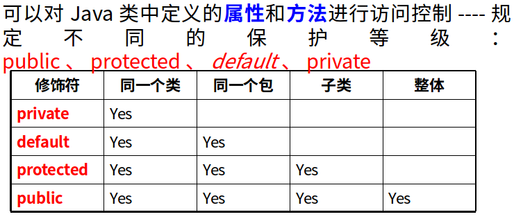
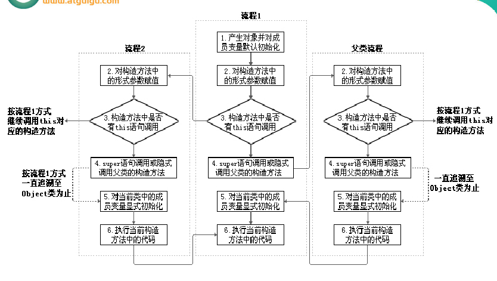
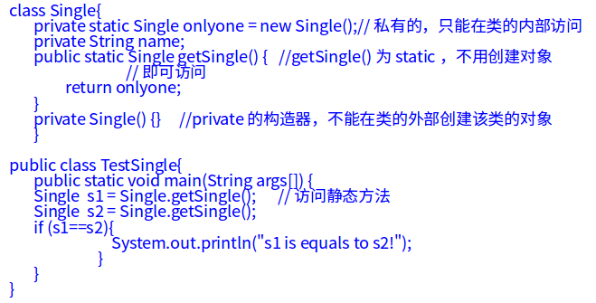
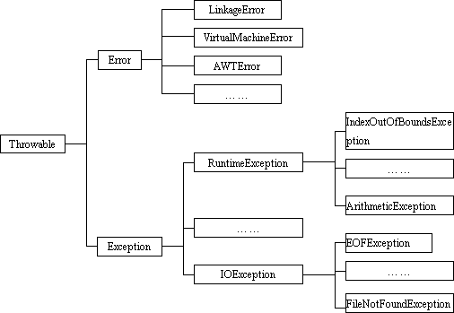
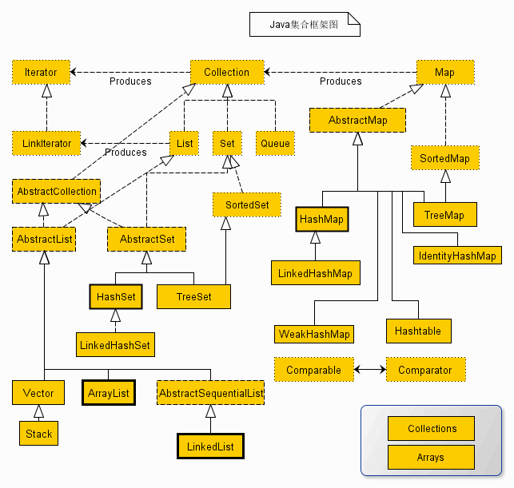
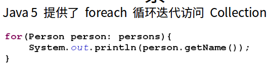
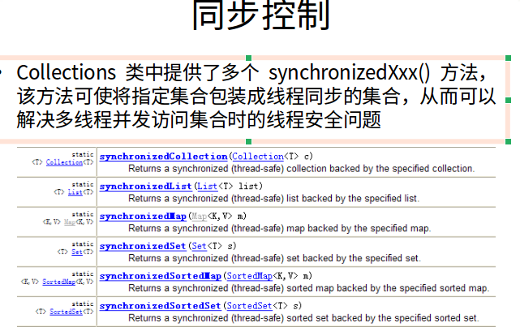

# 一.初识Java

## **Java两大核心机制**

   1.Java虚拟机（Java Virtual Machine）：

​     JVM是一个虚拟的计算机，具有指令集并使用不同的存储区域。负责执行指令， 管理数据、内存、寄存器。 JVM 用于运行 Java 应用程序对于不同的平台，有不同的虚拟机。Java虚拟机机制屏蔽了底层运行平台的差别，实现了“一次编译，到处运行

​    2. 垃圾收集机制（Garbage Collection）

   垃圾回收：将不再使用的内存空间进行回收。 

   在 C/C++ 等语言中，由程序员负责回收无用内存。

  Java 不需要程序员负责回收无用的内存：它提供一种系统级线程跟踪存储空间的分配情况

  并在JVM空闲时，检查并释放那些可被释放的存储空间。

   垃圾回收在 Java 程序运行过程中自动进行，程序员无法精确控制和干预。

# **二. Java语言特点**

特点一：面向对象

两个基本概念：类、对象

三大特性：封装、继承、多态

特点二：健壮性

吸收了C/C++语言的优点，但去掉了其影响程序健壮性的部分。如：指针、内存的申请与释放等

特点三：跨平台性

跨平台性：通过Java语言编写的应用程序在不同的系统平台上都可以运行。

原理：只要在需要运行 java 应用程序的操作系统上，先安装一个Java虚拟机 (JVM Java Virtual Machine) 即可。由JVM来负责Java程序在该系统中的运行。

定义合法标识符规则：

由26个英文字母大小写，数字：0-9 ，_或 $ 组成  ,数字不可以开头。

不可以使用关键字和保留字，但能包含关键字和保留字。

Java中严格区分大小写，长度无限制。

标识符不能包含空格

**“&”和“&&”的区别：**

单&时，左边无论真假，右边都进行运算；

双&时，如果左边为真，右边参与运算，如果左边为假，那么右边不参与运算。

和“||”的区别同理，双或时，左边为真，右边不参与运算。

异或( ^ )与或( | )的不同之处是：对于 ^ 而言，当左右都为true时，结果为false。

### **switch()中支持的类型**

　　在[Java](https://www.baidu.com/s?wd=Java&tn=44039180_cpr&fenlei=mv6quAkxTZn0IZRqIHckPjm4nH00T1YLmW04nWckrHu-rAD1nH--0ZwV5Hcvrjm3rH6sPfKWUMw85HfYnjn4nH6sgvPsT6KdThsqpZwYTjCEQLGCpyw9Uz4Bmy-bIi4WUvYETgN-TLwGUv3En16zPj0zPWDz) 5以前，switch(expr)中，expr只能是byte、short、char、int。从[Java](https://www.baidu.com/s?wd=Java&tn=44039180_cpr&fenlei=mv6quAkxTZn0IZRqIHckPjm4nH00T1YLmW04nWckrHu-rAD1nH--0ZwV5Hcvrjm3rH6sPfKWUMw85HfYnjn4nH6sgvPsT6KdThsqpZwYTjCEQLGCpyw9Uz4Bmy-bIi4WUvYETgN-TLwGUv3En16zPj0zPWDz) 5开始，[Java](https://www.baidu.com/s?wd=Java&tn=44039180_cpr&fenlei=mv6quAkxTZn0IZRqIHckPjm4nH00T1YLmW04nWckrHu-rAD1nH--0ZwV5Hcvrjm3rH6sPfKWUMw85HfYnjn4nH6sgvPsT6KdThsqpZwYTjCEQLGCpyw9Uz4Bmy-bIi4WUvYETgN-TLwGUv3En16zPj0zPWDz)中引入了[枚举类型](https://www.baidu.com/s?wd=%E6%9E%9A%E4%B8%BE%E7%B1%BB%E5%9E%8B&tn=44039180_cpr&fenlei=mv6quAkxTZn0IZRqIHckPjm4nH00T1YLmW04nWckrHu-rAD1nH--0ZwV5Hcvrjm3rH6sPfKWUMw85HfYnjn4nH6sgvPsT6KdThsqpZwYTjCEQLGCpyw9Uz4Bmy-bIi4WUvYETgN-TLwGUv3En16zPj0zPWDz)，expr也可以是enum类型，从Java 7开始，expr还可以是字符串（String），但是长整型（long）在目前所有的版本中都是不可以的。

### **break与cntinue用法**

break只能用于switch语句和循环语句中。

continue 只能用于循环语句中。

标号语句必须紧接在循环的头部。标号语句不能用在非循环语句的前面。

break和continue之后不能有其他的语句，因为程序永远不会执行break 和 continue之后的语句。

**java中数组**

一维数组的声明方式： type  var[] 或 type[]  var；

Java语言中声明数组时不能指定其长度(数组中元素的数）

数组一经分配空间，其中的每个元素也被按照成员变量同样的方式被隐式初始化

```java
int a[]= new int[5]; 
System.out.println(a[3]);	//a[3]的默认值为0
```


动态初始化：数组定义与为数组元素分配空间并赋值的操作分开进行。

```java
int  a[];
a  = new int[3];
a[0] = 3;
a[1] = 9;
a[2] = 8;
```

**静态初始化**：在定义数组的同时就为数组元素分配空间并赋值。

```java
int a[] = { 3, 9, 8};
```

# **三. Java 面向对象**

**面向对象的三大特征**

封装  (Encapsulation)

继承  (Inheritance)

多态  (Polymorphism)

​	类(class)和对象(object)是面向对象方法的核心概念。类是对一类事物描述，是抽象的、概念上的定义；对象是实际存在的该类事物的每个个体，因而也称实例(instance)。

​	如果将对象比作汽车，那么类就是汽车的设计图纸。所以面向对象程序设计的重点是类的设计，而不是对象的设计。 

### **匿名对象**

​	我们也可以不定义对象的句柄，而直接调用这个对象的方法。这样的对象叫做匿名对象， 如：new Person().shout(); 

如果对一个对象只需要进行一次方法调用，那么就可以使用匿名对象。 

我们经常将匿名对象作为实参传递给一个函数调用

### **信息的封装和隐藏**

​	Java中通过将数据声明为私有的(private)，再提供公开的（public）方法:getXXX和setXXX实现对该属性的操作，以实现下述目的：

隐藏一个类的实现细节；

使用者只能通过事先定制好的方法来访问数据，可以方便地加入控制逻辑，限制对属性的不合理操作；

便于修改，增强代码的可维护性；

### **构造方法：**

构造方法的特征---》它具有与类相同的名称；它不含返回值；

注意：在构造方法里不含返回值的概念是不同于“void”的，在定义构造方法时加了“void”，结果这个方法就不再被自动调了。

构造方法的作用：当一个类的实例对象刚产生时，这个类的构造方法就会被自动调用，我们可以在这个方法中加入要完成初始化工作的代码。

Java语言中，每个类都至少有一个构造方法；

如果类的定义者没有显式的定义任何构造方法，系统将自动提供一个默认的构造方法：

默认构造方法没有参数、默认构造方法没有方法体

 所以：不编写构造方法就能用new Xxx()创建类的实例。

Java类中，一旦类的定义者显式定义了一个或多个构造方法，系统将不再提供默认的构造方法；

构造器的主要作用：利用构造器参数初始化对象的属性。

### **函数重载**

​	函数的重载就是在同一个类中允许同时存在一个以上的同名函数，只要它们的参数个数或类型不同即可。重载方法的参数列表必须不同、 重载方法的返回值类型可以相同，也可以不同。调用时根据方法的参数类型来区别

构造方法重载，参数列表必须不同

### **this使用**

this关键字在java程序里的作用和它的词义很接近，它在函数内部就是这个函数所属的对象的引用变量。  

java.lang----包含一些Java语言的核心类，如String、Math、Integer、System和Thread，提供常用功能。

java.net----包含执行与网络相关的操作的类。

java.io----包含能提供多种输入/输出功能的类。

java.util----包含一些实用工具类，如定义系统特性、使用与日期日历相关的函数。


super用来引用父类对象

this用来引用当前对象

super和this均需放在构造方法的第一行

this和super不能同时出想在一个构造函数内

thish和super都指的是对象，不能在static环境中使用，static变量 static方法 static语句块


# **四. Java 类设计**

  **继承：**

子类继承了父类，就继承了父类的方法和属性。在子类中，可以使用父类中定义的方法和属性，也可以创建新的数据和方法。因而，子类通常比父类的功能更多。

在Java 中，继承的关键字用的是“extends”，即子类不是父类的子集，而是对父类的“扩展”。

Java只支持单继承，不允许多重继承

一个子类只能有一个父类

一个父类可以派生出多个子类

关于继承的规则：

子类不能继承父类中私有的(private)的成员变量和方法。

### **访问控制**



**覆盖方法：**

​	在子类中可以根据需要对从父类中继承来的方法进行改造—覆盖方法(方法的重置、重写)，在程序执行时，子类的方法将覆盖父类的方法。

​	覆盖方法必须和被覆盖方法具有相同的方法名称、参数列表和返回值类型。覆盖方法不能使用比被覆盖方法更严格的访问权限。

### **Super用法：**

在Java类中使用super来引用父类的成分

super可用于访问父类中定义的属性

super可用于调用父类中定义的成员方法

super可用于在子类构造方法中调用父类的构造方法

super的追溯不仅限于直接父类

子类继承父类所有的成员变量和成员方法，但不继承父类的构造方法

在一个Java类中可以通过两种方式获得构造方法

使用系统默认的无参数构造方法

显式定义一个或多个构造方法

一旦显式定义了构造方法，则系统不再提供默认构造方法

在子类的构造方法中可使用super(参数列表)语句调用父类的构造方法

如果子类的构造方法中没有显示地调用父类构造方法，也没有使用this关键字调用重载的其它构造方法，则系统默认调用父类无参数的构造方法

如果子类构造方法中既未显式调用父类构造方法，而父类中又没有无参的构造方法，则编译出错

子类对象的实例化过程



**多态特性**

多态—在Java中，子类的对象可以替代父类的对象使用

一个变量只能有一种确定的数据类型

一个引用类型变量可能指向(引用)多种不同类型的对象

```java
Person p = new Student();
Object o = new Person();//Object类型的变量o，指向Person类型的对象
o = new Student(); //Object类型的变量o，指向Student类型的对象
```

父类类型的变量可以指向子类的对象

一个引用类型变量如果声明为父类的类型，但实际引用的是子类对象，那么该变量就不能再访问子类中添加的属性

和方法

```java
Student m = new Student();
m.school = “pku”; 	//合法,Student类有school成员变量
Person e = new Student(); 
e.school = “pku”;	//非法,Person类没有school成员变量
```


 属性是在编译时确定的，编译时e为Person类型，没有school成员变量，因而编译错误。

虚拟方法调用(Virtual Method Invocation)：

正常的方法调用

  ```java
Person e = new Person();
e.getInfo();
Student e = new Student();
e.getInfo();
  ```

  虚拟方法调用(多态情况下)

 ```java
Person e = new Student();
e.getInfo();	//调用Student类的getInfo()方法
 ```


  编译时类型和运行时类型

编译时e为Person类型，而方法的调用是在运行时确定的，所以调用的是Student类的getInfo()方法。—— 动态绑定

方法声明的形参类型为父类类型，可以使用子类的对象作为实参调用该方法

```java
public class Test{ 
	public void method(Person e) {
	           //……

	           e.getInfo();
	}
	public static  void main(Stirng args[]){
           Test t = new Test();
	       Student m = new Student();
	       t.method(m); //子类的对象m传送给父类类型的参数e
	}
}

```

**数据类型转化**

对Java对象的强制类型转换称为造型

从子类到父类的类型转换可以自动进行

从父类到子类的类型转换必须通过造型(强制类型转换)实现

无继承关系的引用类型间的转换是非法的

在造型前可以使用instanceof操作符测试一个对象的类型

### **==操作符与equals方法的区别：**

==：

​	引用类型比较引用(是否指向同一个对象)；

​	Person p1=new Person();   Person p2=new Person();

​	if (p1==p2){…}

​	基本类型比较值；int a=5; if(a==6){…}

用"=="进行比较时，符号两边的数据类型必须一致(可自动转换的基本数据类型除外)，否则编译出错；

equals()方法是Object类的方法，由于所有类都继承Object类，也就继承了equals()方法。只能比较引用类型，其作用与“==”相同,比较是否指向同一个对象。格式:obj1.equals(obj2)

特例：当用equals()方法进行比较时，对类File、String、Date及封装类（Wrapper Class）来说，是比较类型及内容而不考虑引用的是否是同一个对象；

​	原因：在这些类中覆盖了equals()方法。

# 五.java 高级特性

## **static 关键字**

　　　如果想让一个类的所有实例共享数据，请用类变量　。在Java类中声明变量、方法和内部类时，可使用关键字static做为修饰符 ，static标记的变量或方法由整个类(所有实例)共享，如访问控制权限允许，可不必创建该类对象而直接用类名加‘.’调用。static成员也称类成员或静态成员，如：类变量、类方法、静态方法等。

类变量（类属性）由该类的所有实例共享，类属性类似于全局变量

没有对象的实例时，可以用类名.方法名()的形式访问由static标记的类方法

在static方法内部只能访问类的static属性，不能访问类的非static属性。

因为不需要实例就可以访问static方法，因此static方法内部不能有this,(也不能有super  )

1、修饰成员变量

static可以让类共享属性，即属性不再被类对象所有，而是被类共有。静态成员变量在第一次被调用的地方初始化，并且只会被初始化一次。

2、修饰成员方法

static修饰的成员方法，可以使用类名.方法名的方式使用，避免了new出对象的繁琐和资源消耗。

3、静态块

static{

​    ...

}

静态块中的代码，在第一次被调用的地方被执行，且只会被执行一次

总结：

用来修饰成员变量，将其变为类的成员，从而实现所有对象对于该成员的共享；

用来修饰成员方法，将其变为类方法，可以直接使用“类名.方法名”的方式调用，常用于工具类；

静态块用法，将多个类成员放在一起初始化，使得程序更加规整，其中理解对象的初始化过程非常关键；

静态导包用法，将类的方法直接导入到当前类中，从而直接使用“方法名”即可调用类方法，更加方便。


static 特性：static变量在类装载的时候进行初始化，多个实例的static变量会共享同一块内存地址区域

##  Native

Java平台有个用户和本地C代码进行互操作的API，称为Java Native Interface (Java本地接口)。java和C/C++之间的互相调用，即JNI机制。

java中的方法会声明为native

## **类方法**

　　　在静态方法里只能直接调用同类中其它的静态成员（包括变量和方法），而**不能直接**访问类中的非静态成员。

这是因为，对于非静态的方法和变量，需要先创建类的实例对象后才可使用，而静态方法在使用前不用创建任何

对象。 静态方法不能以任何方式引用this和super关键字。与上面的道理一样，因为静态方法在使用前不用创建任何

实例对象，当静态方法被调用时，this所引用的对象根本就没有产生。main() 方法是静态的，因此JVM在执行main

方法时不创建main方法所在的类的实例对象，因而在main()方法中，我们不能直接访问该类中的非静态成员，

必须创建该类的一个实例对象后，才能通过这个对象去访问类中的非静态成员。

　　类属性，类方法的设计思想：类属性作为该类各个对象之间共享的变量。在设计类时,分析哪些类属性**不因对象的不同而改变**，将这些属性设置为类属性。相应的方法设置为类方法。如果方法与调用者无关，则这样的方法通常被声明为类方法，由于不需要创建对象就可以调用类方法，从而简化了方法的调用

　　静态初始化：一个类中可以使用不包含在任何方法体中的静态代码块(static block )，当类被载入时，静态代码块被执行，且只被执行一次，静态块经常用来进行类属性的初始化。

　　　单例模式：所谓类的单态设计模式，就是采取一定的方法保证在整个的软件系统中，对某个类只能存在一个对象实例，并且该类只提供一个取得其对象实例的方法。并且该类只提供一个取得其对象实例的方法。如果我们要让类在一个虚拟机中只能产生一个对象，我们首先必须将类的构造方法的访问权限设置为private，这样，就不能用new 操作符在类的外部产生类的对象了，但在类内部仍可以产生该类的对象。因为在类的外部开始还无法得到类的对象，只能调用该类的某个静态方法以返回类内部创建的对象，静态方法只能访问类中的静态成员变量，所以，指向类内部产生的该类对象的变量也必须定义成静态的。



　　　main 方法的理解:由于java虚拟机需要调用类的main()方法，所以该方法的访问权限必须是public，又因为java虚拟机在执行main()方法时不必创建对象，所以该方法必须是static的，该方法接收一个String类型的数组参数，该数组中保存执行java命令时传递给所运行的类的参数。 

## **fianl 关键字：**

　　　在Java中声明类、属性和方法时，可使用关键字final来修饰。final标记的变量(成员变量或局部变量)即成为常量，

只能赋值一次。final标记的类不能被继承。提高安全性，提高程序的可读性。final标记的方法不能被子类重写

。增加安全性。final标记的成员变量必须在声明的同时或在**每个构造方法**中显式赋值，然后才能使用。

**1、final用途**


final关键字可以用来修饰本地变量，成员变量，方法，类。

成员变量/本地变量被final修饰后，不可修改

方法被final修饰后，子类不可重写

类被final修饰后，不能被继承

2、优点

JVM会对被final修饰的方法/变量/类优化，在编译的阶段被替换，提升效率

final变量可以在多线程下进行共享，不需要额外的同步开销

被修饰后，保证不被修改

3、final类

被final修饰的类，不能被继承。final类中的所有成员方法都被隐式的被指定为final方法。

4、final方法

被final修饰的方法，不能被子类重写。使用final方法的原因有两个，一，把方法锁定，以防任何继承类修改它的含义，二，提升效率

5、final基本数据类型变量

被初始化之后，不能更改

6、final引用类型的变量

被初始化之后，不能再指向其他对象

7、final集合对象

List被用final修饰，不能改变引用，但是可以增/删/改内容。

7、final类变量

必须在定义时，或者构造器中初始化赋值，贝尔哦赋值之后，不能再修改。

## **抽象类(abstract class)：**

　　随着继承层次中一个个新子类的定义，类变得越来越具体，而父类则更一般，更通用。类的设计应该保证父类和

子类能够共享特征。有时将一个父类设计得非常抽象，以至于它没有具体的实例，这样的类叫做抽象类。用abstract

关键字来修饰一个类时，这个类叫做抽象类；用abstract来修饰一个方法时，该方法叫做抽象方法。抽象方法：只有

方法的声明，没有方法的实现。以分号结束。 abstract int abstractMethod1( int a );含有抽象方法的类必须被声明为

抽象类。抽象类不能被实例化。抽象类是用来被继承的，抽象类的子类必须重写父类的抽象方法，并提供方法体。

不能用abstract修饰私有方法，构造方法，静态方法。

　　　抽象类是用来模型化那些父类无法确定全部实现，而是由其子类提供具体实现的对象的类。

## **接口interface:**

​      有时必须从几个类中派生出一个子类，继承它们所有的属性和方法。但是，Java不支持多重继承。有了接口，

就可以得到多重继承的效果。接口(interface)是抽象方法和常量值的定义的集合。从本质上讲，接口是一种特殊的

抽象类，这种抽象类中只包含常量和方法的定义，而没有变量和方法的实现。

**接口的特点：**

​                用 interface 来定义。

​                接口中的所有成员变量都默认是由public static final修饰的。

​                接口中的所有方法都默认是由public abstract修饰的。接口没有构造方法。

​                实现接口的类中必须提供接口中所有方法的具体实现内容。 

​                 多个无关的类可以实现同一个接口

​                 一个类可以实现多个无关的接口

​                 与继承关系类似，接口与实现类之间存在多态性

​                接口也可以继承另一个接口，使用extends关键字

​                 注：如果实现接口的类中没有实现接口中的全部方法，必须将此类定义为抽象类。 

​                　　接口也可以继承另一个接口，使用extends关键字

| 参数               | 抽象类                                                       | 接口                                                         |
| ------------------ | ------------------------------------------------------------ | ------------------------------------------------------------ |
| 默认的方法实现     | 它可以有默认的方法实现                                       | 接口完全是抽象的。它根本不存在方法的实现                     |
| 实现               | 子类使用extends关键字来继承抽象类。如果子类不是抽象类的话，它需要提供抽象类中所有声明的方法的实现。 | 子类使用关键字implements来实现接口。它需要提供接口中所有声明的方法的实现 |
| 构造器             | 抽象类可以有构造器                                           | 接口不能有构造器                                             |
| 与正常Java类的区别 | 除了你不能实例化抽象类之外，它和普通Java类没有任何区别       | 接口是完全不同的类型                                         |
| 访问修饰符         | 抽象方法可以有public、protected和default这些修饰符           | 接口方法默认修饰符是public。你不可以使用其它修饰符。         |
| main方法           | 抽象方法可以有main方法并且我们可以运行它                     | 接口没有main方法，因此我们不能运行它。                       |
| 多继承             | 抽象方法可以继承一个类和实现多个接口                         | 接口只可以继承一个或多个其它接口                             |
| 速度               | 它比接口速度要快                                             | 接口是稍微有点慢的，因为它需要时间去寻找在类中实现的方法。   |
| 添加新方法         | 如果你往抽象类中添加新的方法，你可以给它提供默认的实现。因此你不需要改变你现在的代码。 | 如果你往接口中添加方法，那么你必须改变实现该接口的类。       |

## **内部类：**

　在Java中，允许一个类的定义位于另一个类的内部，前者称为内部类内部类和外层封装它的类之间存在逻辑上的

所属关系inner class一般用在定义它的类或语句块之内，在外部引用它时必须给出完整的名称。 Inner class的名字

不能与包含它的类名相同；Inner class可以使用包含它的类的静态和实例成员变量，也可以使用它所在方法的局部变

量；Inner class可以声明为抽象类 ，因此可以被其它的内部类继承。也可以声明为final的。和外层类不同，Inner

 class可以声明为private或protected；Inner class 可以声明为static的，但此时就不能再使用外层封装类的非static的

成员变量；非static的内部类中的成员不能声明为static的，只有在顶层类或static的内部类中才可声明static成员；

# **六.异常处理**

Java程序运行过程中所发生的异常事件可分为两类：

​                Error:  JVM系统内部错误、资源耗尽等严重情况

​                Exception: 其它因编程错误或偶然的外在因素导致的一般性问题，例如：

​                空指针访问

​                试图读取不存在的文件

​                网络连接中断



try 

​	捕获异常的第一步是用try{…}语句块选定捕获异常的范围，将可能出现异常的代码放在try语句块中。

catch (Exceptiontype e)

​	在catch语句块中是对异常对象进行处理的代码。每个try语句块可以伴随一个或多个catch语句，用于处理可能产生的不同类型的异常对象。

如果明确知道产生的是何种异常，可以用该异常类作为catch的参数；也可以用其父类作为catch的参数。

捕获异常的有关信息：

​	与其它对象一样，可以访问一个异常对象的成员变量或调用它的方法。

getMessage( ) 方法，用来得到有关异常事件的信息

printStackTrace( )用来跟踪异常事件发生时执行堆栈的内容。

不论在try、catch代码块中是否发生了异常事件，finally块中的语句都会被执行。

finally语句是可选的

声明抛出异常是Java中处理异常的第二种方式

如果一个方法(中的语句执行时)可能生成某种异常，但是并不能确定如何处理这种异常，则此方法应显式地声明抛出异常，表明该方

法将不对这些异常进行处理，而由该方法的调用者负责处理。在方法声明中用 throws 子句可以声明抛出异常的列表，

throws后面的异常类型可以是方法中产生的异常类型，也可以是它的父类。

重写方法声明抛出异常的原则:重写方法不能抛出比被重写方法范围更大的异常类型

异常的第三种处理方式：

​        Java异常类对象除在程序执行过程中出现异常时由系统自动生成并抛出，也可根据需要人工创建并抛出

​        首先要生成异常类对象，然后通过throw语句实现抛出操作(提交给Java运行环境)。

​        IOException e =new IOException();

​        throw e;

​        可以抛出的异常必须是Throwable或其子类的实例。下面的语句在编译时将会产生语法错误：

​        		       throw new String("want to throw");

# **七.java 集合**

  **Java 集合概述:**

​            Java 集合就像一种容器，可以把多个对象的引用放入容器中。

​            Java 集合类可以用于存储数量不等的多个对象，还可用于保存具有映射关系的关联数组

​            Java 集合可分为 Set、List 和 Map 三种体系

​            Set：无序、不可重复的集合

​            List：有序，可重复的集合

​            Map：具有映射关系的集合

​            在 Java5 之前，Java 集合会丢失容器中所有对象的数据类型，把所有对象都当成 Object 类型处理；

​            从 Java5 增加了泛型以后，Java 集合可以记住容器中对象的数据类型



Collection 接口是 List、Set 和 Queue 接口的父接口，该接口里定义的方法既可用于操作 Set 集合，也可用于操作

 List 和 Queue 集合.

Iterator 接口遍历集合元素:

Iterator 接口主要用于遍历 Collection 集合中的元素，Iterator 对象也被称为迭代器

Iterator 接口隐藏了各种 Collection 实现类的底层细节，向应用程序提供了遍历 Collection 集合元素的统一编程接口

Iterator 仅用于遍历集合，Iterator 本身并不提供承装对象的能力。如果需要创建 Iterator 对象，则必须有一个被迭代的集合。



​       **set 集合：**

​                    Set 集合不允许包含相同的元素，如果试把两个相同的元素加入同一个 Set 集合中，则添加操作失败。

​                    Set 判断两个对象是否相同不是使用 == 运算符，而是根据 equals 方法

　　　

​                HashSet 是 Set 接口的典型实现，大多数时候使用 Set 集合时都使用这个实现类。

​                HashSet 按 Hash 算法来存储集合中的元素，因此具有很好的存取和查找性能。

​                HashSet 具有以下特点：

​                                    不能保证元素的排列顺序

​                                    HashSet 不是线程安全的

​                                    集合元素可以使 null

​             　　　　当向 HashSet 集合中存入一个元素时，HashSet 会调用该对象的 hashCode() 方法来得到该对象的 hashCode 值，

​            然后根据 hashCode 值决定该对象在 HashSet 中的存储位置。如果两个元素的 equals() 方法返回 true，但它们

​             hashCode() 返回值不相等，hashSet 将会把它们存储在不同的位置，但依然可以添加成功。

**HashSet** 集合判断两个元素相等的标准：两个对象通过 equals() 方法比较相等，并且两个对象的 hashCode() 方法

返回值也相等。如果两个对象通过 equals() 方法返回 true，这两个对象的 hashCode 值也应该相同。

重写 hashCode() 方法的基本原则：

​                在程序运行时，同一个对象多次调用 hashCode() 方法应该返回相同的值

​                当两个对象的 equals() 方法比较返回 true 时，这两个对象的 hashCode() 方法的返回值也应相等

​                对象中用作 equals() 方法比较的 Field，都应该用来计算 hashCode 值

**LinkedHashSet** 是 HashSet 的子类

LinkedHashSet 集合根据元素的 hashCode 值来决定元素的存储位置，但它同时使用链表维护元素的次序，这使得元素看起来是以插入顺序保存的。

LinkedHashSet 性能插入性能略低于 HashSet，但在迭代访问 Set 里的全部元素时有很好的性能。

LinkedHashSet 不允许集合元素重复。

**TreeSet** 是 SortedSet 接口的实现类，TreeSet 可以确保集合元素处于排序状态。

TreeSet 支持两种排序方法：自然排序和定制排序。默认情况下，TreeSet 采用自然排序。

**list集合：**

​            List 代表一个元素有序、且可重复的集合，集合中的每个元素都有其对应的顺序索引

​            List 允许使用重复元素，可以通过索引来访问指定位置的集合元素。

​            List 默认按元素的添加顺序设置元素的索引。

​            List 集合里添加了一些根据索引来操作集合元素的方法

List 额外提供了一个 listIterator() 方法，该方法返回一个 ListIterator 对象， ListIterator 接口继承了 Iterator 接口，

提供了专门操作 List 的方法：

​                        boolean hasPrevious()

​                        Object previous()

​                        void add()

ArrayList 和 Vector 是 List 接口的两个典型实现

区别：

​            是一个古老的集合，通常建议使用 ArrayList

​            ArrayList 是线程不安全的，而 Vector 是线程安全的。

​            即使为保证 List 集合线程安全，也不推荐使用 Vector

​            Arrays.asList(…) 方法返回的 List 集合即不是 ArrayList 实例，也不是 Vector 实例。

​             Arrays.asList(…)  返回值是一个固定长度的 List 集合。

**Ｍａｐ集合：**

​        Map 用于保存具有映射关系的数据，因此 Map 集合里保存着两组值，一组值用于保存 Map 里的 Key，

​        另外一组用于保存 Map 里的 Value

​        Map 中的 key 和  value 都可以是任何引用类型的数据

​        Map 中的 Key 不允许重复，即同一个 Map 对象的任何两个 Key 通过 equals 方法比较中返回 false

​        Key 和 Value 之间存在单向一对一关系，即通过指定的 Key 总能找到唯一的，确定的 Value。

HashMap 和 Hashtable 是 Map 接口的两个典型实现类，区别：

​        Hashtable 是一个古老的 Map 实现类，不建议使用

​        Hashtable 是一个线程安全的 Map 实现，但 HashMap 是线程不安全的。

​        Hashtable 不允许使用 null 作为 key 和 value，而 HashMap 可以

​        与 HashSet 集合不能保证元素的顺序的顺序一样，Hashtable 、HashMap 也不能保证其中 key-value 对的顺序

​       Hashtable 、HashMap 判断两个 Key 相等的标准是：两个 Key 通过 equals 方法返回 true，hashCode 值也相等。

​        Hashtable 、HashMap 判断两个 Value相等的标准是：两个 Value 通过 equals 方法返回 true

　　

​            LinkedHashMap 是 HashMap 的子类

​            LinkedHashMap 可以维护 Map 的迭代顺序：迭代顺序与 Key-Value 对的插入顺序一致

​            Properties 类是 Hashtable 的子类，该对象用于处理属性文件

​            由于属性文件里的 key、value 都是字符串类型，所以 properties 里的 Key 和 Value 都是字符串类型的

补充：

Collections 是一个操作 Set、List 和 Map 等集合的工具类

Collections 中提供了大量方法对集合元素进行排序、查询和修改等操作，还提供了对集合对象设置不可变、

对集合对象实现同步控制等方法

排序操作：

reverse(List)：反转 List 中元素的顺序

shuffle(List)：对 List 集合元素进行随机排序

sort(List)：根据元素的自然顺序对指定 List 集合元素按升序排序

sort(List，Comparator)：根据指定的 Comparator 产生的顺序对 List 集合元素进行排序

swap(List，int， int)：将指定 list 集合中的 i 处元素和 j 处元素进行交换

Object max(Collection)：根据元素的自然顺序，返回给定集合中的最大元素

Object max(Collection，Comparator)：根据 Comparator 指定的顺序，返回给定集合中的最大元素

Object min(Collection)

Object min(Collection，Comparator)

int frequency(Collection，Object)：返回指定集合中指定元素的出现次数

boolean replaceAll(List list，Object oldVal，Object newVal)：使用新值替换 List 对象的所有旧值



# **八.java 泛型**


# 工作积累：

## BigDecimal比较大小

   这个类是java里精确计算的类，下面说一下两个BigDecimal对象大小，相等的判断
   1 比较对象是否相等
​     一般的对象用equals，但是BigDecimal比较特殊，举个例子：

   ```java
BigDecimal a=BigDecimal.valueOf(1.0);
BigDecimal b=BigDecimal.valueOf(1.000);
   ```

​     在现实中这两个数字是相等的，但是如果用
​     a.equals(b)结果是false;怎么不相等了呢？因为equals是比较内容，“1.0”和“1.000”当然不一样了

​     解决办法：
​            if(a.compareTo(b)==0) 结果是true

    ```java
 public int compareTo(BigDecimal val)
          Compares this BigDecimal with the specified BigDecimal. 
         Two BigDecimal objects that are equal in value but have a different
         scale (like 2.0 and 2.00) are considered equal by this method. 
         This method is provided in preference to individual methods for each of 
         the six boolean comparison operators (<, ==, >, >=, !=, <=). 
         The suggested idiom for performing these comparisons is: (x.compareTo(y) <op> 0), where <op> is one of the six comparison operators.

    Specified by:
    compareTo in interface Comparable<BigDecimal>
    Parameters:
    val - BigDecimal to which this BigDecimal is to be compared. 
    Returns:
       -1, 0, or 1 as this BigDecimal is numerically less than, equal to, or greater than val.
   #   简单翻译：
           结果是
-1 小于  
0 等于
1 大于
    ```

 