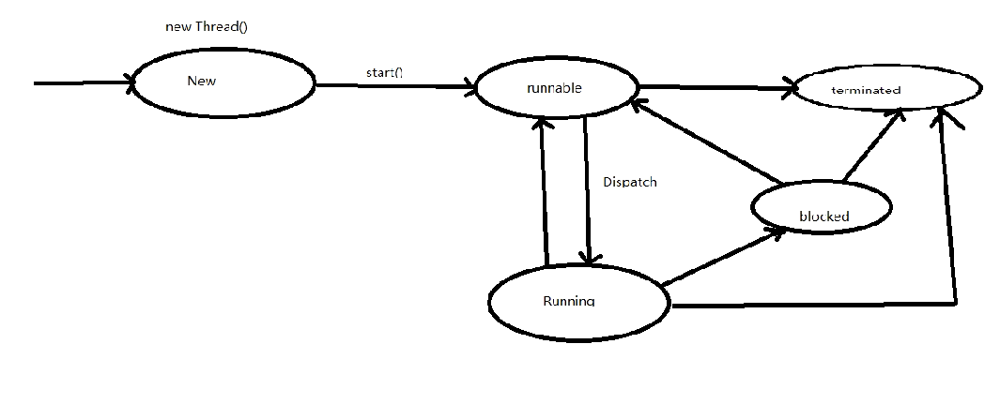

基础

**jps：** 

  jps是jdk提供的一个查看当前java进程的小工具， 可以看做是JavaVirtual Machine Process Status Tool的缩写。非常简单实用。

​      命令格式：jps [options ] [ hostid ] 

​      [options]选项 ：

-q：仅输出VM标识符，不包括classname,jar name,arguments in main method 

-m：输出main method的参数 

-l：输出完全的包名，应用主类名，jar的完全路径名 

-v：输出jvm参数 

-V：输出通过flag文件传递到JVM中的参数(.hotspotrc文件或-XX:Flags=所指定的文件 

-Joption：传递参数到vm,例如:-J-Xms512m

**jconsole：**

JConsole 是一个内置 Java 性能分析器，可以从命令行或在 GUI shell 中运行。您可以轻松地使用 JConsole（或者，它更高端的 “近亲” VisualVM ）来监控 Java 应用程序性能和跟踪 Java 中的代码。

### 线程生命周期以及start方法原理剖析

[线程生命周期]

1.Java应用程序的main函数是一个线程,是被JVM启动的时候调用,线程名字叫做main

2.实现一个线程，必须创建Thread实例，overrite run 方法，并调用start方法

3.在JVM启动后，实际上有多个线程，但是至少有一个非守护线程

4.当我们调用一个线程的start方法的时候，此时至少有两个线程，一个是调用你的线程，还有一个是执行run方法的线程（被创建的线程）

5.线程的生命周期分为new,runnable,running,block,termiated

### Callable Runnable

相同点：

1. 两者都是接口；（废话）
2. 两者都可用来编写多线程程序；
3. 两者都需要调用Thread.start()启动线程；

 

不同点：

1. 两者最大的不同点是：实现Callable接口的任务线程能返回执行结果；而实现Runnable接口的任务线程不能返回结果；
2. Callable接口的call()方法允许抛出异常；而Runnable接口的run()方法的异常只能在内部消化，不能继续上抛；

 

注意点：

- Callable接口支持返回执行结果，此时需要调用FutureTask.get()方法实现，此方法会阻塞主线程直到获取‘将来’结果；当不调用此方法时，主线程不会阻塞！

来源： <https://www.cnblogs.com/frinder6/p/5507082.html>