gg1.删除用户：

root用户进入home，ls查看当前有多少用户  userdel -r 用户名

2.执行userdel -r 用户名

查找jetty进程并杀掉进程： 

ps -ef | grep -i jeety   kill -9 25709

3.将某个文件内容清空，

cat /dev/null > license.js

４.查找某个进程并终止进程

ps -ef | grep jetty | awk '{print $2}' | xargs kill -9

5.查找文件

grep -rl "licenseinfo*" /apps/CloudData/flexsafe_proj_bak/

６.切换到普通用户

root切换到普通用户：su - weixiaotao

查看当前系统使用情况：df -lh

菜单导航栏水平：gsettings set com.canonical.Unity.Launcher launcher-position Bottom

```
７.查找过滤端口/服务进程
netstat -nlt | grep 3306 | wc -l
ps -ef | grep mysql* | grep -v grep | wc -l

5、安装chromium
add-apt-repository ppa:a-v-shkop/chromium
apt-get update
apt-get install chromium-browser


安装之后不能用root用户打开，解决方案：
apt-get -y install hexedit
hexedit /opt/google/chrome/chrome
进入到编辑器后，光标在左侧，首先按TAB键切换到右侧的ASCII码模式，接着按Ctrl+S打开搜索功能，输入geteuid查找，当光标停到首字母的地方后，直接输入getppid就能修改了，最后按Ctrl+X保存退出。
```

## Linux LVM简明教程 

  https://linux.cn/article-3218-2.html   

挂在后修改/etc/fatab文件在最后添加如下内容保证下次软件安装在挂在的apps下面


## ubuntu 中问题

### apt-get install 安装软件问题

在[Ubuntu](http://www.linuxidc.com/topicnews.aspx?tid=2)系统的termial下，用apt-get install 安装软件的时候，如果在未完成下载的情况下强制关闭terminal。此时 apt-get进程可能没有结束。结果，如果再次运行apt-get install 命令安装如今，可能会发生下面的问题。

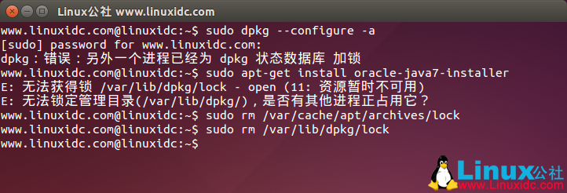

**问题说明**：

Ubuntu下运行程序更新时出现报错：

E：无法获得锁 /var/lib/dpkg/lock - open (11: 资源暂时不可用)

E：无法锁定管理目录(/var/lib/dpkg/)，是否有其他进程正占用它？

或者这个错误：

dpkg: 错误：另外一个进程已经为 dpkg 状态数据库 加锁

上述某一执行过程中卡死了，相应进程也没结束掉。

**解决方法**：

其实这是因为有另外一个程序在运行，导致锁不可用。原因可能是上次运行更新或安装没有正常完成。如果是以上分析的前两种情况，最好是等待操作完成。也可以用以下办法是杀死此进程

sudo rm /var/cache/apt/archives/lock

sudo rm /var/lib/dpkg/lock

OK，如果没有意外，此问题解决了。


chkconfig iptables --list   查看防火墙状态

chkconfig iptables off      关闭防火墙

sync 将数据由内存同步到硬盘中

设置xxx用户具有root权限

​    修改/etc/sudoers 文件,在root下面添加一行

​        root ALL=(ALL) ALL

​        xxx ALL=(ALL) ALL


### linux-移动复制相关（scp）

cp [options] source dest

cp [options] source... directory

说明：将一个档案拷贝至另一档案，或将数个档案拷贝至另一目录。

-a 尽可能将档案状态、权限等资料都照原状予以复制。

-r 若 source 中含有目录名，则将目录下之档案亦皆依序拷贝至目的地。

-f 若目的地已经有相同档名的档案存在，则在复制前先予以删除再行复制

命令：scp

不同的Linux之间copy文件常用有3种方法：

第一种就是ftp，也就是其中一台Linux安装ftp Server，这样可以另外一台使用ftp的client程序来进行文件的copy。

第二种方法就是采用samba服务，类似Windows文件copy 的方式来操作，比较简洁方便。

第三种就是利用scp命令来进行文件复制。

scp是有Security的文件copy，基于ssh登录。操作起来比较方便，比如要把当前一个文件copy到远程另外一台主机上，可以如下命令。

scp /home/daisy/full.tar.gz root@172.19.2.75:/home/root

然后会提示你输入另外那台172.19.2.75主机的root用户的登录密码，接着就开始copy了。

如果想反过来操作，把文件从远程主机copy到当前系统，也很简单。

scp root@/full.tar.gz 172.19.2.75:/home/root/full.tar.gz home/daisy/full.tar.gz

linux 的 scp 命令 可以 在 linux 之间复制 文件 和 目录； 

从 本地 复制到 远程 
====== 
\* 复制文件： 
       * 命令格式： 
               scp local_file remote_username@remote_ip:remote_folder 
               或者 
               scp local_file remote_username@remote_ip:remote_file 
               或者 
               scp local_file remote_ip:remote_folder 
               或者 
               scp local_file remote_ip:remote_file

​       * 命令格式： 

​               scp -r local_folder remote_username@remote_ip:remote_folder 

​               或者 

​               scp -r local_folder remote_ip:remote_folder 

​            

====== 

从 远程 复制到 本地 

====== 

从 远程 复制到 本地，只要将 从 本地 复制到 远程 的命令 的 后2个参数 调换顺序 即可； 

例如： 

​       scp root@www.cumt.edu.cn:/home/root/others/music /home/space/music/1.mp3 

​       scp -r www.cumt.edu.cn:/home/root/others/ /home/space/music/

注意两点：
1.如果远程服务器防火墙有特殊限制，scp便要走特殊端口，具体用什么端口视情况而定，命令格式如下：
\#scp -p 4588 remote@www.abc.com:/usr/local/sin.sh /home/administrator
2.使用scp要注意所使用的用户是否具有可读取远程服务器相应文件的权限


### linux-文件操作相关

1.文件查找相关

grep "mainDiv_panelBody" * -R     --在当前目录下递归查询mainDiv_panelBody 出现的地方

grep "mainDiv_panelBody" * -R | wc -l   ---在当前目录下递归查询mainDiv_panelBody 出现的次数

grep "mainDiv_panelBody"  -n -R         ---在当前目录下递归查询mainDiv_panelBody 出现的地方并显示行号

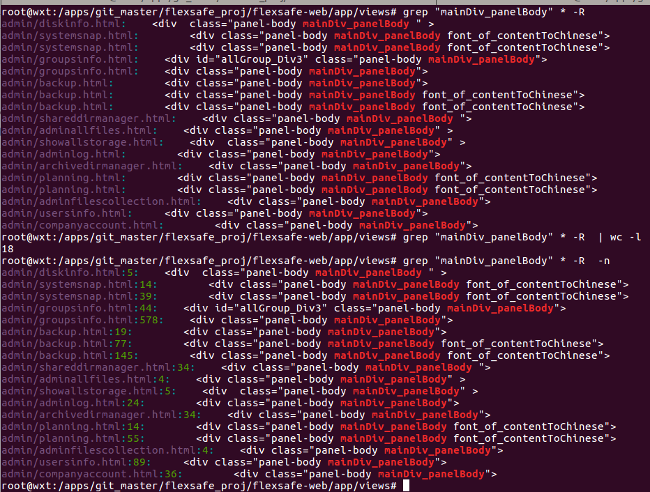

```
# grep ‘energywise’ *           #在当前目录搜索带'energywise'行的文件

# grep -r ‘energywise’ *        #在当前目录及其子目录下搜索'energywise'行的文件
```

```
# grep -l -r ‘energywise’ *     #在当前目录及其子目录下搜索'energywise'行的文件，但是不显示匹配的行，只显示匹配的文件


2.替换文件中指点的字符换
sed -i "s/faBetweenSpanWithToFilesList/faBetweenSpanWith/g"  views/admin/*.html
```

将所有

```
faBetweenSpanWithToFilesList 替换成faBetweenSpanWith
```


**Ubuntu１６.04没有声音**

解决办法

将文件【myprofile.sh】放在　/etc/profile.d 目录下面

文件内容如下：myprofile.sh

```sh
pulseaudio --start --log-target=syslog
```

### **Ubuntu 16.04 安装Maven3.3.9**

1 下载地址

```
http://maven.apache.org/download.cgi
```

2 将下载到的apache-maven-3.3.9-bin.tar.gz文件上传到/temp目录下，然后切换到root用户下，执行如下命令。

```
root@test:/temp# tar zxvf apache-maven-3.3.9-bin.tar.gz
root@test:/temp# cd /opt
root@test:/opt# mv /temp/apache-maven-3.3.9 .
```

3 创建软链接

```
root@test:/bin# ln -s /opt/apache-maven-3.3.9/bin/mvn mvn
```

4 添加环境配置

```
root@test:/opt/jdk1.8.0_92# gedit /etc/profile
......
export M2_HOME=/opt/apache-maven-3.3.9
export PATH=${M2_HOME}/bin:$PATH
......
```

 执行下面命令使配置文件生效

```
root@test:/opt/jdk1.8.0_92# source /etc/profile
```

5 使用其它用户验证

```
ccskun@test:~$ mvn -v
Apache Maven 3.3.9 (bb52d8502b132ec0a5a3f4c09453c07478323dc5; 2015-11-11T00:41:47+08:00)
Maven home: /opt/apache-maven-3.3.9
Java version: 1.8.0_92, vendor: Oracle Corporation
Java home: /opt/jdk1.8.0_92/jre
Default locale: zh_CN, platform encoding: UTF-8
OS name: "linux", version: "4.4.0-22-generic", arch: "amd64", family: "unix"
ccskun@test:~$ 
```

### Ubuntu root登录

ubuntu 16.04启用root用户方法
     1、使用:sudo passwd root设置root的密码，如下图所示：

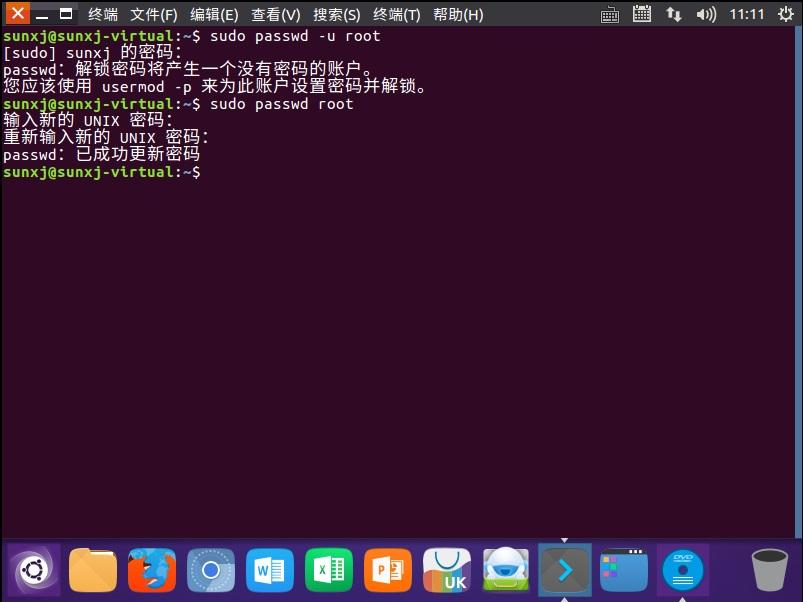 2、使用su root来测试是否可以进入root用户，如果出现#说明已经设置root用户的密码成功，如下图所示：

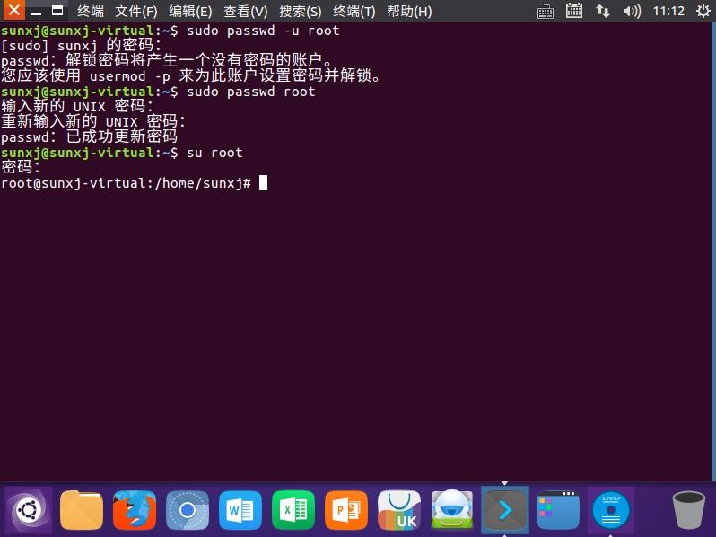 3、进入到/usr/share/lightdm/lightdm.conf.d/目录，使用gedit 50-unity-greeter.conf &命令打开50-unity-greeter.conf 文件，如下图所示：

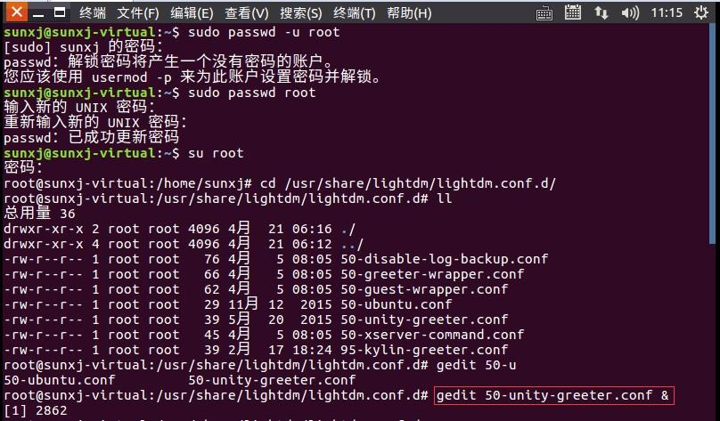 4、在打开文件中添加如下信息，来设置登录时可以选择用户登录，如下图所示：user-session=ubuntugreeter-show-manual-login=trueall-guest=false

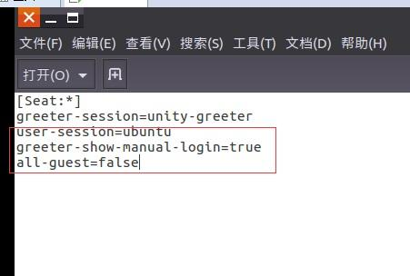 

5、重启系统，即可出现输入用户名信息，如下图所示：

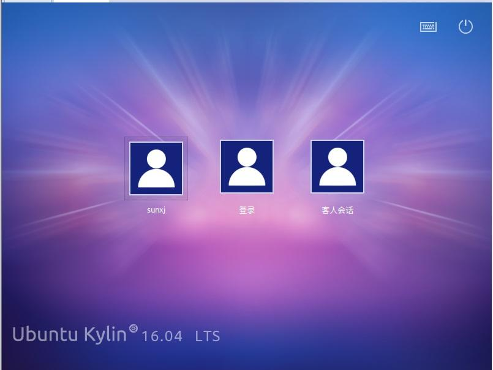 6、输入root用户名和密码，如下图所示：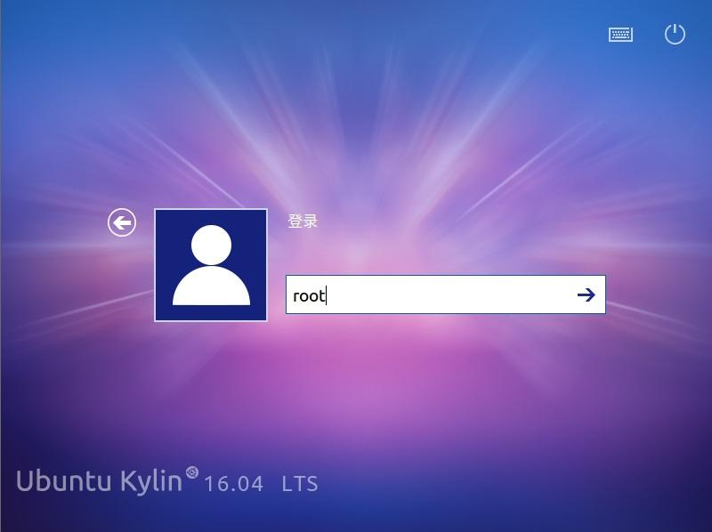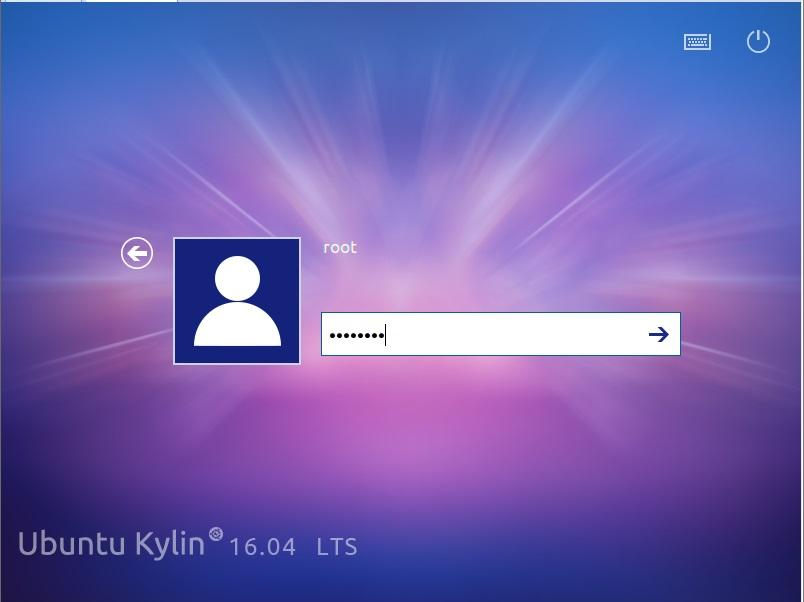 7、此时会出现：读取/root/.profile时发现错误，对话框，如下图所示：

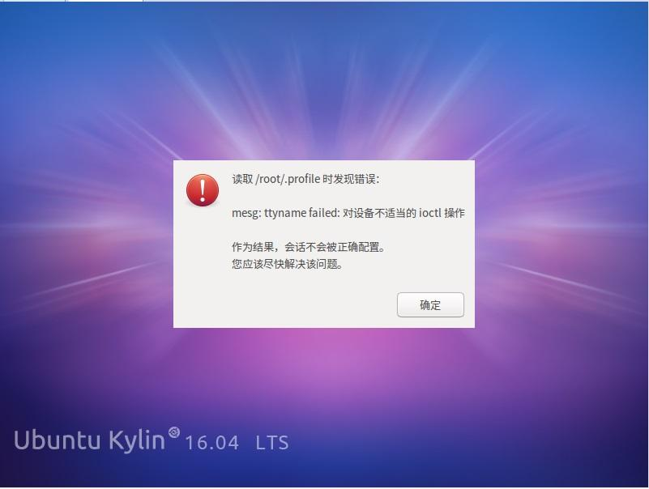 8、点击确定按钮，进入系统，使用vi /root/.profile命令修改文件，找到mesg n，修改为：tty -s && mesg n，如下图所示：

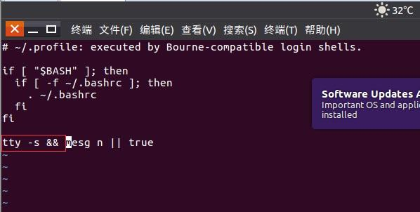 

9、保存退出，然后重启系统即可。

## 马哥linux

### 07-01vim编辑器详解

vi

全屏编辑器、模式话编辑器

vim模式：

编辑模式（命令模式）：

输入模式：

末行模式：

模式转换

编辑-->输入

​      i:在当前光标所在的字符的前面，转为输入模式

​      I：在当前光标所在的行的行首，转为输入模式

​      a:在当前光标所在的字符的后面，转为输入模式

​     A：在当前光标所在的行的行尾，转为输入模式

​     o:在当前光标所在的行的下方，新建一行，并转为输入模式

​    O:在当前光标所在的行的上方，新建一行，并转为输入模式

输入--》编辑

   ESC

只能从编辑模式才能进入末行模式

编辑模式->末行模式

​       ：

末行模式->编辑模式：

​     ESC ESC

一.打开文件

vim +num :打开文件，并定位于第n行

vim + :打开文件，定位至最后一行

vim +/pattern:打开文件，定位至第一次匹配pattern的行的行首

二.关闭文件

1.末行模式关闭文件：

​    :w  保存

​    :q   退出

​     :wq  保存退出   --> :x

​    :q!   不保存退出

​    :w!  强制保存（一般只有root可以）

2.编辑模式下退出

   ZZ:保存并退出

三.移动光标（编辑模式）

1.逐字符移动

​    h:left

​    j: down

​    k:up

​    l:right

  #h:移动#个字符

2.按照单词为单位进行移动

   w;移至下一个单词的词首

   e:跳至当前或者下一个单词的词尾

   b:跳至当前或者上一个单词的词首

  #w:一次跳#个单词

3.行内跳转

​     0：绝对行首

​     ^:行首的第一个非空白字符

​     $:绝对行尾

4.行间跳转

​    #G:跳转至第#行

​    G:最后一行

   末行模式下，直接给出行号即可

四.翻屏操作         

​      ctrl +F :向下翻一屏

​      ctrl+ B:向上翻一屏

​      ctrl+ D::向下翻半屏

​      ctrl+U::向下翻半屏

五.删除单个字符

​    x:删除光标所在处的单个字符

​    #x:删除光标所在处及向后的#个字符

六.删除命名：d

​    d命名跟跳转命令组合使用

   #d跳转符：删除跳转符指定范围内的#个字符 ---》3dw ,#de ,#db

​    dd:删除当前光标所在行

​    #dd:删除包括当前光标所在行在内的#行

   末行模式下：

​      start,end dd    --删除statt-end范围内的行

​      . :表示当前行

​      $:最后一行

​     +#:向下的#行

七.粘贴命名：p

​        p:如果删除的或者复制的为整行内容，则粘贴至光标所在行的下方

​           如果删除的或者复制的为非整行内容，则粘贴至光标所在字符的后面

​        P:如果删除的或者复制的为整行内容，则粘贴至光标所在行的上方

​           如果删除的或者复制的为非整行内容，则粘贴至光标所在字符的前面

八.复制命名：y

​     用法同d命令

九.修改：先删除内容在转换为输入模式

​    c:用法同d命令

十.替换：r   -替换单个字符

​       R:替换模式

十一.撤销编辑操作 u

​        u:撤销前一次的编辑操作

​        连续u命令可以撤销此前的n词操作

​        #u:直接撤销最近的#次编辑操作

​        ctrl + r:撤销最近一次的撤销

十二.重复前一次编辑操作    .

十三.可视化模式：v /V

​       v:按字符选取

​       V:按矩形块选取

十四.查找替换

​      /pattern :

​     ?pattern:倒序查找

​           n/N:下一个/上一个

十五.查找并替换

​    在末行模式下使用s命名

​      start,ends/str1/str2/gi

​     %:表示全文替换    <=> 1,$

​      

​    .,$-1s/source/SOURCE/g   --替换从当前行到倒数第二行将source->SOURCE

十六.打开多个文件

   vim file1 file2 ...

   末行模式下：

​      :next 切换至下一个文件

​      :prev 切换至前一个文件

​      :last 切换至最后一个文件

​      :first 切换至第一个文件

​      退出：

​       ：qa 全部退出

十七：分屏显示一个文件

​      ctrl + w ,s 水平拆分窗口

​      ctrl + w ,v 垂直拆分窗口

​       在窗口间切换光标

​      ctrl + w,arrow :

​      :qa 关闭所有窗口

十八.分窗口显示多个文件

​       vim -o file1 file2 :水平分割显示

​       vim -O file1 file2 :垂直分割显示    

十九.将当前文件中的部分内容另存为另一个文件

​      末行模式下使用w命令

​     :w

​     :start,endw /path/to/somewhere

二十.将另外一个文件的内容填充到当前文件中

​     ：r /path/to/somewhere

二十一.跟shell交互

​     ：！ command

二十二.高级话题

​    1.显示或取消行号

​        ：set nu   

​          : set nonu

​    2.显示忽略或者区分字符大小写

​       :set ic   (set ignorecase)

​       :set noignorecase

​       :set noic

3.设置自动缩进

​    :set autoindent

   : set ai

​    : set noai

4.查找到的文本高亮显示或者取消

​    :set hlsearch

​    :set nohlsearch

5.语法高亮

​     : syntax on

​     : syntax off

二十三.配置文件

​    /etc/vimrc   --对所有用户生效

   ~/.vimrc  --对当前用户生效

### 07-02使用脚本选择以及组合条件测试

`$# 是传给脚本的参数个数`

`$``0` `是脚本本身的名字`

`$``1` `是传递给该shell脚本的第一个参数`

`$``2` `是传递给该shell脚本的第二个参数`

`$@ 是传给脚本的所有参数的列表`

`$* 是以一个单字符串显示所有向脚本传递的参数，与位置变量不同，参数可超过``9``个`

`$$ 是脚本运行的当前进程ID号`

`$? 是显示最后命令的退出状态，``0``表示没有错误，其他表示有错误`

测试：

整数测试：

​    -le

​    -lt

​    -gt

​    -ge

​    -eq

​     -ne

字符测试

​     ==、!=、>、<、-n、-z

文件测试:

​     -e 、-f、 -d、 -r、 -w、-x

组合测试条件

​     -a: 与关系

​     -o:或关系

​      ！:非关系

### 07-03文件查找

grep  egrep fgrep :文本查找

文件查找：

locate:    速度相对较快，用的少

​              非实时，模糊匹配，查找是根据全系统文件数据来进行的

​               updatedb  手动生成文件数据库

find:

​        实时

​        精确

​        支持众多查找目标

​        遍历指定目录中的所有文件完成查找，速度较慢;

find  查找路径 查找标准 查找到以后的处理动作

查找路径：默认当前目录

查找标准：默认为指定路径下的所有文件

处理动作：默认为显示

查找标准（匹配标准）：

​      -name "filename": 对文件名做精确匹配

​          文件名通配：

​                           *:任意长度的任意字符

​                           ？:

​                           []:

​       -iname "filename" ：文件名匹配不区分大小写

​      -regex PATTERN:基于正则表达式进行文件名匹配

​     -user username:根据属主查找

​     -group  groupname:根据属组查找

​     -uid UID：根据uid查找

​     -gid GID :根据gid查找

​     -nouser :查找没有属主的文件

​     -nogroup:查找没有数组的文件

​     -type 根据文件类型查找

​           f:普通文件

​           d:

​           c:

​           l:

​           s:

​          b:

​          p:

   -size 根据文件大小查找

​            [+|-]#k   -->    +10k  大于10k的文件，-10k 小于10k的文件，10k 10k的文件(会显示9-10k的文件)

​            #M

​            #G

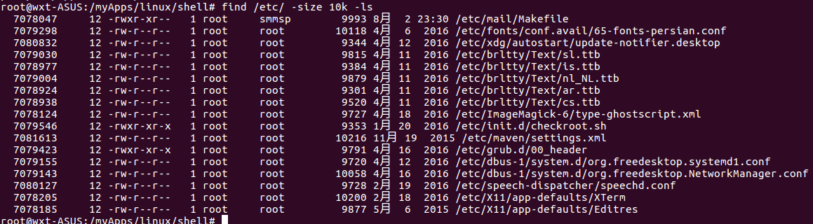

   组合条件的查找

​     -a 与（默认）

​     -o  或

​    -not  非

eg:查找某目录下没有属主，并且为目录的文件，并查看信息

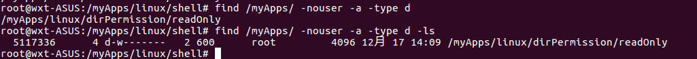

查找非目录的文件

\# find /tem/ -not -type d

/tmp 目录下不是目录并且不是套接字文件

/tmp 目录下属主不是user1,也不是user2的文件

find /tmp/ -not -user user1 -a -not -user -user2

或者

find /tmp/ -not \( -user user1 -o -user -user2 \)

​     -mtime

​     -ctime

​     -atime

​            [+|-]#(天)

​     -mmin

​     -cmin

​     -amin

​            [+|-] #(分钟)

​    根据文件权限查找

​    -perm mode ：精确匹配

​    -perm -mode ：文件权限能完全包含此mode时候才能显示

​     -perm /mode ： 任意一位匹配即满足条件

动作：默认 -print 显示

​        -print ：显示

​        -ls:类似ls -l 的形式显示每一个文件的详情

​        如果需要引用结果中的文件名，就需要使用{}

​         -ok command  {}  \;  每一次操作都需要确认

​         -exec command  {}  \; 不需要确认

man xargs ====》了解即可


### 07-04 特殊权限SUID详解

特殊权限

password:s

SUID: 运行某程序的时候，相应的进程的属主是文件自身的属主，而不是启动者

​       chomd u+s FILE

​       如果file本身原来就有执行权限，则SUID为s,否则为S

​       chomd u-s FILE

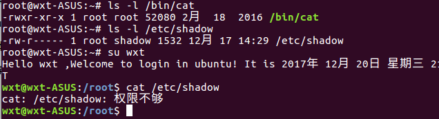

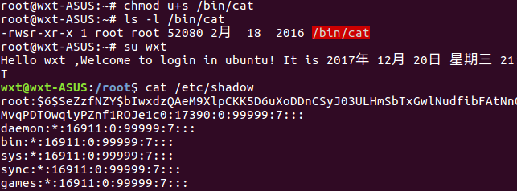

SGID: 运行某程序的时候，相应进程的属组是程序文件本身的属组，而不是启动者所 属的基本组

​             chomd g+s FILE

​             chomd g-s FILE

Sticky: 在一个公共目录每个人都可以创建文件，删除自己的文件，但是不能删除别人的文件

​            chmod o+t Dir

​            chmod o-t Dir

这三位代表一组权限

000,001,...111

   chmod 2755 /test   --第一位2表示010,即无SUID,有SGID,无Sticky

umask 0022


### 03-04磁盘及文件管理系统

磁盘管理：

机械式硬盘：

​        u盘、光盘、软盘、硬件、磁带

partition 分区

​            文件系统

MBR :（主引导分区）512byte

​            Master Boot Record(Main Boot Record)

​                446bytes:BootLoader, 程序，主引导程序

​                64bytes: 其中每16bytes标识一个分区（故最多有四个主分区）

​                2bytes:Magic Number ，标识MBR是否有效

主+ 扩展分区 <=4 ,其中扩展分区 <=1

链接的创建

ln [-s -v] SRC DEST

​     -v :表示显示过程

硬链接：

​        1.只能对文件创建，不能应用于目录

​        2.不能跨文件系统

​        3.创建硬链接会增加文件被链接的次数

软链接：

​        1.可以运用于目录

​        2.可以跨文件系统

​        3.不会增加被链接文件的链接次数

​        4. 其大小为指定路径所包含的字符个数

du  -s

​      -h

df 

链接

设备文件

​            b:按块为单位，随机访问的设备   ----硬盘等

​            c:按字符为单位，线性设备          -----键盘等

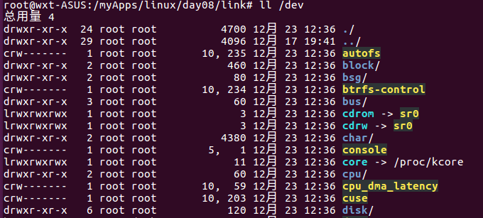

​      /dev

​                主设备号：（major number）

​                                标识设备类型

​                次设备号：  (minor number)

​                                标识同一种类型中的不同设备    

mknod [OPTION]... NAME TYPE [MAJOR MINOR]

​            -m MODE

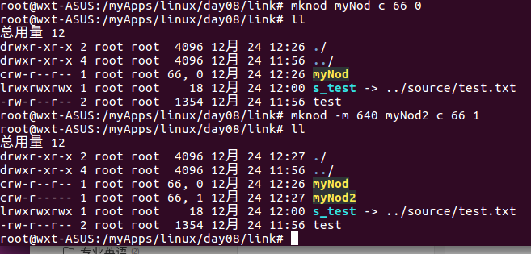

从tty 1往3 发信息

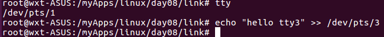

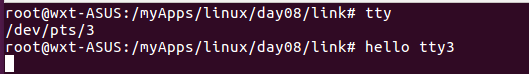

硬盘设备的设备文件名：

IDE,ATA: /dev/hd*

SATA:/dev/sd*

SCSI:/dev.sd*

USB:/dev/sd*

​         a,b,c ....来区别同一种类型下的不同设备

IDE:

​        第一个IDE口：主-hda、从-hdb

​                             /dev/hda 、/dev/dhb

​        第二个IDE口：主-hdc、从-hdd

​                             /dev/hdc 、/dev/dhd

sda, sdb sdc .....

hda:

​        hda1: 第一个主分区

​        hda2:

​        hda3:（2,3,4任意一个可能为扩展分区）

​        hda4:

​        hda5:第一个逻辑分区

​        hda6:

​               ......

查看当前系统识别了几块硬盘:

fdisk -l [/dev/to/some_dev_file]

管理磁盘分区：

fdisk /dev/sda

​                p:显示当前硬件的分区，包括没保存的改动

​                n:创建新分区

​                        e:扩展分区

​                        p:主分区

​                d:删除一个分区

​                w:保存退出

​                q;不保存退出

​                t:修改分区类型

​                        L:显示所支持的所有类型

​                l:显示所支持的所有类型

partprobe  [/dev/sda] 通知内核重新读取

高级格式化：mkfs -t ext3

### 01-02facl及用户及linux终端

文件系统访问列表

tom与jerry不再同一组，tom想让jerry访问tom的某个公共目录下的文件

tom:

​      tom ,tom基本组

jerry: other --> rw-

chown(普通用户无权限执行该命令)

FACL: filesystem access controll list

利用文件扩展属性，保存额外的访问控制权限

setfacl

​          -m:设定

​                    u:UID:perm

​                    g:GID:perm

​           -x:取消设定

​                     u:UID

​                    g:GID

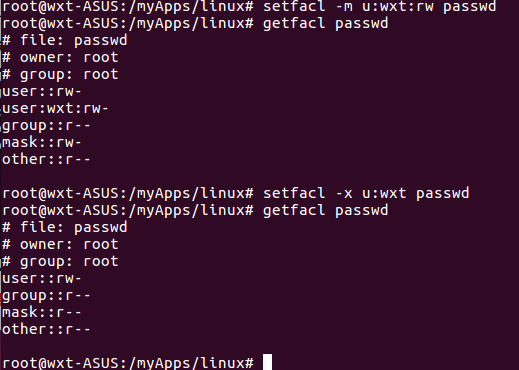

此处的mask需要注意

​                      

getfacl

终端类型

​    console:控制台

​    pty:物理终端（VGA） -与控制台不严格区分

​    tty#：虚拟终端(VGA)

​    ttyS#:串行终端

​    pts/#:伪终端

Shell:

​    who -H

​    who -r -->显示当前用户运行级别

查找某个用户是否登录过 who | grep "username"

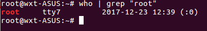

几个命令

w  比who命名详细一些

who  

sleep

whoami

last    --显示/var/log/wtmp 文件。显示用户的登录历史以及系统重启历史

​          -n # :显示最近#次的相关信息

lastb   显示/var/log/btmp，显示用户错误的登录尝试

​          -n # :显示最近#次的相关信息          

lastlog  显示每一个用户最近一次的成功登录信息

​            -u username:显示特定用户最近的登录信息

basename 

​            $0 ：执行脚本时的脚本路径及名称

mail

hostname :显示当前主机的主机名（echo $HOSTNAME）

如果当前主机的主机名为空，或者none,或者为localhost 就将其改为wxt

[ -z `hostname` ] || [ `hostname` == '(none)' -o `hostname`=='localhost' ] && hostname wxt-ASUS

生成随机数：

RANDOM:0-32768   (echo $RANDOM)

随机数生成器：熵池

 /dev/random 

/dev/urandom

利用random生成十个随机数，并取出其最大（小值）

面向过程

​         控制结构

​                顺序结构

​                选择结构

​                循环结构

选择结构

if:单分支，双分支，多分支

if CONDITION ;then

​    statement

​    ...

fi

if CONDITION; then

​    statement

​    ...

else 

   statement

   ...

fi

if CONDITION1; then 

​    statement

​    ...

elif CONDITION2; then

​     statement

​     .....

else

​     statement

​    ...

fi

Case 语句：选择语句

case SWITCH in

value1)

​    statement

​    ...

​    ;;

value2)

​    statement

​    ...

​    ;;

*)

​    statement

​    ...

​    ;;

esac

[0-9]

[a-z]

[A-Z]

[abc]

bash -n ***.sh 检测某脚本是否有语法错误

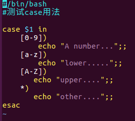

eg：只接受参数start,stop,restart,status 之一

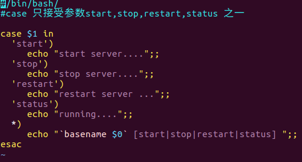


### 04压缩及归档

压缩、解压缩命令

压缩格式：gz,bz2,xz,zip，z

压缩算法:算法不同，压缩比例也会不同

相对古老的压缩方式：compress

compress:FILENAME.z

uncompress:

xz,bz2,gz

gzip: *.gz

​        gzip /path/to/somefile :压缩完成后会删除源文件，但是不能压缩目录（会将目录中的文件逐个压缩）

​                -d:相当于gunzip 解压缩

​                -#：1-9,指定压缩比，默认是6

gunzip:

​        gunzip /path/to/some_compress_file.gz  解压完成后会删除原来的压缩文件

zcat  /path/to/somefile.gz  :不解压的情况下，查看文本文件的内容

bzip2: *.bz2

​        比gzip有着更打压缩比的压缩工具，使用格式近似

​            bzip2 /path/to/somefile

​                    -d:解压缩

​                    -#：1-9,指定压缩比，默认是6

​                    -k:压缩时，保留源文件

​                bunzip2 /path/to/somefile.bz2

​                bzcat:不解压的情况下，查看文本文件的内容

xz: *.xz

​            xz /path/to/somefile

​                     -d:解压缩

​                      -#：1-9,指定压缩比，默认是6

​                       -k:压缩时，保留源文件

​              unxz /path/to/somefile.bz2

​               xzdec (用的少，了解即可)，xz文件的解压缩工具

​              xzcat:不解压的情况下，查看文本文件的内容

gzip,bzip2,xz 均值能压缩文件，不能压缩目录

zip:可以压缩目录，即归档又压缩的工具

​        zip filename.zip file1,file2 ....;压缩后默认不删除源文件

​        unzip filename.zip

archive:归档，归档本身并不意味着压缩

tar:归档工具 ， *.tar

​        -c:创建归档文件

​        -f file.tar:操作的归档文件

​        -x:展开归档

​        --xattrs :归档时，保留文件的扩展属性信息

​        -t:不展开归档，直接查看归档了那些文件

​        -zcf:归档并调用gzip压缩

​        -zxf:调用gzip解压缩并展开归档,-z选项可以省略

​         -jcf:归档并调用bzip2压缩

​         -jxf:调用bzip2解压缩并展开归档,-z选项可以省略

​        -Jcf:归档并调用xz压缩

​        -Jxf:调用xz解压缩并展开归档,-z选项可以省略

cpio:归档工具（较老的工具，使用较少）

read 

​        -p "PROMPT" 给出提示

​        -t 指定时间

脚本编程：

​            顺序结构

​            选择结构

​                    if 

​                    case

​            循环结构

​                    for    

​                    while

​                    until

while 循环，适用于循环次数未知的场景，要有退出条件

语法： 

​            while condition ; do

​                    statement

​                        ....

​             done

计算100以内所有整数的和

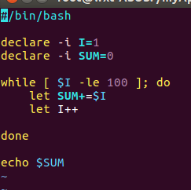

### 01-03磁盘及文件系统管理详解

VFS(Virtual File System)

swap分区

free:查看物理内存和交换空间的使用情况

​          -m 以M显示

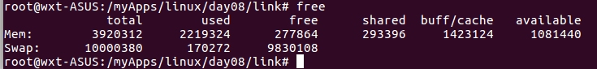

fdisk 命令中，调整分区类型为swap(82)

创建交换分区：

mkswap  /dev/sda8

​                -L LABEL

swapon /dev/sda8

​                启用交换分区上的交换空间

​                swapon -a 启用所有的定义在/etc/fstab 文件中的交换设备

swapoff /dev/sda8

​                关闭交换分区上的交换空间

回环设备：

​        loopback:使用软件来模拟实现硬件

创建一个镜像文件：120G

dd命令：

​            if=数据来源

​            of=数据存储目标

​            bs=#  数据转换或复制的大小单位

​            count=#  按照bs的单位，转换的个数

​            seek=#  创建数据文件时候，跳过的空间大小（个数# *bs的大小）

mount命令，可以挂载iso镜像

mount DEVICE MOUNT_POINT

​             -o loop :挂载本地回环设备

文件系统的配置文件 /etc/fstab

​            OS在初始化的时候，会自动挂载此文件中定义的每个文件系统


要挂载的设备  挂载点  文件系统的类型     挂载选项  转储频率（每多少天做一次完全备份）文件系统检测次序（只有根可以为1，0表示不检测）

mount -a :挂载/etc/fstab 文件中定义的所有文件系统

fuser :验证进程正在使用的文件或者套接字文件

​            -v :查看某文件上正在运行的进程

​            -k:

​            -m:    

fuser -km MOUNT_POINT:终止正在访问此挂载点的所有进程

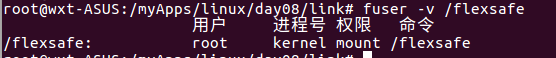

### LVM

cat /proc/filesystems :查看当前内核所支持的文件系统

RAID:独立冗余磁盘阵列

Linux:硬件，软件

​        /dev/md#

MD:muliti device 多设备

mdadm:用户空间工具，管理工具

DM: device mapper 

​            逻辑设备

​                    RAID,LVM2 

DM:

​        快照

​        多路径

fdisk （最多显示15个分区）

### Raid 以及mdadm

练习：

当用户选择完成，显示相应的信息不退出;而让用户在进行一次选择，在显示相应内容，除非用户使用quit

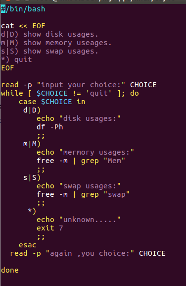

RAID

级别：仅代表磁盘组织方式不同，没有上下之分

0：条带

​            性能提升：读， 写

​             冗余能力（容错）：无

​            空间利用率：ns

1：镜像

​        性能提升：写性能下降，读性能提升

​        冗余能力：有

​        空间利用率：1/2

​        至少两块盘

2：

3：

4：

5：

​        性能表现：读写提升

​        冗余能力 ：有

​        空间利用率：（n-1）/ n   

​        至少3块盘

10: 

​        性能表现：读，写提升

​        冗余能力：有

​        空间利用率：1/2

​        至少4块盘

01:

​        性能表现：读，写提升

​        冗余能力：有

​        空间利用率：1/2

​        至少4块盘

50：

​        性能表现：读，写提升

​        冗余能力：有

​        空间利用率：（n-2）/ n   

​        至少6块盘

jbod:

​           性能表现：无提升

​            冗余能力：无

​            空间利用率：100%

​            至少两块盘

速度

可用性

逻辑AID

/dev/md0

/dev/md1

md:

mdadm:将任何块设备做成RAID

模式化的命令：

​        创建模式

​                -C

​                        专用选项：

​                            -l:级别

​                            -n:设备个数

​                            -a {yes|no}:是否自动为其创建设备文件

​                            -c:CHUNK大小

​        管理模式

​                -add ,--del 等

​                mdadm  /dev/md0 --fail /dev/sda7

​        监控模式

​                -F

​        增长模式

​                -G

​        装配模式

​                -A

查看RAID 阵列的详细信息

​            mdadm -D /dev/md# 

​                            --detail

停止阵列：

​            mdadm -S /dev/md#

​                            --stop 

RAID0

​            2G:

​                    4: 512M

​                    2:1G

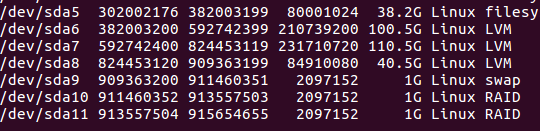

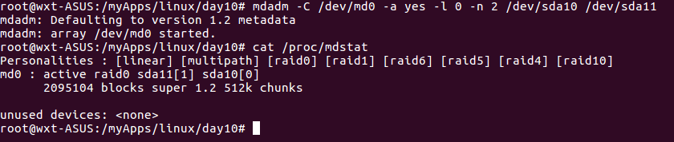

mke2fs -j /dev/md0  格式化设备

查看RAID 阵列的详细信息

mdadm  -D /dev/md0

​                --detail

RAID1

​            2G:

​                    2:2G

watch :周期性的执行指定命令，并以全屏方式显示

​            -n #:指定周期长度，默认单位为秒，默认为2

格式： watch -n # 'COMMAND'

mdadm --detail --scan

将当前信息保存至配置文件，以便以后进行配置

### 06-03 bash字符串以及for循环

seq

如何生成列表

seq [起始数] [步进长度] 结束数

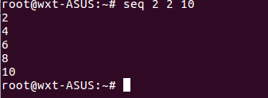

declare 声明

declare -i SUM=0

​            -i: Integer

​            -x:声明为环境变量

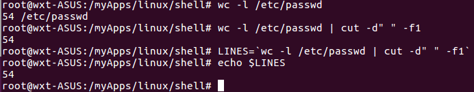

### sed使用

grep :

sed :流编辑器（stream editor）

awk:

sed基本用法

sed:模式空间

默认不编辑源文件，仅对模式空间中的数据做处理;而后，处理结束后，将模式空间打印至屏幕

sed  [option] 'AddressCommand' file....

​    -n:静默模式,不再默认显示模式空间中的内容

Address:

1.startLine,endLine

   比如:1,100

  $:最后一行

\2. /regExp/

   /^root/

3./pattern1/,/pattern2/

  第一次被pattern1匹配的行开始，到第一次被pattern2匹配的行结束，这中间的所有行

4.lineNum 指定的行

5.startLine,+N

   从startLine开始，向后N行（总共n+1行）

Command:

  d:删除符合条件的行

  p:显示符合条件的行

  a \"string" : 在指定的行后面追加新行，内容为“string”

  i \"string" : 在指定的行前面追加新行，内容为“string”

 r File :将指定的文件的内容添加至符合条件的行处

 w file: 将指定范围内的内容另存至指定的文件中

  s/pattern/string/[修饰符]:查找并替换,默认替换每行中第一次被模式匹配到的字符串

​    加修饰符

​     g:全局替换

​     i:胡略大小写

  &:引用模式匹配的整个串

​       like--->liker

​       love--->lover

  sed 's/oot/OOT/' fstab_sed 

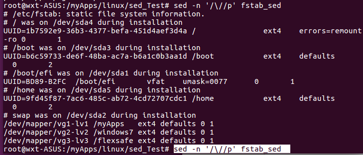

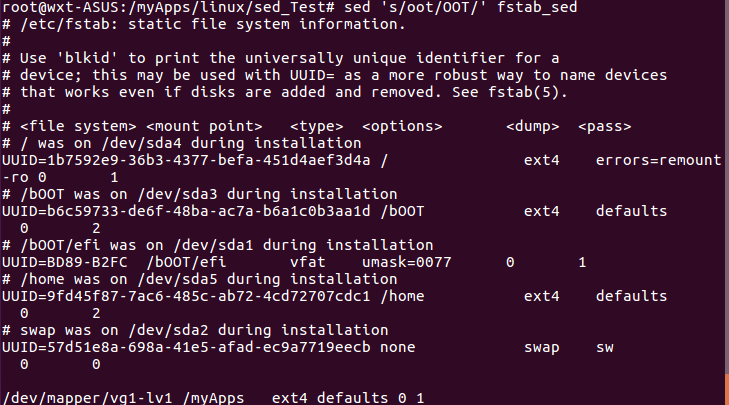

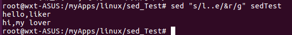

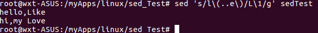

### shell编程基础

编程语言：机器语言、汇编语言、高级语言

静态语言（编译型语言）：

​           强类型语言(变量)：

​           事先转换成可执行格式

​           关键字：

​            C、C++、JAVA、C#...

动态语言（解释型语言）

​           弱类型语言：

​           边解释边执行

​           asp、shell、php、python...

面向对象：JAVA、python、C++

面向过程：shell、C

变量：内存空间、命名

内存：编址的存储单元

变量类型：事先定义好数据的存储格式和长度

​    字符：

​    数值：

​           整型：8bit:256

​                 0-255:溢出

​          浮点型：

​     布尔类型

逻辑运算：与、或、非、异或

编译器、解释器

shell编程：弱类型编程语言

强类型：变量在使用前，必须事先声明、甚至还需要赋初始值

弱类型：变量用时声明，不需要声明，甚至不需要区分类型

编程能力：

​     脚本编程

变量赋值： var_name = value;

bash变量类型：

​     环境变量：

​     本地变量（局部变量）：

​     位置变量：

​     特殊变量（系统变量）：

本地变量：作用域为整个bash进程都可以使用

​     VARNAME =VALUE;

局部变量： 作用域为当前代码段

​     local varname=value;

环境变量：作用域为当前shell以及其子进程

​     export varname=value;

脚本在执行时候会启动一个子shell进程

​       命令行中启动执行的脚本会继承当前shell的环境变量

​      系统自动执行的脚本（非命令行启动，就cuya自我定义需要的各环境变量）

​      bash:

引用变量： ${var_name}其中{}可以省略

​              “”与‘’区别：""-->：弱引用、内部的变量会被替换

​                                 ‘’-->：强引用，不做变量替换

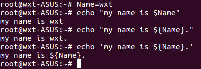

位置变量：用于引用脚本参数

​    $1,$2....

特殊变量：

​     $?:保存上一个命名的执行状态返回值

程序执行，可能有两种返回值

​     程序执行结果：

​     程序状态返回码：0-255

​                                  0正确执行、1-255错误执行

​                                    1、2、127系统预留

输出重定向：

\>

\>>

2>

2>>

&>

/dev/null:（设备、软件模拟设备），bit bucket,数据黑洞

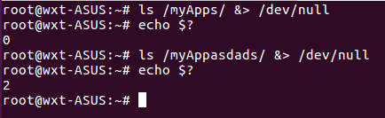

撤销变量：unset VALNAME

查看当前shell中的变量：

​                 set

查看当前shell中的环境变量

​     printenv

​    env

​     export

脚本:命名的堆彻，按实际需要，结合命令流程控制机制实现的源程序

行首：#! /bin/bash

练习：编写脚本实现

​     1.添加五个用户，user1....user5

​     2.每个用户的密码同用户名，而且要求，添加密码完成后不显示命令passwd的执行结果

​     3.每个用户添加完成后，都要显示“用户XXX添加成功”

  条件判断：

​        如果用户不存在

​               添加用户，给密码并提示添加成功

​        否则

​               显示用户已存在，不添加

bash中如何实现条件判断：

​     条件判断类型：

​                   整数测试

​                   字符测试

​                   文件测试

条件测试的表达式：

​      [   experssion  ]

​       [[ experssion  ]]

​      test experssion

整数比较：

​     -eq:测试两个整数是否相等，eg：$A  -eq $B


   -ne:测试两个整数是否不等、不等为真，相等为假

   -gt:测试一个数是否大于另一个数、大于为真否则为假

   -lt:测试一个数是否小于另一个数、小于为真、否则为假

   -ge:>=

​    -le：<=

命令间的逻辑关系：

​      逻辑与：&&

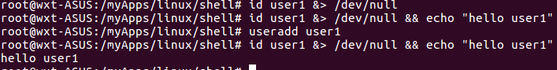

如果用户不存在就添加

 ！user1 && useradd user1   、id user1 || useradd user1

变量名称:

   1.只能包含字母数字和下划线且不能以数字开头，

​    2.不应该和系统中已有的环境变量重名

​    3.见名知意

如果用户存在，就显示用户已存在，否则就添加用户

​    id uesr1 && "user1 existed." || useradd user1

如果用户不存在就添加，否则提示已存在

  ! id user && useradd user1 || echo "user1 existed"

如果用户不存在就添加并设置密码，否则显示以存在

  ! id user1 && useradd user1 && echo "user1 " | passwd --stdin user1 || echo "user1 existed"

​      逻辑或：||

练习2：

​       1.使用一个变量保存一个用户名

​        2.删除此变量中的用户，且一并删除其家目录

​        3.显示“用户删除完成类” 的信息

练习：

​        给定一个用户

​          1.如果其UUID为0,就显示为管理员

​          2.否则，就显示其为普通用户

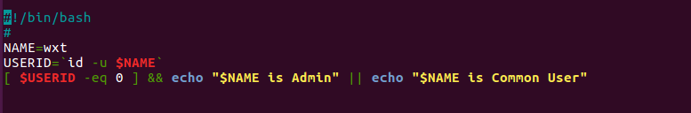

条件判断、控制语句：

 单分支的if语句：

​    if 判断条件; then

​         statement1

​         statement2

​          .....

​     fi

双分支的if语句：

​     if 判断条件; then 

​            statement1

​            statement2

​            .....

​        else 

​                statememt4

​                statement5

​                 ....

​         fi   

另一种写法可以省略;

if 判断条件

 then 

​            statement1

​            statement2

​            .....

​    else 

​             statememt4

​             statement5

​                ....

​        fi   

date +%s --获取毫秒数    

毫秒数/86400 = 距离1970-1-1的天数

shell 中如何进行算数运算

A=10

B=20

1.let 算数表达式

let C=$A +$B

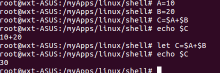

\2. $[算数表达式]

   c=$[$A+$B]

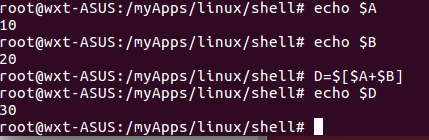

3.$((算数表达式))

e=$(($A+$B))

\4. expr 算数表达式，表达式中各操作数以及运算符间要有空格。而且要使用命令引用

F=`expr $A + $B`

exit 退出脚本

测试方法 [  expression ]

​                [[  expression ]] 

​                test expression

INT1=100

INT2=90

[ $INT1 -eq $INT2]

[[ $INT2 -eq $INT2]]

test $INT1 -eq $INT2

bash中常见的条件测试有三种：

整数测试：-gt -le -ne -eq -ge -lt

  

文件测试

​     -e FILE: 测试文件是否存在

​     -f FILE：测试文件是否为普通文件

​    -d FILE:测试指定路基是否为目录

​    -r file:测试当前用户对指定文件是否有读权限

​    -w file:测试当前用户对指定文件是否有写权限

​    -x File：测试当前用户对指定文件是否有执行权限

[ -e /etc/passwd ]

[ -x /bin/bash ]


多分支的if 语句

if exipression1 ; then

  statement1

   ...

elif expression2; then

   statement2

​     ....

elif experssion3 ;then

​    statement3 

​    ....

else 

   statement4

  ....

fi

定义脚本状态退出码

​    ：如果脚本没有明确定义退出状态码，那么，最后执行的一条命名的退出码就是脚本的退出状态码

检测脚本是否有语法错误

  bash -n FILE

 bash -x 脚本： 单步执行脚本

bash 变量类型

​     本地变量：（局部变量）

​     环境变量

​     位置变量：$1 ,$2....

​                         shift

​     特殊变量:

​                $?:

​                $#:参数的个数

​                 $*:参数列表

​                $@:参数列表

### 操作系统基础

1.计算机体系机构

   运算器、控制器、存储器（内存，编址）、输出设备、输入设备

运算器从存储器中取数据（eg获取加数与被加数），由控制器协调控制器需要接受控制指令从而告诉运算器如何取存储器中的数据，存储器中不仅存放数据也存放指令

指令总线，数据总线

Kernel: 内核

release: 发行版，发行商

Linux 基本原则：

  1.由目的单一的小程序组成：组合小程序完成复杂的任务

  2.一切皆文件

  3.尽量避免捕获用户接口：减少与用户的交互

  4.配置文件保存为纯文本格式

命令格式： 命令 [选项] [参数]

.dll 库文件 动态链接库(dynamic link library)--windows

.so 共享对象(shared object) ----linux

Authentication   ---认证机制

Authorization----授权

Audition ---审计（日志）

Prompt---命令提示符

GUI:graphic user interface(图形用户接口/界面)

[IDE](https://baike.baidu.com/item/IDE) ：集成[开发环境](https://baike.baidu.com/item/%E5%BC%80%E5%8F%91%E7%8E%AF%E5%A2%83)（，Integrated Development Environment ）

### Linux 常用命令01

su [username]

su -l [username]

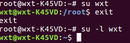

ls   （list）列出，列表

目录：文件，路径的映射

路径：从指定起点到目的地所经过的位置

文件系统：filesystem

列出指定路径下的文件

目录：working directory ,current directory

pwd: printing working directory

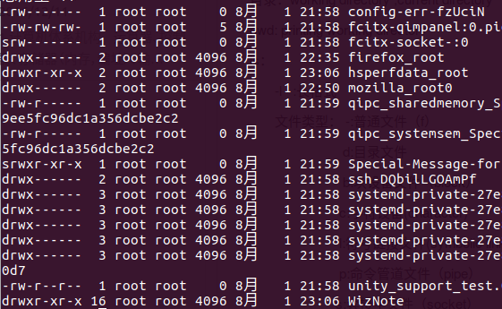

ls：

​       -l   :长格式

​       文件类型： -:普通文件（f）              

​                          d:目录文件

​                          b:块设备文件（block）

​                         c:字符设备(character)

​                         l:符号链接文件(symbolic link file)

​                         p:命令管道文件（pipe）

​                        s:套接字文件（socket）

​     文件权限：9位，每三位一组，每一组(读，写，执行)rwx,

​     文件硬链接的次数： 

​     文件的属主（owner）

​     文件的属组（group）

​    文件大小（size）,默认是字节

​     时间戳（最近访问的时间，修改的时间，改变的时间）访问-access、修改-modify（文件内容）、改变-change(属性（metadata-元数据）的变换)

​     文件名

ls -h ：做单位转换

   -a:显示所有文件包含以.开头的隐藏文件

​       .表示当前目录

​       ..表示父目录

​    -A 

​    -d:显示文件自身属性（不显示子文件）

​    -i（显示节点号 index node）,-r(逆序显示),-R（递归显示）

cd ：changde directory(切换目录)

   家目录：也叫主目录，home directory 回到家目录 cd 、cd ~、cd ~username(进入指定用户家目录)

 cd  - :在前一个目录和当前目录来回切换

命令类型：

​      内置命令（shell类型）

​     外部命令：在文件系统的某个路径下有一个与命令名名称相应的可执行文件

环境变量：命名的内存空间（变量的赋值）

printenv ：输出系统中的环境变量

hash:记录命令命中的次数

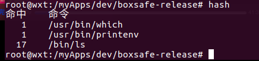

type：显示指定命令属于那种类型

date 时间管理：

  Linux

​     硬件时间   hwclock查看

​     系统时间  date 查看

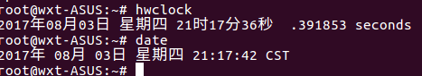

​     获得命令的使用帮助：

​     内部命令：help  COMMAND

​     外部命令：COMMAND --help

命令手册manual    : man COMMAND

man 分章节：1.用户命令（/bin,/usr/bin,/usr/local/bin）

​                       2.系统调用。3.库调用 4.特殊文件 (设备文件)

​                      5.文件格式(配置文件的语法) 6.游戏 .7杂项(miscellaneous)

​                      8.管理命令（/sbin,/usr/sbin,/user/local/sbin）

whatis COMMAND

man 4 tty、  man 1 ls、 man 1 passwd 、man 5 passwd、man man

MAN: name;命令名称以及功能简要说说明

​           synopsis:用法说明，包括可用的选项

​           description:命令功能的详细说明，可能包括每个选项的意义

​           options:说明每个选项的意义

​           files:此命令相关的配置文件

​           bugs:

​          examples:使用实例

​          see alse:另外参照

（space-下一页，B-上一页，enter-下一行，K-上一行===

​      =查找：/keyword 向后搜索-》n下一个，N前一个

​                   ？keyword向前搜索-》n下一个，N前一个）q退出

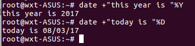

hwclock -w:系统时间设置成硬件时间

hwclock -s:硬件时间设置成系统时间

在线手册 info COMMAND

命令文档的存放位置：/usr/share/doc

cal:calendar


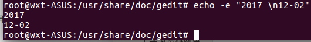

   


### grep以及正则初步

文本查找的需要：

grep、egrep、fgrep

grep:根据模式去搜索文本，并将符合模式的文本行显示出来

pattern：文本字符和正则表达式的元字符组合而成的匹配条件

grep [option] PATTERN [file....]

​    -i：胡略大小写

​    --color:

​     -v:显示没有被匹配模式找到的行

​     -o:只显示被模式匹配到的字符串

*：任意长度的任意字符

？：任意单个字符

[]:指定范围内字符

[^]: 指定范围外字符

正则表达式：regular expression(REGEXP)

元字符：

​     . :匹配任意单个字符

​    []:匹配指定范围内的任意单个字符

[^]: 匹配指定范围外的任意单个字符

​    字符集合：

​       [:digit:]、     [:lower:]、     [:upper:]、     [:punct:]、     [::]、     [::]、

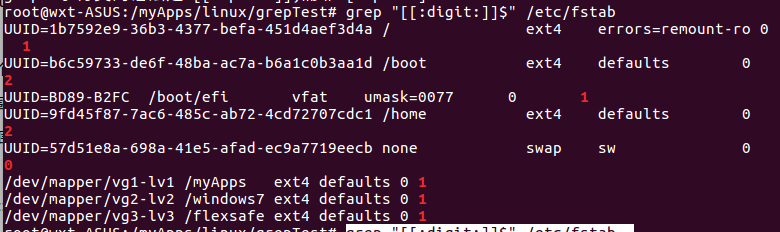

匹配次数（贪婪模式-尽可能长的去匹配）：

​     * ：表示匹配其前面的字符任意次

​     .*:任意长度的任意字符

​    ?:匹配其前面的字符0或者一次，?使用可能需要转义\?

  \{m,n\}:匹配其前面的字符至少m次，至多n次

位置锚定：

​    ^:锚定行首，此字符后面的任意字符必须出现在行首

​    $:锚定行首，此字符前面的任意字符必须出现在行尾

   ^$:空白行

   \< 或者\b:锚定词首、其后面的字符必须作为单词首部出现

​    \>或者\b:锚定词尾、其前面的字符必须作为单词的尾部出现

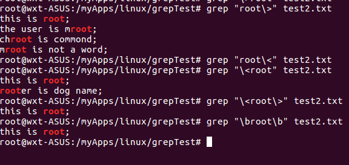

分组：\(\)      

​      \(ab\)*:ab出现n次

​     向后引用;

​          \1:引用第一个左括号以及与之对应的右括号所包括的所有内容

​          \2:

​          \3:

正则表达式：

​     Basic REGEXP:基本正则表达式

​           .:任意单个字符

​           []:

​           [^]:

​           次数匹配：

​             *:

​            \?:

​          \{m,.n\}:注意n省略表示至少m次，m最小为0且不可省

​         .*:任意长度任意字符：

​        锚定：

​         ^:

​         $:

​         \<,\b:

​         \>,\b:

​        \(\):

​         \1,\2,\3....:

​     Extended REGEXP:拓展正则表达式

grep :使用基本正则表达式定义的模式来过滤文本的命令

​      -i;

​       -v:

​      -m:

​     --color:

​     -E:使用拓展正则表达式

​     -A #(数字): 匹配到的字符的后n行都被显示

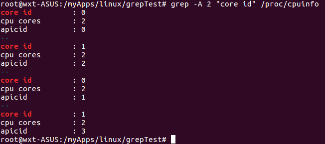

​      -B #: 匹配到的字符的前n行都被显示

​      -C #:匹配到的字符的前n行与后n行都被显示


扩展正则表达式：

​    字符匹配：.、[]、[^]

​    次数匹配：*、？、+

​        +：匹配其前面的字符至少一次

​        {m,n}:m-n次，不需要转义

​      锚定:^、$、\<、\>

​      分组:

​         ():分组

​         \1、\2、、\3...

​        或者：

​            | ： or

​           C|cat :C 或者cat

​           (C|c)at：Cat或者cat

找出匹配到1-255的地方：

   

ifconfig | egrep "\<([1-9]|[1-9[0-9]]|1[0-9][0-9]|2[0-4][0-9]|25[0-5])\>"


初略找ip地址：

ifconfig | egrep -o "(\<([0-9]|[1-9[0-9]]|1[0-9][0-9]|2[0-4][0-9]|25[0-5])\>\.){3}\<([0-9]|[1-9[0-9]]|1[0-9][0-9]|2[0-4][0-9]|25[0-5])\>"


IPv4:

   5类ip:A、B、C、D、E

​      A:1-127

​      B:128-191

​      C:192-223

​    找出ABC三类的ip地址

\<[1-9]|[1-9][0-9]|1[0-9][0-9]|2[01][0-9]|22[0-3]/>(\.\<([0-9]|[1-9][0-9]|1[0-9][1-9]|2[0-4][0-9]|25[0-4])>/){2}\.\<([1-9]|[1-9][0-9]|1[0-9][1-9]|2[0-4][0-9]|25[0-4])>/

fgrep:不支持正则表达式


### 管道以及IO重定向

运算器，控制器，cpu

存储器：RAM

输入设备、输出设备

程序：指令和数据

控制器：指令

运算器：

存储器：

地址总线：内存地址

数据总线：传输数据

控制总线：控制指令

寄存器：cpu暂时存储器

I/O:硬盘

INPUT设备：

OUTPUT设备：

系统设定

​        默认输出设备：标准输出，STDOUT,1

​        默认输入设备:标准输入，STDIN ,0

​        标准错误输出：STDERR,2

标准输入：键盘

标准输出和错误输出:显示器

I/O重定向：

​    Linux:

​       >:输出重定向，覆盖输出

​      >>:追加输出

​       2>:重定向错误输出

​        2>>:追加方式重定向错误输出

​       &>:重定向标准输出或则错误输出至同一个文件

​       &>>:重定向标准输出或则错误输出至同一个文件(追加方式)

set  -C:禁止对已存在的文件使用覆盖重定向

​          强制覆盖输出，使用 > |

set +C :关闭上述功能

​      <：输入重定向


​      <<:Here Document


管道：前一个命令的输出，作为另一个命令的输入

​    命令1 | 命令2 | 命令3 | ....


   


tee:从标准输入内容，即标准输出也保存在文件中


只显示文件行数：


​    显示某目录先文件个数：ls /usr/bin/ | wc -l

​    显示某文件夹下所有文件类型：file `ls /myApps`    


取出文件的第某一行内容：先去前n行内容，在用管道取出前n的最后一行内容

​                                              head -7 /etc/fstab | tail -1

取出/etc/passwd中的倒数第9个用户的信息，取出用户名和shell字段，输出在屏幕上并保存下来


### 用户以及权限详解

计算机资源

权限，用户，用户组

用户：标识符

用户组：标识符

文件：

安全上下文

权限：r,w,x

对于文件：

r:可读，可以使用类似cat等命令查看文件内容

w:可写，可以编辑或者删除此文件

x:可执行，exacutable,可以在命令提示符下当作命令提交给内核运行

对于目录：

r:可以对此目录执行ls以列出内部的所有文件

w:可以在此目录下创建文件

x:可以使用cd切换到此目录，也可以使用ls -l查看内部文件的详细

一般默认目录含有x权限

用户：UID 、/etc/passwd

用户组：GID、/etc/group

影子口令：

用户：/etc/shadow

组：/etc/gshadow

用户类别：

 管理员：0

普通用户：1-65535

​                 系统用户 1-499

​                   一般用户：500-60000

用户组：

​    管理员组：

​    普通组：

​                系统组：

​                一般组：

用户组类别：

​       基本组（默认组）：用户的默认组

​       私有组：创建用户时候如果没有指定其所属的组，系统会自动为其创建一个与用户名同名的组

​       附加组（额外组）：默认组以外的其他组

/etc/passwd中几个字段含义

account:用户名

password：密码

UID:用户id

GID:基本组id

comment:注释

HOME DIR：家目录

SHELL:用户默认shell

/etc/shadow

account:用户名

encrypted password:加密后的密码

加密方法：

   对称加密：加解码使用同一个密码

   公钥加密：每个密码都是成对出现的，一个为公钥（public key），一个为私钥（secret key）

   单向加密（指纹加密），散列加密：提取数据特征码，可用于数据校验，常用于数据完整性校验

​                          1.不可逆 2.雪崩效应（蝴蝶效应）（初始条件的微小改变，将引起结果的巨大变化）

​                          3.定长输出

​                            MD5:message digest 信息摘要算法（128位）

​                            SHA1：sercure hash algorithm(160位)


用户管理：

useradd: -u UID,-g GID(基本组)

​                   -g,....(附加组，可以有多个)

​                   -c "commit"

​                  -d /path/to/somedirectory: 指定家目录

​                  -s:指定shell的路径（必须存在/etc/shells里面）

​                  -m:

​                  -M:

​                   -r：添加系统用户

环境变量：PATH,SHELL

/etc/shells:指定了当前系统可用的安全的shell

/etc/login.defs:

userdel :删除用户（默认不会删除用户家目录），-r级联删除用户根目录

修改用户账户信息：

usermod ： -u UID 

​                     -g GID

​                    -a  -G GID:不使用-a选型，会覆盖此前的附加组

​                     -c:

​                    -d -m:

​                    -s:

​                    -l

​                     -L:锁定账户

​                    -U:解锁账户             

passwd：修改用户密码

chsh：（change shell）

chfn(change finger);修改主持信息

finger:查看（检索）用户信息

id：查看用户的账户属性信息-u,-g,-G,-n

pwck:检查用户帐号完整性

chage: -d:最近一次修改时间

​             -E:过期时间

​             -I:非活动时间

​              -m:最短使用期限

​             -M:最长使用期限

​             -w:警告时间

组管理：

groupadd： 

​               -g GID:指定gid

​               -r:添加系统组

groupdel;删除组

groupmod： 

​               -g GID

​               -n GRPNAME

gpasswd：为组加密码

newgrp groupNAME <---> exit

权限管理：

r,w,x

三类用户：

u:属主

g:属组

o:其他用户

chown:改变文件属主（只有管理员才能使用此命令）

​            chown username file,...:

​           -R :修改目录以及目录内文件属主

​           --reference=/filePath   file

​       chown username:groupname file,...

​        chown username.groupname file,...


chgrp:

​    chgrp  groupname file,...

​     -R 

​     --reference=/filePath file

chmod:改变文件权限

 修改三类用户的权限：chmod mod file,...

​                                      chmod -R mod file,...

​                                     --reference=/filePath file,...

​                                     chmod 750 filename

修改某类用户或某些类用户权限：u,g,o,a(all)                         

​                 chmod 用户类别=mod file,....  eg.  chmod u=rwx test.txt

修改某类用户的某些位或者某位的权限：u,g,o,a

​                 chmod 用户类别 + | - MOD file,...

​                 chmod  u+w file,chmod

umask:遮罩码

   创建文件或者目录的默认权限为如下

  666-umask(文件)

  777-umask（目录）

eg:umask: 023 文件默认没有执行权限，如果计算的结果有执行权限，则将其权限+1

   文件：666-023=643  X  --->644

   目录：777-023=754


shell类型（用户角度）：

登录式shell:  正常通过某终端登录

​                      su - username

​                      su -l username

非登录式shell:

​                     su username 

​                     图形终端中打开的命令窗口

​                    自动执行的shell脚本

bash的配置文件：

​     全局配置：

​                    /etc/profile、/etc/profile.d/*.sh、/etc/bashrc

​      个人配置：

​                      ~/.bash_profile、~/.bashrc

profile类文件：设定环境变量

​                          运行命令或者脚本

bashrc类文件：设定本地变量

​                           定义命令别名

登录式shell如何读取配置文件：

​     /etc/profile  --> /etc/profile.d/*.sh --> ~/.bash_profile --> ~/.bashrc -->/etc/bashrc

非登录式shell如何读取配置文件：

​    ~/.bashrc --> /etc/bashrc --> /etc/profile.d/*.sh   

bash:脚本解释器


### **Bash特性介绍**

bash及其特性：

程序：进程

进程：在每个进程看来，当前主机上只存在内核和当前进程，进程是程序的副本，进程是程序执行的实例

用户的工作环境

shell，子shell

bash-bash:

1.命令历史,命令补全

2.管道，重定向

3.命令别名

4.命令行编辑

5.命令行展开

6.文件名通配

7.变量

8.编程（脚本）

命令行编辑：光标跳转ctrl +A行首，ctrl+E行尾 ，ctrl+ u删除光标至行首的内容

​                       ctrl+ k删除光标至行尾的内容,ctrl+l清屏

命令历史：查看历史命令history, -c清空命令历史，

​      history -d OFFSET [n]:删除指定位置的命令

​     -w,保存命令历史至历史文件（用户家目录下的.bash_history文件）中

​     命令历史的使用技巧： ！n 执行命令历史中的第n条命令

​                                        ！-n 执行命令历史中的倒数第n条命令

​                                      ！！执行上一条命令

​                                ！string执行命令历史中最近一个以string开头的命令

​                              !$ ：引用前一个命令的最后一个参数（ESC  .  或者alt+.）

命令补全：TAB键

路径补全：

环境变量：

PATH:命令搜索路径

HISTORYSIZE：命令历史大小

命令别名：alias ,alias cls=clear

​    在shell中定义的别名仅仅在当前shell生命周期中有效，别名的有效范围为当前shell进程

 unalias + 别名，撤销别名

\cmd 不使用别名，使用命令本身

命令替换：$(CMD),反引号`CMD`

bash支持的引号：

``：反引号，命令替换

“”：弱引用，可以实现变量替换

‘’：强引用，不完成变量替换

把命令中某个子命令替换为其执行结果的过程


文件名通配：globing

×:匹配任意长度的任意字符

？:匹配任意单个字符

[]:匹配指定范围内的任意单个字符，ls [a-zA-Z]*[0-9] 字母开头数字结尾

[:space:]: 匹配含有空格的
[:punct:]: 匹配含有标点的、:alpha:大小写字母、:digit::数字
[:lower:]: 小写字母、:upper:大写字母、:alnum::数字和大小写字母

字母开头字母结尾中间含有任意字符


[^]: 匹配指定范围外的任意单个字符
[]: 

man 7 glob


### 文件系统介绍

文件系统

rootfs:根文件系统

/boot:系统启动相关的文件，如：内核、initrd以及grub(bootloader)

/dev:设备文件（块设备：随机访问的设备，数据块如磁盘硬盘、

​                          字符设备：线性设备，按字符为单位如键盘）

​                          设备号：主设备号（major）和次设备号（minor）


/etc:配置文件

/home：用户家目录，默认/home/username

/root：管理员家目录

/lib:库文件--静态库（.a）、动态库（.dll(windows)文件，.so（shared object linux））

​      以及内核模块（/lib/modules）文件

/media:挂载点目录，挂载移动设备

/mnt:挂载点目录，额外的临时文件系统

/opt:可选目录，第三方程序安装目录（老版本）

/proc：伪文件系统,内核映射/映像文件（关机后目录为空）

/sys：伪文件系统，跟硬件设备相关的属性映射文件（关机后目录为空）

/tmp:临时文件，/var/tmp

/var:可变化的文件

/bin:可执行文件，用户命令

/sbin：可执行文件，管理命令

/usr:(universory share readonly)只读文件，全局的只读文件。/usr/bin、/usr/sbin、/usr/lib、/usr/local、/usr/local(第三方软件的安装路径)

/usr/local/bin、/usr/local/sbin、/usr/local/lib

命名规则：1.长度<255.2.不能使用/当文件名 3.严格区分大小写

相对路径

绝对路径

一般操作系统可以做的事：

文件管理、

目录管理：ls、cd、pwd、mkdir（-p,-v常用）、tree（查看目录树）,rmdir（只能用于删除空目录），

命令行展开

   mkdir -pv /myApps/linux/{1test/a,test2/b}

   mkdir -pv /myApps/linux/{a,b}_{c,d}


文件的创建删除:touch（-c,-a,-m,-t注意man touch），stat,tree,file


   


  创建文件也可以使用文件编辑器: nano  

  删除文件：rm（-i,-f,-r）在root下rm=rm -i,普通用户下rm

  移动和复制文件：

​    cp :cp SRC DEST （-r,-i,-p,-f,-a:归档复制常用于备份）

   mv:

install: (rpm包制作时候会用此命令)

目录管理：ls cd pwd mkdir rmdir tree

文件管理：touch stat file rm cp mv nano

日期时间：date clock hwclock cal

文本处理命令：cat、more、less、head、tail、cut、sort、uniq、grep、正则

查看文本：cat tac、more、less、head、tail

cat:  -E 、-n 连接并查看 linux文件行结束符$,window下为$+enter(换行符)

more:分屏幕显示，向后翻（space-后 B-前）

less:

head:查看文件的前n行，n默认=10

tail:查看后n行，tailf、tail -f ：查看文本尾部，不退出，等待显示后续追加到此文件的新内容

文本处理：cut,join,**sed、awk**

cut： -d:指定字段分隔符，默认是空格

​         -f:指定要显示的字段 -f 1、 -f 1,3

cut -d : -f1 /etc/passwd

文本排序：sort （-r降序,-n数值排序，-t字段分隔符，-k以何关键字排序,-u排序后相同的行只显示一次，-f忽略大小写）

uniq: -c显示某一行出现的次数

​        -d只显示重复的行


文本查找：**grep**

文本统计： wc（word count）

​           -l:显示行数，-L:显示最长行包含多少字符

​           -m:显示字符数、-w:显示单词数、   -c：显示字节数

字处理命令：tr(转换或删除字符)


管道和重定向：>  <  >>  <<

 用户、组、权限

bash以及其特性

运行程序、

设备管理、

软件管理、

进程管理、

网络管理